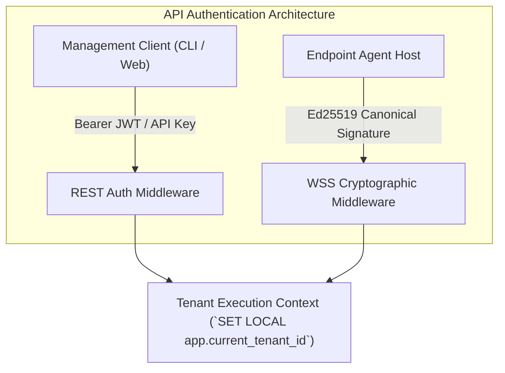
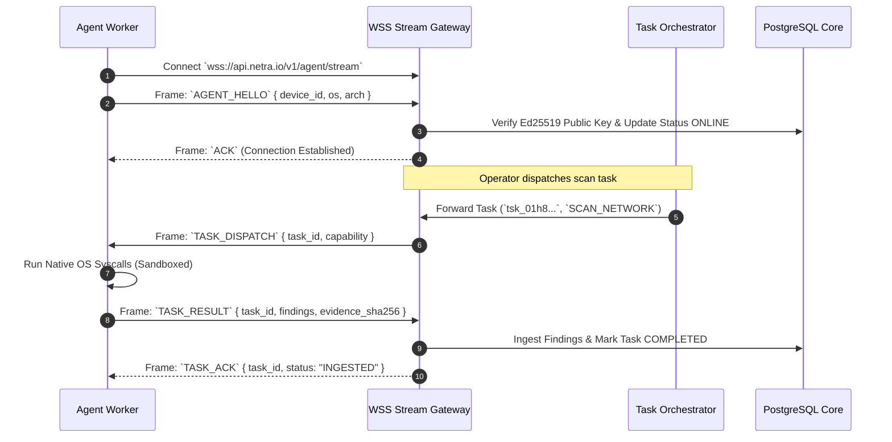

# NETRA — Official API Reference & Stream Protocol Specification

> **Document Status:** Approved Specification  
> **Target Version:** v1.0.0-MVP  
> **Authoritative Scope:** Official REST API endpoints, WebSocket streaming frames, authentication schemas, error codes, and Protobuf contracts for NETRA.  
> **Related Documents:** [SYSTEM_DESIGN.md](./SYSTEM_DESIGN.md), [SECURITY_CHECK.md](./SECURITY_CHECK.md), [UI_UX.md](./UI_UX.md)

---

## Contents

1. [API Design Philosophy & Versioning](#1-api-design-philosophy--versioning)
2. [Authentication & Authorization Models](#2-authentication--authorization-models)
3. [Cryptographic Request Headers (Agent Authentication)](#3-cryptographic-request-headers-agent-authentication)
4. [Standard Request & Error Response Format](#4-standard-request--error-response-format)
5. [WebSocket Agent Gateway Protocol (`/v1/agent/stream`)](#5-websocket-agent-gateway-protocol-v1agentstream)
6. [Device Management Endpoints](#6-device-management-endpoints)
7. [Task Orchestration Endpoints](#7-task-orchestration-endpoints)
8. [Finding & Evidence Endpoints](#8-finding--evidence-endpoints)
9. [Topology & Network Graph Endpoints](#9-topology--network-graph-endpoints)
10. [Health & Observability Endpoints](#10-health--observability-endpoints)

---

## 1. API Design Philosophy & Versioning

The NETRA API is built according to OpenAPI 3.1 specifications. It is strictly versioned via the URL path prefix (`/v1`). All timestamp fields are ISO 8601 UTC strings (`2026-08-24T12:00:00Z`), and all entity identifiers are standard UUIDv7 strings.

```
Base URL (Production): https://api.netra.io/v1
Base WSS (Production): wss://api.netra.io/v1/agent/stream
```

---

## 2. Authentication & Authorization Models



---

## 3. Cryptographic Request Headers (Agent Authentication)

Every HTTP request or WebSocket initialization frame sent by an enrolled agent must include:

```http
X-NETRA-Device-ID: dev_01h8a9b2c3d4e5f6
X-NETRA-Timestamp: 1776189500
X-NETRA-Nonce: a9f8e7d6-c5b4-4a3b-2a1f-0e9d8c7b6a5f
X-NETRA-Request-ID: req_1122334455667788
X-NETRA-Signature: 6f8b9e... (128-char hex-encoded Ed25519 signature)
```

$$\text{Canonical String} = \text{METHOD} \parallel \text{"\textbackslash n"} \parallel \text{PATH} \parallel \text{"\textbackslash n"} \parallel \text{TIMESTAMP} \parallel \text{"\textbackslash n"} \parallel \text{NONCE} \parallel \text{"\textbackslash n"} \parallel \text{REQUEST\_ID} \parallel \text{"\textbackslash n"} \parallel \text{SHA256}(\text{BODY})$$

---

## 4. Standard Request & Error Response Format

### Success Response:
```json
{
  "success": true,
  "data": { ... },
  "meta": {
    "request_id": "req_01h8a9b2c3",
    "timestamp": "2026-08-24T12:00:00Z"
  }
}
```

### Standard Error Response:
```json
{
  "success": false,
  "error": {
    "code": "DEVICE_NOT_FOUND",
    "message": "The requested device UUID does not exist in the active tenant.",
    "details": { "device_id": "dev_01h8a9b2c3" }
  },
  "meta": {
    "request_id": "req_01h8a9b2c3",
    "timestamp": "2026-08-24T12:00:00Z"
  }
}
```

---

## 5. WebSocket Agent Gateway Protocol (`/v1/agent/stream`)

The following sequence demonstrates the live bidirectional frame exchange between an agent and the backend gateway.



---

## 6. Device Management Endpoints

### 6.1 `POST /v1/agent/enroll`
Enrolls a new endpoint device into a tenant organization.
* **Auth**: None (Authorized by single-use token in request body)
* **Request**:
```json
{
  "enrollment_token": "enroll_sec_99a8b7c6d5e4",
  "public_key": "3d4f5a6b... (64-char hex Ed25519 public key)",
  "hostname": "prod-worker-01",
  "os": "linux",
  "kernel": "6.5.0-generic",
  "arch": "amd64"
}
```
* **Response (201 Created)**:
```json
{
  "success": true,
  "data": {
    "device_id": "dev_01h8a9b2c3d4e5f6",
    "tenant_id": "ten_01h8a1b2c3d4",
    "enrolled_at": "2026-08-24T12:00:00Z"
  }
}
```

### 6.2 `GET /v1/devices`
Lists all enrolled devices for the active tenant.
* **Auth**: Bearer JWT (Roles: `USER`, `ADMIN`)
* **Query Params**: `status` (`ONLINE`, `OFFLINE`, `REVOKED`), `limit`, `offset`

---

## 7. Task Orchestration Endpoints

### 7.1 `POST /v1/tasks`
Creates and dispatches an asynchronous security scan task.
* **Auth**: Bearer JWT (Roles: `OPERATOR`, `ADMIN`)
* **Request**:
```json
{
  "device_id": "dev_01h8a9b2c3d4e5f6",
  "capability": "SCAN_FIREWALL",
  "parameters": {}
}
```
* **Response (202 Accepted)**:
```json
{
  "success": true,
  "data": {
    "task_id": "tsk_01h8b3c4d5e6",
    "status": "PENDING",
    "device_id": "dev_01h8a9b2c3d4e5f6",
    "created_at": "2026-08-24T12:01:00Z"
  }
}
```

---

## 8. Finding & Evidence Endpoints

### 8.1 `GET /v1/findings`
Queries security findings for the active tenant with rich filtering.
* **Auth**: Bearer JWT
* **Query Params**: `severity` (`CRITICAL`, `HIGH`, `MEDIUM`, `LOW`, `INFO`), `status` (`OPEN`, `ACKNOWLEDGED`, `RESOLVED`), `device_id`

### 8.2 `GET /v1/findings/:id/evidence`
Retrieves the cryptographically verified raw evidence payload backing a finding.

---

## 9. Topology & Network Graph Endpoints

### 9.1 `GET /v1/topology/graph`
Returns the synthesized network topology reachability graph.
* **Auth**: Bearer JWT
* **Response**:
```json
{
  "success": true,
  "data": {
    "nodes": [
      { "id": "node_dev_01", "type": "DEVICE", "label": "srv-prod-01", "ip": "192.168.1.10" },
      { "id": "node_gw_01", "type": "GATEWAY", "label": "Router-R3", "ip": "192.168.1.1" }
    ],
    "links": [
      { "source": "node_dev_01", "target": "node_gw_01", "type": "DEFAULT_GATEWAY" }
    ]
  }
}
```

---

## 10. Health & Observability Endpoints

* `GET /v1/health`: Returns system status (`{"status": "HEALTHY", "database": "CONNECTED"}`).
* `GET /metrics`: Standard Prometheus metrics endpoint for cluster monitoring.
