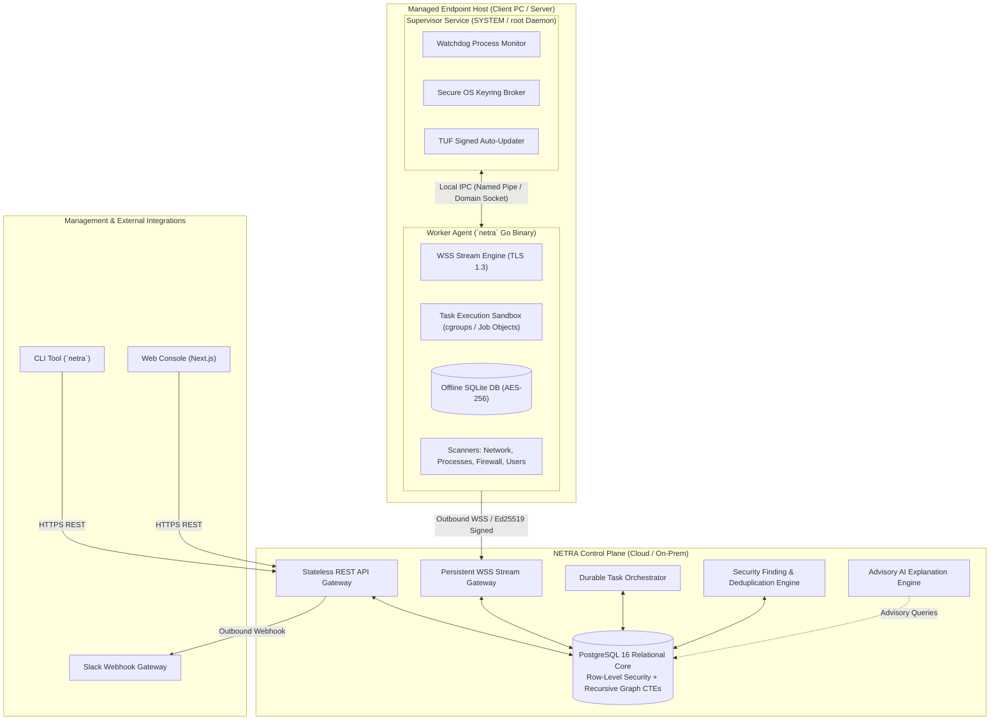
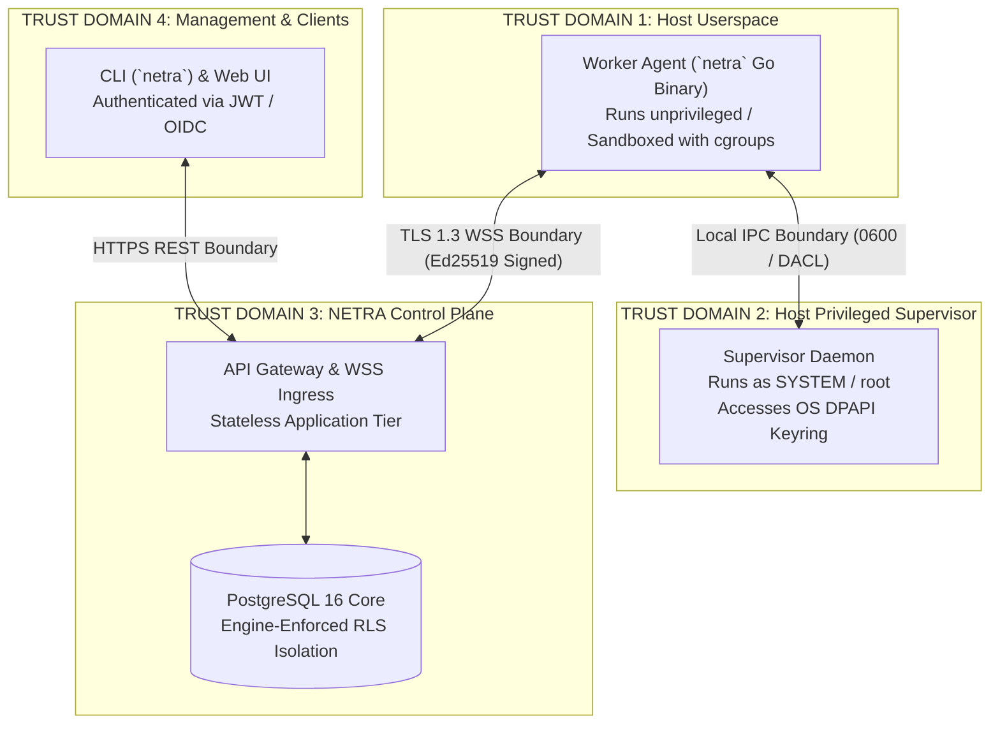
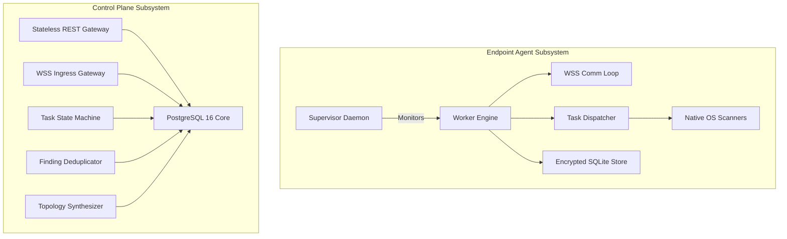
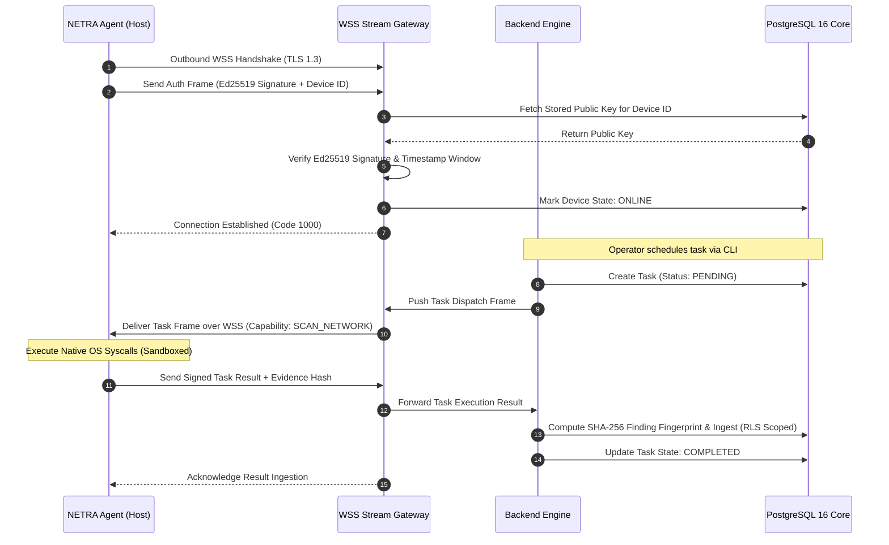
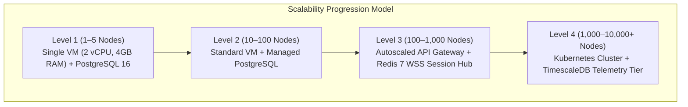
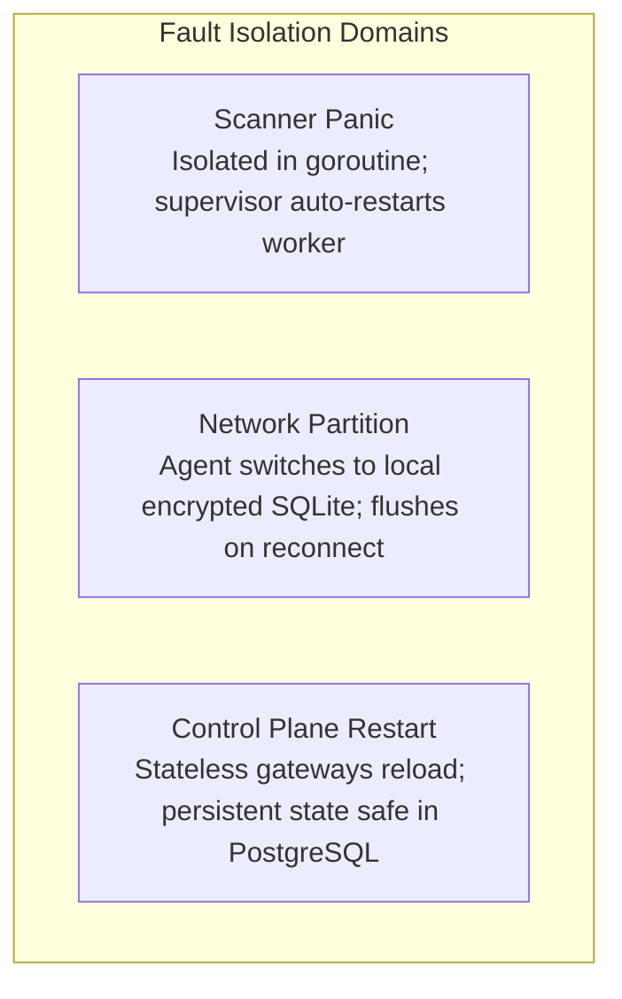

# NETRA — System Architecture & Architectural Decision Records (ADRs)

> **Document Status:** Approved Architecture  
> **Target Version:** v1.0.0-MVP  
> **Authoritative Scope:** Comprehensive system architecture, component boundaries, data flow topologies, and Architectural Decision Records (ADRs) for NETRA.  
> **Related Documents:** [SYSTEM_DESIGN.md](./SYSTEM_DESIGN.md), [SECURITY_CHECK.md](./SECURITY_CHECK.md), [TRD.md](./TRD.md)

---

## Contents

1. [Architectural Overview](#1-architectural-overview)
2. [Architectural Principles](#2-architectural-principles)
3. [System Boundaries & Trust Domains](#3-system-boundaries--trust-domains)
4. [Component Architecture](#4-component-architecture)
5. [Network Topology & Data Flow](#5-network-topology--data-flow)
6. [Architectural Decision Records (ADRs)](#6-architectural-decision-records-adrs)
7. [Scalability & Evolution Strategy](#7-scalability--evolution-strategy)
8. [Failure Domains & Fault Isolation](#8-failure-domains--fault-isolation)

---

## 1. Architectural Overview

NETRA is designed as a **decoupled, multi-tenant security reconnaissance and posture management platform**. It combines a lightweight, single-binary Go endpoint agent with a stateless, streaming backend and an event-driven PostgreSQL relational core.

---

## 2. Architectural Principles

1. **Evidence Precedes Finding**: No security finding exists without an immutable, cryptographically verifiable evidence artifact.
2. **Deterministic Core, Advisory AI**: Security rules, finding transitions, and remediation commands are 100% deterministic; AI is strictly restricted to explanations and queries.
3. **Least Privilege by Default**: Agents run with bounded OS privileges; high-privilege scans are isolated.
4. **Zero Inbound Ports**: Agent hosts never open inbound listening ports. All communication is outbound persistent TLS 1.3 over WebSocket.
5. **Asymmetric Cryptographic Identity**: Every device is uniquely identified via an Ed25519 keypair; shared secrets are prohibited across the wire.
6. **Strict Capability Model**: Remote arbitrary code evaluation (`exec`/`eval`) is structurally forbidden.
7. **Database-Enforced Multi-Tenancy**: Logical isolation is guaranteed by PostgreSQL Row-Level Security (RLS).
8. **Fail-Safe & Offline-Tolerant**: Network partitions never crash the agent; data is buffered locally in encrypted SQLite storage.
9. **Single Static Binaries**: The endpoint agent is compiled in Go with zero external runtime dependencies (`CGO_ENABLED=0`).

---

## 3. System Boundaries & Trust Domains

---

## 4. Component Architecture

---

## 5. Network Topology & Data Flow

The following sequence details the complete communication flow from device connection to task execution and finding ingestion.

---

## 6. Architectural Decision Records (ADRs)

### ADR-01: Go (Golang) as the Endpoint Agent Language
* **Decision**: Build the endpoint agent exclusively in Go (Golang 1.22+).
* **Reason**: Single static binary compilation (`CGO_ENABLED=0`), low idle memory footprint ($<20\text{MB}$ RAM), high concurrency safety (goroutines/channels), fast cold-start ($<50\text{ms}$), and first-class native OS system call packages (`golang.org/x/sys`).
* **Alternatives Considered**: Python 3.11 (PyInstaller), Rust, C++20.
* **Why Rejected**: Python was rejected due to heavy runtime packaging ($>60\text{MB}$), slow startup, and high memory usage. Rust was rejected for slower developer velocity during rapid prototyping. C++ was rejected due to manual memory management and vulnerability risks.
* **Security Implications**: Eliminates buffer overflows and memory corruption vulnerabilities while ensuring high operational stability.

### ADR-02: Outbound WSS (WebSocket over TLS 1.3) with REST Polling Fallback
* **Decision**: Adopt Outbound Persistent WSS as the primary transport protocol, with HTTPS REST Long Polling as a fallback.
* **Reason**: Traverses corporate NATs and firewalls without requiring inbound listening ports; supports instant bidirectional dispatch with minimal overhead.
* **Alternatives Considered**: Inbound REST agent listener, gRPC, MQTT.
* **Why Rejected**: Inbound REST creates an unacceptable security risk (open host ports). MQTT adds unnecessary broker infrastructure (Mosquitto/RabbitMQ).
* **Security Implications**: All streams are encrypted with TLS 1.3 and authenticated per-frame with Ed25519 signatures.

### ADR-03: PostgreSQL 16 with Row-Level Security (RLS) and Recursive CTE Topology Graphing
* **Decision**: Standardize on PostgreSQL 16 as the unified datastore for relational entities, multi-tenancy (RLS), and network topology graphing (Recursive CTEs).
* **Reason**: Unifies data operations in a single ACID-compliant database; eliminates the operational overhead and dual-write sync bugs of a separate graph database (e.g., Neo4j).
* **Alternatives Considered**: MongoDB, Neo4j, Apache AGE, MySQL.
* **Why Rejected**: Neo4j introduces severe operational complexity and lacks unified ACID transaction support with relational tables. MongoDB lacks strict relational integrity.
* **Security Implications**: Database-enforced RLS ensures zero possibility of cross-tenant data leaks even in the event of application-layer authorization bugs.

### ADR-04: Asymmetric Device Identity via Ed25519 Cryptography
* **Decision**: Implement Ed25519 public-key authentication for all agent communication.
* **Reason**: Eliminates shared-secret leakage risks; private keys remain permanently in client OS-protected keystores (DPAPI/SecretService/Keychain).
* **Alternatives Considered**: Shared-secret HMAC-SHA256, X.509 mTLS.
* **Why Rejected**: Shared secrets present server-side database exposure risks. X.509 mTLS introduces heavy PKI/CA certificate management and expiration failure modes.
* **Security Implications**: High cryptographic strength (128-bit security level) with compact 64-byte signatures and constant-time verification.

### ADR-05: Strict Pre-Compiled Capability Whitelist vs. Remote Shell
* **Decision**: Structurally prohibit arbitrary remote command execution (`exec`/`eval`); restrict tasks strictly to pre-compiled enums (`SCAN_NETWORK`, `SCAN_FIREWALL`, etc.).
* **Reason**: Eliminates the risk of the security agent being hijacked as a remote execution backdoor.
* **Alternatives Considered**: Arbitrary remote shell over WSS / SSH wrapper.
* **Why Rejected**: High risk of catastrophic organization-wide compromise if control plane credentials are breached.

---

## 7. Scalability & Evolution Strategy

---

## 8. Failure Domains & Fault Isolation

