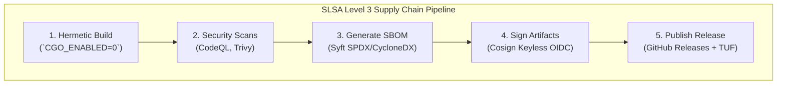
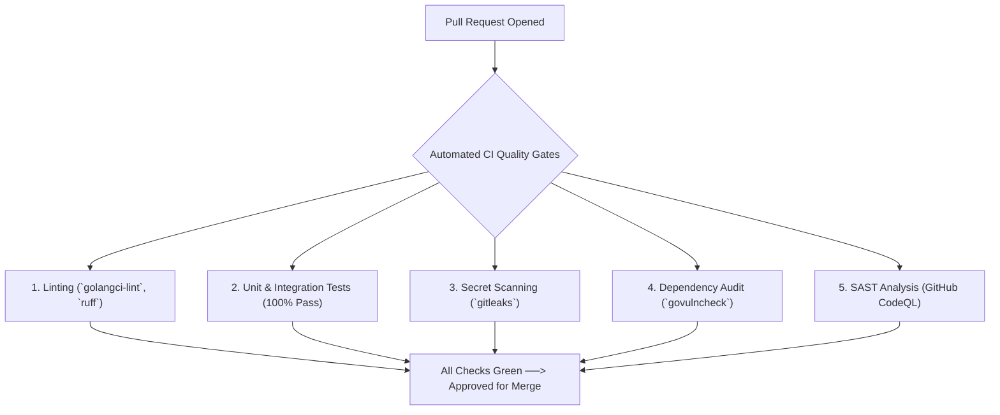
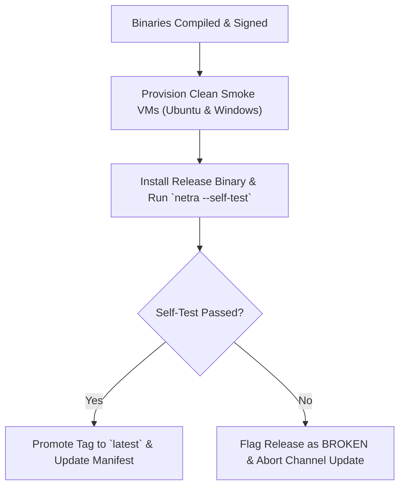

# NETRA — CI/CD Automation & Supply Chain Security Framework

> **Document Status:** Approved Specification  
> **Target Version:** v1.0.0-MVP  
> **Authoritative Scope:** Specifications for continuous integration, hermetic builds, automated security testing, Software Bill of Materials (SBOM) generation, artifact signing, and releases.  
> **Related Documents:** [WORKFLOW.md](./WORKFLOW.md), [SECURITY_CHECK.md](./SECURITY_CHECK.md), [ARCHITECTURE.md](./ARCHITECTURE.md)

---

## Contents

1. [CI/CD Philosophy & Supply Chain Posture](#1-cicd-philosophy--supply-chain-posture)
2. [Branch Validation & Automated PR Quality Gates](#2-branch-validation--automated-pr-quality-gates)
3. [Hermetic Build & Multi-Architecture Compilation](#3-hermetic-build--multi-architecture-compilation)
4. [Automated Security Scanners (SAST, Secrets, Vulnerabilities)](#4-automated-security-scanners-sast-secrets-vulnerabilities)
5. [Software Bill of Materials (SBOM) Generation](#5-software-bill-of-materials-sbom-generation)
6. [Cryptographic Artifact Signing (Cosign / Sigstore)](#6-cryptographic-artifact-signing-cosign--sigstore)
7. [GitHub Actions Release Pipeline Architecture](#7-github-actions-release-pipeline-architecture)
8. [Release Verification & Automated Rollback](#8-release-verification--automated-rollback)

---

## 1. CI/CD Philosophy & Supply Chain Posture

NETRA is built with the conviction that **a security platform must demonstrate verifiable software supply chain integrity (SLSA Level 3)**. Every released binary is reproducible, cryptographically signed, and traceable to an immutable Git commit.



---

## 2. Branch Validation & Automated PR Quality Gates

Every Pull Request targeting `main` must pass mandatory automated checks before merging:



---

## 3. Hermetic Build & Multi-Architecture Compilation

Release binaries are compiled across supported operating systems and architectures using standard Go toolchains:

```bash
# Matrix Build Example:
# Linux AMD64
CGO_ENABLED=0 GOOS=linux GOARCH=amd64 go build -trimpath -ldflags="-s -w" -o dist/netra-linux-amd64 ./cmd/netra

# Linux ARM64
CGO_ENABLED=0 GOOS=linux GOARCH=arm64 go build -trimpath -ldflags="-s -w" -o dist/netra-linux-arm64 ./cmd/netra

# Windows AMD64
CGO_ENABLED=0 GOOS=windows GOARCH=amd64 go build -trimpath -ldflags="-s -w" -o dist/netra-windows-amd64.exe ./cmd/netra

# macOS Universal (Apple Silicon + Intel)
CGO_ENABLED=0 GOOS=darwin GOARCH=arm64 go build -trimpath -ldflags="-s -w" -o dist/netra-darwin-arm64 ./cmd/netra
CGO_ENABLED=0 GOOS=darwin GOARCH=amd64 go build -trimpath -ldflags="-s -w" -o dist/netra-darwin-amd64 ./cmd/netra
lipo -create -output dist/netra-darwin-universal dist/netra-darwin-arm64 dist/netra-darwin-amd64
```

---

## 4. Automated Security Scanners

1. **`govulncheck`**: Queries the official Go vulnerability database to flag known CVEs in transitive dependencies.
2. **`gitleaks`**: Scans commits for accidental exposure of private keys, tokens, or credentials.
3. **`trivy`**: Scans container base images for OS-level package vulnerabilities.

---

## 5. Software Bill of Materials (SBOM) Generation

During each release build, an authoritative SBOM is generated using `syft`:

```bash
# Generate SBOM in CycloneDX and SPDX formats
syft packages dir:dist/ -o cyclonedx-json=dist/netra-sbom.cyclonedx.json
syft packages dir:dist/ -o spdx-json=dist/netra-sbom.spdx.json
```

---

## 6. Cryptographic Artifact Signing (Cosign / Sigstore)

Release artifacts and container images are cryptographically signed using **Cosign** via GitHub Actions OIDC identity:

```bash
# Keyless signing of release binary
cosign sign-blob \
  --yes \
  --output-signature dist/netra-linux-amd64.sig \
  --output-certificate dist/netra-linux-amd64.pem \
  dist/netra-linux-amd64
```

---

## 7. GitHub Actions Release Pipeline Architecture

```yaml
name: Release Pipeline
on:
  push:
    tags:
      - 'v*'

jobs:
  build-and-release:
    runs-on: ubuntu-latest
    permissions:
      contents: write
      id-token: write
    steps:
      - uses: actions/checkout@v4
      - uses: actions/setup-go@v5
        with:
          go-version: '1.22'
      - name: Build Static Binaries
        run: make release-build
      - name: Generate SBOM
        uses: anchore/sbom-action@v0
        with:
          path: dist/
      - name: Sign Binaries with Cosign
        uses: sigstore/cosign-installer@v3
      - name: Create GitHub Release
        uses: softprops/action-gh-release@v2
        with:
          files: dist/*
```

---

## 8. Release Verification & Automated Rollback


