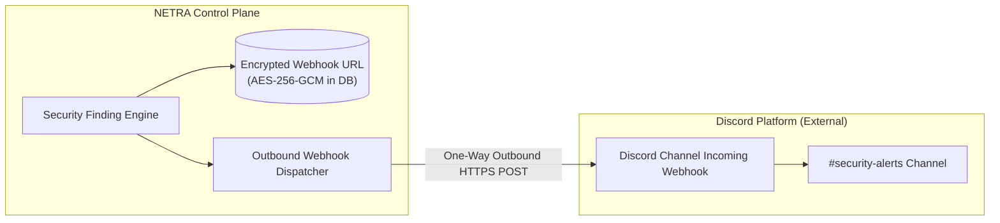
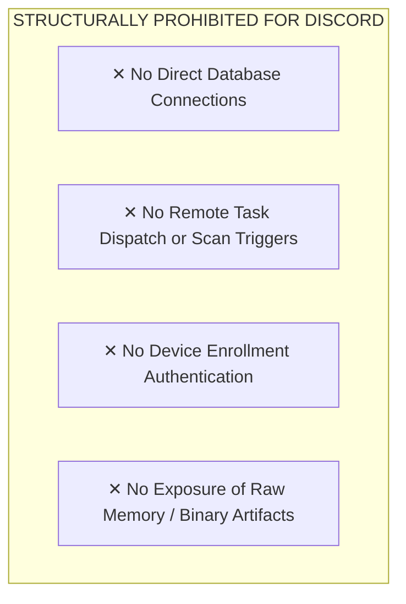

# NETRA — Discord Integration & Community Notifier Architecture

> **Document Status:** Approved Specification  
> **Integration Role:** Optional Homelab Plugin / Outbound Webhook Notifier  
> **Authoritative Scope:** Specifications for Discord webhook notifications, embed schemas, security restrictions, and architectural demotion rationale for NETRA.  
> **Related Documents:** [ARCHITECTURE.md](./ARCHITECTURE.md), [SLACK.md](./SLACK.md), [SECURITY_CHECK.md](./SECURITY_CHECK.md)

---

## Contents

1. [Integration Role & Demotion Rationale](#1-integration-role--demotion-rationale)
2. [Supported Use Cases](#2-supported-use-cases)
3. [Discord Webhook Architecture & Security Boundary](#3-discord-webhook-architecture--security-boundary)
4. [Discord Webhook Embed Schema](#4-discord-webhook-embed-schema)
5. [What Discord MUST NOT Control](#5-what-discord-must-not-control)

---

## 1. Integration Role & Demotion Rationale

`[FACT]` In legacy NETRA, Discord was mistakenly architected as a primary interactive control plane (`discord/` bot, slash commands, direct session management).

`[RECOMMENDATION]` Discord has been **formally demoted from the core architecture**:
* **Why Demoted**: Discord is a consumer gaming/community chat application. It lacks enterprise Single Sign-On (SSO/SAML), enforces strict 2,000-character message limits, introduces third-party token leakage risks, and cannot operate in air-gapped or compliance-regulated enterprise environments.
* **New Role**: Discord is maintained purely as an **Optional Outbound Webhook Notifier** for students, security researchers, and homelab enthusiasts.

---

## 2. Supported Use Cases

1. **Homelab Finding Alerts**: Push real-time finding notifications to a personal Discord server channel via a standard incoming webhook URL.
2. **Weekly Lab Digest**: Post a formatted summary of homelab device health and open findings.

---

## 3. Discord Webhook Architecture & Security Boundary



---

## 4. Discord Webhook Embed Schema

When an alert triggers, NETRA dispatches a standard Discord Webhook payload:

```json
{
  "username": "NETRA Security Notifier",
  "avatar_url": "https://netra.io/assets/netra-icon.png",
  "embeds": [
    {
      "title": "🛡️ NETRA Alert: Insecure Listening Port Discovered",
      "description": "An unauthorized service was discovered listening on an external interface.",
      "color": 15158332,
      "fields": [
        { "name": "Host", "value": "`homelab-server-01`", "inline": true },
        { "name": "Severity", "value": "HIGH", "inline": true },
        { "name": "Service", "value": "Redis (Port 6379)", "inline": true },
        { "name": "Remediation", "value": "Bind Redis to `127.0.0.1` or enable UFW firewall rule." }
      ],
      "footer": { "text": "NETRA Community Edition • v1.0.0" },
      "timestamp": "2026-08-24T10:30:00Z"
    }
  ]
}
```

---

## 5. What Discord MUST NOT Control


