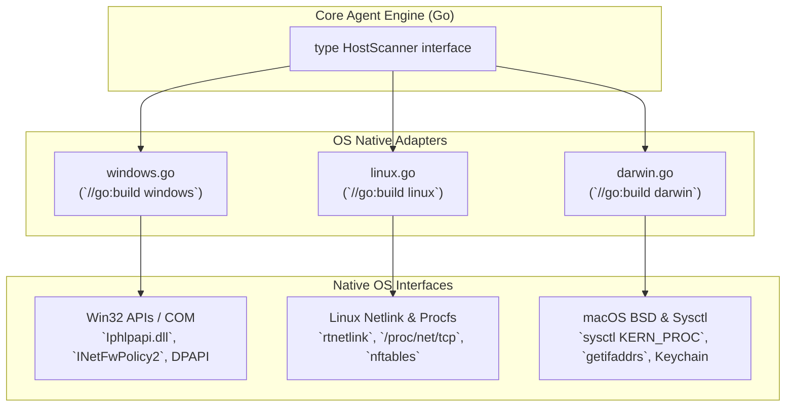
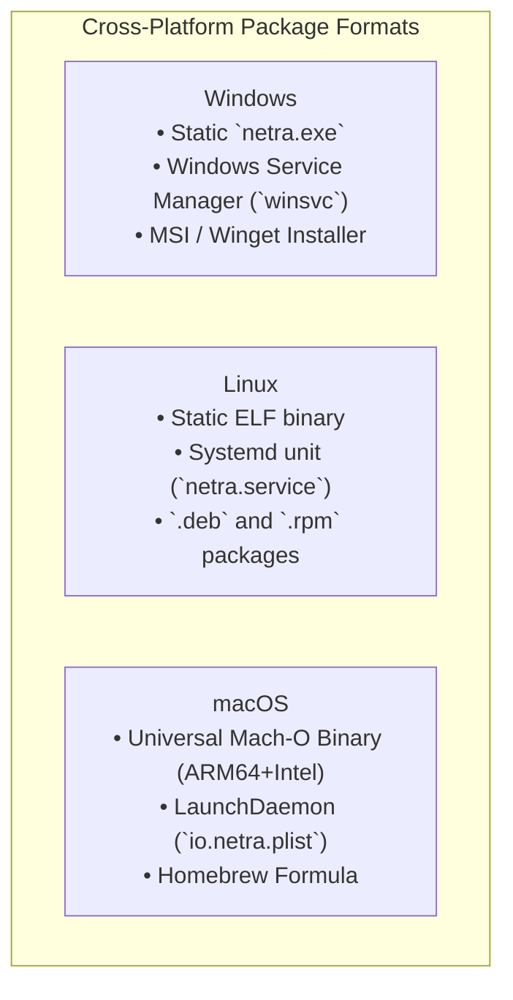
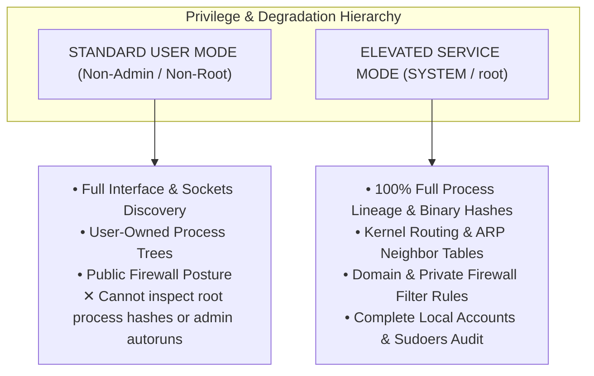

# NETRA — Cross-Platform Strategy & OS Versatility Architecture

> **Document Status:** Approved Specification  
> **Target Version:** v1.0.0-MVP  
> **Authoritative Scope:** Technical specifications for Windows, Linux, and macOS native operating system adapters, syscall bindings, privilege boundaries, and packaging.  
> **Related Documents:** [ARCHITECTURE.md](./ARCHITECTURE.md), [SYSTEM_DESIGN.md](./SYSTEM_DESIGN.md), [TRD.md](./TRD.md)

---

## Contents

1. [OS Versatility Philosophy](#1-os-versatility-philosophy)
2. [Unified Abstraction Layer Architecture](#2-unified-abstraction-layer-architecture)
3. [Windows Native Adapter Specification](#3-windows-native-adapter-specification)
4. [Linux Native Adapter Specification](#4-linux-native-adapter-specification)
5. [macOS Native Adapter Specification](#5-macos-native-adapter-specification)
6. [Comprehensive OS Capability Matrix](#6-comprehensive-os-capability-matrix)
7. [Packaging, Installation & Service Management](#7-packaging-installation--service-management)
8. [Privilege Boundaries & Graceful Degradation](#8-privilege-boundaries--graceful-degradation)

---

## 1. OS Versatility Philosophy

`[FACT]` Security tools that rely on shell command scraping (e.g., executing `netsh`, `ufw`, or `ps` via subprocesses) fail in multi-language environments and create severe performance overhead.

`[RECOMMENDATION]` NETRA enforces **Native OS System Call and C-ABI Bindings**:
* All platform interactions occur via direct system calls, Win32/COM APIs, Linux Netlink sockets, or BSD sysctl interfaces.
* The agent compiles down to clean platform-specific binaries using Go build tags (`//go:build windows`, `//go:build linux`, `//go:build darwin`).

---

## 2. Unified Abstraction Layer Architecture



---

## 3. Windows Native Adapter Specification

```mermaid
flowchart LR
    subgraph WindowsAdapter["Windows Native Implementation"]
        W1["Sockets & Routes"] -->|Direct Call| W1_API["`Iphlpapi.dll`<br/>(`GetExtendedTcpTable`, `GetIpForwardTable2`)"]
        W2["Firewall Rules"] -->|COM Interface| W2_API["`INetFwPolicy2`<br/>(Domain, Private, Public Profiles)"]
        W3["Process Lineage"] -->|Win32 Snapshot| W3_API["`CreateToolhelp32Snapshot`<br/>`QueryFullProcessImageNameW`"]
        W4["Key Storage"] -->|DPAPI Encryption| W4_API["`CryptProtectData`<br/>(Protected by Local System User)"]
    end
```

---

## 4. Linux Native Adapter Specification

```mermaid
flowchart LR
    subgraph LinuxAdapter["Linux Native Implementation"]
        L1["Routing & ARP"] -->|Kernel Netlink Socket| L1_API["`rtnetlink`<br/>(`RTM_GETROUTE`, `RTM_GETNEIGH`)"]
        L2["Sockets & PIDs"] -->|Procfs Filesystem| L2_API["`/proc/net/tcp` + `/proc/[pid]/fd/*`"]
        L3["Firewall State"] -->|Netlink / Config| L3_API["`nftables` API / `/etc/nftables.conf`"]
        L4["Key Storage"] -->|Kernel Keyring| L4_API["`keyctl` / Protected `0600` File"]
    end
```

---

## 5. macOS Native Adapter Specification

```mermaid
flowchart LR
    subgraph macOSAdapter["macOS Native Implementation"]
        M1["Network Interfaces"] -->|BSD Sockets| M1_API["`getifaddrs` + Routing Sockets (`AF_ROUTE`)"]
        M2["Sockets & PIDs"] -->|Proc PID Info| M2_API["`proc_pidinfo` (`PROC_PIDLISTFDS`)"]
        M3["Process Tree"] -->|Kernel Sysctl| M3_API["`sysctl` (`CTL_KERN`, `KERN_PROC`)"]
        M4["Key Storage"] -->|Keychain API| M4_API["`SecItemAdd` (`kSecClassGenericPassword`)"]
    end
```

---

## 6. Comprehensive OS Capability Matrix

| Capability / Scanner | Windows Implementation | Linux Implementation | macOS Implementation | MVP Status |
| :--- | :--- | :--- | :--- | :--- |
| **`SCAN_NETWORK`** | `GetAdaptersAddresses`, `GetIpForwardTable2` | Netlink `rtnetlink` + `ip neigh` | `getifaddrs` + BSD routing sockets | **★ MUST HAVE** |
| **`SCAN_SOCKETS`** | `GetExtendedTcpTable` | `/proc/net/tcp` + `/proc/[pid]/fd` | `proc_pidinfo` | **★ MUST HAVE** |
| **`SCAN_PROCESSES`**| `Toolhelp32Snapshot` | `/proc/[pid]/stat` + `/proc/[pid]/exe` | `sysctl KERN_PROC` + `proc_pidpath` | **★ MUST HAVE** |
| **`SCAN_FIREWALL`** | COM `INetFwPolicy2` | Netlink `nftables` / UFW config | `/dev/pf` ioctl | **★ MUST HAVE** |
| **`SCAN_USERS`** | `NetUserEnum` / `NetLocalGroup` | `/etc/passwd` + `/etc/group` | OpenDirectory / `dscl` | **★ MUST HAVE** |
| **`SCAN_STARTUP`** | Win32 Registry Run Keys + Tasks | systemd units + `/etc/cron.*` | LaunchDaemons / LaunchAgents | Phase 2 |
| **`SCAN_FIM`** | ReadDirectoryChangesW | `inotify` / `fanotify` | `FSEvents` API | Phase 3 |

---

## 7. Packaging, Installation & Service Management



---

## 8. Privilege Boundaries & Graceful Degradation


