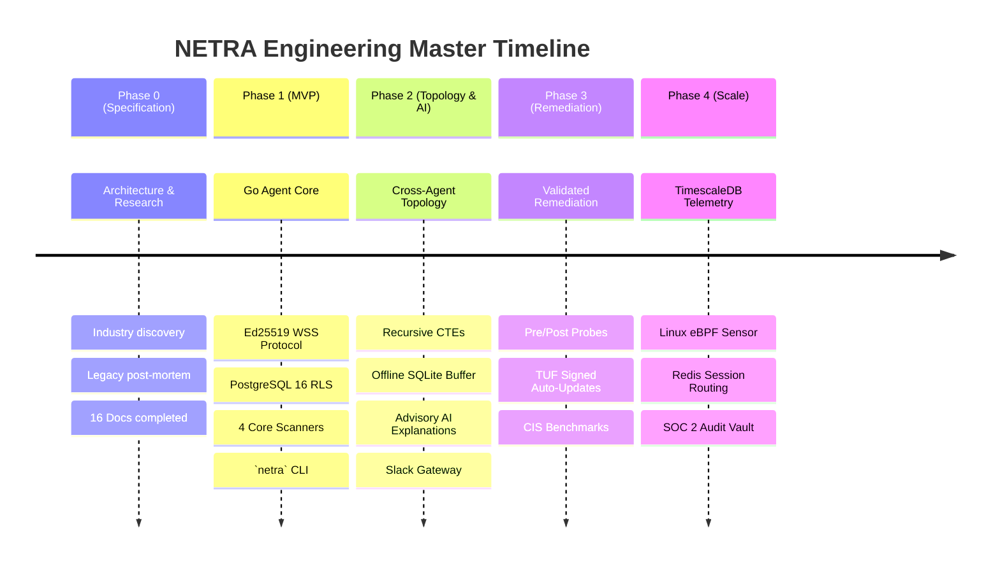
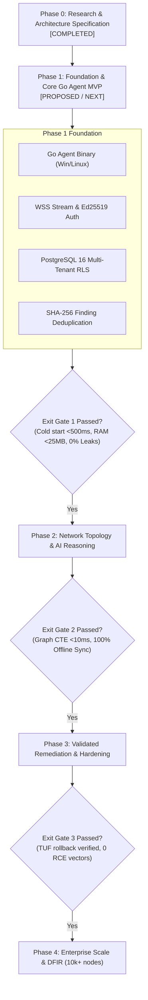

# NETRA — Phased Implementation Roadmap & Engineering Milestones

> **Document Status:** Approved Roadmap  
> **Authoritative Scope:** Master execution roadmap defining deliverables, security requirements, tests, acceptance criteria, and exit gates across all project phases for NETRA.  
> **Related Documents:** [PRD.md](./PRD.md), [TRD.md](./TRD.md), [WORKFLOW.md](./WORKFLOW.md)

---

## Contents

1. [Phased Engineering Philosophy](#1-phased-engineering-philosophy)
2. [Master Milestone Timeline](#2-master-milestone-timeline)
3. [Phase Dependency & Gating Architecture](#3-phase-dependency--gating-architecture)
4. [Phase 0: Deep Research & Architectural Specification](#4-phase-0-deep-research--architectural-specification)
5. [Phase 1: Foundation & Core Go Agent MVP](#5-phase-1-foundation--core-go-agent-mvp)
6. [Phase 2: Network Topology Engine & Advisory AI Explanation](#6-phase-2-network-topology-engine--advisory-ai-explanation)
7. [Phase 3: Validated Remediation & Compliance Playbooks](#7-phase-3-validated-remediation--compliance-playbooks)
8. [Phase 4: Enterprise Scale & Advanced Telemetry](#8-phase-4-enterprise-scale--advanced-telemetry)

---

## 1. Phased Engineering Philosophy

NETRA progresses through strictly gated milestones. No phase shall be declared complete without passing its predefined automated test suites, security checks, and formal acceptance criteria.

---

## 2. Master Milestone Timeline

---

## 3. Phase Dependency & Gating Architecture

---

## 4. Phase 0: Deep Research & Architectural Specification

* **Status**: `COMPLETED`
* **Goal**: Conduct deep security ecosystem research, perform a critical post-mortem on legacy NETRA, establish architectural principles, and produce the authoritative documentation suite.
* **Deliverables**: Complete 16-document engineering specification (`README.md`, `PRD.md`, `TRD.md`, `ARCHITECTURE.md`, `SYSTEM_DESIGN.md`, `SECURITY_CHECK.md`, `PHASES.md`, `CI_CD.md`, `WORKFLOW.md`, `UI_UX.md`, `USAGE.md`, `API.md`, `OS_VERSATILE.md`, `SLACK.md`, `DISCORD.md`, `RESEARCH.md`).
* **Exit Gate**: All documents consistent, cross-linked, and validated against research findings.

---

## 5. Phase 1: Foundation & Core Go Agent MVP

* **Status**: `PROPOSED / NEXT`
* **Goal**: Build and verify the core Go agent, outbound WSS communication gateway, PostgreSQL 16 multi-tenant backend, and CLI interface.
* **Scope**:
  * Single-binary Go agent with cross-compilation for Windows & Linux (x86_64/ARM64).
  * Asymmetric Ed25519 device identity generation and DPAPI/Keyring persistence.
  * Outbound WSS persistent connection with 15s heartbeats and TLS 1.3 encryption.
  * 4 Core Native Scanners: `SCAN_NETWORK`, `SCAN_PROCESSES`, `SCAN_FIREWALL`, `SCAN_USERS`.
  * PostgreSQL 16 backend with Row-Level Security (`SET LOCAL app.current_tenant_id`).
  * Deterministic SHA-256 finding deduplication and state machine.
  * CLI tool `netra`: `enroll`, `status`, `scan`, `findings`.
* **Security Requirements**:
  * Zero shared secrets over the wire; all payloads signed with Ed25519.
  * Pre-compiled capability execution only; zero remote shell evaluation.
  * Nonce sliding window replay protection ($<300\text{s}$).
* **Tests**:
  * Unit tests for Ed25519 signature canonicalization and verification.
  * Integration tests for PostgreSQL RLS multi-tenant query isolation.
  * Cross-platform scanner test suites on clean Windows and Linux VMs.
* **Exit Gate**: Agent cold-start $<500\text{ms}$, idle RAM $<25\text{MB}$, zero duplicate findings created on repeated scans.

---

## 6. Phase 2: Network Topology Engine & Advisory AI Explanation

* **Status**: `PLANNED`
* **Goal**: Synthesize cross-agent local network reachability graphs and integrate advisory AI finding explanations and Slack alerts.
* **Scope**:
  * Local ARP cache and routing table correlation across enrolled agents.
  * PostgreSQL Recursive CTE reachability graph generator.
  * Encrypted local SQLite buffer on the agent for offline operation.
  * macOS (Apple Silicon / Intel) native OS adapter implementation.
  * Asynchronous Slack Block Kit notifications and human approval webhooks.
  * Advisory AI summarization engine (sandboxed prompt generation).
* **Exit Gate**: Topology graph correctly discovers adjacent subnet neighbors in $<10\text{ms}$; 100% offline finding retention verified over 24-hour network partition.

---

## 7. Phase 3: Validated Remediation & Compliance Playbooks

* **Status**: `PLANNED`
* **Goal**: Enable cryptographically validated, human-approved remediation playbooks and TUF-compliant auto-updates.
* **Scope**:
  * Automated post-remediation validation probes.
  * CIS Benchmark automated configuration posture scans.
  * TUF-compliant agent auto-update system with atomic binary swap.
  * Signed release distribution pipeline (Cosign / Sigstore).
* **Exit Gate**: Zero arbitrary command execution vectors; automated rollbacks verified during simulated update corruptions.

---

## 8. Phase 4: Enterprise Scale & Advanced Telemetry

* **Status**: `PLANNED`
* **Goal**: Scale backend throughput to 10,000+ active agents and introduce Linux eBPF telemetry.
* **Scope**:
  * TimescaleDB / ClickHouse telemetry tiering for high-frequency metrics.
  * Linux eBPF process execution and socket tracking sensor.
  * Distributed Redis 7 WSS connection routing.
* **Exit Gate**: 10,000 concurrent active WSS streams sustained with $<100\text{ms}$ task dispatch latency.
