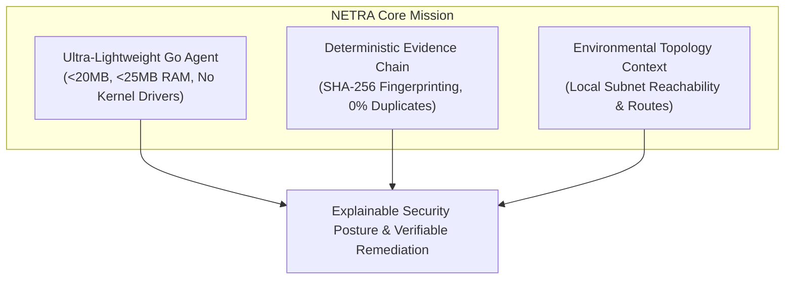
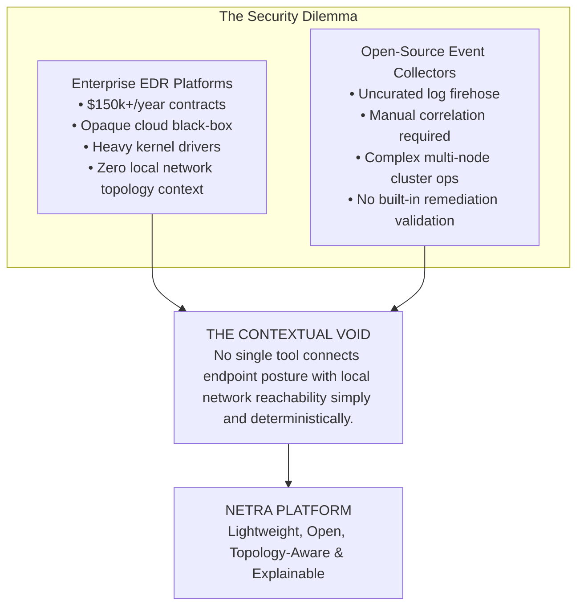
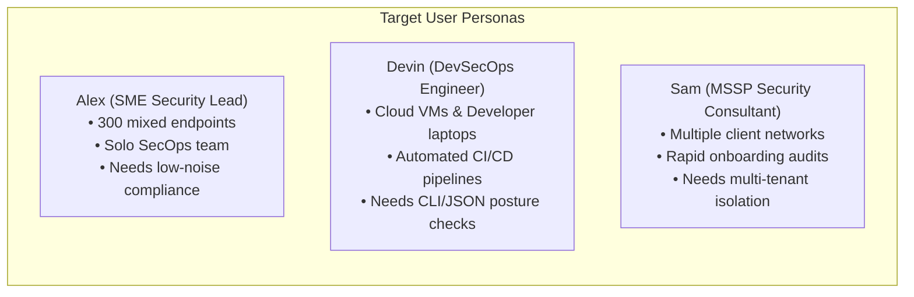
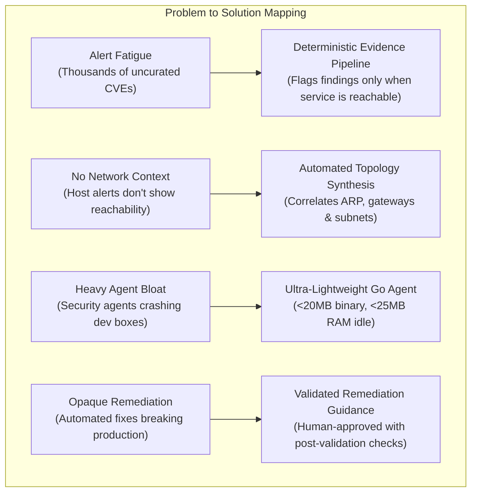
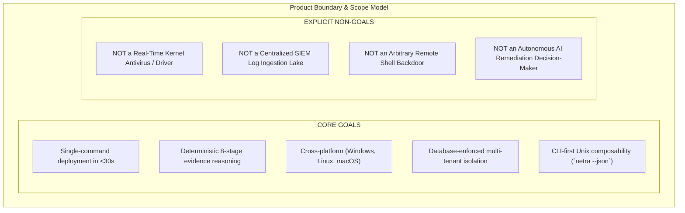
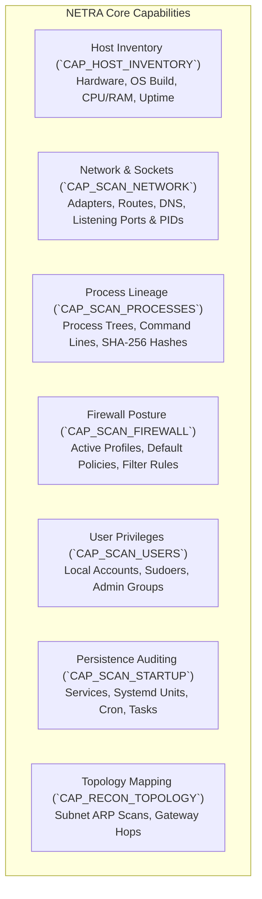
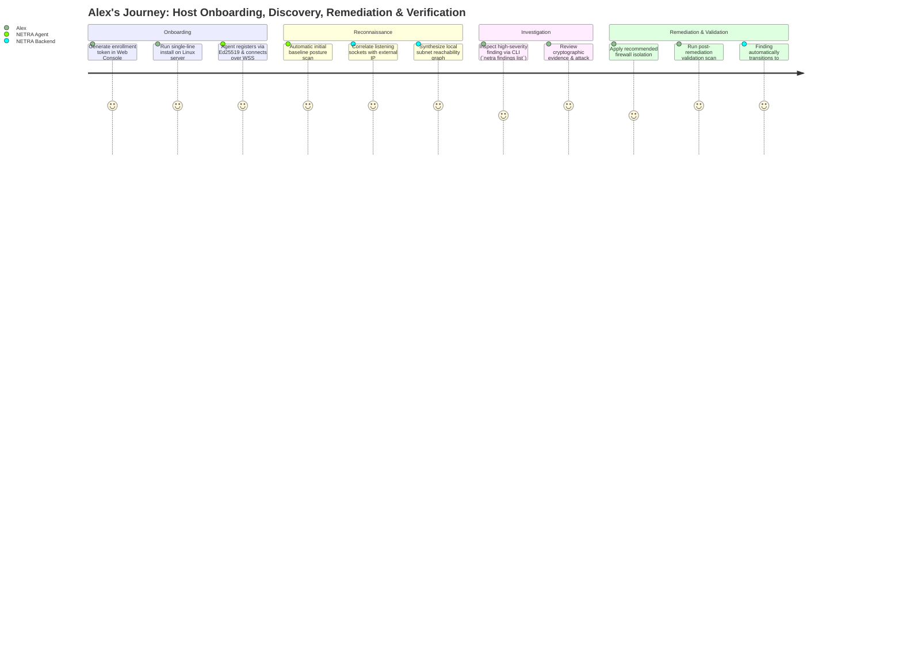
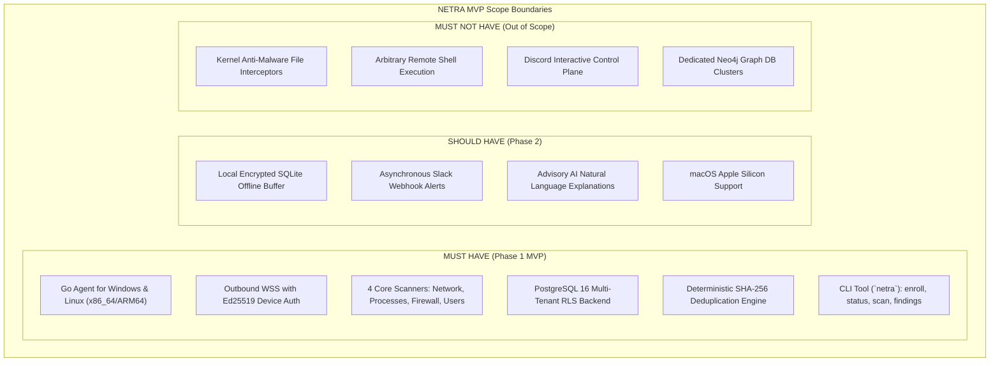

# NETRA — Product Requirements Document (PRD)

> **Document Status:** Approved Specification  
> **Target Version:** v1.0.0-MVP  
> **Authoritative Scope:** Defines product vision, target personas, functional requirements, MVP boundaries, non-goals, and success metrics for NETRA.  
> **Related Documents:** [TRD.md](./TRD.md), [ARCHITECTURE.md](./ARCHITECTURE.md), [PHASES.md](./PHASES.md)

---

## Contents

1. [Product Overview & Vision](#1-product-overview--vision)
2. [Problem Statement & Product Thesis](#2-problem-statement--product-thesis)
3. [Target Users & User Personas](#3-target-users--user-personas)
4. [User Problems & Core Value Propositions](#4-user-problems--core-value-propositions)
5. [Product Goals & Non-Goals](#5-product-goals--non-goals)
6. [Core Product Capabilities](#6-core-product-capabilities)
7. [Functional Requirements](#7-functional-requirements)
8. [Non-Functional Requirements](#8-non-functional-requirements)
9. [User Journeys](#9-user-journeys)
10. [Minimum Viable Product (MVP) Scope](#10-minimum-viable-product-mvp-scope)
11. [Future Product Roadmap](#11-future-product-roadmap)
12. [Success Metrics & Acceptance Criteria](#12-success-metrics--acceptance-criteria)
13. [Constraints, Assumptions & Product Risks](#13-constraints-assumptions--product-risks)

---

## 1. Product Overview & Vision

**NETRA** (Network & Endpoint Threat Reconnaissance Architecture) is an open-source, topology-aware security reasoning platform and host posture management engine. It enables small-to-medium enterprises, infrastructure engineers, and security teams to gain continuous, explainable visibility into endpoint vulnerabilities, configuration drift, and local network reachability without deploying heavy, expensive enterprise EDR suites.

### Vision Statement
To become the global open-source standard for **topology-aware security posture reasoning**, empowering every engineering team to understand, visualize, and secure their computing environment through transparent, deterministic evidence.

### Mission Statement
Deliver a single, ultra-lightweight Go binary and a resilient control plane that automatically correlates endpoint configurations with local network topology, providing instant, verifiable risk insights.

---

## 2. Problem Statement & Product Thesis

### 2.1 Problem Statement
Engineering and security teams face a critical dilemma:
* **Enterprise EDRs** (CrowdStrike, Defender, SentinelOne) are opaque, cost-prohibitive ($150+/node), require dedicated SOC analysts, and operate as cloud black-boxes that ignore local network topology.
* **Open-Source Tools** (osquery, Wazuh) output overwhelming streams of disconnected event logs without synthesizing relational context (e.g., *Is this open port reachable from an adjacent unmanaged subnet?*).

### 2.2 Product Thesis
> **"NETRA exists to provide engineering and security teams with an open, topology-aware security reasoning platform that bridges the gap between endpoint posture and network reachability through a single, ultra-lightweight agent and an explainable, deterministic evidence pipeline."**

---

## 3. Target Users & User Personas

---

## 4. User Problems & Core Value Propositions

---

## 5. Product Goals & Non-Goals

---

## 6. Core Product Capabilities

---

## 7. Functional Requirements

### 7.1 Agent Lifecycle & Management
* `[PRD-FR-01]` The agent must generate a cryptographically secure Ed25519 keypair upon enrollment and persist the private key in OS-protected storage.
* `[PRD-FR-02]` The agent must establish an outbound persistent WebSocket (WSS) connection to the backend over TLS 1.3 with zero inbound listening ports.
* `[PRD-FR-03]` The agent must automatically buffer findings locally in an encrypted SQLite database during network disconnects and synchronize upon reconnection.

### 7.2 Posture & Network Reconnaissance
* `[PRD-FR-04]` The agent must enumerate listening TCP/UDP sockets and bind each socket to its owning Process ID (PID), executable binary path, and user account.
* `[PRD-FR-05]` The agent must inspect the host firewall state using native platform APIs and identify if any profile is disabled or misconfigured.
* `[PRD-FR-06]` The agent must read local ARP tables and default gateways to construct a local network reachability map.

### 7.3 Findings, Deduplication & Evidence
* `[PRD-FR-07]` The system must compute a deterministic SHA-256 fingerprint for every finding to eliminate alert duplicates across repetitive scans.
* `[PRD-FR-08]` Every finding must be linked to an immutable evidence payload containing raw technical artifacts.
* `[PRD-FR-09]` Finding states must strictly follow the lifecycle: `OPEN` $\rightarrow$ `ACKNOWLEDGED` $\rightarrow$ `RESOLVED` $\rightarrow$ `REOPENED` $\rightarrow$ `MUTED`.

### 7.4 CLI & Automation
* `[PRD-FR-10]` The `netra` CLI must provide interactive human-readable outputs on TTYs and pure, unadorned JSON when invoked with `--json`.
* `[PRD-FR-11]` The CLI must return standard exit codes: `0` (clean), `1` (system error), `2` (policy violation / high severity detected).

---

## 8. Non-Functional Requirements

* `[PRD-NFR-01]` **Agent Resource Limits**: Static binary $<20\text{MB}$, idle RAM $<25\text{MB}$, peak scan RAM $<100\text{MB}$, idle CPU $<0.1\%$.
* `[PRD-NFR-02]` **Cold-Start Time**: Agent initialization and backend handshake completed in $<500\text{ms}$.
* `[PRD-NFR-03]` **Crash Isolation**: Scanner panics or OS API failures must be caught cleanly and never crash the supervisor daemon.
* `[PRD-NFR-04]` **Backend Scalability**: Single backend node must sustain $\ge 5,000$ active concurrent agent WSS connections.
* `[PRD-NFR-05]` **Zero-Trust Multi-Tenancy**: Logical and relational data isolation enforced at the PostgreSQL database level via Row-Level Security.

---

## 9. User Journeys

The following journey diagram illustrates how a solo security lead (Alex) deploys NETRA, investigates an exposed service finding, applies a configuration fix, and verifies the resolution deterministically.

---

## 10. Minimum Viable Product (MVP) Scope

---

## 11. Future Product Roadmap

* **Phase 2 (Topology & AI Reasoning)**: Cross-agent ARP/routing graph correlation; macOS Apple Silicon support; advisory AI risk explanations.
* **Phase 3 (Validated Remediation)**: Controlled, safe remediation playbooks with automatic pre/post validation probes; TUF-compliant auto-updates.
* **Phase 4 (Enterprise Scale & Compliance)**: TimescaleDB telemetry offload for 10,000+ nodes; CIS Benchmark compliance reporting; Linux eBPF telemetry.

---

## 12. Success Metrics & Acceptance Criteria

1. **Deployment Friction**: New agent deployed and enrolled in $<30$ seconds.
2. **Resource Footprint**: Agent idle memory verified $\le 25\text{MB}$ across all supported platforms.
3. **Alert Noise Reduction**: $0\%$ duplicate finding creation across continuous 60-second scan intervals.
4. **Offline Resilience**: Agent retains $100\%$ of offline findings during a 24-hour network outage and flushes upon reconnection.
5. **Security Verification**: $0$ arbitrary command execution vulnerabilities in penetration testing.

---

## 13. Constraints, Assumptions & Product Risks

* **Constraint**: Must operate entirely in user-space without custom signed kernel drivers.
* **Assumption**: Client environments permit outbound TCP traffic on port 443 (HTTPS/WSS).
* **Product Risk**: Overzealous automated remediation causing system instability $\longrightarrow$ *Mitigated by requiring human approval and strict validation checks*.
