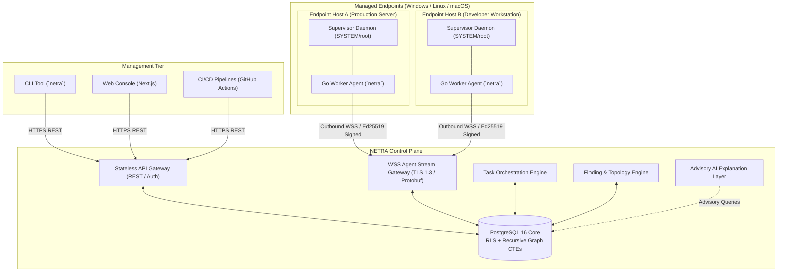
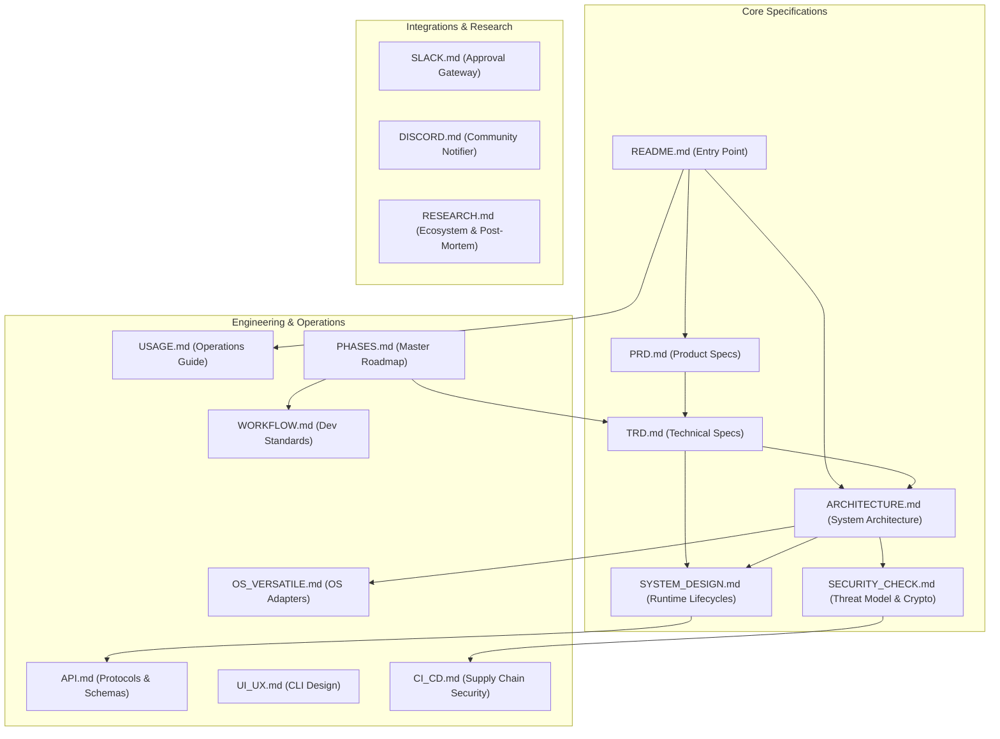

# NETRA — Network & Endpoint Threat Reconnaissance Architecture

> **Status:** Approved Specification  
> **Target Release:** v1.0.0-MVP  
> **Primary Interfaces:** CLI (`netra`), WSS Protocol, REST API, Web Console  

---

## 1. Executive Overview

**NETRA** is an open-source, topology-aware security reasoning platform and lightweight host reconnaissance engine. Built for small-to-medium enterprises (SMEs), DevSecOps teams, and security engineers, NETRA bridges the critical gap between **isolated endpoint posture** and **environmental network reachability**.

Traditional security platforms either flood analysts with uncurated, disconnected event logs (e.g., osquery, Wazuh) or operate as expensive, opaque cloud black-boxes (e.g., CrowdStrike, Defender for Endpoint). NETRA introduces a **Deterministic Security Reasoning Engine** delivered via a single, self-contained Go agent binary (<20MB, <25MB RAM idle). It replaces alert fatigue with an immutable cryptographic chain:

$$\text{Observation} \longrightarrow \text{Evidence} \longrightarrow \text{Finding} \longrightarrow \text{Relationship} \longrightarrow \text{Risk} \longrightarrow \text{Explanation} \longrightarrow \text{Recommended Action} \longrightarrow \text{Validation}$$

```mermaid
flowchart LR
    subgraph Pipeline["NETRA Security Reasoning Pipeline"]
        direction LR
        Obs["1. Observation<br/>(Raw Fact)"] --> Ev["2. Evidence<br/>(Hashed Artifact)"]
        Ev --> Fnd["3. Finding<br/>(Deterministic Rule)"]
        Fnd --> Rel["4. Relationship<br/>(Topology Context)"]
        Rel --> Rsk["5. Risk<br/>(Blast Radius)"]
        Rsk --> Exp["6. Explanation<br/>(Human/AI Digest)"]
        Exp --> Rec["7. Recommendation<br/>(Safe Fix)"]
        Rec --> Val["8. Validation<br/>(Post-Check)"]
    end
    style Obs fill:#e1f5fe,stroke:#0288d1,stroke-width:1px
    style Ev fill:#e1f5fe,stroke:#0288d1,stroke-width:1px
    style Fnd fill:#fff3e0,stroke:#f57c00,stroke-width:1px
    style Rel fill:#ede7f6,stroke:#512da8,stroke-width:1px
    style Rsk fill:#ffebee,stroke:#d32f2f,stroke-width:1px
    style Exp fill:#f3e5f5,stroke:#7b1fa2,stroke-width:1px
    style Rec fill:#e8f5e9,stroke:#388e3c,stroke-width:1px
    style Val fill:#e0f2f1,stroke:#00796b,stroke-width:1px
```



---

## 2. Core Product Thesis

> **"NETRA exists to provide engineering and security teams with an open, topology-aware security reasoning platform that bridges the gap between endpoint posture and network reachability through a single, ultra-lightweight agent and an explainable, deterministic evidence pipeline."**

---

## 3. High-Level Architecture Overview

The following diagram illustrates the interaction between operators, the central control plane, and managed endpoint devices over secure outbound TLS 1.3 WebSocket streams.



---

## 4. Key Capabilities

* **Deterministic Finding Pipeline**: Every security defect is backed by an immutable, cryptographically hashed evidence artifact (SHA-256 fingerprinting) eliminating alert duplicates.
* **Network & Topology Intelligence**: Automatically infers Layer-2/Layer-3 routing paths, default gateways, listening socket owners, and neighbor relationships across subnets without intrusive network scanning.
* **Single-Binary Zero-Dependency Agent**: Cross-platform (Windows, Linux, macOS) Go agent running as an unprivileged or system service with strict OS resource sandboxing (cgroups / Job Objects).
* **Asymmetric Device Identity (Ed25519)**: Eliminates shared-secret vulnerabilities. Private keys are generated locally and stored in OS-protected storage (Windows DPAPI, Linux SecretService, macOS Keychain).
* **Multi-Tenant Row-Level Security (RLS)**: Enforces complete tenant isolation at the PostgreSQL database engine layer (`SET LOCAL app.current_tenant_id`).
* **Controlled Capability Model**: Strict pre-compiled task execution whitelist (`SCAN_NETWORK`, `SCAN_PROCESSES`, `SCAN_FIREWALL`, etc.). Arbitrary remote shell evaluation (`exec`/`eval`) is structurally prohibited.
* **CLI-First Architecture**: Clean Unix philosophy (`netra --json | jq`) designed for automation, terminal-first engineers, and CI/CD pipelines.
* **Advisory AI Layer**: AI is strictly quarantined to natural language explanations, attack path summarization, and query translation. The security core remains 100% deterministic.

---

## 5. Quick Conceptual Workflow

```bash
# 1. Enroll an endpoint host into your organization (one-time command)
$ sudo netra enroll --token enroll_sec_99a8b7c6d5e4

# 2. Check local agent health and connection state
$ netra status

# 3. Trigger an on-demand host security posture and network scan
$ netra scan --all

# 4. View discovered findings with deterministic SHA-256 evidence
$ netra findings list --severity HIGH

# 5. Output structured JSON for automation and CI/CD pipelines
$ netra findings list --json | jq '.findings[] | {title: .title, risk: .risk_score}'
```

---

## 6. Official Documentation Suite

The complete engineering specification of NETRA is structured across the following authoritative documents:



* **[PRD.md](./docs/PRD.md)**: Product requirements, user personas, goals, non-goals, and success metrics.
* **[TRD.md](./docs/TRD.md)**: Technical requirements, protocols, resource budgets, and performance specifications.
* **[ARCHITECTURE.md](./docs/ARCHITECTURE.md)**: System topology, component boundaries, and Architectural Decision Records (ADRs).
* **[SYSTEM_DESIGN.md](./docs/SYSTEM_DESIGN.md)**: Runtime workflows, sequence diagrams, state machines, and concurrency models.
* **[SECURITY_CHECK.md](./docs/SECURITY_CHECK.md)**: Threat modeling (STRIDE), Ed25519 cryptography, PostgreSQL RLS, and TUF auto-updates.
* **[OS_VERSATILE.md](./docs/OS_VERSATILE.md)**: Windows, Linux, and macOS native syscall adapters and capability matrices.
* **[API.md](./docs/API.md)**: REST endpoints, WebSocket streaming frames, authentication schemas, and error codes.
* **[UI_UX.md](./docs/UI_UX.md)**: CLI interaction standards, output stream separation, ANSI tables, and machine-readable JSON modes.
* **[USAGE.md](./docs/USAGE.md)**: Practical end-user operations, installation, enrollment, scanning, and troubleshooting.
* **[SLACK.md](./docs/SLACK.md)**: Asynchronous notifications and human-in-the-loop remediation approval gateway.
* **[DISCORD.md](./docs/DISCORD.md)**: Optional outbound webhook notifier for homelabs and community users.
* **[CI_CD.md](./docs/CI_CD.md)**: Hermetic Go builds, SBOM generation (Syft), Cosign cryptographic signing, and release gates.
* **[WORKFLOW.md](./docs/WORKFLOW.md)**: Engineering branching models, conventional commits, and Definition of Done.
* **[PHASES.md](./docs/PHASES.md)**: Master implementation roadmap across verified engineering milestones.
* **[RESEARCH.md](./docs/RESEARCH.md)**: Industry discovery, competitive analysis, legacy post-mortem, and diagram inventory.

---

## 7. Security & Engineering Principles

1. **Evidence Before Finding**: No risk or defect is reported without immutable, hashed technical evidence.
2. **Deterministic Core, Advisory AI**: Security rules and remediations are 100% deterministic; AI never makes operational decisions.
3. **Least Privilege & Zero Inbound Ports**: The agent requires no open listening ports and executes with strictly bounded OS privileges.
4. **Single Static Binaries**: Built in Go with zero external runtime dependencies (`CGO_ENABLED=0`).
5. **No Arbitrary Remote Execution**: Remote shell strings are strictly prohibited by design.

---

## 8. Project Status & Roadmap

NETRA is currently in the **Specification & Architectural Verification Phase** (Phase 0). Application code implementation will follow the strict milestone roadmap defined in [PHASES.md](./docs/PHASES.md).

* **Phase 0: Research & Architecture Specification** $\longrightarrow$ `[COMPLETED]`
* **Phase 1: Foundation & Core Go Agent MVP** $\longrightarrow$ `[PROPOSED / NEXT]`
* **Phase 2: Network Topology Engine & AI Explanation** $\longrightarrow$ `[PLANNED]`
* **Phase 3: Validated Remediation & Compliance Playbooks** $\longrightarrow$ `[PLANNED]`
* **Phase 4: Enterprise Scale & Advanced Telemetry** $\longrightarrow$ `[PLANNED]`

---

## 9. License

NETRA is released under the [Apache 2.0 License](./LICENSE) (pending final release packaging).
