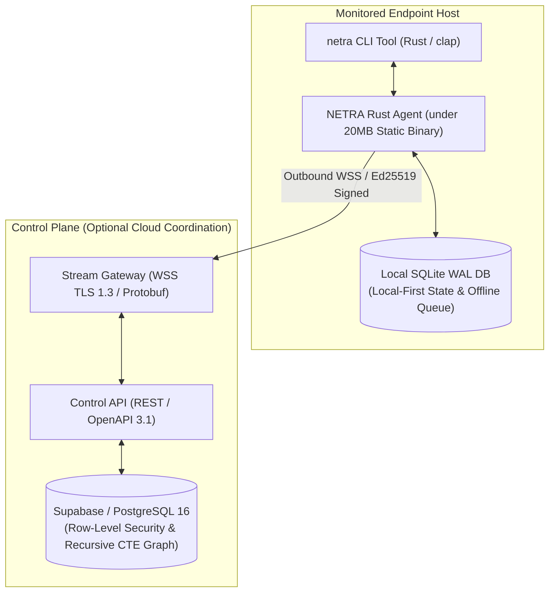
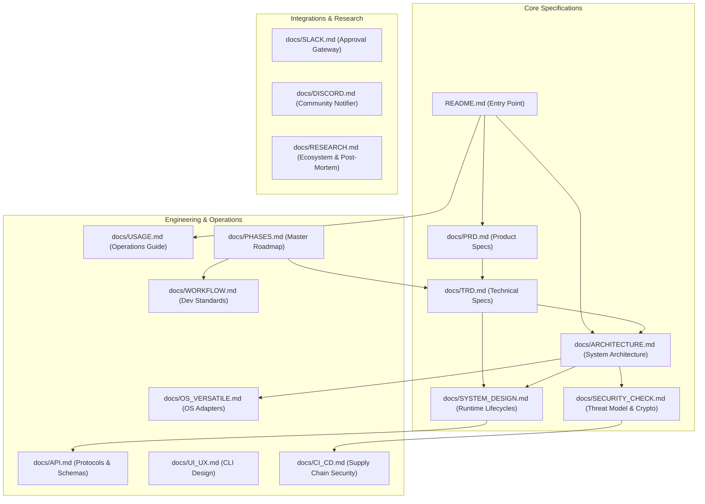

# NETRA — Network & Endpoint Threat Reconnaissance Architecture

> **An Open-Source, Academic Defensive Security Engineering Framework**  
> Built with a **Rust-First Systems Architecture** for learning, experimentation, research, and understanding modern endpoint security and network reachability.

---

## 1. Project Identity & Purpose

**NETRA** is an open-source, non-commercial security engineering and research project. It is created to provide students, security researchers, developers, and defensive engineers with a transparent, well-architected reference platform for endpoint posture reconnaissance, local network reachability reasoning, and safe, controlled remediation.

### What NETRA Is:
* An **academic research project** demonstrating modern system design, local-first state management, and defensive telemetry.
* A **Rust-first systems platform** engineered for deterministic performance, memory safety, zero garbage collection pauses, and minimal host resource consumption (under 15MB idle RAM).
* A **developer-oriented security tool** providing transparent, deterministic reasoning without black-box proprietary heuristics.
* A **hands-on learning platform** for studying cross-platform OS syscalls (Windows Win32/COM, Linux Netlink, macOS BSD sockets), cryptographic device attestation (Ed25519), and supply chain integrity (SLSA Level 3).

### What NETRA Is NOT:
* ✕ **NOT** a commercial SaaS or enterprise security product.
* ✕ **NOT** a commercial replacement for CrowdStrike Falcon, Microsoft Defender for Endpoint, or SentinelOne.
* ✕ **NOT** an antivirus replacement or malware signature blocker.
* ✕ **NOT** a commercial SIEM/SOAR platform.
* ✕ **NOT** an offensive hacking or exploitation framework.

---

## 2. Important Educational & Safety Disclaimer

> [!CAUTION]
> **Academic & Experimental Software Disclaimer**  
> NETRA is developed for research, education, and experimental evaluation. While engineered according to rigorous security best practices:
> 1. It should **not automatically be treated as production-grade security software** without prior internal validation and testing.
> 2. Active remediation actions (such as firewall adjustments or service bindings) modify host operating system state and carry potential risks of service disruption.
> 3. Users, students, and researchers assume full responsibility for how they deploy, configure, and execute NETRA within their environments.

---

## 3. Rust-First Architectural Foundation

NETRA adopts a **Rust-First Systems Architecture** for its core endpoint runtime. Rust provides:
* **Memory Safety & Stability**: Eliminates memory corruption vulnerabilities without requiring a runtime garbage collector.
* **Low Resource Footprint**: Operates with under 15MB RSS idle RAM and under 0.1% CPU utilization, ideal for persistent daemon execution.
* **Direct OS Syscall Integration**: Native interop with Win32 APIs, Linux Netlink sockets, and macOS kernel sysctl tables without bulky bridge wrappers.
* **Justified Extension Layer**: High-level scripting languages (such as Python) are reserved strictly for exploratory research tooling, offline heuristics, and sandboxed advisory LLM prompt translation.



---

## 4. Key Capabilities

* **Deterministic 10-Stage Evidence Pipeline**: Every defect is backed by an immutable, SHA-256 hashed evidence artifact, completely eliminating alert duplicates.
* **Network & Topology Intelligence**: Passively extracts ARP tables and kernel routing rules to synthesize Layer-2/Layer-3 network reachability without noisy port scans.
* **Browser & Web Exposure Awareness**: Correlates web browser processes with external socket connections and DNS domains while strictly enforcing zero user payload inspection.
* **Vulnerability Intelligence**: Offline-capable correlation of installed software packages with standardized open CVE/CPE vulnerability catalogs (OSV / NVD).
* **Controlled Remediation with Verification**: Safe, human-approved remediations backed by pre-flight checks, native OS changes, post-validation probes, and automated rollbacks.
* **Local-First Resilience**: All findings and observations persist in a local SQLite database, operating seamlessly through 24-hour network partitions.
* **Single Static Zero-Dependency Binary**: Compiled in Rust with zero external runtime dependencies.

---

## 5. Quick Conceptual Workflow

```bash
# 1. Enroll an endpoint host into your environment (one-time command)
$ netra enroll --token enroll_sec_99a8b7c6d5e4

# 2. Check local agent health and connection state
$ netra status

# 3. Trigger an on-demand host security posture and network scan
$ netra scan --all

# 4. View discovered findings with deterministic SHA-256 evidence
$ netra findings list --severity HIGH

# 5. Output structured JSON for automation and CI/CD pipelines
$ netra findings list --json | jq '.data.findings[] | {title: .title, risk: .risk_score}'
```

---

## 6. Authoritative Documentation Suite

The complete engineering specification of NETRA is structured across the following 15 documents in the [`docs/`](./docs) directory:



### Complete Documentation Directory:
* **[docs/PRD.md](./docs/PRD.md)**: Product requirements, academic personas, non-goals, and success metrics.
* **[docs/TRD.md](./docs/TRD.md)**: Technical requirements, protocols, resource budgets, and performance specifications.
* **[docs/ARCHITECTURE.md](./docs/ARCHITECTURE.md)**: Master system architecture, Rust systems core, boundaries, and ADRs.
* **[docs/SYSTEM_DESIGN.md](./docs/SYSTEM_DESIGN.md)**: Detailed runtime workflows, sequence diagrams, state machines, and lifecycles.
* **[docs/API.md](./docs/API.md)**: Official API reference, WSS Protobuf frames, schemas, error models, and ER diagrams.
* **[docs/SECURITY_CHECK.md](./docs/SECURITY_CHECK.md)**: Threat modeling (STRIDE), Ed25519 crypto, PostgreSQL RLS, and TUF updates.
* **[docs/OS_VERSATILE.md](./docs/OS_VERSATILE.md)**: Windows, Linux, and macOS native syscall adapters and capability matrices.
* **[docs/UI_UX.md](./docs/UI_UX.md)**: CLI interaction standards, stream separation (stdout vs. stderr), and ANSI formatting.
* **[docs/USAGE.md](./docs/USAGE.md)**: Practical end-user operations, installation, enrollment, scanning, and troubleshooting.
* **[docs/PHASES.md](./docs/PHASES.md)**: Master implementation roadmap across verified engineering milestones (Phases 0–17).
* **[docs/CI_CD.md](./docs/CI_CD.md)**: Reproducible Rust builds, SBOM generation (Syft), Cosign signing, and supply chain security.
* **[docs/WORKFLOW.md](./docs/WORKFLOW.md)**: Developer branching models, conventional commits, and Definition of Done.
* **[docs/RESEARCH.md](./docs/RESEARCH.md)**: Industry discovery, competitive analysis, legacy post-mortem, and 59-diagram inventory.
* **[docs/SLACK.md](./docs/SLACK.md)**: Asynchronous notifications and human-in-the-loop remediation approval gateway.
* **[docs/DISCORD.md](./docs/DISCORD.md)**: Optional outbound webhook notifier for homelabs and community users.

---

## 7. Open-Source Status, Acknowledgements & License

* **Open-Source Status**: Active Academic & Research Project.
* **Development Status**: **Phase 0** through **Phase 6** (**Device Identity, Ed25519 Cryptography, OS KeyStore, Request Signing, Two-Stage Enrollment, Key Rotation & WSS Protocol**) are `COMPLETED & VERIFIED`. Implementation proceeds strictly along the milestone roadmap in [docs/PHASES.md](./docs/PHASES.md).
* **License**: `License: To be selected.` (Apache 2.0 / MIT candidate pending final packaging).
* **Acknowledgements & Academic References**:
  - [osquery](https://osquery.io/) — Conceptual inspiration for OS table abstractions.
  - [Velociraptor](https://docs.velociraptor.app/) — Reference for endpoint forensic collection.
  - [Drishti-Innofusion](https://github.com/soumyachk101/Drishti-Innofusion/) — Reference project evaluated for browser exposure and multi-workstation observations.
  - [The Update Framework (TUF)](https://theupdateframework.io/) — Reference for cryptographic software update resilience.
* **Responsible Security Disclosure**: If you discover a security vulnerability within NETRA, please contact the maintainers via private security disclosure channels rather than opening a public issue.
