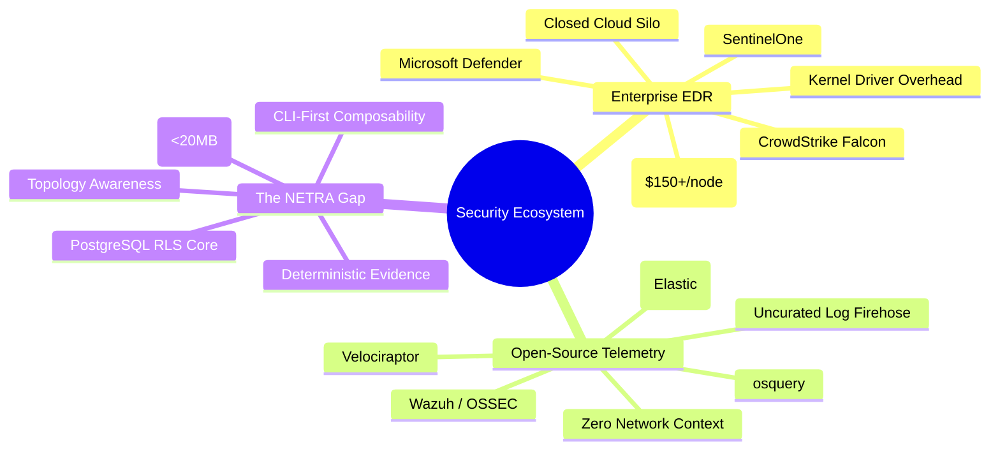
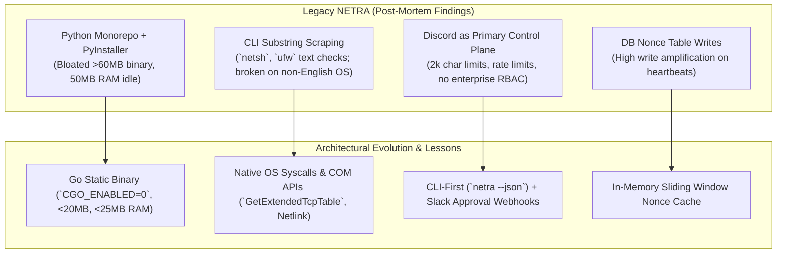
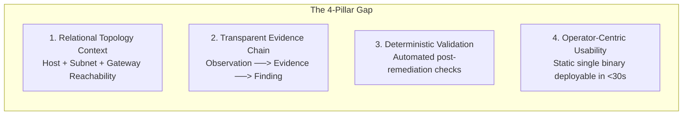
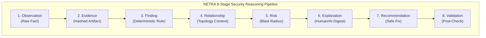
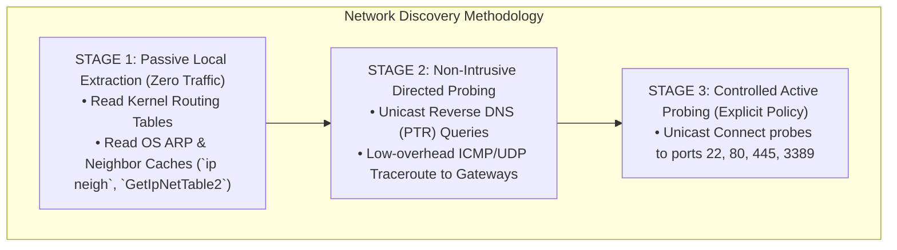
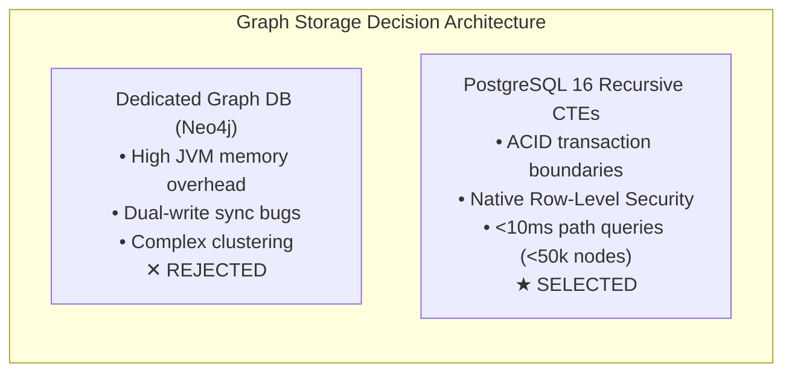
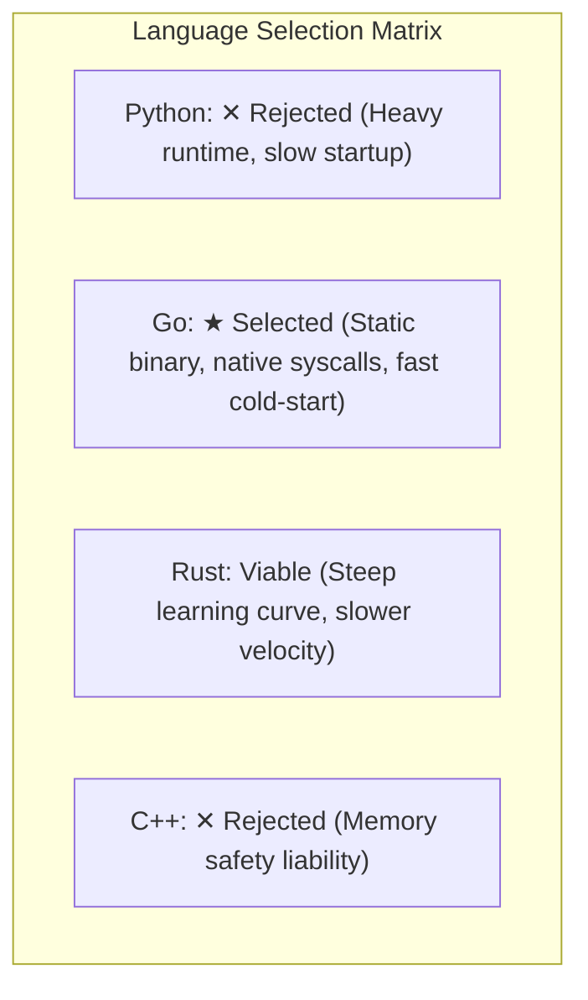
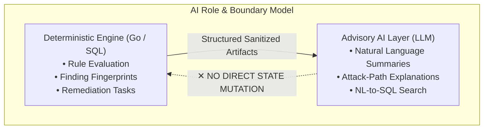

# NETRA — Deep Research, Ecosystem Analysis & Post-Mortem

> **Document Status:** Approved Research Base  
> **Authoritative Scope:** Comprehensive industry discovery, legacy codebase post-mortem, technological trade-offs, architectural decision rationales, and complete diagram inventory for NETRA.  
> **Related Documents:** [ARCHITECTURE.md](./ARCHITECTURE.md), [PRD.md](./PRD.md), [SECURITY_CHECK.md](./SECURITY_CHECK.md)

---

## Contents

1. [Executive Research Summary](#1-executive-research-summary)
2. [Problem Space Discovery & Ecosystem Mindmap](#2-problem-space-discovery--ecosystem-mindmap)
3. [Industry Landscape & Competitive Analysis](#3-industry-landscape--competitive-analysis)
4. [Legacy NETRA Post-Mortem & Evolution Analysis](#4-legacy-netra-post-mortem--evolution-analysis)
5. [The Identified Market & Technical Gap](#5-the-identified-market--technical-gap)
6. [NETRA Differentiation Thesis](#6-netra-differentiation-thesis)
7. [Network Intelligence & Topology Discovery Research](#7-network-intelligence--topology-discovery-research)
8. [Graph vs. Relational Data Architecture Evaluation](#8-graph-vs-relational-data-architecture-evaluation)
9. [Endpoint Agent Architecture & Language Evaluation](#9-endpoint-agent-architecture--language-evaluation)
10. [Communication Protocol & Network Traversal Analysis](#10-communication-protocol--network-traversal-analysis)
11. [Device Identity, Cryptography & Attestation Research](#11-device-identity-cryptography--attestation-research)
12. [Task Orchestration & State Machine Modeling](#12-task-orchestration--state-machine-modeling)
13. [Finding, Evidence & Risk Data Modeling](#13-finding-evidence--risk-data-modeling)
14. [AI Boundaries & Decision Framework](#14-ai-boundaries--decision-framework)
15. [Third-Party Integration Analysis (Slack & Discord)](#15-third-party-integration-analysis-slack--discord)
16. [Supply Chain & Agent Update Security Research](#16-supply-chain--agent-update-security-research)
17. [Core Deep-Thinking Questions Answered](#17-core-deep-thinking-questions-answered)
18. [Visual Documentation & Diagram Inventory](#18-visual-documentation--diagram-inventory)

---

## 1. Executive Research Summary

Security infrastructure in 2026 presents a sharp divergence. On one side are enterprise Endpoint Detection and Response (EDR) platforms (CrowdStrike Falcon, Microsoft Defender for Endpoint, SentinelOne) that cost upwards of $150–$250 per host annually, require kernel-level drivers, and operate as closed cloud silos. On the other side are open-source host tools (osquery, Wazuh, auditd, Sysmon) that generate overwhelming volumes of uncurated event streams without relational network context, explainable risk models, or verifiable remediation.

This research establishes the foundation for **NETRA** (Network & Endpoint Threat Reconnaissance Architecture). NETRA occupies the unaddressed middle ground: an open-source, lightweight (<20MB Go binary), topology-aware security platform that correlates **endpoint configuration posture** with **local network reachability** through a deterministic 8-stage evidence pipeline.

---

## 2. Problem Space Discovery & Ecosystem Mindmap

---

## 3. Industry Landscape & Competitive Analysis

| System | Architecture & Language | Telemetry Source | Primary Strength | Critical Limitation for NETRA's Use Case |
| :--- | :--- | :--- | :--- | :--- |
| **osquery** | C++ daemon embedding SQLite | OS tables (processes, sockets, users) | Exposes OS state as standard SQL virtual tables | Pure telemetry collector; no built-in remediation, no topology synthesis, requires heavy third-party control planes (Fleet). |
| **Velociraptor** | Single Go binary with custom VQL engine | Raw NTFS, memory, MFT, process tables | Fast, flexible digital forensics and incident hunting across 10,000+ endpoints | Designed for point-in-time forensic investigations, steep learning curve (VQL), not built for continuous posture reasoning. |
| **Wazuh** | C agent + Python scripts + OpenSearch | Log files (Syslog, EventLog), FIM, rootcheck | Broad compliance mapping (PCI-DSS, SOC 2) | High server operational complexity (OpenSearch/Elastic cluster), outdated XML rule syntax, brittle regex decoders. |
| **LimaCharlie** | C/C++ sensor + cloud event routing | Real-time EDR telemetry ring | "SecOps Cloud" primitives with granular API control | Proprietary commercial cloud; not an open-source, topology-aware self-hostable platform. |
| **Elastic Agent**| Go wrapper managing Elastic Beats | System logs, NetFlow, Endpoint Security | Unified log and metric collection in Elastic Stack | High host memory footprint (>250MB RAM), strict dependency on expensive Elasticsearch clusters. |
| **CrowdStrike / Defender** | Proprietary C++ kernel drivers | Kernel hooks (ETW, eBPF, Minifilter) | Enterprise-grade malware execution blocking | Expensive ($150+/node), closed-source, cloud-locked, ignores network routing topology and local posture reasoning. |

---

## 4. Legacy NETRA Post-Mortem & Evolution Analysis

---

## 5. The Identified Market & Technical Gap

---

## 6. NETRA Differentiation Thesis

---

## 7. Network Intelligence & Topology Discovery Research

---

## 8. Graph vs. Relational Data Architecture Evaluation

---

## 9. Endpoint Agent Architecture & Language Evaluation

---

## 10. Communication Protocol & Network Traversal Analysis

* **Selected Protocol**: Persistent **WebSocket over TLS 1.3 (WSS)** with **Protocol Buffers (Protobuf v3)**.
* **Why Outbound WSS**: Requires **zero open inbound ports** on client firewalls, effortlessly traverses corporate NAT gateways, and supports sub-millisecond bidirectional task dispatch.
* **Fallback Protocol**: Authenticated **HTTPS Long Polling** for strict enterprise proxy environments.

---

## 11. Device Identity, Cryptography & Attestation Research

* **Cryptographic Standard**: **Ed25519 (RFC 8032)** asymmetric public-key cryptography.
* **Key Storage**: Windows DPAPI (`CryptProtectData`), Linux SecretService/Keyring, macOS Keychain.
* **Payload Signing**: Canonical string with timestamp, nonce, request ID, and body SHA-256 hash.

---

## 12. Task Orchestration & State Machine Modeling

Tasks follow an explicit, durable state machine managed by PostgreSQL transactions:
$$\text{PENDING} \longrightarrow \text{DISPATCHED} \longrightarrow \text{RUNNING} \longrightarrow \text{COMPLETED} \ (\text{or } \text{FAILED} / \text{CANCELLED})$$

---

## 13. Finding, Evidence & Risk Data Modeling

* **Observation**: Raw technical fact (e.g., `Port 445 listening on 0.0.0.0`).
* **Evidence**: Cryptographically hashed proof artifact (JSON dump + SHA-256).
* **Finding**: Policy violation or vulnerability identified by deterministic rules.
* **Deduplication Fingerprint**:
  $$\text{Fingerprint} = \text{SHA-256}(\text{TenantID} \parallel \text{DeviceID} \parallel \text{Capability} \parallel \text{RuleID} \parallel \text{ResourceKey})$$

---

## 14. AI Boundaries & Decision Framework

---

## 15. Third-Party Integration Analysis (Slack & Discord)

* **Slack**: Positioned as an **Asynchronous Notification & Human Approval Gateway**. Employs Block Kit alerts and interactive buttons (`[Approve Remediation]`) with dual-custody approval support.
* **Discord**: Demoted from the core architecture to an **Optional Outbound Webhook Notifier** for homelabs and students.

---

## 16. Supply Chain & Agent Update Security Research

Release binaries are compiled hermetically (`CGO_ENABLED=0`), signed with **Cosign** and an **Offline Root Ed25519 Key**, verified via **The Update Framework (TUF)**, and installed via atomic binary swaps.

---

## 17. Core Deep-Thinking Questions Answered

1. **Fundamental Problem**: Contextual disconnect between endpoint posture and network reachability.
2. **Target Users**: IT admins, DevSecOps engineers, and security teams at SMEs (50–2,000 nodes) and MSSPs.
3. **Core Differentiator**: Deterministic 8-stage reasoning pipeline + automated topology synthesis in a single static Go binary (<20MB).
4. **Non-Goals**: No real-time kernel file filter drivers, no arbitrary remote shell, no autonomous AI remediation.
5. **MVP Goal**: Prove that a single Go binary can enroll via Ed25519, stream posture/topology over WSS, and output deduplicated findings via a clean CLI (`netra`).

---

## 18. Visual Documentation & Diagram Inventory

The following authoritative inventory tracks every visual diagram engineered across the NETRA documentation suite:

| Diagram ID | Document | Diagram Title | Mermaid Type | Explanatory Purpose |
| :--- | :--- | :--- | :--- | :--- |
| **DIA-001** | `README.md` | NETRA Reasoning Pipeline | `flowchart LR` | Summarize the 8-stage deterministic evidence pipeline at a glance |
| **DIA-002** | `README.md` | High-Level System Topology | `flowchart TD` | Illustrate the operator, control plane, and endpoint relationships |
| **DIA-003** | `README.md` | Documentation Navigation Map | `flowchart TD` | Guide readers across the 16-document engineering suite |
| **DIA-004** | `PRD.md` | NETRA Core Mission | `flowchart TD` | Connect product pillars to the core value proposition |
| **DIA-005** | `PRD.md` | The Security Context Dilemma | `flowchart TD` | Highlight the void between EDRs and open-source log tools |
| **DIA-006** | `PRD.md` | Problem-to-Solution Mapping | `flowchart TD` | Map user pain points directly to NETRA capabilities |
| **DIA-007** | `PRD.md` | Product Scope & Boundary Model | `flowchart TD` | Visually separate core goals from explicit non-goals |
| **DIA-008** | `PRD.md` | Core Capabilities Matrix | `flowchart TD` | Display the 7 core scanner capabilities |
| **DIA-009** | `PRD.md` | Alex's Operational Journey | `journey` | Illustrate the end-to-end user experience of onboarding to fix |
| **DIA-010** | `PRD.md` | MVP Boundaries (Phases 1–4) | `flowchart TD` | Clarify Must Have, Should Have, and Out-of-Scope boundaries |
| **DIA-011** | `TRD.md` | PRD to TRD Requirements Map | `flowchart TD` | Connect product goals to specific technical requirements |
| **DIA-012** | `TRD.md` | System Component Architecture | `flowchart TD` | Show detailed boundaries between supervisor, worker, and backend |
| **DIA-013** | `TRD.md` | PostgreSQL Entity-Relationship Model | `erDiagram` | Define relational entities, cardinalities, and foreign keys |
| **DIA-014** | `TRD.md` | Performance & Resource Budgets | `flowchart LR` | Detail binary size, memory ceilings, and latency thresholds |
| **DIA-015** | `TRD.md` | Offline State & Reconnect Model | `stateDiagram-v2` | Detail transition into local SQLite buffering and recovery |
| **DIA-016** | `ARCHITECTURE.md` | Complete System Topology | `flowchart TD` | Master architectural diagram showing all services and flows |
| **DIA-017** | `ARCHITECTURE.md` | Trust Boundaries & Isolation | `flowchart TD` | Delineate trust levels across userspace, supervisor, cloud, and DB |
| **DIA-018** | `ARCHITECTURE.md` | Component Architecture Subsystems | `flowchart TD` | Detail agent and control plane subsystem building blocks |
| **DIA-019** | `ARCHITECTURE.md` | Task Execution Sequence | `sequenceDiagram` | Show handshake, task dispatch, and result ingestion |
| **DIA-020** | `ARCHITECTURE.md` | Scalability Progression Milestones | `flowchart TD` | Show growth trajectory from Level 1 to Level 4 |
| **DIA-021** | `ARCHITECTURE.md` | Fault Isolation Domains | `flowchart TD` | Show blast-radius containment across crashes and outages |
| **DIA-022** | `SYSTEM_DESIGN.md` | Runtime System Components | `flowchart TD` | Connect agent components, WSS ingress, and SQL core |
| **DIA-023** | `SYSTEM_DESIGN.md` | Device Enrollment Lifecycle | `sequenceDiagram` | Multi-actor sequence for token validation and Ed25519 pairing |
| **DIA-024** | `SYSTEM_DESIGN.md` | Agent Connection & WSS Auth | `sequenceDiagram` | Detail cryptographic handshake and heartbeat loop |
| **DIA-025** | `SYSTEM_DESIGN.md` | Task Orchestration State Machine | `stateDiagram-v2` | State transitions for task dispatch, lease, and completion |
| **DIA-026** | `SYSTEM_DESIGN.md` | Scanner Execution & Sandboxing | `sequenceDiagram` | Detail process limit application and syscall invocation |
| **DIA-027** | `SYSTEM_DESIGN.md` | Finding Lifecycle State Machine | `stateDiagram-v2` | State transitions for finding deduplication and resolution |
| **DIA-028** | `SYSTEM_DESIGN.md` | Topology Synthesis Sequence | `sequenceDiagram` | Multi-agent ARP correlation and graph link generation |
| **DIA-029** | `SYSTEM_DESIGN.md` | Offline Buffering & Sync Sequence | `sequenceDiagram` | Local SQLite FIFO write and recovery flush sequence |
| **DIA-030** | `SYSTEM_DESIGN.md` | Concurrency & Resource Controls | `flowchart TD` | Worker goroutine capping and heap memory guard logic |
| **DIA-031** | `SECURITY_CHECK.md` | Core Security Tenets | `flowchart TD` | Display zero-trust architectural principles |
| **DIA-032** | `SECURITY_CHECK.md` | Security Trust Boundaries | `flowchart TD` | Map trust levels from host userspace to PostgreSQL RLS |
| **DIA-033** | `SECURITY_CHECK.md` | Ed25519 Key Lifecycle & Crypto | `sequenceDiagram` | Key generation, local storage, and frame signing sequence |
| **DIA-034** | `SECURITY_CHECK.md` | PostgreSQL RLS Engine Policy | `flowchart TD` | Detail `SET LOCAL` tenant scoping and DB filter enforcement |
| **DIA-035** | `SECURITY_CHECK.md` | Capability Whitelist vs. Shell | `flowchart LR` | Detail approved scan capabilities vs prohibited shell calls |
| **DIA-036** | `SECURITY_CHECK.md` | Emergency Device Revocation | `sequenceDiagram` | Revocation trigger, WSS drop, and task cancellation |
| **DIA-037** | `SECURITY_CHECK.md` | AI Security Air-Gap Model | `flowchart TD` | Telemetry sanitization and advisory air-gap boundary |
| **DIA-038** | `SECURITY_CHECK.md` | TUF Signed Auto-Update Workflow | `sequenceDiagram` | Manifest signature check, self-test, and atomic swap |
| **DIA-039** | `SECURITY_CHECK.md` | STRIDE Threat Model Surface Map | `flowchart TD` | Map STRIDE categories to architectural mitigations |
| **DIA-040** | `OS_VERSATILE.md` | OS Adapter Abstraction Layer | `flowchart TD` | Go interface to Windows/Linux/macOS syscall mapping |
| **DIA-041** | `OS_VERSATILE.md` | Windows Native Syscall Adapter | `flowchart LR` | Map `Iphlpapi.dll`, COM, and DPAPI implementations |
| **DIA-042** | `OS_VERSATILE.md` | Linux Native Netlink Adapter | `flowchart LR` | Map `rtnetlink`, procfs, and nftables implementations |
| **DIA-043** | `OS_VERSATILE.md` | macOS Native Sysctl Adapter | `flowchart LR` | Map `sysctl`, BSD routing sockets, and Keychain |
| **DIA-044** | `OS_VERSATILE.md` | Cross-Platform Package Formats | `flowchart TD` | Display `.exe`, `.deb`/`.rpm`, and Mach-O packaging |
| **DIA-045** | `OS_VERSATILE.md` | Privilege & Degradation Hierarchy | `flowchart TD` | Standard user vs. elevated daemon capability scopes |
| **DIA-046** | `API.md` | API Authentication Architecture | `flowchart TD` | JWT user auth vs. Ed25519 device auth layers |
| **DIA-047** | `API.md` | WSS Stream Protocol Exchange | `sequenceDiagram` | Bidirectional frame exchange for dispatch and results |
| **DIA-048** | `UI_UX.md` | CLI Design Principles | `flowchart LR` | Summary of Unix CLI philosophy |
| **DIA-049** | `UI_UX.md` | CLI Command Hierarchy Tree | `flowchart TD` | Complete tree of `netra` CLI subcommands and flags |
| **DIA-050** | `UI_UX.md` | Stream Separation Architecture | `flowchart TD` | Visualizing stdout data piping vs. stderr UI output |
| **DIA-051** | `UI_UX.md` | Interactive vs. CI Mode Check | `flowchart TD` | `isatty` detection and terminal spinner handling |
| **DIA-052** | `USAGE.md` | Operational User Lifecycle | `flowchart TD` | Install ──> Enroll ──> Scan ──> View ──> Fix ──> Validate |
| **DIA-053** | `USAGE.md` | Diagnostics & Troubleshooting Tree | `flowchart TD` | Decision tree for troubleshooting offline agents |
| **DIA-054** | `SLACK.md` | Slack Cloud Integration Gateway | `flowchart LR` | NETRA backend to Slack bot alert delivery |
| **DIA-055** | `SLACK.md` | Interactive Approval Sequence | `sequenceDiagram` | Human-in-the-loop remediation authorization sequence |
| **DIA-056** | `SLACK.md` | Least-Privilege OAuth Scopes | `flowchart TD` | Permitted scopes vs. strictly prohibited scopes |
| **DIA-057** | `DISCORD.md` | Discord Outbound Webhook Flow | `flowchart LR` | One-way webhook egress to Discord channel |
| **DIA-058** | `DISCORD.md` | Prohibited Discord Actions | `flowchart TD` | Visually reinforce restrictions on Discord integration |
| **DIA-059** | `CI_CD.md` | SLSA Level 3 Supply Chain Flow | `flowchart LR` | Build ──> Scan ──> SBOM ──> Cosign Sign ──> Release |
| **DIA-060** | `CI_CD.md` | Automated PR Quality Gates | `flowchart TD` | 5-stage automated check matrix for pull requests |
| **DIA-061** | `CI_CD.md` | Release Smoke Test & Verification | `flowchart TD` | Clean VM provisioning and automated rollback trigger |
| **DIA-062** | `WORKFLOW.md` | Git Branching Model | `gitGraph` | Git flow branching, feature merging, and patch tags |
| **DIA-063** | `WORKFLOW.md` | Feature Development Lifecycle | `flowchart TD` | Issue ──> Design/ADR ──> Code ──> PR ──> Merge |
| **DIA-064** | `WORKFLOW.md` | Emergency Hotfix Release Flow | `flowchart TD` | Rapid vulnerability patch and expedited release flow |
| **DIA-065** | `PHASES.md` | Master Timeline Roadmap | `timeline` | Chronological milestone roadmap (Phases 0 to 4) |
| **DIA-066** | `PHASES.md` | Phase Dependency & Gating Graph | `flowchart TD` | Dependency gating flow from Phase 0 to Phase 4 |
| **DIA-067** | `RESEARCH.md` | Security Ecosystem Mindmap | `mindmap` | Landscape categorization and identification of the gap |
| **DIA-068** | `RESEARCH.md` | Legacy vs. New Architecture Flow | `flowchart TD` | Post-mortem lessons translated to architectural decisions |
| **DIA-069** | `RESEARCH.md` | 4-Pillar Market Gap | `flowchart LR` | Visualizing the four core dimensions of NETRA's gap |
| **DIA-070** | `RESEARCH.md` | Network Discovery Methodology | `flowchart TD` | 3-stage discovery model from passive to active |
| **DIA-071** | `RESEARCH.md` | Graph Storage Decision Architecture | `flowchart LR` | Justification for PostgreSQL CTEs over Neo4j |
| **DIA-072** | `RESEARCH.md` | Language Selection Matrix | `flowchart TD` | Evaluation of Go vs. Python, Rust, and C++ |
| **DIA-073** | `RESEARCH.md` | AI Role & Boundary Model | `flowchart TD` | Deterministic engine core air-gapped from advisory AI |
