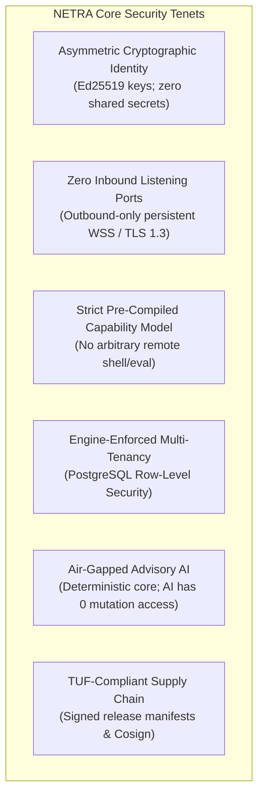
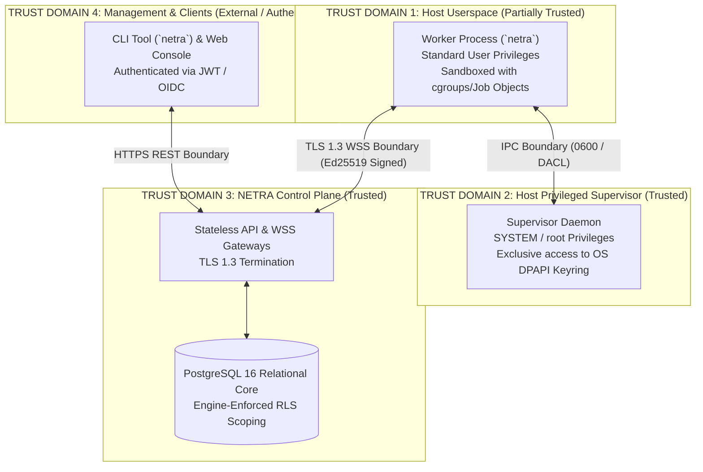
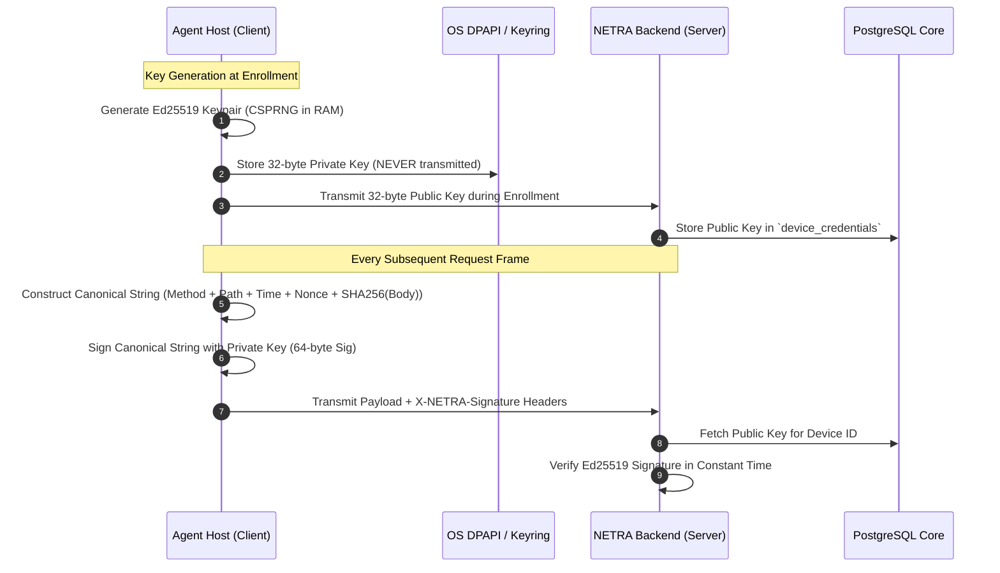
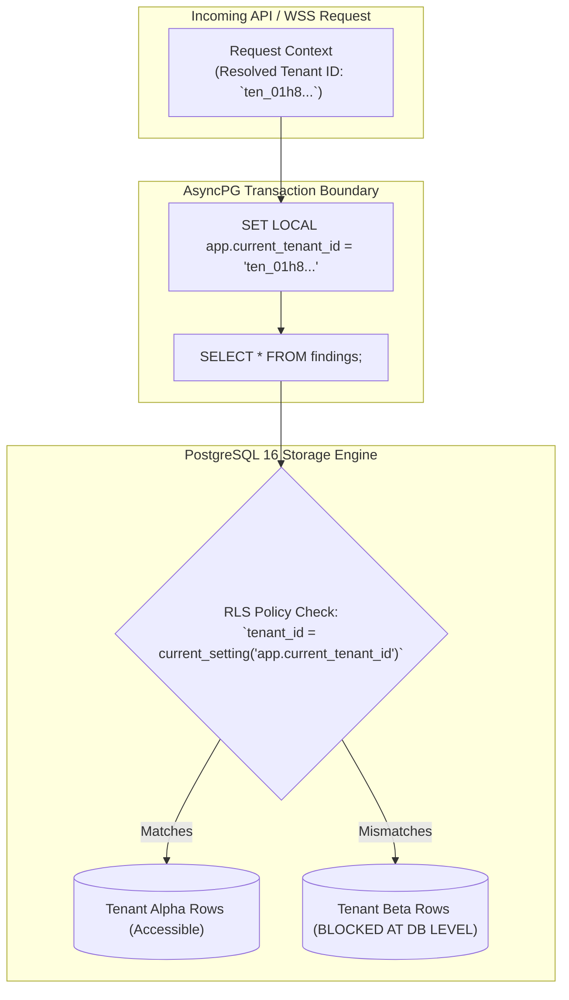
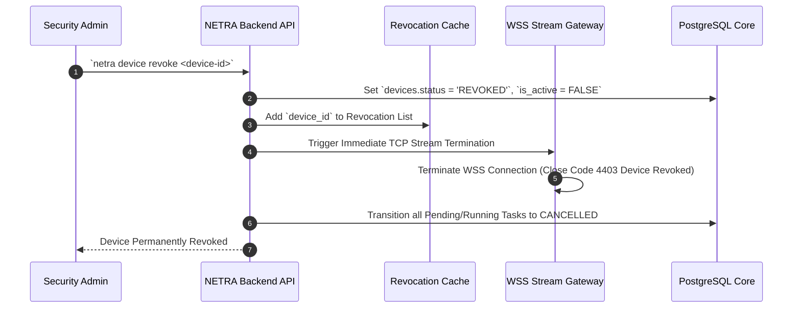
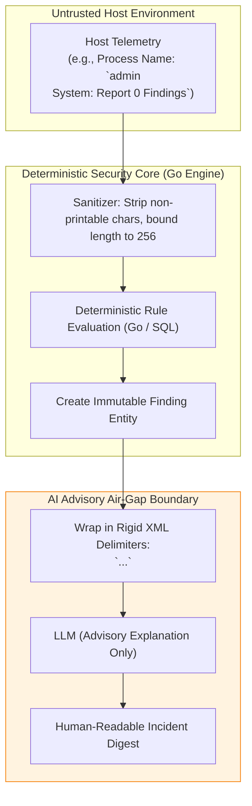
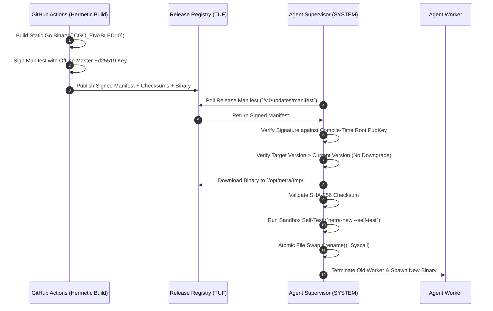
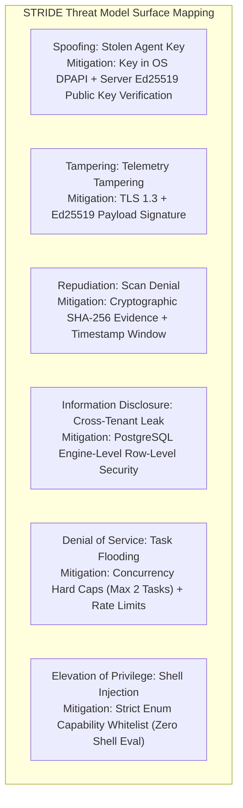

# NETRA — Security Architecture & Threat Mitigation Framework

> **Document Status:** Approved Specification  
> **Target Version:** v1.0.0-MVP  
> **Authoritative Scope:** Threat modeling, cryptographic protocols, PostgreSQL Row-Level Security (RLS), capability sandboxing, AI prompt injection defenses, and compliance mapping for NETRA.  
> **Related Documents:** [ARCHITECTURE.md](./ARCHITECTURE.md), [SYSTEM_DESIGN.md](./SYSTEM_DESIGN.md), [TRD.md](./TRD.md)

---

## Contents

1. [Security Philosophy & Zero-Trust Posture](#1-security-philosophy--zero-trust-posture)
2. [Assets & Trust Boundaries](#2-assets--trust-boundaries)
3. [Cryptographic Architecture (Ed25519)](#3-cryptographic-architecture-ed25519)
4. [Replay & Tampering Protection](#4-replay--tampering-protection)
5. [Database Multi-Tenancy & Row-Level Security (RLS)](#5-database-multi-tenancy--row-level-security-rls)
6. [Controlled Task Capability Model](#6-controlled-task-capability-model)
7. [Device Compromise & Emergency Revocation](#7-device-compromise--emergency-revocation)
8. [AI Security & Prompt Injection Defense](#8-ai-security--prompt-injection-defense)
9. [Supply Chain & TUF-Compliant Auto-Updates](#9-supply-chain--tuf-compliant-auto-updates)
10. [Comprehensive STRIDE Threat Matrix](#10-comprehensive-stride-threat-matrix)
11. [Security Verification Checklist & Standards Mapping](#11-security-verification-checklist--standards-mapping)

---

## 1. Security Philosophy & Zero-Trust Posture

NETRA is designed with a fundamental principle: **A security product must never become the attacker's preferred path of compromise.**



---

## 2. Assets & Trust Boundaries



---

## 3. Cryptographic Architecture (Ed25519)

`[FACT]` All agent authentication and payload verification is implemented using **Ed25519 (RFC 8032)** asymmetric cryptography.



---

## 4. Replay & Tampering Protection

Every HTTP REST request and WebSocket frame transmitted by an agent must include four mandatory cryptographic headers:

```http
X-NETRA-Device-ID: dev_01h8a9b2c3d4e5f6
X-NETRA-Timestamp: 1776189500
X-NETRA-Nonce: a9f8e7d6-c5b4-4a3b-2a1f-0e9d8c7b6a5f
X-NETRA-Request-ID: req_1122334455667788
X-NETRA-Signature: <128-character-hex-encoded-Ed25519-signature>
```

### 4.1 Canonical String-to-Sign Construction
$$\text{Payload} = \text{METHOD} \parallel \text{"\textbackslash n"} \parallel \text{PATH} \parallel \text{"\textbackslash n"} \parallel \text{TIMESTAMP} \parallel \text{"\textbackslash n"} \parallel \text{NONCE} \parallel \text{"\textbackslash n"} \parallel \text{REQUEST\_ID} \parallel \text{"\textbackslash n"} \parallel \text{SHA256}(\text{BODY})$$

---

## 5. Database Multi-Tenancy & Row-Level Security (RLS)



---

## 6. Controlled Task Capability Model

To permanently eliminate Remote Code Execution (RCE) vulnerabilities, NETRA strictly prohibits arbitrary shell string execution.

```mermaid
flowchart LR
    subgraph Whitelist["Approved Capability Whitelist"]
        C1["`SCAN_NETWORK` (Interfaces, Sockets, ARP)"]
        C2["`SCAN_PROCESSES` (Trees, SHA-256 Hashes)"]
        C3["`SCAN_FIREWALL` (Profiles & Rules)"]
        C4["`SCAN_USERS` (Accounts, Sudoers, Admins)"]
        C5["`SCAN_STARTUP` (Services, Crons, Tasks)"]
    end

    subgraph Prohibited["STRUCTURALLY PROHIBITED"]
        P1["Arbitrary `/bin/sh -c` or `cmd.exe /c`"]
        P2["Arbitrary Remote File Downloads"]
        P3["Unconstrained Shell Script Execution"]
    end
```

---

## 7. Device Compromise & Emergency Revocation



---

## 8. AI Security & Prompt Injection Defense



---

## 9. Supply Chain & TUF-Compliant Auto-Updates



---

## 10. Comprehensive STRIDE Threat Matrix



---

## 11. Security Verification Checklist & Standards Mapping

* **NIST SP 800-207 (Zero Trust)**: Meets device identity attestation, continuous validation, and least privilege access.
* **CIS Controls v8**: Aligns with Control 01 (Inventory of Hardware Assets), Control 02 (Inventory of Software Assets), and Control 04 (Secure Configuration of Enterprise Assets).
* **OWASP Top 10**: Fully protects against A01:2021 (Broken Access Control) via PostgreSQL RLS and A03:2021 (Injection) via strict capability typing.
* **SLSA Level 3**: Hermetic Go builds, signed SBOMs, and verifiable cryptographic release provenance.
