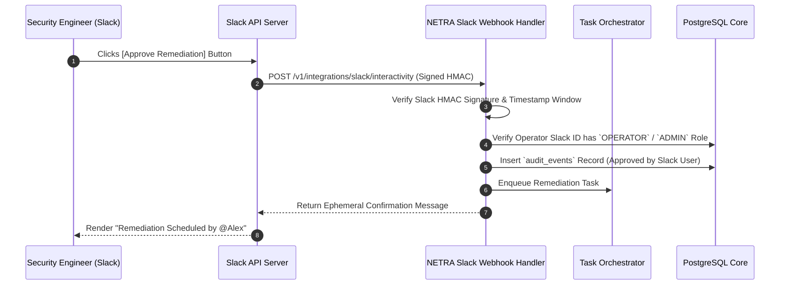

# NETRA — Slack Integration & Human Approval Gateway Architecture

> **Document Status:** Approved Specification  
> **Integration Role:** Optional Plugin / Asynchronous Notification & Approval Gateway  
> **Authoritative Scope:** Specifications for Slack alerts, Block Kit schemas, interactive human-in-the-loop approvals, and security boundaries for NETRA.  
> **Related Documents:** [ARCHITECTURE.md](./ARCHITECTURE.md), [SECURITY_CHECK.md](./SECURITY_CHECK.md), [SYSTEM_DESIGN.md](./SYSTEM_DESIGN.md)

---

## Contents

1. [Integration Role & Architecture Philosophy](#1-integration-role--architecture-philosophy)
2. [Supported Use Cases](#2-supported-use-cases)
3. [Alert Notification Model & Block Kit Design](#3-alert-notification-model--block-kit-design)
4. [Interactive Remediation Approval Workflow](#4-interactive-remediation-approval-workflow)
5. [Security Boundaries & OAuth Scopes](#5-security-boundaries--oauth-scopes)
6. [Rate Limits & Failure Handling](#6-rate-limits--failure-handling)
7. [What Slack MUST NOT Be Allowed To Do](#7-what-slack-must-not-be-allowed-to-do)

---

## 1. Integration Role & Architecture Philosophy

`[FACT]` Slack is an external third-party communication platform. It is not an enterprise database, does not provide hardware-backed cryptographic identity, and cannot operate in air-gapped networks.

`[RECOMMENDATION]` Slack is defined strictly as an **Asynchronous Notification & Human Approval Gateway**:
* It is an **optional plugin integration**, not a core dependency.
* The NETRA backend operates with 100% functionality even if Slack is unconfigured or offline.

```mermaid
flowchart LR
    subgraph CorePlatform["NETRA Core Control Plane"]
        BE["NETRA Backend API & Database"]
    end

    subgraph SlackService["Slack Cloud (Optional Gateway)"]
        Bot["Slack Bot App"]
        Channel["#security-alerts Channel"]
    end

    BE -->|Outbound Webhook (TLS 1.3)| Bot
    Bot --> Channel
```

---

## 2. Supported Use Cases

1. **Critical Finding Alerts**: Instant notification when a `CRITICAL` or `HIGH` severity finding is detected on a production host.
2. **Interactive Remediation Approvals**: Human-in-the-loop authorization (`[Approve]` / `[Reject]`) before executing high-impact corrective actions.
3. **Weekly Posture Summaries**: Scheduled executive digest showing total resolved vs. open findings across all enrolled devices.

---

## 3. Alert Notification Model & Block Kit Design

When a critical finding is ingested, the NETRA backend dispatches a structured Slack Block Kit message:

```json
{
  "blocks": [
    {
      "type": "header",
      "text": { "type": "plain_text", "text": "🚨 NETRA Alert: Exposed SMBv1 Service Detected" }
    },
    {
      "type": "section",
      "fields": [
        { "type": "mrkdwn", "text": "*Host:* `srv-prod-db-01`" },
        { "type": "mrkdwn", "text": "*Severity:* `CRITICAL`" },
        { "type": "mrkdwn", "text": "*Subnet:* `192.168.1.0/24`" },
        { "type": "mrkdwn", "text": "*MITRE:* `T1021.002`" }
      ]
    },
    {
      "type": "actions",
      "elements": [
        {
          "type": "button",
          "text": { "type": "plain_text", "text": "View in Console" },
          "url": "https://console.netra.io/findings/fnd_01h8c4d5e6"
        },
        {
          "type": "button",
          "text": { "type": "plain_text", "text": "Approve Firewall Isolation" },
          "style": "danger",
          "action_id": "approve_remediation_fnd_01h8c4d5e6"
        }
      ]
    }
  ]
}
```

---

## 4. Interactive Remediation Approval Workflow

The following sequence details how a human operator authorizes a remediation action securely from a Slack interactive alert:



---

## 5. Security Boundaries & OAuth Scopes

```mermaid
flowchart TD
    subgraph OAuthScopes["Least-Privilege Slack Scopes"]
        S1["`chat:write`<br/>Post alert notifications to channels"]
        S2["`commands`<br/>Support `/netra status` slash queries"]
    end

    subgraph ProhibitedScopes["STRICTLY PROHIBITED SCOPES"]
        P1["✕ `channels:history` (Reading channel messages)"]
        P2["✕ `files:write` (Uploading arbitrary files)"]
        P3["✕ `admin` (Workspace administrative control)"]
    end
```

---

## 6. Rate Limits & Failure Handling

* **Rate Limiting**: Outbound Slack notifications are throttled using a token bucket algorithm to respect Slack's limit of 1 message per second per channel.
* **Failure Decoupling**: If Slack API returns HTTP `429` or `5xx`, messages are buffered in memory for retry up to 3 times before being dropped. Failures are recorded in `audit_events` without impacting core scanning operations.

---

## 7. What Slack MUST NOT Be Allowed To Do

* ✕ Slack users cannot trigger arbitrary remote commands or shell evaluations.
* ✕ Slack cannot be used as an authentication provider for agent device enrollment.
* ✕ Full raw evidence dumps (e.g., memory artifacts or registry dumps) must never be sent into Slack channels.
