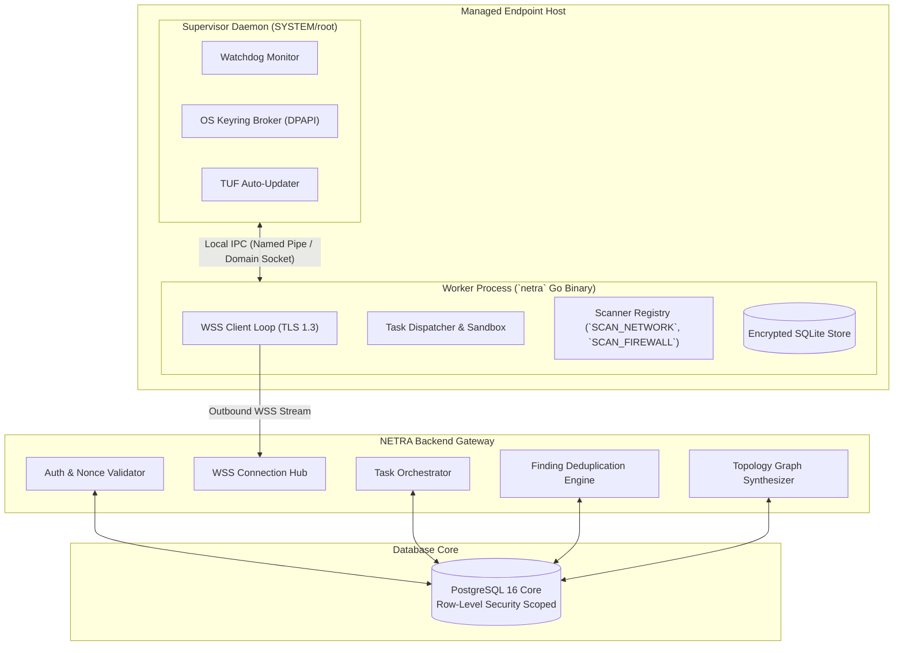
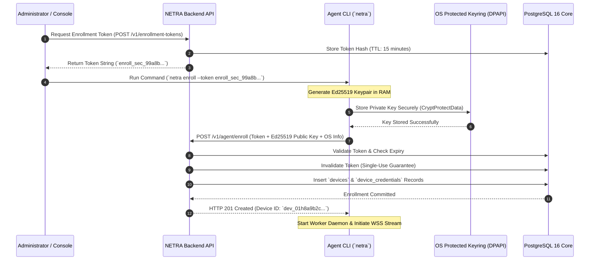
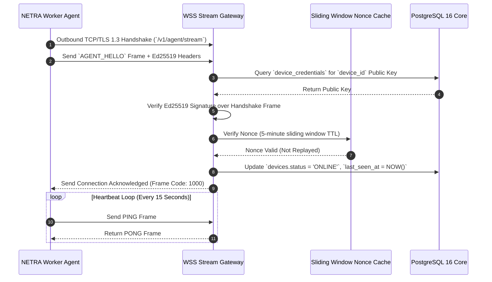
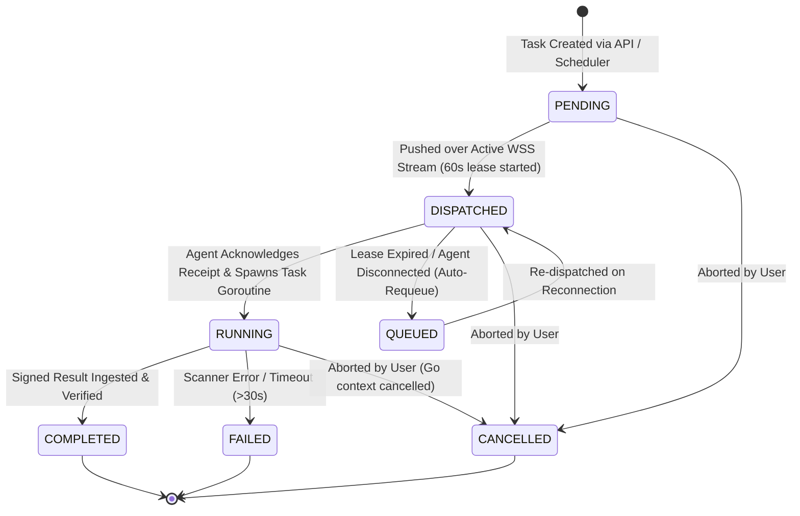
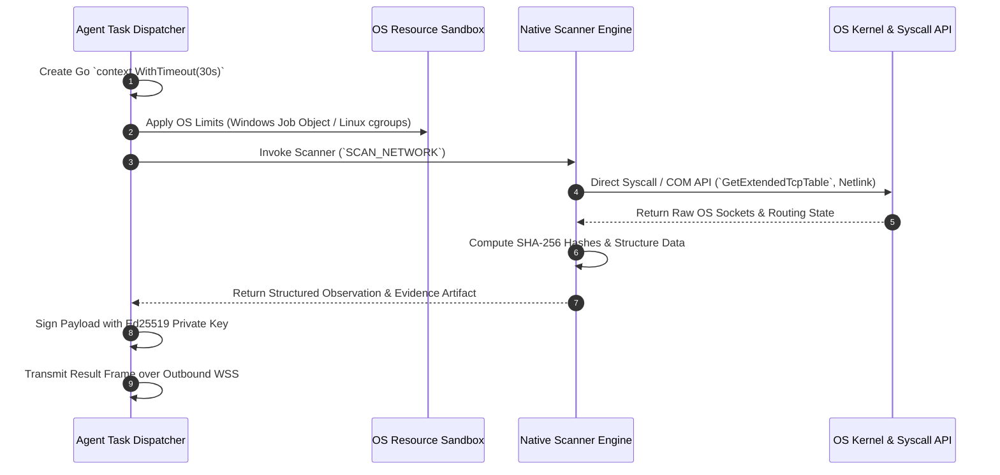
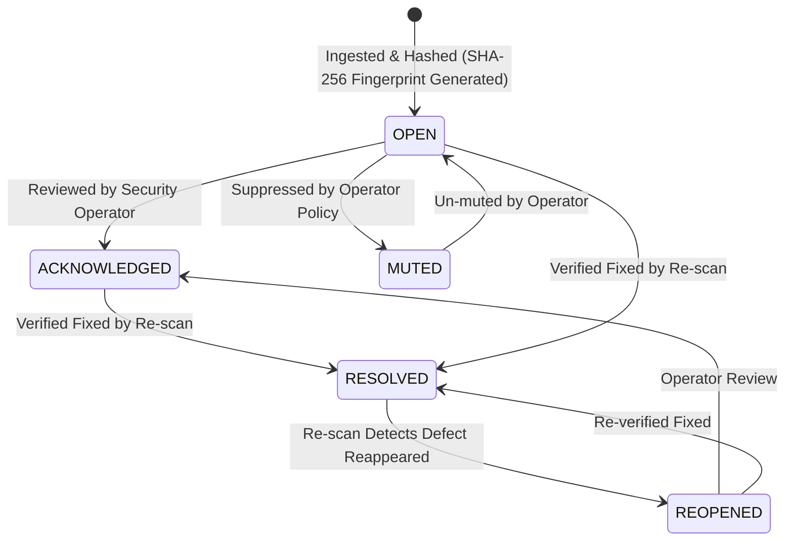
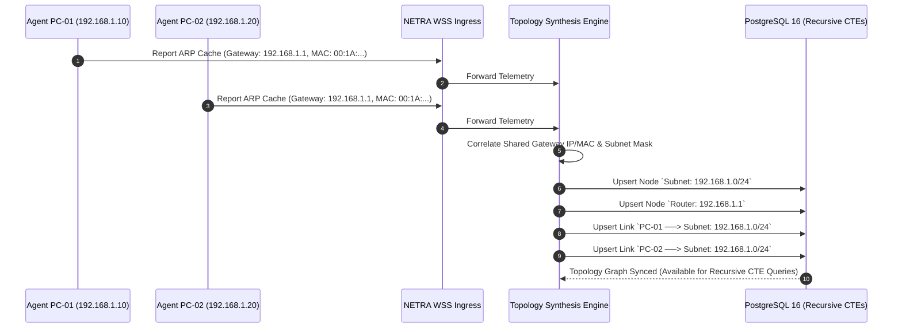
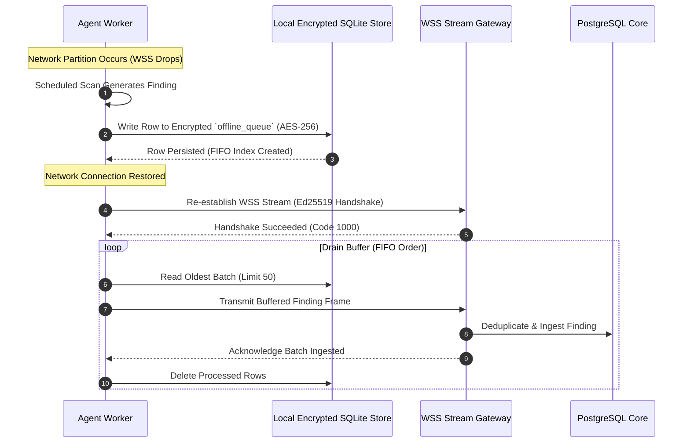
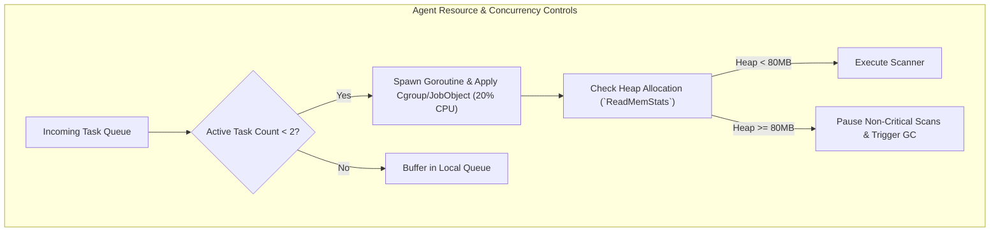

# NETRA — System Design & Runtime Lifecycles

> **Document Status:** Approved Specification  
> **Target Version:** v1.0.0-MVP  
> **Authoritative Scope:** Runtime workflows, state machines, sequence diagrams, failure recovery loops, and concurrency models for NETRA.  
> **Related Documents:** [ARCHITECTURE.md](./ARCHITECTURE.md), [API.md](./API.md), [SECURITY_CHECK.md](./SECURITY_CHECK.md)

---

## Contents

1. [Runtime Architectural Components](#1-runtime-architectural-components)
2. [Device Enrollment Lifecycle](#2-device-enrollment-lifecycle)
3. [Agent Connection & Authentication Flow](#3-agent-connection--authentication-flow)
4. [Task Orchestration & State Machine](#4-task-orchestration--state-machine)
5. [Scanner Execution & Sandboxing Model](#5-scanner-execution--sandboxing-model)
6. [Finding, Evidence & Risk Pipeline](#6-finding-evidence--risk-pipeline)
7. [Network Discovery & Topology Synthesis Engine](#7-network-discovery--topology-synthesis-engine)
8. [Offline Buffering & Synchronization Lifecycle](#8-offline-buffering--synchronization-lifecycle)
9. [Concurrency & Resource Control Model](#9-concurrency--resource-control-model)

---

## 1. Runtime Architectural Components

---

## 2. Device Enrollment Lifecycle

Device enrollment establishes a cryptographically secure, permanent binding between an endpoint host and a tenant organization without transmitting private keys over the wire.

---

## 3. Agent Connection & Authentication Flow

Once enrolled, the agent connects exclusively over outbound persistent WebSocket (WSS):

---

## 4. Task Orchestration & State Machine

The following state machine governs the complete lifecycle of tasks dispatched from the control plane to endpoints.

---

## 5. Scanner Execution & Sandboxing Model

Every capability execution on the agent is strictly isolated:

---

## 6. Finding, Evidence & Risk Pipeline

The following state machine defines the lifecycle of security findings:

---

## 7. Network Discovery & Topology Synthesis Engine

---

## 8. Offline Buffering & Synchronization Lifecycle

---

## 9. Concurrency & Resource Control Model

