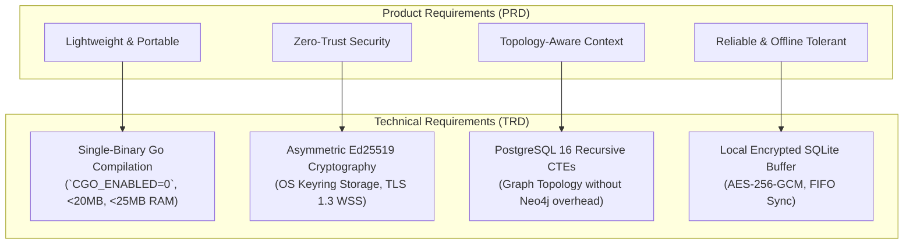
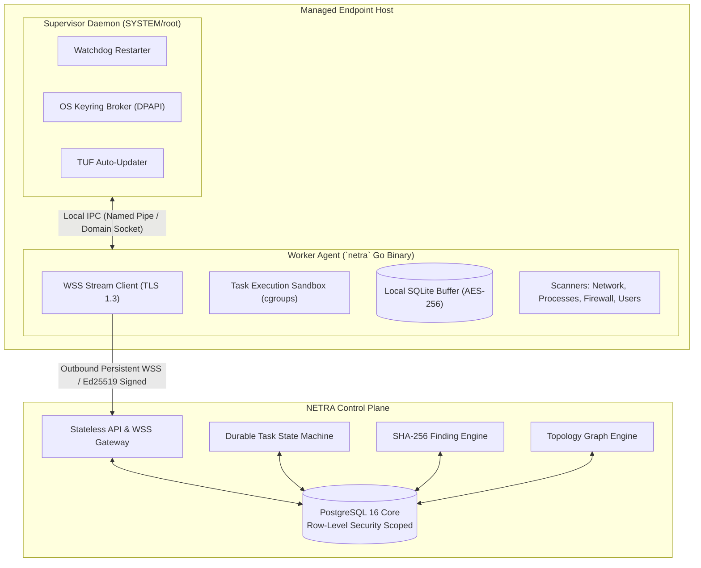
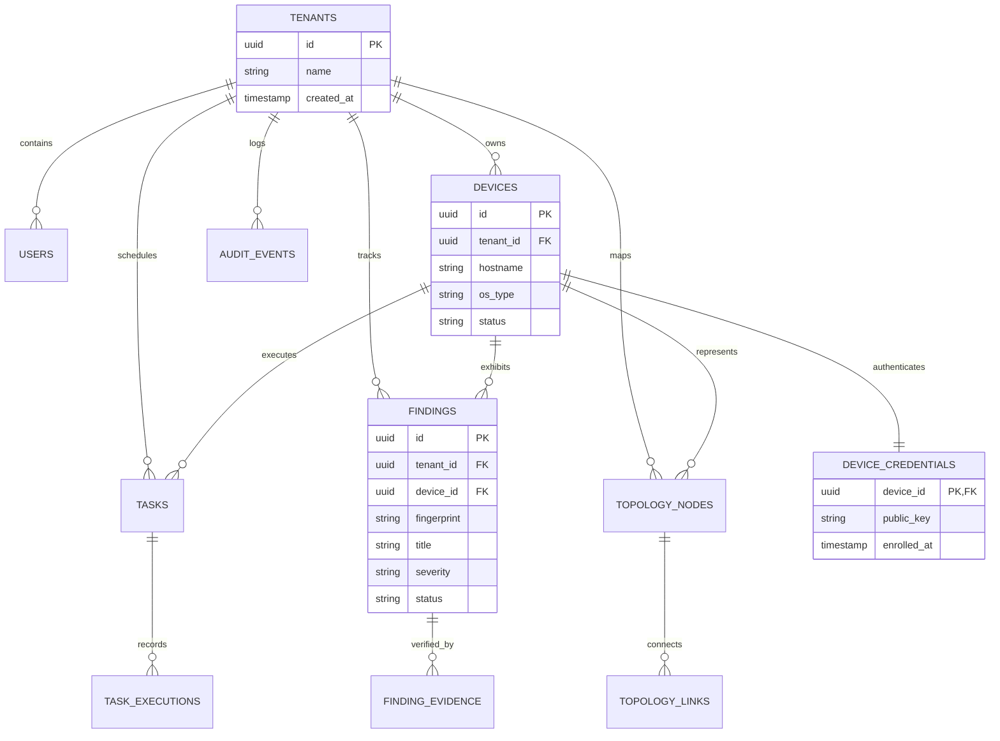
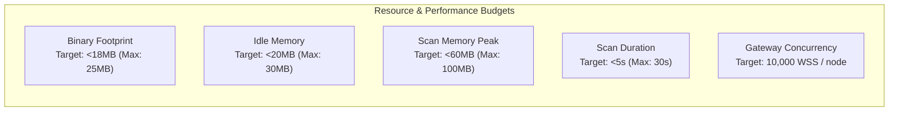
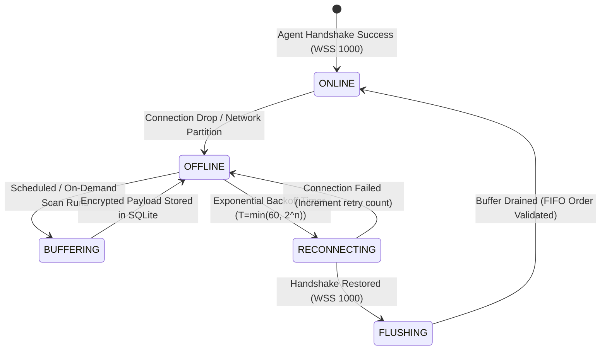

# NETRA — Technical Requirements Document (TRD)

> **Document Status:** Approved Specification  
> **Target Version:** v1.0.0-MVP  
> **Authoritative Scope:** Defines technical specifications, engineering constraints, performance thresholds, protocols, and architectural requirements for NETRA.  
> **Related Documents:** [PRD.md](./PRD.md), [ARCHITECTURE.md](./ARCHITECTURE.md), [SECURITY_CHECK.md](./SECURITY_CHECK.md)

---

## Contents

1. [Technical Objectives & Hierarchy](#1-technical-objectives--hierarchy)
2. [System Architectural Requirements](#2-system-architectural-requirements)
3. [Agent Technical Requirements](#3-agent-technical-requirements)
4. [Backend & Control Plane Technical Requirements](#4-backend--control-plane-technical-requirements)
5. [Communication & Protocol Specifications](#5-communication--protocol-specifications)
6. [Data Architecture & Storage Specifications](#6-data-architecture--storage-specifications)
7. [Security & Cryptographic Specifications](#7-security--cryptographic-specifications)
8. [Performance & Resource Budgets](#8-performance--resource-budgets)
9. [Reliability, Fault Tolerance & Offline Mode](#9-reliability-fault-tolerance--offline-mode)
10. [CLI Technical Specifications](#10-cli-technical-specifications)
11. [AI Layer Technical Boundaries](#11-ai-layer-technical-boundaries)
12. [Verification, Benchmarking & Acceptance Criteria](#12-verification-benchmarking--acceptance-criteria)

---

## 1. Technical Objectives & Hierarchy

The following diagram maps high-level product objectives directly to their corresponding technical architectural requirements and performance constraints.



---

## 2. System Architectural Requirements



* `[TRD-SYS-01]` **Stateless Application Nodes**: All backend gateway instances must remain strictly stateless. All persistent state must reside in PostgreSQL 16.
* `[TRD-SYS-02]` **Outbound-Only Ingress**: All agent-to-backend communication must originate as outbound TCP/TLS from the client host. No inbound listening ports shall be opened on client machines.
* `[TRD-SYS-03]` **Database-Enforced Multi-Tenancy**: All database interactions must bind to the active tenant context using PostgreSQL Row-Level Security (`SET LOCAL app.current_tenant_id`).

---

## 3. Agent Technical Requirements

### 3.1 Two-Tier Process Architecture
* `[TRD-AGT-01]` **Supervisor Process**: Runs as an OS service, manages worker lifecycles, handles watchdog restarts, brokers OS keyring access, and validates signed TUF auto-updates.
* `[TRD-AGT-02]` **Worker Process**: Runs the communication engine, local scheduler, and sandboxed scanners over a local IPC channel.

### 3.2 Native OS Scanners
* `[TRD-AGT-03]` **`SCAN_NETWORK`**:
  * Windows: Query `Iphlpapi.dll` via `GetAdaptersAddresses`, `GetIpForwardTable2`, `GetExtendedTcpTable`, and `GetIpNetTable2`.
  * Linux: Query Linux Netlink sockets (`rtnetlink`) and parse `/proc/net/tcp`, `/proc/net/udp`, and `/proc/[pid]/fd`.
  * macOS: Call `getifaddrs`, BSD routing sockets, and `proc_pidinfo`.
* `[TRD-AGT-04]` **`SCAN_FIREWALL`**:
  * Windows: Interface with Windows Defender Firewall COM API (`INetFwPolicy2`).
  * Linux: Query Netlink `nftables` API / parse `/etc/nftables.conf`.
  * macOS: Query `/dev/pf` via `pfctl` ioctl.
* `[TRD-AGT-05]` **`SCAN_PROCESSES`**: Enumerate running process trees, extract command lines, resolve executable paths, and compute SHA-256 hashes of disk binaries.
* `[TRD-AGT-06]` **`SCAN_USERS`**: Enumerate local user accounts, active sessions, sudoers/wheel groups, and local Administrators.

### 3.3 Resource Sandboxing
* `[TRD-AGT-07]` **CPU Throttling**: On Windows, assign worker processes to a Windows Job Object with `JobObjectCpuRateControlInformation` set to $20\%$. On Linux, bind to systemd cgroups with `CPUQuota=20%`.
* `[TRD-AGT-08]` **Hard Deadlines**: Every scanner invocation must execute within a Go `context.WithTimeout` bounded to a maximum of 30 seconds.

---

## 4. Backend & Control Plane Technical Requirements

* `[TRD-BE-01]` **WSS Agent Gateway**: Terminate persistent TLS 1.3 WebSocket connections, register device connection heartbeats, and handle bi-directional JSON/Protobuf message dispatch.
* `[TRD-BE-02]` **REST API Engine**: Expose an OpenAPI 3.1-compliant REST API for CLI, Web UI, and CI/CD operations with JWT/OIDC authentication.
* `[TRD-BE-03]` **Task Orchestration Engine**: Maintain a durable transactional state machine in PostgreSQL with optimistic concurrency locking and lease timeouts (60s default).
* `[TRD-BE-04]` **Finding Deduplication**: Compute deterministic SHA-256 fingerprints over canonical finding attributes and maintain finding lifecycle transitions.
* `[TRD-BE-05]` **Topology Engine**: Correlate reported IP addresses, default gateways, and ARP neighbors into indexed topology nodes and links.

---

## 5. Communication & Protocol Specifications

### 5.1 Request Signing Protocol (Ed25519)
Every REST and WSS request frame must include cryptographic headers:
```http
X-NETRA-Device-ID: dev_01h8a9b2c3d4e5f6
X-NETRA-Timestamp: 1776189500
X-NETRA-Nonce: a9f8e7d6-c5b4-4a3b-2a1f-0e9d8c7b6a5f
X-NETRA-Request-ID: req_1122334455667788
X-NETRA-Signature: <128-character-hex-encoded-Ed25519-signature>
```
* **String to Sign**:
  $$\text{Payload} = \text{METHOD} \parallel \text{"\textbackslash n"} \parallel \text{PATH} \parallel \text{"\textbackslash n"} \parallel \text{TIMESTAMP} \parallel \text{"\textbackslash n"} \parallel \text{NONCE} \parallel \text{"\textbackslash n"} \parallel \text{REQUEST\_ID} \parallel \text{"\textbackslash n"} \parallel \text{SHA256}(\text{BODY})$$

---

## 6. Data Architecture & Storage Specifications

The following Entity-Relationship Diagram outlines the core PostgreSQL schema and Row-Level Security tenant relationships.



---

## 7. Security & Cryptographic Specifications

* `[TRD-SEC-01]` **Key Management**: Ed25519 private keys must be generated using CSPRNG (`crypto/rand` in Go) and stored in OS protected keystores (Windows DPAPI `CryptProtectData`, Linux SecretService/Kernel Keyring, macOS Keychain).
* `[TRD-SEC-02]` **Replay Window**: Reject any request where $|\text{CurrentTime} - \text{Timestamp}| > 300\text{ seconds}$.
* `[TRD-SEC-03]` **Nonce Cache**: Nonces are verified against an in-memory sliding window cache with 5-minute TTL; duplicates return HTTP `401 Unauthorized`.
* `[TRD-SEC-04]` **Capability Whitelist**: Task execution is restricted strictly to pre-compiled enums. Arbitrary shell strings (`/bin/sh -c`, `cmd.exe /c`) are rejected at both API and Agent boundaries.

---

## 8. Performance & Resource Budgets



---

## 9. Reliability, Fault Tolerance & Offline Mode

The following state machine governs how the agent handles connectivity loss, switches to local encrypted SQLite storage, and flushes data upon reconnection.



---

## 10. CLI Technical Specifications

* `[TRD-CLI-01]` Built in Go using `github.com/spf13/cobra` and `github.com/spf13/pflag`.
* `[TRD-CLI-02]` Dual-stream output:
  * Interactive TTY: Progress spinners and colored tables output to `stderr`.
  * Machine-readable: Formatted JSON emitted to `stdout` when `--json` is supplied or when stdout is redirected to a pipe.
* `[TRD-CLI-03]` Exit Codes:
  * `0`: Clean execution / No high-severity findings.
  * `1`: Operational error (network failure, bad auth).
  * `2`: Policy failure (Findings exceeding severity threshold).
  * `3`: Invalid CLI arguments.

---

## 11. AI Layer Technical Boundaries

* `[TRD-AI-01]` The core security engine must operate with zero dependency on LLMs or external AI APIs.
* `[TRD-AI-02]` AI services are consumed asynchronously via sandboxed REST worker queues for natural language explanations and query translations.
* `[TRD-AI-03]` All host telemetry strings passed to LLM prompts must be sanitized and enclosed in structured delimiters.

---

## 12. Verification, Benchmarking & Acceptance Criteria

1. **Static Build Verification**: Verify compiled agent contains zero dynamic C-library dependencies via `ldd` on Linux and `dumpbin /dependents` on Windows.
2. **Memory Profiling**: Profile agent memory across 24 hours of continuous operation under load using Go `pprof` to verify zero memory leaks.
3. **Multi-Tenant Leak Test**: Automated integration test suites must attempt cross-tenant finding queries and confirm $100\%$ rejection by PostgreSQL RLS.
4. **Offline Resilience Test**: Simulate a 12-hour network partition; verify that $100\%$ of generated findings are buffered in local SQLite and cleanly synchronized upon reconnect.
