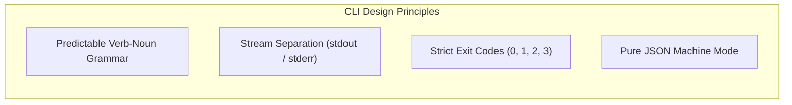
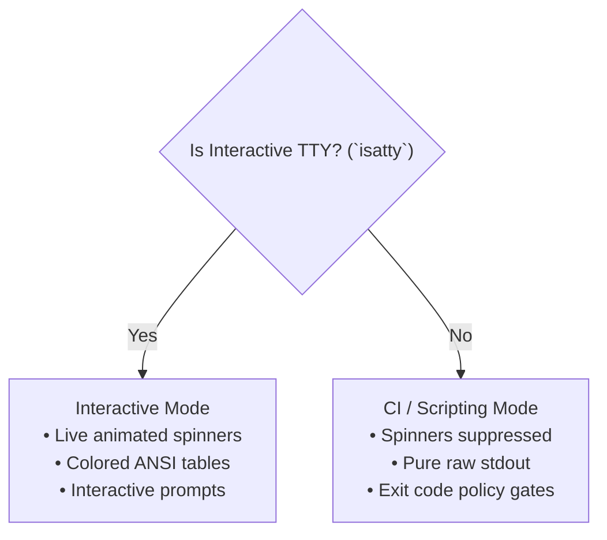

# NETRA — CLI User Experience (UI/UX) & Interface Standards

> **Document Status:** Approved Specification  
> **Target Version:** v1.0.0-MVP  
> **Authoritative Scope:** Specifications for the command-line interface, terminal interaction models, ANSI formatting, machine-readable JSON modes, exit codes, and developer experience.  
> **Related Documents:** [USAGE.md](./USAGE.md), [API.md](./API.md), [ARCHITECTURE.md](./ARCHITECTURE.md)

---

## Contents

1. [CLI Design Philosophy & Unix Principles](#1-cli-design-philosophy--unix-principles)
2. [Command Taxonomy & Hierarchy](#2-command-taxonomy--hierarchy)
3. [Output Stream Separation (stdout vs. stderr)](#3-output-stream-separation-stdout-vs-stderr)
4. [Terminal Presentation & ANSI Formatting](#4-terminal-presentation--ansi-formatting)
5. [Machine-Readable Modes (`--json` / `--yaml`)](#5-machine-readable-modes---json----yaml)
6. [Interactive vs. Non-Interactive CI Modes](#6-interactive-vs-non-interactive-ci-modes)
7. [Standard Exit Code Specifications](#7-standard-exit-code-specifications)
8. [Command UX Walkthroughs & Examples](#8-command-ux-walkthroughs--examples)
9. [Error Presentation & Actionable Help UX](#9-error-presentation--actionable-help-ux)

---

## 1. CLI Design Philosophy & Unix Principles

NETRA is designed with a **Terminal-First Philosophy**. The command-line tool `netra` serves as the primary interface for both human security engineers and automated CI/CD pipelines.



---

## 2. Command Taxonomy & Hierarchy

The following diagram illustrates the complete command tree of the `netra` binary:

```mermaid
flowchart TD
    netra["`netra` CLI Root"]

    netra --> enroll["`enroll <token>`<br/>Pair device via Ed25519"]
    netra --> status["`status`<br/>Show agent daemon health"]
    netra --> scan["`scan`<br/>Run on-demand audit"]
    netra --> findings["`findings`<br/>Query posture defects"]
    netra --> topology["`topology`<br/>Display local ARP/routing"]
    netra --> service["`service`<br/>Manage OS supervisor"]
    netra --> diag["`diagnostics`<br/>Generate debug bundle"]

    scan --> scan_all["`--all`"]
    scan --> scan_net["`--network`"]
    scan --> scan_fw["`--firewall`"]
    scan --> scan_proc["`--processes`"]

    findings --> fnd_list["`list [--severity]`"]
    findings --> fnd_show["`show <id>`"]

    service --> svc_start["`start`"]
    service --> svc_stop["`stop`"]
    service --> svc_status["`status`"]
```

---

## 3. Output Stream Separation (stdout vs. stderr)

```mermaid
flowchart TD
    subgraph CLIExecution["CLI Invocation (`netra findings list`)"]
        Parser["Cobra Command Parser"] --> Exec["Execution Engine"]
    end

    Exec -->|Human UI (Spinners, Tables, Colors)| Stderr["`stderr` (Terminal UI)"]
    Exec -->|Pure Structured Data (JSON / Plain)| Stdout["`stdout` (Piped to jq / automation)"]

    Stdout --> JQ["`jq` / Python / CI Parser"]
    Stderr --> User["Human Operator Display"]
```

---

## 4. Terminal Presentation & ANSI Formatting

### 4.1 Color Hierarchy:
* **CRITICAL**: Bright Red (`\033[1;31m`) — Immediate exploit risk or system compromise.
* **HIGH**: Red (`\033[0;31m`) — Severe configuration defect or exposed sensitive service.
* **MEDIUM**: Yellow (`\033[0;33m`) — Insecure setting or unverified network route.
* **LOW / INFO**: Cyan / Blue (`\033[0;36m`) — Posture observation or inventory item.
* **SUCCESS**: Green (`\033[0;32m`) — Task passed or finding resolved.

---

## 5. Machine-Readable Modes (`--json` / `--yaml`)

When `--json` is supplied, `netra` suppresses all terminal spinners and outputs a standard JSON envelope:

```json
{
  "version": "1.0.0",
  "command": "findings list",
  "status": "success",
  "data": {
    "total": 2,
    "findings": [
      {
        "id": "fnd_01h8c4d5e6",
        "title": "Public Profile Firewall Disabled",
        "severity": "HIGH",
        "status": "OPEN",
        "fingerprint": "a9f8e7d6c5b4..."
      }
    ]
  }
}
```

---

## 6. Interactive vs. Non-Interactive CI Modes



---

## 7. Standard Exit Code Specifications

| Exit Code | Semantic Meaning | Usage Context |
| :--- | :--- | :--- |
| **`0`** | **SUCCESS** | Command executed cleanly; no policy violations detected. |
| **`1`** | **OPERATIONAL ERROR** | Network unreachable, invalid credentials, missing permissions. |
| **`2`** | **POLICY FAILURE** | Security scan detected findings exceeding `--fail-on` threshold. |
| **`3`** | **INVALID ARGUMENTS** | Incorrect CLI syntax, missing required flags. |

---

## 8. Command UX Walkthroughs & Examples

### 8.1 `netra status`
```text
$ netra status

NETRA Host Security Agent (v1.0.0-linux-amd64)
─────────────────────────────────────────────────────────────
  Device ID:       dev_01h8a9b2c3d4e5f6
  Tenant ID:       ten_01h8a1b2c3d4 (Acme Corp Security)
  Status:          ● ONLINE (WSS Stream Active)
  Supervisor:      Active (systemd unit: netra.service)
  Local Buffer:    Clean (0 offline items queued)
  Last Sync:       2026-08-24 10:15:32 UTC (12s ago)
─────────────────────────────────────────────────────────────
```

---

## 9. Error Presentation & Actionable Help UX

Errors in NETRA are formatted with clear root causes and actionable remediation commands:

```text
$ netra scan --firewall

✖ Error: Permission Denied (OS_PRIVILEGE_ERROR)
  The requested capability 'SCAN_FIREWALL' requires elevated OS privileges to query
  the kernel firewall state.

  Remedy:
  • Re-run this command with elevated privileges:
    $ sudo netra scan --firewall
  • Or start the NETRA background supervisor daemon:
    $ sudo netra service start
```
