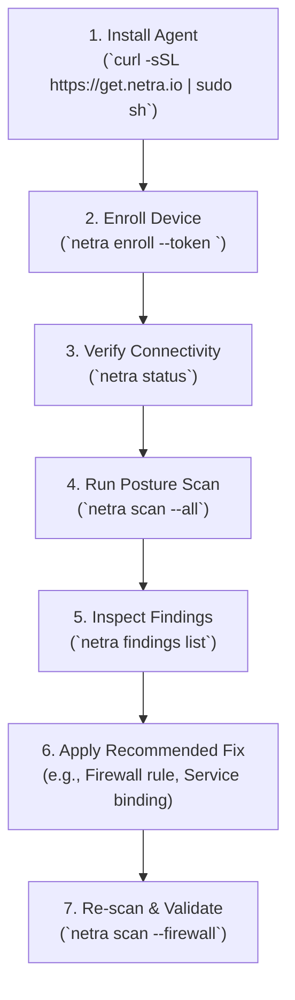
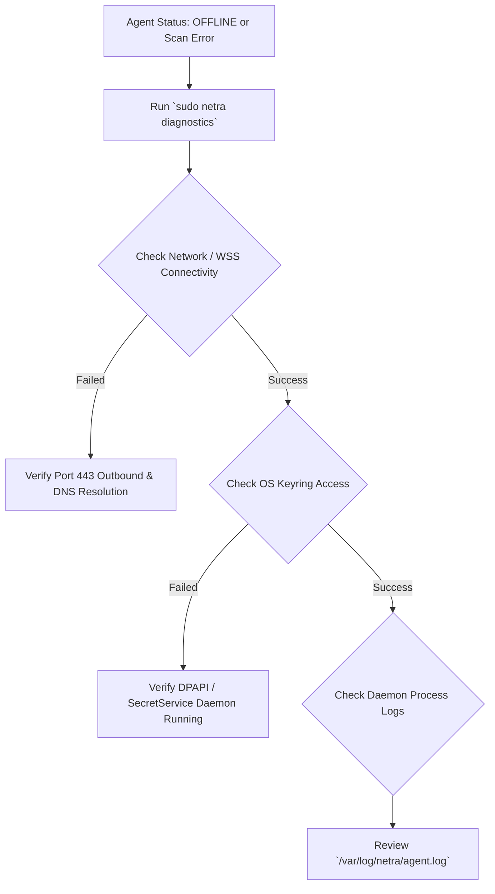

# NETRA — End-User Operations & CLI Usage Guide

> **Document Status:** Approved Specification  
> **Target Version:** v1.0.0-MVP  
> **Authoritative Scope:** Practical user manual for installing, configuring, enrolling, and operating the NETRA agent and CLI.  
> **Related Documents:** [UI_UX.md](./UI_UX.md), [API.md](./API.md), [ARCHITECTURE.md](./ARCHITECTURE.md)

---

## Contents

1. [Operational Workflow Overview](#1-operational-workflow-overview)
2. [System Requirements & Prerequisites](#2-system-requirements--prerequisites)
3. [Agent Installation & Verification](#3-agent-installation--verification)
4. [Device Enrollment Workflow](#4-device-enrollment-workflow)
5. [Running Posture & Network Scans](#5-running-posture--network-scans)
6. [Investigating Findings & Cryptographic Evidence](#6-investigating-findings--cryptographic-evidence)
7. [Inspecting Local Network Topology](#7-inspecting-local-network-topology)
8. [CI/CD Automation & Pipeline Integration](#8-cicd-automation--pipeline-integration)
9. [Configuration & Environment Variables](#9-configuration--environment-variables)
10. [Diagnostics & Troubleshooting Flow](#10-diagnostics--troubleshooting-flow)

---

## 1. Operational Workflow Overview

The following flowchart outlines the complete operational lifecycle from initial installation to continuous verification.



---

## 2. System Requirements & Prerequisites

* **Windows**: Windows 10/11 (x86_64) or Windows Server 2016/2019/2022.
* **Linux**: Linux Kernel 4.19+ (x86_64 or ARM64, systemd recommended).
* **macOS**: macOS 12 Monterey or newer (Apple Silicon / Intel).
* **Network**: Outbound access to the NETRA backend over TCP port 443 (HTTPS/WSS).

---

## 3. Agent Installation & Verification

### Linux (Debian / Ubuntu / RHEL / Arch)
```bash
# Automated Single-Line Installer
$ curl -sSL https://get.netra.io | sudo sh

# Verify installation
$ netra --version
netra version 1.0.0 (linux/amd64)
```

### Windows (PowerShell as Administrator)
```powershell
# Automated PowerShell Installer
iwr -useb https://get.netra.io/install.ps1 | iex

# Verify installation
netra.exe --version
```

---

## 4. Device Enrollment Workflow

```bash
$ sudo netra enroll --token enroll_sec_99a8b7c6d5e4f3a2

✔ Generating Ed25519 cryptographic keypair...
✔ Storing private key in OS protected keyring...
✔ Registering device with NETRA Backend (https://api.netra.io)...
✔ Device enrolled successfully! (Device ID: dev_01h8a9b2c3d4e5f6)
✔ Background supervisor daemon started.
```

---

## 5. Running Posture & Network Scans

```bash
# 5.1 Full System Reconnaissance
$ netra scan --all

# 5.2 Network & Socket Reconnaissance Only
$ netra scan --network

# 5.3 Firewall Posture Audit
$ netra scan --firewall
```

---

## 6. Investigating Findings & Cryptographic Evidence

```bash
$ netra findings show fnd_01h8c4d5e6

Finding: Exposed SMBv1 Service on External Subnet
────────────────────────────────────────────────────────────────────────
  ID:             fnd_01h8c4d5e6
  Severity:       HIGH
  Category:       NETWORK_SECURITY
  Fingerprint:    a9f8e7d6c5b4... (SHA-256 Verified)
  MITRE ATT&CK:   T1021.002 (Remote Services: SMB/Windows Admin Shares)
  Discovered:     2026-08-24 10:15:32 UTC

Description:
  TCP port 445 is listening on interface 'eth0' (192.168.1.10) without
  firewall isolation, accessible to 14 unmanaged adjacent hosts.

Recommended Remediation:
  1. Disable SMBv1 via Windows Features or Registry.
  2. Restrict inbound port 445 to authorized management IPs only.
```

---

## 7. Inspecting Local Network Topology

```bash
$ netra topology

Subnet: 192.168.1.0/24 (Interface: eth0)
Default Gateway: 192.168.1.1 (Router-R3 - 00:1A:2B:3C:4D:5E)

Discovered Adjacent Neighbors (ARP Cache):
  • 192.168.1.15  [00:11:22:33:44:55]  (dev-laptop-02)
  • 192.168.1.50  [00:AA:BB:CC:DD:EE]  (srv-database-01)
```

---

## 8. CI/CD Automation & Pipeline Integration

```yaml
name: Security Posture Gate
on: [push, pull_request]

jobs:
  netra-audit:
    runs-on: ubuntu-latest
    steps:
      - uses: actions/checkout@v4
      - name: Install NETRA Agent
        run: curl -sSL https://get.netra.io | sudo sh
      - name: Run Host Posture Audit
        run: |
          netra scan --all --fail-on=HIGH --json > netra-report.json
      - name: Upload Security Report
        uses: actions/upload-artifact@v4
        with:
          name: netra-security-report
          path: netra-report.json
```

---

## 9. Configuration & Environment Variables

| Variable | Default Value | Description |
| :--- | :--- | :--- |
| `NETRA_SERVER_URL` | `https://api.netra.io` | Central backend API base URL |
| `NETRA_LOG_LEVEL` | `info` | Logging verbosity (`debug`, `info`, `warn`, `error`) |
| `NETRA_CONFIG_DIR` | `/etc/netra` (Linux) | Path to local agent configuration directory |
| `NO_COLOR` | `0` | Disable ANSI color formatting when set to `1` |

---

## 10. Diagnostics & Troubleshooting Flow


