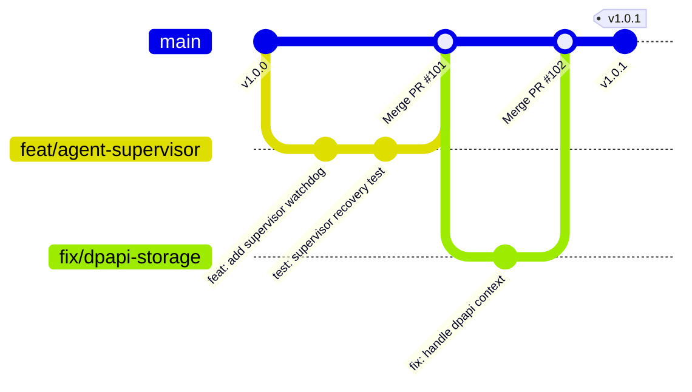
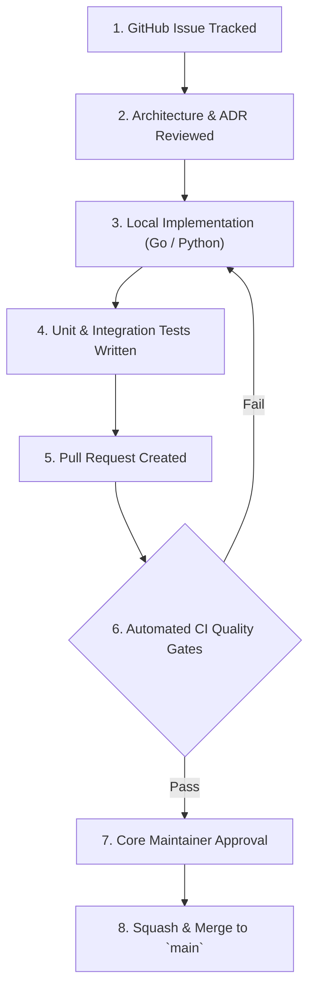
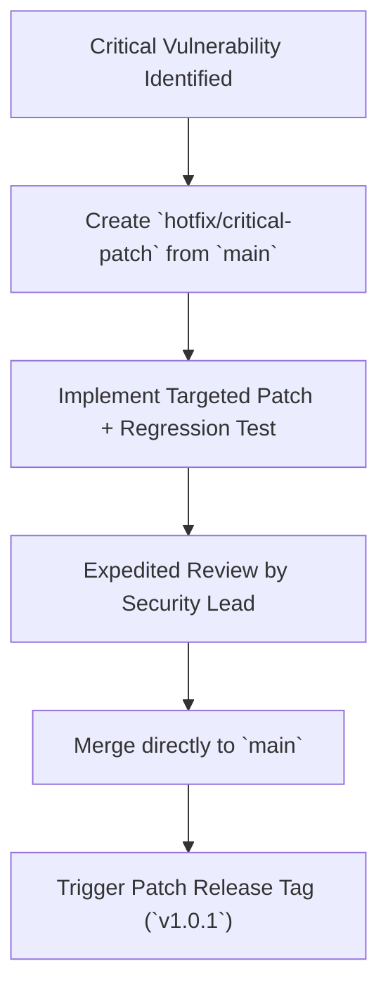

# NETRA — Engineering Workflow & Development Standards

> **Document Status:** Approved Specification  
> **Target Version:** v1.0.0-MVP  
> **Authoritative Scope:** Developer workflows, Git branching models, conventional commit standards, PR review gates, and Definition of Done for NETRA.  
> **Related Documents:** [CI_CD.md](./CI_CD.md), [ARCHITECTURE.md](./ARCHITECTURE.md), [PHASES.md](./PHASES.md)

---

## Contents

1. [Engineering Philosophy & Code Standards](#1-engineering-philosophy--code-standards)
2. [Branching Strategy & Repository Flow](#2-branching-strategy--repository-flow)
3. [Feature Development Lifecycle](#3-feature-development-lifecycle)
4. [Conventional Commit Specifications](#4-conventional-commit-specifications)
5. [Pull Request Lifecycle & Review Gates](#5-pull-request-lifecycle--review-gates)
6. [Architecture Decision Process (ADRs)](#6-architecture-decision-process-adrs)
7. [Definition of Ready (DoR) & Definition of Done (DoD)](#7-definition-of-ready-dor--definition-of-done-dod)
8. [Emergency Hotfix Workflow](#8-emergency-hotfix-workflow)

---

## 1. Engineering Philosophy & Code Standards

NETRA enforces rigorous software engineering standards to guarantee long-term stability and security:
* **Zero Technical Debt by Default**: No code merges with disabled linter warnings or failing tests.
* **Hermetic Dependencies**: External dependencies must be thoroughly vetted for licensing (Apache 2.0 / MIT compatible) and security posture.
* **Strict Type Safety**: All Go and Python code must be statically typed and linted (`golangci-lint`, `mypy`, `ruff`).

---

## 2. Branching Strategy & Repository Flow



---

## 3. Feature Development Lifecycle

The following flowchart outlines the path of any new capability from concept to production release:



---

## 4. Conventional Commit Specifications

All commits must adhere to the **Conventional Commits v1.0.0** specification:

```text
<type>(<scope>): <short summary in present tense>

[optional body explaining WHY, not what]

[optional footer: Fixes #123]
```

### Supported Types:
* `feat`: A new user-facing or technical capability.
* `fix`: A bug fix or defect correction.
* `sec`: A security hardening improvement or vulnerability patch.
* `refactor`: Code change that neither fixes a bug nor adds a feature.
* `perf`: Performance optimization.
* `test`: Adding or correcting test suites.
* `docs`: Documentation updates or corrections.

*Example*:
```text
sec(agent): enforce 30s timeout on windows netsh com queries

Binds Win32 COM invocations to context deadlines to prevent worker thread hangs.
Fixes #42
```

---

## 5. Pull Request Lifecycle & Review Gates

Every Pull Request must satisfy the following checklist before merge approval:

1. **Title & Description**: Clear summary of the problem solved and links to relevant GitHub issues.
2. **Automated CI Validation**: $100\%$ green status across all automated tests, SAST, and security scans.
3. **Test Coverage**: New functionality must include accompanying unit and integration tests.
4. **Documentation**: Updated corresponding documentation files (e.g., `API.md`, `USAGE.md`, `TRD.md`).

---

## 6. Architecture Decision Process (ADRs)

Any architectural modification impacting security models, database schemas, protocols, or technology choices must be preceded by an **Architectural Decision Record (ADR)** added to [ARCHITECTURE.md](./ARCHITECTURE.md).

---

## 7. Definition of Ready (DoR) & Definition of Done (DoD)

### Definition of Ready (DoR):
* Technical requirements documented in [TRD.md](./TRD.md).
* Threat implications analyzed against [SECURITY_CHECK.md](./SECURITY_CHECK.md).
* API / CLI interfaces agreed upon in [API.md](./API.md) and [UI_UX.md](./UI_UX.md).

### Definition of Done (DoD):
* Code implemented, statically typed, and lint-clean.
* Unit test coverage $\ge 85\%$ on new code paths.
* Zero newly introduced vulnerabilities (`govulncheck`, `trivy`).
* PR reviewed and approved by a core maintainer.

---

## 8. Emergency Hotfix Workflow


