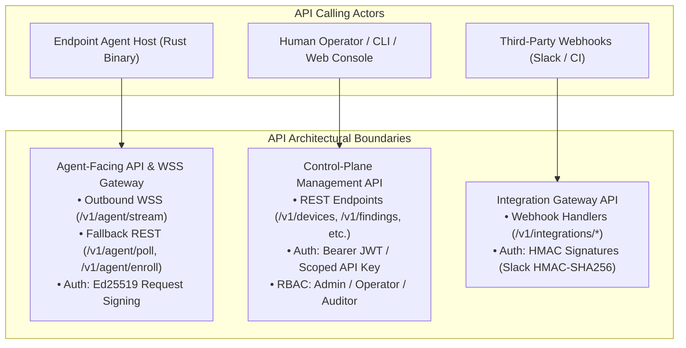
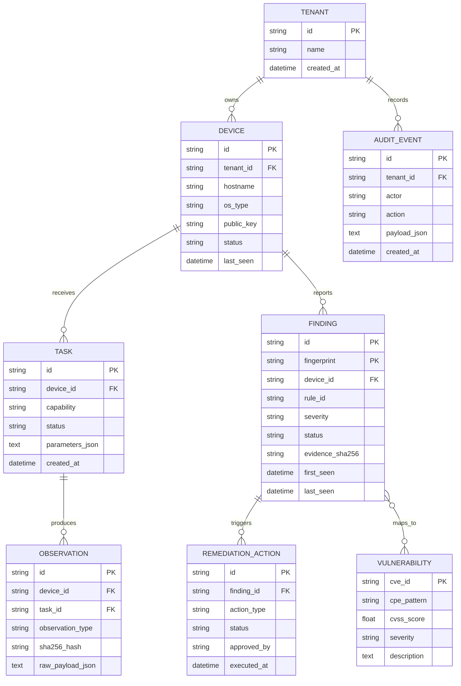

# NETRA — Official API Reference & Stream Protocol Specification

> **Overview**
>
> This document provides the complete, authoritative API reference and network communication contracts for NETRA (Network & Endpoint Threat Reconnaissance Architecture). It defines REST endpoints, WebSocket streaming frames, Protocol Buffer schemas, cryptographic authentication headers, error models, and entity data relationships.

**Status:** Specified / Designed  
**Audience:** Backend Engineers, Rust Systems Developers, Security Architects, API Integrators  
**Purpose:** Serves as the immutable protocol specification connecting endpoint Rust agents, central control services, CLI tools, and external notification gateways.

---

## Contents

1. [API Architecture & Actor Boundaries](#1-api-architecture--actor-boundaries)
2. [Authentication, Authorization & Device Attestation](#2-authentication-authorization--device-attestation)
3. [Standard Headers & Cryptographic Request Signing](#3-standard-headers--cryptographic-request-signing)
4. [Universal Request, Response & Error Envelopes](#4-universal-request-response--error-envelopes)
5. [Idempotency & Retry Semantics](#5-idempotency--retry-semantics)
6. [API Data Model & Entity-Relationship Schema](#6-api-data-model--entity-relationship-schema)
7. [WebSocket Agent Stream Protocol (`/v1/agent/stream`)](#7-websocket-agent-stream-protocol-v1agentstream)
8. [Agent-Facing REST Endpoints](#8-agent-facing-rest-endpoints)
9. [Control-Plane Management Endpoints](#9-control-plane-management-endpoints)
10. [Network & Vulnerability Intelligence Endpoints](#10-network--vulnerability-intelligence-endpoints)
11. [Controlled Remediation Endpoints](#11-controlled-remediation-endpoints)
12. [Integration Gateway Endpoints (Slack & Webhooks)](#12-integration-gateway-endpoints-slack--webhooks)
13. [Health, Telemetry & Diagnostics Endpoints](#13-health-telemetry--diagnostics-endpoints)
14. [Internal Local IPC Protocol Specification (Phase 2.3)](#14-internal-local-ipc-protocol-specification-phase-23)

---

## 1. API Architecture & Actor Boundaries

The NETRA API cleanly separates communication pathways across three distinct actors:



---

## 2. Authentication, Authorization & Device Attestation

* **Agent Authentication**: Uses asymmetric **Ed25519 (RFC 8032)** public-key signatures generated by the Rust agent. Endpoints possess zero shared secrets or database credentials.
* **Control-Plane Authentication**: Uses standard JSON Web Tokens (**JWT**) signed by the Supabase / PostgreSQL auth service (RS256/ES256).
* **Role-Based Access Control (RBAC)**:
  - `ROLE_ADMIN`: Full administrative control (Enrollment token generation, device revocation, policy configuration).
  - `ROLE_OPERATOR`: Can trigger scans, view findings, and approve remediation actions.
  - `ROLE_AUDITOR`: Read-only access to findings, topology graphs, and immutable audit logs.
* **Database Isolation Rule**: Distributed agents **must never** receive or store direct Supabase service-role keys or PostgreSQL credentials. All data is routed strictly through the authenticated Control API.

---

## 3. Standard Headers & Cryptographic Request Signing

### 3.1 Agent Cryptographic Headers
Every HTTP request and WebSocket initialization frame dispatched by an enrolled Rust agent must include:

```http
X-NETRA-Device-ID: dev_01h8a9b2c3d4e5f6
X-NETRA-Timestamp: 1776189500
X-NETRA-Nonce: a9f8e7d6-c5b4-4a3b-2a1f-0e9d8c7b6a5f
X-NETRA-Request-ID: req_1122334455667788
X-NETRA-Signature: 6f8b9e... (128-character hex-encoded Ed25519 signature)
```

```text
StringToSign = METHOD + "\n" + PATH + "\n" + TIMESTAMP + "\n" + NONCE + "\n" + REQUEST_ID + "\n" + SHA256(BODY)
```

---

## 4. Universal Request, Response & Error Envelopes

### 4.1 Standard Success Envelope
```json
{
  "success": true,
  "data": { ... },
  "meta": {
    "request_id": "req_01h8a9b2c3",
    "timestamp": "2026-08-24T12:00:00Z"
  }
}
```

### 4.2 Standard Error Envelope
```json
{
  "success": false,
  "error": {
    "code": "DEVICE_NOT_ENROLLED",
    "message": "The requested device UUID does not exist or has been revoked.",
    "details": { "device_id": "dev_01h8a9b2c3" }
  },
  "meta": {
    "request_id": "req_01h8a9b2c3",
    "timestamp": "2026-08-24T12:00:00Z"
  }
}
```

### Standard Error Codes:
* `AUTH_INVALID_SIGNATURE`: Ed25519 signature verification failed.
* `AUTH_NONCE_REPLAYED`: The provided nonce was seen within the sliding 300s window.
* `DEVICE_REVOKED`: The device has been administratively revoked.
* `CAPABILITY_NOT_WHITELISTED`: The requested task capability is not in the approved pre-compiled whitelist.
* `REMEDIATION_PREFLIGHT_FAILED`: Pre-flight safety checks prevented remediation execution.

---

## 5. Idempotency & Retry Semantics

* **Idempotency Key**: Endpoints supporting state creation (`POST /v1/tasks`, `POST /v1/remediation/apply`) accept an `Idempotency-Key: <UUIDv7>` header. If re-sent with the same key within 24 hours, the server returns the cached response without re-executing.
* **Finding Deduplication**: Findings are ingested via deterministic SHA-256 fingerprints. Ingesting an existing fingerprint updates `last_seen` rather than creating duplicate records.

---

## 6. API Data Model & Entity-Relationship Schema



---

## 7. WebSocket Agent Stream Protocol (`/v1/agent/stream`)

Persistent bidirectional connection between the endpoint Rust agent and control gateway.

### Protobuf Frame Definitions:
```protobuf
syntax = "proto3";
package netra.agent.v1;

message Frame {
  string frame_id = 1;
  int64 timestamp = 2;
  oneof payload {
    AgentHello hello = 3;
    TaskDispatch task_dispatch = 4;
    TaskResult task_result = 5;
    FindingIngest finding_ingest = 6;
    Heartbeat heartbeat = 7;
    Ack ack = 8;
  }
}

message AgentHello {
  string device_id = 1;
  string os_name = 2;
  string arch = 3;
  string agent_version = 4;
}

message TaskDispatch {
  string task_id = 1;
  string capability = 2;
  string parameters_json = 3;
  int32 timeout_seconds = 4;
}

message TaskResult {
  string task_id = 1;
  string status = 2;
  string evidence_sha256 = 3;
  bytes raw_evidence_gz = 4;
  string error_message = 5;
}
```

---

## 8. Agent-Facing REST Endpoints

### 8.1 `POST /v1/agent/enroll`
Enrolls a newly installed agent host.
* **Status**: `Specified`
* **Actor**: Unenrolled Agent Host
* **Auth**: Single-use Enrollment Token
* **Request**:
```json
{
  "enrollment_token": "enroll_sec_99a8b7c6d5e4f3a2",
  "public_key": "3d4f5a6b7c8d9e0f1a2b3c4d5e6f7a8b9c0d1e2f3a4b5c6d7e8f9a0b1c2d3e4f",
  "hostname": "workstation-01",
  "os_type": "linux",
  "os_release": "Ubuntu 24.04 LTS",
  "arch": "amd64"
}
```
* **Response (201 Created)**:
```json
{
  "success": true,
  "data": {
    "device_id": "dev_01h8a9b2c3d4e5f6",
    "tenant_id": "ten_01h8a1b2c3d4",
    "heartbeat_interval_seconds": 15,
    "enrolled_at": "2026-08-24T12:00:00Z"
  }
}
```

---

## 9. Control-Plane Management Endpoints

### 9.1 `GET /v1/devices`
Lists all registered endpoint devices in the active tenant.
* **Status**: `Specified`
* **Actor**: Operator / Web Console / CLI
* **Auth**: Bearer JWT (`ROLE_OPERATOR`, `ROLE_ADMIN`, `ROLE_AUDITOR`)
* **Query Params**: `status` (`ONLINE`, `OFFLINE`, `REVOKED`), `os_type`, `limit`, `offset`
* **Response (200 OK)**:
```json
{
  "success": true,
  "data": {
    "total": 1,
    "devices": [
      {
        "id": "dev_01h8a9b2c3d4e5f6",
        "hostname": "workstation-01",
        "os_type": "linux",
        "status": "ONLINE",
        "last_seen": "2026-08-24T12:05:00Z"
      }
    ]
  }
}
```

### 9.2 `POST /v1/tasks`
Creates and dispatches an asynchronous scan task to an enrolled device.
* **Status**: `Specified`
* **Actor**: Operator / Automated CI Gate
* **Auth**: Bearer JWT (`ROLE_OPERATOR`, `ROLE_ADMIN`)
* **Request**:
```json
{
  "device_id": "dev_01h8a9b2c3d4e5f6",
  "capability": "SCAN_FIREWALL",
  "parameters": {}
}
```
* **Response (202 Accepted)**:
```json
{
  "success": true,
  "data": {
    "task_id": "tsk_01h8b3c4d5e6",
    "status": "PENDING",
    "device_id": "dev_01h8a9b2c3d4e5f6",
    "created_at": "2026-08-24T12:06:00Z"
  }
}
```

---

## 10. Network & Vulnerability Intelligence Endpoints

### 10.1 `GET /v1/topology/graph`
Returns the synthesized network topology and reachability graph.
* **Status**: `Specified`
* **Actor**: Operator / Web Console
* **Auth**: Bearer JWT
* **Response (200 OK)**:
```json
{
  "success": true,
  "data": {
    "nodes": [
      { "id": "node_dev_01", "type": "DEVICE", "label": "workstation-01", "ip": "192.168.1.50" },
      { "id": "node_gw_01", "type": "GATEWAY", "label": "Default-Gateway", "ip": "192.168.1.1" }
    ],
    "links": [
      { "source": "node_dev_01", "target": "node_gw_01", "type": "DEFAULT_GATEWAY" }
    ]
  }
}
```

### 10.2 `GET /v1/vulnerabilities`
Queries the cached CVE vulnerability intelligence catalog.
* **Status**: `Specified`
* **Actor**: Operator / CLI

---

## 11. Controlled Remediation Endpoints

### 11.1 `POST /v1/remediation/apply`
Applies an approved, controlled remediation action with mandatory post-validation.
* **Status**: `Specified`
* **Actor**: Human Operator / Approved Slack Action
* **Auth**: Bearer JWT (`ROLE_ADMIN`, `ROLE_OPERATOR`)
* **Request**:
```json
{
  "finding_id": "fnd_01h8c4d5e6",
  "action_type": "FIREWALL_ENABLE_PROFILE",
  "dry_run": false
}
```
* **Response (200 OK)**:
```json
{
  "success": true,
  "data": {
    "remediation_id": "rem_01h8d5e6f7",
    "status": "VERIFIED_RESOLVED",
    "finding_id": "fnd_01h8c4d5e6",
    "post_validation_passed": true,
    "executed_at": "2026-08-24T12:10:00Z"
  }
}
```

---

## 12. Integration Gateway Endpoints (Slack & Webhooks)

### 12.1 `POST /v1/integrations/slack/interactivity`
Handles Slack Block Kit interactive buttons (`[Approve Remediation]`).
* **Status**: `Specified`
* **Actor**: Slack API Servers
* **Auth**: HMAC-SHA256 Signature (`X-Slack-Signature`, `X-Slack-Request-Timestamp`)

---

## 13. Health, Telemetry & Diagnostics Endpoints

* `GET /v1/health`: System health check (`{"status": "HEALTHY", "db": "CONNECTED", "version": "1.0.0"}`).
* `GET /metrics`: Standard Prometheus metrics format.

---

## 14. Internal Local IPC Protocol Specification (Phase 2.3)

> [!NOTE]
> **Internal Trust Boundary Contract**: This section specifies the host-local communication protocol connecting the **Tier-1 Supervisor Daemon**, **Tier-2 Worker Process**, and **CLI Query Launcher**. It operates strictly over local OS abstractions (Named Pipes / Unix Domain Sockets) and is completely decoupled from the external HTTP / WSS API.

### 14.1 Transport & Wire Framing
* **Windows Transport**: Named Pipe (`\\.\pipe\netra-supervisor-ipc`) with strict SDDL DACL.
* **Unix Transport**: Unix Domain Socket (`/run/netra/supervisor.sock` or `$XDG_RUNTIME_DIR/netra/supervisor.sock`) with mode `0600`.
* **Framing Format**: 4-byte unsigned big-endian length prefix followed by UTF-8 encoded JSON payload:
  ```text
  +-------------------------+----------------------------------------------------+
  | Length Prefix (4-byte)  |             JSON Payload (UTF-8)                   |
  | Big-Endian uint32       |  {"protocol_version":1,"message_type":"Heartbeat"...} |
  +-------------------------+----------------------------------------------------+
  ```
* **Maximum Frame Size Guard**: `1,048,576` bytes (1MB). Frames exceeding this limit trigger immediate connection termination.

### 14.2 Universal IPC Envelope Schema

```json
{
  "protocol_version": 1,
  "message_type": "CommandRequest",
  "request_id": "req_01h8a9b2c3d4",
  "correlation_id": "corr_01h8a9b2c3d4",
  "session_id": "sess_01h8a9b2c3d4",
  "timestamp": 1776189500,
  "payload": { ... }
}
```

| Field | Type | Description |
| :--- | :--- | :--- |
| `protocol_version` | `uint32` | Protocol version integer (Current: `1`). Mismatched versions receive `INCOMPATIBLE_VERSION`. |
| `message_type` | `string` | Enum identifying the payload schema type. |
| `request_id` | `string` | Unique UUIDv7 identifier for the specific request. |
| `correlation_id` | `string?` | Optional UUIDv7 linking a response or event to an initial request. |
| `session_id` | `string?` | Cryptographic session identifier assigned upon successful handshake. |
| `timestamp` | `int64` | Unix epoch timestamp in seconds. |
| `payload` | `object` | Type-specific JSON payload body. |

### 14.3 IPC Message Catalog

#### 1. `HandshakeRequest` (Client $\to$ Server)
```json
{
  "protocol_version": 1,
  "message_type": "HandshakeRequest",
  "request_id": "req_01h8a9b2c3d4",
  "timestamp": 1776189500,
  "payload": {
    "token": "a1b2c3d4e5f6...",
    "client_pid": 10482,
    "client_role": "WORKER",
    "version": "1.0.0-foundation"
  }
}
```

#### 2. `HandshakeResponse` (Server $\to$ Client)
```json
{
  "protocol_version": 1,
  "message_type": "HandshakeResponse",
  "correlation_id": "req_01h8a9b2c3d4",
  "timestamp": 1776189501,
  "payload": {
    "success": true,
    "session_id": "sess_01h8b1c2d3e4",
    "heartbeat_interval_ms": 5000,
    "error": null
  }
}
```

#### 3. `Heartbeat` (Worker $\to$ Supervisor)
```json
{
  "protocol_version": 1,
  "message_type": "Heartbeat",
  "session_id": "sess_01h8b1c2d3e4",
  "timestamp": 1776189505,
  "payload": {
    "memory_rss_bytes": 14680064,
    "cpu_usage_pct": 0.4,
    "runtime_state": "RUNNING",
    "active_tasks": 0
  }
}
```

#### 4. `HeartbeatAck` (Supervisor $\to$ Worker)
```json
{
  "protocol_version": 1,
  "message_type": "HeartbeatAck",
  "session_id": "sess_01h8b1c2d3e4",
  "timestamp": 1776189505,
  "payload": {
    "acknowledged": true
  }
}
```

#### 5. `CommandRequest` (Supervisor / CLI $\to$ Worker)
```json
{
  "protocol_version": 1,
  "message_type": "CommandRequest",
  "request_id": "req_01h8c2d3e4f5",
  "session_id": "sess_01h8b1c2d3e4",
  "timestamp": 1776189510,
  "payload": {
    "action": "STATUS_QUERY",
    "parameters": {}
  }
}
```

#### 6. `CommandResponse` (Worker $\to$ Supervisor / CLI)
```json
{
  "protocol_version": 1,
  "message_type": "CommandResponse",
  "correlation_id": "req_01h8c2d3e4f5",
  "session_id": "sess_01h8b1c2d3e4",
  "timestamp": 1776189510,
  "payload": {
    "success": true,
    "data": {
      "state": "RUNNING",
      "health": "HEALTHY",
      "uptime_seconds": 120
    },
    "error": null
  }
}
```

#### 7. `ShutdownNotice` (Supervisor $\to$ Worker)
```json
{
  "protocol_version": 1,
  "message_type": "ShutdownNotice",
  "request_id": "req_01h8d3e4f5a6",
  "timestamp": 1776189520,
  "payload": {
    "reason": "OS_TERMINATION_SIGNAL",
    "grace_period_ms": 5000
  }
}
```

#### 8. `ErrorResponse` (Server $\to$ Client)
```json
{
  "protocol_version": 1,
  "message_type": "ErrorResponse",
  "correlation_id": "req_01h8a9b2c3d4",
  "timestamp": 1776189501,
  "payload": {
    "error_code": "UNAUTHORIZED_TOKEN",
    "message": "The provided ephemeral handshake token is invalid or expired."
  }
}
```

### 14.4 Error Codes & Behavior Table
| Error Code | Trigger Condition | Server Action |
| :--- | :--- | :--- |
| `UNAUTHORIZED_TOKEN` | Token mismatch in `HandshakeRequest` | Drops session and terminates connection |
| `PEER_PID_MISMATCH` | Kernel peer PID != claimed client PID | Disconnects immediately; logs security audit alert |
| `HANDSHAKE_TIMEOUT` | No handshake received within 3.0s | Drops unauthenticated socket |
| `FRAME_OVERFLOW` | Frame size header exceeds 1MB | Closes socket without allocating buffer |
| `MALFORMED_JSON` | Payload cannot be parsed as JSON envelope | Returns `ErrorResponse` and drops connection |
| `INCOMPATIBLE_VERSION` | Client protocol version != server version | Rejects connection with supported version range |
| `SESSION_EXPIRED` | Worker restarted; old session ID used | Rejects request; client must perform fresh handshake |

