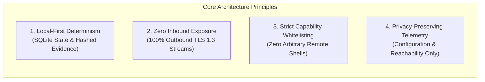
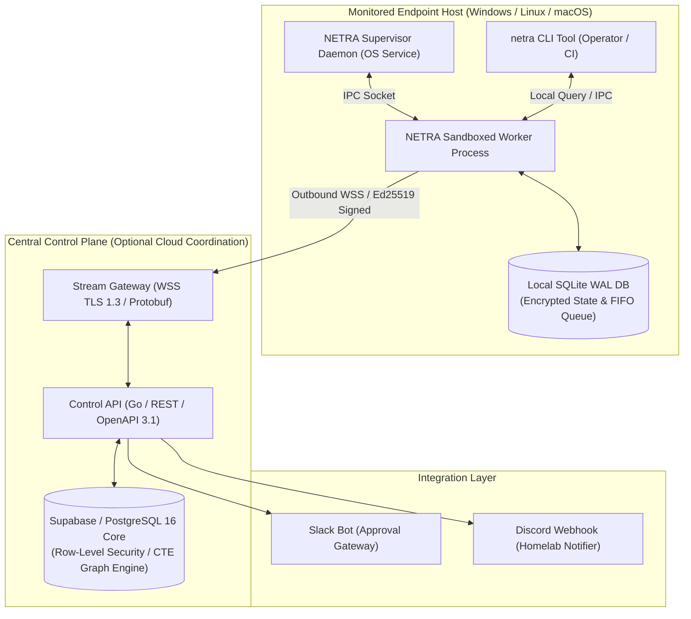
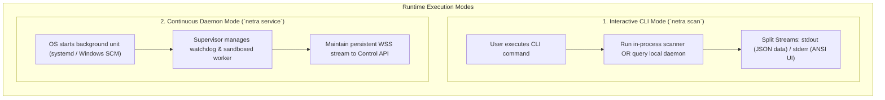
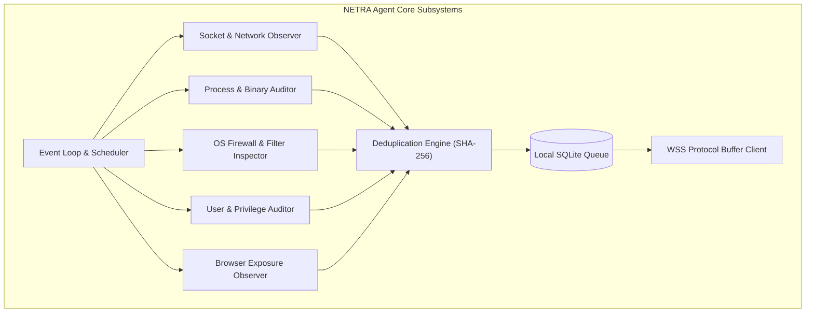
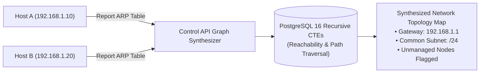
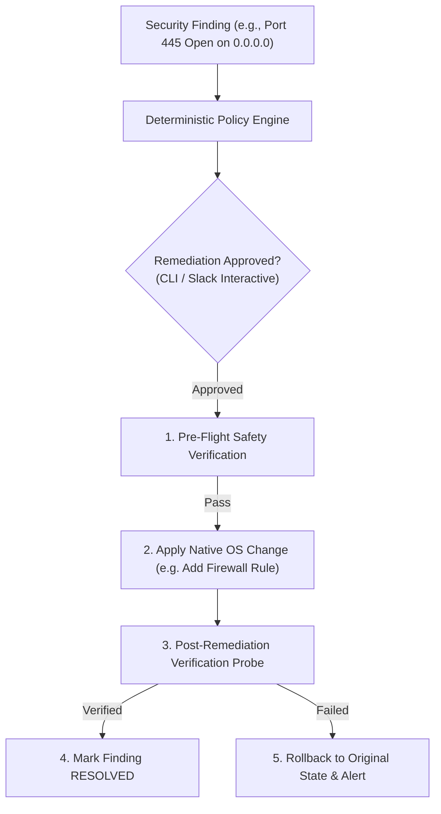
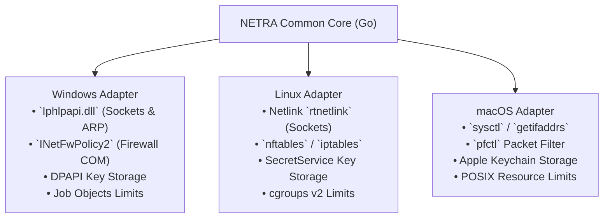
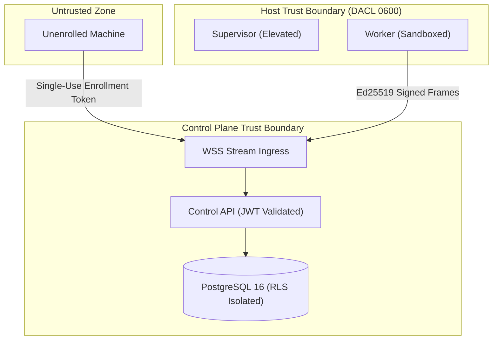

# NETRA — Comprehensive System Architecture & Design Principles

> **Overview**
>
> This document provides the master technical architecture for NETRA (Network & Endpoint Threat Reconnaissance Architecture). It establishes the core design principles, runtime component subsystems, local-first storage models, cloud coordination layers, browser exposure abstractions, and architectural decision records (ADRs) governing the platform.

**Status:** Specified / Designed  
**Audience:** System Architects, Core Developers, Security Researchers, Technical Contributors  
**Purpose:** Serves as the authoritative architectural reference for all NETRA engineering implementations and component interactions.

---

## Contents

1. [Architectural Principles & Academic Identity](#1-architectural-principles--academic-identity)
2. [High-Level System Topology](#2-high-level-system-topology)
3. [Dual Runtime Architecture (Daemon vs. CLI)](#3-dual-runtime-architecture-daemon-vs-cli)
4. [Endpoint Agent Internal Subsystems](#4-endpoint-agent-internal-subsystems)
5. [Local-First Data Architecture (SQLite Core)](#5-local-first-data-architecture-sqlite-core)
6. [Network Intelligence & Topology Architecture](#6-network-intelligence--topology-architecture)
7. [Browser & Web Exposure Observation Subsystem](#7-browser--web-exposure-observation-subsystem)
8. [Vulnerability Intelligence Subsystem](#8-vulnerability-intelligence-subsystem)
9. [Policy & Controlled Remediation Architecture](#9-policy--controlled-remediation-architecture)
10. [Control API & Supabase Coordination Layer](#10-control-api--supabase-coordination-layer)
11. [Cross-Platform OS Abstraction Layer](#11-cross-platform-os-abstraction-layer)
12. [Supply Chain Security & TUF Update Model](#12-supply-chain-security--tuf-update-model)
13. [Security Trust, Data & Failure Boundaries](#13-security-trust-data--failure-boundaries)
14. [Architectural Decision Records (ADRs)](#14-architectural-decision-records-adrs)

---

## 1. Architectural Principles & Academic Identity

NETRA is an open-source academic research project developed to demonstrate robust defensive security engineering:

---

## 2. High-Level System Topology

---

## 3. Dual Runtime Architecture (Daemon vs. CLI)

NETRA decouples interactive analysis from continuous monitoring using a unified binary:

---

## 4. Endpoint Agent Internal Subsystems

---

## 5. Local-First Data Architecture (SQLite Core)

To guarantee resilience during network partitions, the agent stores configuration, evidence, and pending sync batches locally in SQLite:

* **WAL Mode**: `PRAGMA journal_mode = WAL;` enables concurrent reads by the CLI while the worker daemon writes.
* **Bounded FIFO Queue**: If the host is offline, observations are queued locally up to 500MB, pruning resolved or low-priority items first.

---

## 6. Network Intelligence & Topology Architecture

NETRA correlates local network configuration across all enrolled endpoints without invasive port scanning:

---

## 7. Browser & Web Exposure Observation Subsystem

Correlates OS network sockets with browser binaries to identify unauthorized external exposures:
* **Passive Correlation**: Reads OS socket tables (`GetExtendedTcpTable` / Netlink) and matches PID to known browser binaries.
* **Domain Resolution**: Uses OS DNS cache and TLS SNI headers observed at TCP connect time.
* **Academic Privacy Boundary**: Never inspects web page DOM, cookies, HTTP bodies, or user keystrokes.

---

## 8. Vulnerability Intelligence Subsystem

Correlates installed software inventories with cached CVE catalogs:
* **Local Parsing**: Queries OS package managers and registry keys.
* **CPE Normalization**: Maps software to CPE 2.3 identifiers.
* **Offline Matching**: Matches versions against cached NVD/OSV feeds stored in local SQLite or PostgreSQL.

---

## 9. Policy & Controlled Remediation Architecture

---

## 10. Control API & Supabase Coordination Layer

* **Supabase / PostgreSQL Core**: Serves as the central data store enforcing multi-tenant isolation via Row-Level Security (`SET LOCAL app.current_tenant_id`).
* **Architectural Decoupling**: Endpoints never connect directly to the database; all traffic routes through the authenticated Control API / WSS Gateway.

---

## 11. Cross-Platform OS Abstraction Layer

---

## 12. Supply Chain Security & TUF Update Model

* **Hermetic Compilation**: `CGO_ENABLED=0` static Go binaries.
* **Artifact Provenance**: Syft generates CycloneDX/SPDX SBOMs; Cosign signs release binaries via GitHub OIDC.
* **Atomic Binary Updates**: Downloaded updates are verified against TUF signed manifests and swapped atomically on disk.

---

## 13. Security Trust, Data & Failure Boundaries

---

## 14. Architectural Decision Records (ADRs)

| ADR ID | Decision | Chosen Approach | Rejected Alternative | Core Rationale |
| :--- | :--- | :--- | :--- | :--- |
| **ADR-001** | Agent Implementation Language | **Go (Golang 1.22+)** | Python / PyInstaller | Single static binary (<20MB), low memory (<25MB RAM), sub-millisecond cold start, native Win32/Netlink syscall bindings. |
| **ADR-002** | Device Transport Protocol | **Outbound WebSocket over TLS 1.3 (Protobuf)** | Inbound REST / gRPC | Traverses NAT gateways with zero open client firewall ports. Protobuf ensures minimal bandwidth. |
| **ADR-003** | Local State Management | **Local SQLite (WAL Mode)** | JSON files / Raw memory | ACID safety, WAL non-blocking concurrent reads, resilient offline buffering up to 500MB. |
| **ADR-004** | Topology & Reachability Graph | **PostgreSQL 16 Recursive CTEs** | Dedicated Neo4j Cluster | Sub-10ms graph path queries for <50k nodes within existing ACID transaction boundary; zero dual-write operational overhead. |
| **ADR-005** | Third-Party Integrations | **Slack (Async Gateway) / Discord (Outbound Webhook)** | Discord as Primary Control Plane | Discord lacks enterprise RBAC and SSO. Positioned strictly as optional notification plugins. |
