# NETRA — Comprehensive System Architecture & Design Principles

> **Overview**
>
> This document provides the master technical architecture for NETRA (Network & Endpoint Threat Reconnaissance Architecture). It establishes the core design principles, Rust-first systems foundations, local-first storage models, cloud coordination layers, browser exposure abstractions, and architectural decision records (ADRs) governing the platform.

**Status:** Specified / Designed  
**Audience:** System Architects, Rust Systems Developers, Security Researchers, Technical Contributors  
**Purpose:** Serves as the authoritative architectural reference for all NETRA engineering implementations and component interactions.

---

## Contents

1. [Architectural Principles & Academic Identity](#1-architectural-principles--academic-identity)
2. [High-Level System Topology](#2-high-level-system-topology)
3. [Rust-First Systems Core & Justified Python Boundary](#3-rust-first-systems-core--justified-python-boundary)
4. [Dual Runtime Architecture (Daemon vs. CLI)](#4-dual-runtime-architecture-daemon-vs-cli)
5. [Endpoint Agent Internal Subsystems](#5-endpoint-agent-internal-subsystems)
6. [Local-First Data Architecture (SQLite Core)](#6-local-first-data-architecture-sqlite-core)
7. [Network Intelligence & Topology Architecture](#7-network-intelligence--topology-architecture)
8. [Browser & Web Exposure Observation Subsystem](#8-browser--web-exposure-observation-subsystem)
9. [Modular Vulnerability Intelligence Subsystem](#9-modular-vulnerability-intelligence-subsystem)
10. [Policy & Controlled Remediation Architecture](#10-policy--controlled-remediation-architecture)
11. [Control API & Supabase Coordination Layer](#11-control-api--supabase-coordination-layer)
12. [Cross-Platform OS Abstraction Layer](#12-cross-platform-os-abstraction-layer)
13. [Supply Chain Security & TUF Update Model](#13-supply-chain-security--tuf-update-model)
14. [Security Trust, Data & Failure Boundaries](#14-security-trust-data--failure-boundaries)
15. [Architectural Decision Records (ADRs)](#15-architectural-decision-records-adrs)

---

## 1. Architectural Principles & Academic Identity

NETRA is an open-source academic research project developed to demonstrate robust defensive security engineering:

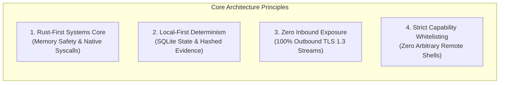

---

## 2. High-Level System Topology

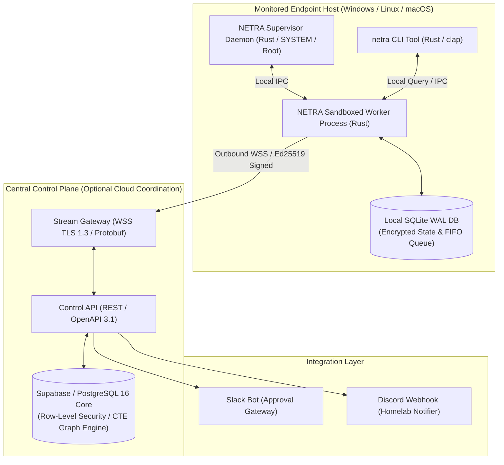

---

## 3. Rust-First Systems Core & Crate Boundaries

NETRA enforces strict subsystem boundaries to prevent language proliferation and maintain optimal host efficiency:

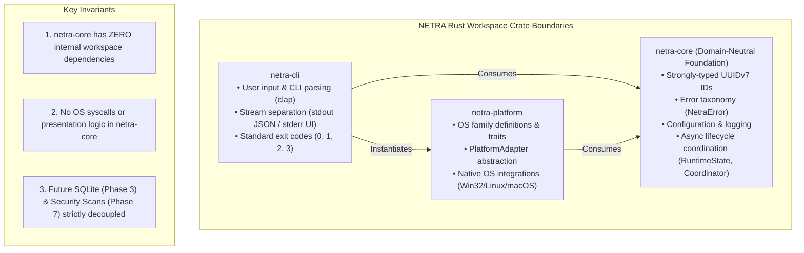

### Conceptual Architecture & Dependency Hierarchy

The conceptual dependency direction of the NETRA runtime is strictly unidirectional:

$$\mathbf{netra\text{-}cli} \;\longrightarrow\; \mathbf{netra\text{-}core} \;\longrightarrow\; \mathbf{runtime\;lifecycle} \;\longrightarrow\; \mathbf{platform\;abstraction}$$

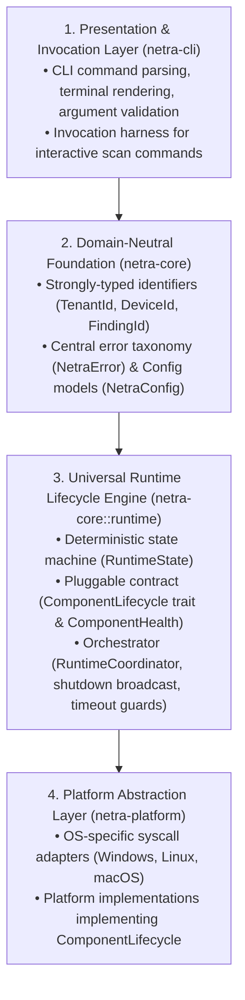

### Why Runtime Ownership Belongs in `netra-core`

1. **What `netra-core` Owns**:
   - **Canonical Lifecycle State Machine**: The mathematical `RuntimeState` enum (`Created`, `Initializing`, `Ready`, `Running`, `Degraded`, `Stopping`, `Stopped`, `Failed`) and its deterministic transition validation rules.
   - **Pluggable Subsystem Contract**: The `ComponentLifecycle` trait (`initialize()`, `start()`, `stop()`, `health()`, `is_critical()`) and `ComponentHealth` enum.
   - **Asynchronous Lifecycle Coordinator**: `RuntimeCoordinator`, which manages component registration, serial startup, health aggregation, broadcast shutdown signaling, and graceful reverse teardown with timeout guards.
   - **Universal Domain Primitives**: Strongly-typed UUIDv7 identifiers, unified error models (`NetraError`), configuration (`NetraConfig`), and structured logging (`init_logging`).

2. **What `netra-core` Deliberately Does NOT Own**:
   - **Operating System Syscalls**: Win32 API calls (`Iphlpapi.dll`, DPAPI), Linux Netlink sockets, or macOS `sysctl` routines (strictly owned by `netra-platform`).
   - **CLI Presentation & Arguments**: Terminal argument parsing (`clap`), ANSI formatting, stream splitting (`stdout` data vs. `stderr` human UI), and POSIX exit codes (strictly owned by `netra-cli`).
   - **Process Supervision & OS Daemon Units**: Service Control Manager, systemd slices, launchd daemons, Job Objects, cgroups sandboxing, and local IPC sockets (strictly owned by Phase 2.3 daemon).
   - **Concrete Scanner Implementations**: Socket probes, process monitors, and firewall rule inspectors (strictly owned by Phase 7 scanners).

3. **Why `netra-cli` Does NOT Own the Runtime Lifecycle**:
   - `netra-cli` is merely one of multiple possible invocation frontends (interactive CLI vs. background service daemon vs. embedded library).
   - If CLI owned the runtime lifecycle, the background service daemon (Phase 2.3) or worker process would either have to depend directly on the CLI presentation crate (violating layering) or duplicate the runtime state machine.
   - By housing runtime coordination in `netra-core`, both CLI commands and background daemons reuse the exact same deterministic lifecycle engine without code duplication.

4. **Why OS-Specific Implementations Do NOT Own the Runtime Lifecycle**:
   - Operating system APIs vary drastically across Windows, Linux, and macOS, but lifecycle orchestration (initialization, healthy operation, degradation, reverse teardown) is 100% platform-invariant.
   - Placing the coordinator in `netra-platform` would pollute the platform abstraction layer with domain-level orchestration logic and force circular dependencies when domain components need to be coordinated.
   - Instead, platform adapters in `netra-platform` simply implement `ComponentLifecycle` as pluggable subsystems and register into the core coordinator.

5. **How Future Subsystems Plug Into the Runtime**:
   - Any future subsystem (e.g., Local SQLite Database in Phase 3, Local IPC Gateway in Phase 2.3, WSS Streamer in Phase 6, Network Scanner in Phase 7, CVE Matcher in Phase 10) implements the `ComponentLifecycle` trait.
   - Subsystems register into `RuntimeCoordinator` via `coordinator.register_component(Arc::new(subsystem))`.
   - The coordinator manages initialization, health aggregation, and reverse graceful teardown without requiring any subsystem-specific knowledge in `netra-core`.

### Subsystem Boundaries & Python Extension Layer

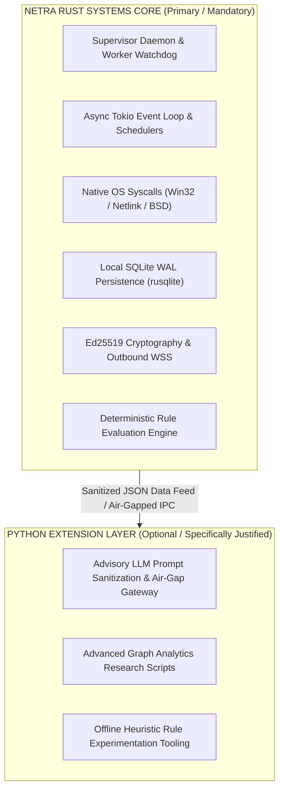

---

## 4. Dual Runtime Architecture & Lifecycle State Machine

NETRA decouples interactive analysis from continuous monitoring using a unified Rust binary orchestrated by the core `RuntimeCoordinator`:

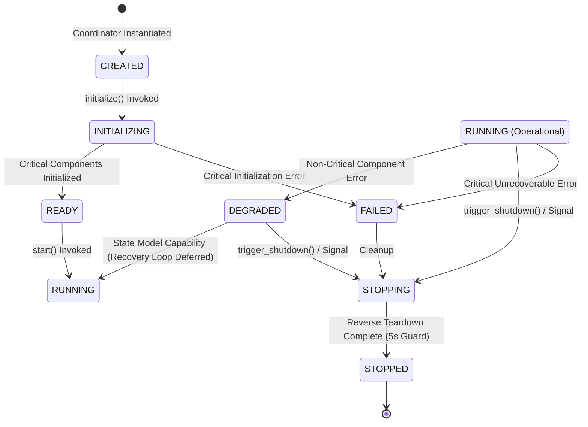

### State Model Capabilities vs. Implemented Runtime Behavior (Phase 2.2 Boundary)

To prevent architectural ambiguity, NETRA explicitly differentiates between the state model's transition capabilities and active runtime features implemented in Phase 2.2:

* **State Model Capability (`netra-core::runtime::state`)**:
  - The `RuntimeState` transition rules structurally permit `DEGRADED -> RUNNING`, `RUNNING -> DEGRADED`, and `DEGRADED -> STOPPING`.
  - This establishes the mathematical validity of self-healing and recovery transitions without requiring breaking state-machine redesigns in future phases.
* **Implemented Runtime Behavior (Phase 2.2)**:
  - Phase 2.2 implements the in-process lifecycle coordinator (`RuntimeCoordinator`), component lifecycle registration (`ComponentLifecycle`), deterministic start/stop ordering, reverse teardown, and on-demand health auditing (`coordinator.health().await`).
  - **Deferred**: Automated background health monitoring loops, periodic heartbeat probes, and autonomous `DEGRADED -> RUNNING` recovery actions are deferred to **Phase 2.3** (Supervisor watchdog process) and **Phase 16** (Reliability & Observability).

### Dual Runtime Execution Modes

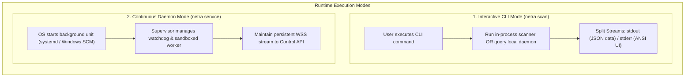

---

## 5. Endpoint Agent Internal Subsystems

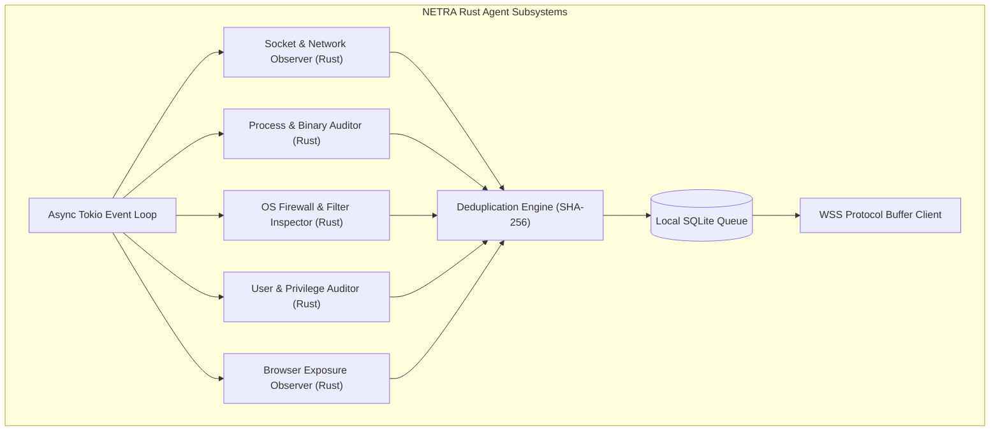

---

## 6. Local-First Data Architecture (SQLite Core)

To guarantee resilience during network partitions, the agent stores configuration, evidence, and pending sync batches locally in SQLite:

* **WAL Mode**: `PRAGMA journal_mode = WAL;` enables concurrent reads by the CLI while the worker daemon writes.
* **Bounded FIFO Queue**: If the host is offline, observations are queued locally up to 500MB, pruning resolved or low-priority items first.

---

## 7. Network Intelligence & Topology Architecture

NETRA correlates local network configuration across all enrolled endpoints without invasive port scanning:

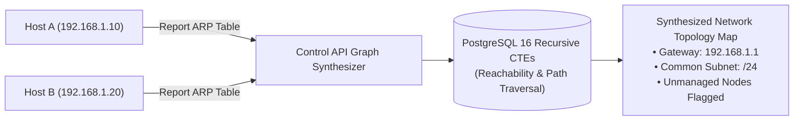

---

## 8. Browser & Web Exposure Observation Subsystem

Correlates OS network sockets with browser binaries to identify unauthorized external exposures:
* **Passive Correlation**: Reads OS socket tables (`GetExtendedTcpTable` / Netlink) in Rust and matches PID to known browser binaries.
* **Domain Resolution**: Uses OS DNS cache and TLS SNI headers observed at TCP connect time.
* **Academic Privacy Boundary**: Never inspects web page DOM, cookies, HTTP bodies, or user keystrokes.

---

## 9. Modular Vulnerability Intelligence Subsystem

Correlates installed software inventories with open vulnerability feeds:

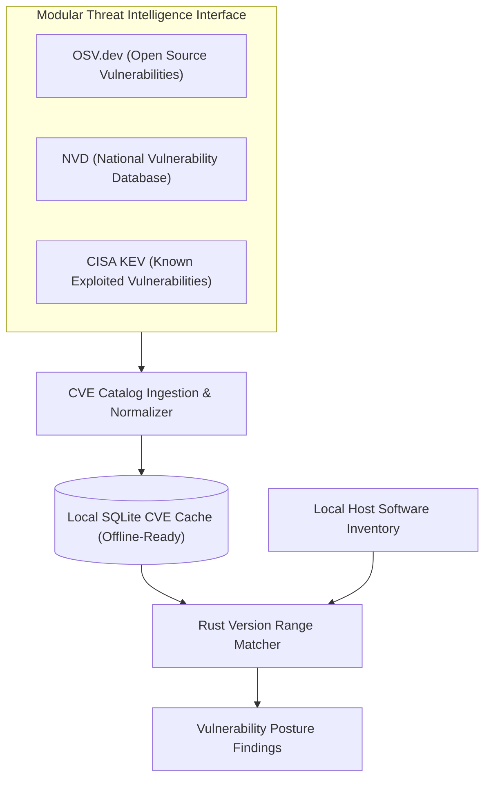

---

## 10. Policy & Controlled Remediation Architecture

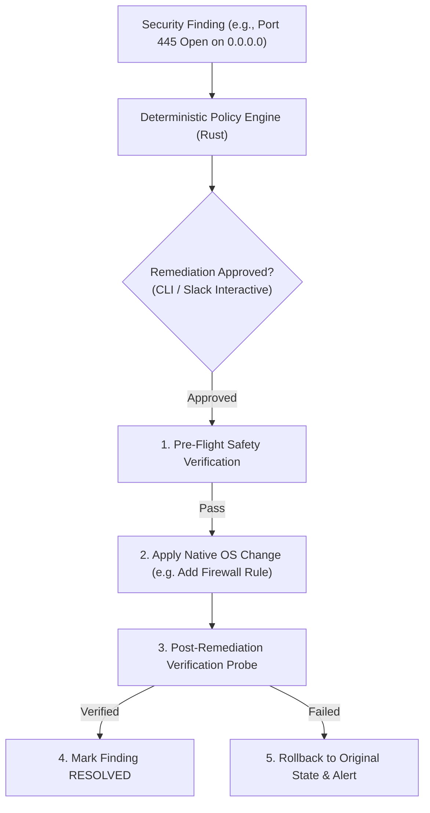

---

## 11. Control API & Supabase Coordination Layer

* **Supabase / PostgreSQL Core**: Serves as the central data store enforcing multi-tenant isolation via Row-Level Security (`SET LOCAL app.current_tenant_id`).
* **Architectural Decoupling**: Endpoints never connect directly to the database; all traffic routes through the authenticated Control API / WSS Gateway.

---

## 12. Cross-Platform OS Abstraction Layer

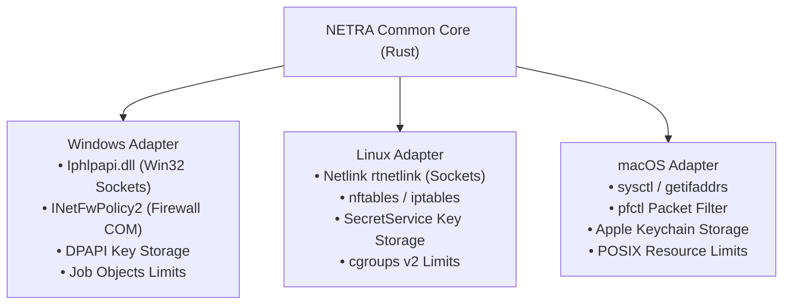

---

## 13. Supply Chain Security & TUF Update Model

* **Hermetic Compilation**: Fully reproducible Rust builds (`cargo build --release --locked`).
* **Artifact Provenance**: Syft generates CycloneDX/SPDX SBOMs; Cosign signs release binaries via GitHub OIDC.
* **Atomic Binary Updates**: Downloaded updates are verified against TUF signed manifests and swapped atomically on disk.

---

## 14. Security Trust, Data & Failure Boundaries

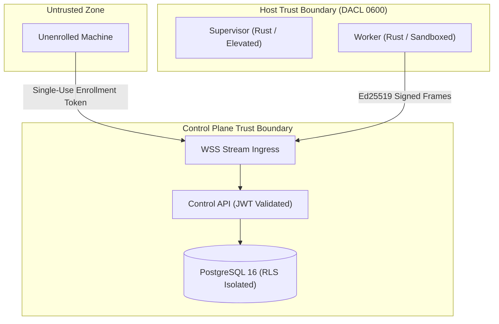

---

## 15. Architectural Decision Records (ADRs)

| ADR ID | Decision | Chosen Approach | Rejected Alternative | Core Rationale |
| :--- | :--- | :--- | :--- | :--- |
| **ADR-001** | Agent Implementation Language | **Rust (Rust 2021 Edition)** | Go, Python, C++ | Memory safety without garbage collection pauses, low memory (<15MB RAM), sub-millisecond cold start, native Win32/Netlink syscall bindings, and high concurrency via Tokio. |
| **ADR-002** | Device Transport Protocol | **Outbound WebSocket over TLS 1.3 (Protobuf)** | Inbound REST / gRPC | Traverses NAT gateways with zero open client firewall ports. Protobuf ensures minimal bandwidth. |
| **ADR-003** | Local State Management | **Local SQLite (WAL Mode via `rusqlite`)** | JSON files / Raw memory | ACID safety, WAL non-blocking concurrent reads, resilient offline buffering up to 500MB. |
| **ADR-004** | Topology & Reachability Graph | **PostgreSQL 16 Recursive CTEs** | Dedicated Neo4j Cluster | Sub-10ms graph path queries for under 50k nodes within existing ACID transaction boundary; zero dual-write operational overhead. |
| **ADR-005** | Third-Party Integrations | **Slack (Async Gateway) / Discord (Outbound Webhook)** | Discord as Primary Control Plane | Discord lacks enterprise RBAC and SSO. Positioned strictly as optional notification plugins. |
| **ADR-006** | Python Subsystem Scope | **Scoped Optional Extension Layer** | Python Monorepo / Python-First Runtime | Confines Python strictly to advisory LLM interfaces and research analytics; eliminates PyInstaller bloat and Python runtime crashes on endpoints. |
| **ADR-007** | Runtime Lifecycle Ownership | **Domain-Neutral Core (`netra-core::runtime`)** | CLI-Owned Runtime or Platform-Owned Runtime | Decouples lifecycle state orchestration from presentation (CLI) and OS syscalls (Platform). Enables uniform lifecycle management across interactive CLI, background daemon, and worker sandboxes without circular dependencies. |
