# NETRA — Comprehensive System Architecture & Design Principles

> **Overview**
>
> This document provides the master technical architecture for NETRA (Network & Endpoint Threat Reconnaissance Architecture). It establishes the core design principles, Rust-first systems foundations, local-first storage models, cloud coordination layers, browser exposure abstractions, and architectural decision records (ADRs) governing the platform.

**Status:** Specified / Designed  
**Audience:** System Architects, Rust Systems Developers, Security Researchers, Technical Contributors  
**Purpose:** Serves as the authoritative architectural reference for all NETRA engineering implementations and component interactions.

---

## Contents

1. [Architectural Principles & Academic Identity](#1-architectural-principles--academic-identity)
2. [High-Level System Topology](#2-high-level-system-topology)
3. [Rust-First Systems Core & Justified Python Boundary](#3-rust-first-systems-core--justified-python-boundary)
4. [Dual Runtime Architecture (Daemon vs. CLI)](#4-dual-runtime-architecture-daemon-vs-cli)
5. [Endpoint Agent Internal Subsystems](#5-endpoint-agent-internal-subsystems)
6. [Local-First Data Architecture (SQLite Core)](#6-local-first-data-architecture-sqlite-core)
7. [Network Intelligence & Topology Architecture](#7-network-intelligence--topology-architecture)
8. [Browser & Web Exposure Observation Subsystem](#8-browser--web-exposure-observation-subsystem)
9. [Modular Vulnerability Intelligence Subsystem](#9-modular-vulnerability-intelligence-subsystem)
10. [Policy & Controlled Remediation Architecture](#10-policy--controlled-remediation-architecture)
11. [Control API & Supabase Coordination Layer](#11-control-api--supabase-coordination-layer)
12. [Cross-Platform OS Abstraction Layer](#12-cross-platform-os-abstraction-layer)
13. [Supply Chain Security & TUF Update Model](#13-supply-chain-security--tuf-update-model)
14. [Security Trust, Data & Failure Boundaries](#14-security-trust-data--failure-boundaries)
15. [Architectural Decision Records (ADRs)](#15-architectural-decision-records-adrs)

---

## 1. Architectural Principles & Academic Identity

NETRA is an open-source academic research project developed to demonstrate robust defensive security engineering:

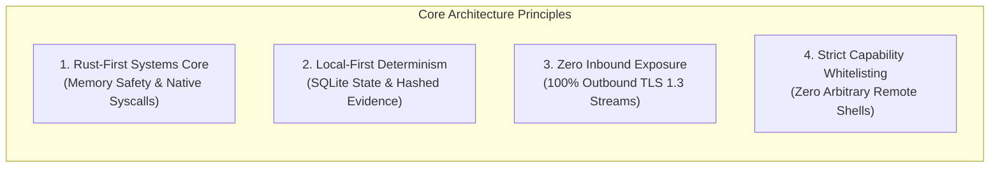

---

## 2. High-Level System Topology

```mermaid
flowchart TD
    subgraph Host["Monitored Endpoint Host (Windows / Linux / macOS)"]
        Supervisor["NETRA Tier-1 Supervisor Daemon<br/>(Least-Privilege Default / Watchdog / IPC Broker)"]
        Worker["NETRA Tier-2 Isolated Worker<br/>(Low-Privilege / Resource-Bounded)"]
        SQLite[("Local SQLite WAL DB<br/>(Encrypted State & FIFO Queue)")]
        CLI["netra CLI Tool (Rust / clap Launcher)"]
        
        Supervisor <-->|Authenticated Local IPC (0600 DACLs)| Worker
        Worker <--> SQLite
        CLI <-->|Local Query / IPC Relay| Supervisor
    end

    subgraph Cloud["Central Control Plane (Optional Cloud Coordination)"]
        WSS["Stream Gateway (WSS TLS 1.3 / Protobuf)"]
        API["Control API (REST / OpenAPI 3.1)"]
        Supa[("Supabase / PostgreSQL 16 Core<br/>(Row-Level Security / CTE Graph Engine)")]
        
        WSS <--> API
        API <--> Supa
    end

    subgraph Integrations["Integration Layer"]
        Slack["Slack Bot (Approval Gateway)"]
        Discord["Discord Webhook (Homelab Notifier)"]
    end

    Worker -->|Outbound WSS / Ed25519 Signed| WSS
    API --> Slack
    API --> Discord
```

---

## 3. Rust-First Systems Core & Crate Boundaries

NETRA enforces strict subsystem boundaries to prevent language proliferation and maintain optimal host efficiency:

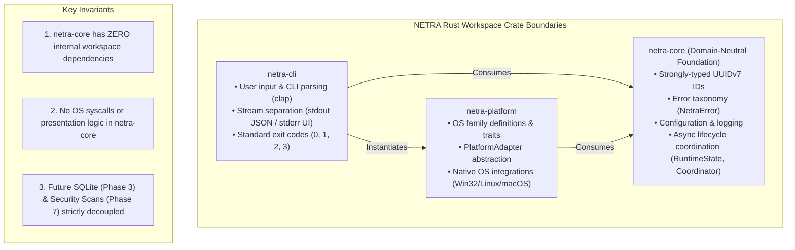

### Conceptual Architecture & Dependency Hierarchy

The conceptual dependency direction of the NETRA runtime is strictly unidirectional:

$$\mathbf{netra\text{-}cli} \;\longrightarrow\; \mathbf{netra\text{-}core} \;\longrightarrow\; \mathbf{runtime\;lifecycle} \;\longrightarrow\; \mathbf{platform\;abstraction}$$

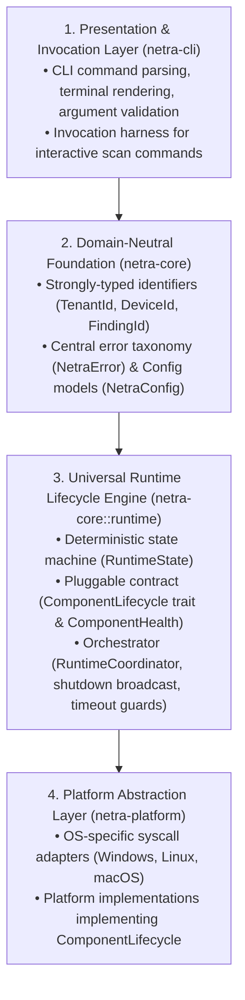

### Why Runtime Ownership Belongs in `netra-core`

1. **What `netra-core` Owns**:
   - **Canonical Lifecycle State Machine**: The mathematical `RuntimeState` enum (`Created`, `Initializing`, `Ready`, `Running`, `Degraded`, `Stopping`, `Stopped`, `Failed`) and its deterministic transition validation rules.
   - **Pluggable Subsystem Contract**: The `ComponentLifecycle` trait (`initialize()`, `start()`, `stop()`, `health()`, `is_critical()`) and `ComponentHealth` enum.
   - **Asynchronous Lifecycle Coordinator**: `RuntimeCoordinator`, which manages component registration, serial startup, health aggregation, broadcast shutdown signaling, and graceful reverse teardown with timeout guards.
   - **Universal Domain Primitives**: Strongly-typed UUIDv7 identifiers, unified error models (`NetraError`), configuration (`NetraConfig`), and structured logging (`init_logging`).

2. **What `netra-core` Deliberately Does NOT Own**:
   - **Operating System Syscalls**: Win32 API calls (`Iphlpapi.dll`, DPAPI), Linux Netlink sockets, or macOS `sysctl` routines (strictly owned by `netra-platform`).
   - **CLI Presentation & Arguments**: Terminal argument parsing (`clap`), ANSI formatting, stream splitting (`stdout` data vs. `stderr` human UI), and POSIX exit codes (strictly owned by `netra-cli`).
   - **Process Supervision & OS Daemon Units**: Service Control Manager, systemd slices, launchd daemons, Job Objects, cgroups sandboxing, and local IPC sockets (strictly owned by Phase 2.3 daemon).
   - **Concrete Scanner Implementations**: Socket probes, process monitors, and firewall rule inspectors (strictly owned by Phase 7 scanners).

3. **Why `netra-cli` Does NOT Own the Runtime Lifecycle or Supervisor Daemon**:
   - `netra-cli` is merely a user-facing invocation frontend and CLI presentation harness (parsing arguments, splitting `stdout`/`stderr`, formatting JSON/ANSI).
   - `netra-core` owns the domain-neutral runtime state machine, lifecycle contracts, IPC message definitions, and watchdog policies.
   - `netra-platform` owns the native OS transport implementations (Named Pipes / Unix Domain Sockets) and resource isolation handles (Job Objects, cgroups/setrlimit).
   - The CLI crate remains lightweight and delegates service startup to the underlying core/platform layers rather than bloating the CLI binary into a monolithic daemon.

4. **Why OS-Specific Implementations Do NOT Own the Runtime Lifecycle**:
   - Operating system APIs vary drastically across Windows, Linux, and macOS, but lifecycle orchestration (initialization, healthy operation, degradation, reverse teardown) is 100% platform-invariant.
   - Placing the coordinator in `netra-platform` would pollute the platform abstraction layer with domain-level orchestration logic and force circular dependencies when domain components need to be coordinated.
   - Instead, platform adapters in `netra-platform` simply implement `ComponentLifecycle` as pluggable subsystems and register into the core coordinator.

5. **How Future Subsystems Plug Into the Runtime**:
   - Any future subsystem (e.g., Local SQLite Database in Phase 3, Local IPC Gateway in Phase 2.3, WSS Streamer in Phase 6, Network Scanner in Phase 7, CVE Matcher in Phase 10) implements the `ComponentLifecycle` trait.
   - Subsystems register into `RuntimeCoordinator` via `coordinator.register_component(Arc::new(subsystem))`.
   - The coordinator manages initialization, health aggregation, and reverse graceful teardown without requiring any subsystem-specific knowledge in `netra-core`.

### Least-Privilege Separation & Isolation Boundary

NETRA enforces the fundamental security principle: **Start with minimum privilege necessary and elevate only where a specific capability genuinely requires it.**

```mermaid
flowchart TD
    subgraph Tier1["Tier-1 Supervisor (Least-Privilege by Default)"]
        S1["Watchdog Monitoring & Process Health"]
        S2["Local IPC Server (0600 DACLs / Peer Auth)"]
        S3["Child Process Lifecycle Management"]
        S4["Resource Limitation Enforcement (Job Objects / cgroups)"]
    end

    subgraph Tier2["Tier-2 Worker (Unprivileged Userspace)"]
        W1["Async Tokio Event Loop & Task Schedulers"]
        W2["Local Rule Evaluation Engine"]
        W3["Local SQLite State Buffering"]
        W4["Outbound TLS 1.3 Streaming (Phase 6)"]
    end

    subgraph PrivHelpers["Future Privileged Isolation (Phases 7 & 12)"]
        H1["Narrowly Scoped Capability Helpers"]
        H2["Kernel Firewall Rules (INetFwPolicy2 / nftables)"]
        H3["Full Cross-User Socket Inspection"]
    end

    Tier1 <-->|Length-Delimited Authenticated IPC| Tier2
    Tier1 -.->|On-Demand Elevation (Optional)| PrivHelpers
```

#### Privilege Responsibility Breakdown

| Operation / Subsystem | Privilege Required | Execution Context | Behavior When Unprivileged |
| :--- | :--- | :--- | :--- |
| **Supervisor Watchdog & Lifecycle** | **None** (Standard User) | Tier-1 Supervisor | Runs seamlessly in user context or user daemon session |
| **Worker Process Spawning** | **None** (Standard User) | Tier-1 Supervisor | Spawns standard user child process |
| **Local IPC (Named Pipes / Sockets)** | **None** (User-scoped DACL) | Supervisor $\leftrightarrow$ Worker | Creates user-owned pipe or `$XDG_RUNTIME_DIR` socket with `0600` permissions |
| **Resource Limitation (Job Objects)** | **None** (Standard User on Windows) | Platform Sandbox | Windows allows standard users to assign Job Objects to own child processes |
| **Resource Limitation (POSIX rlimit)** | **None** (Standard User on Unix) | Platform Sandbox | Lowering resource limits requires zero root privileges |
| **Local SQLite WAL Access** | **None** (User Filesystem) | Tier-2 Worker | Stores database in user-writable `%LOCALAPPDATA%` or `~/.local/share/netra` |
| **Full Cross-User Socket-to-PID Mapping** | Elevated (Admin / Root / CAP_NET_ADMIN) | Phase 7 Scanner | Gracefully degrades to own-process socket inspection |
| **Host Firewall Profile Remediation** | Elevated (Admin / Root) | Phase 12 Remediation | Pre-flight check rejects write actions; returns `ELEVATION_REQUIRED` error |

#### Terminology: Process & Resource Isolation vs. Full Sandboxing

To maintain strict scientific and security accuracy, NETRA distinguishes between tiers of process containment:

1. **Resource Limitation (`IMPLEMENTED IN PHASE 2.3`)**: Bounding CPU quotas and memory ceilings via Windows Job Objects, Linux cgroups v2, or POSIX `setrlimit`.
2. **Process Lifecycle Isolation (`IMPLEMENTED IN PHASE 2.3`)**: Preventing orphan processes and zombies via `JOB_OBJECT_LIMIT_KILL_ON_JOB_CLOSE`, `prctl(PR_SET_PDEATHSIG)`, and IPC disconnection watchdogs.
3. **Privilege Reduction (`IMPLEMENTED IN PHASE 2.3`)**: Running the worker under an unprivileged user token or standard user context with restricted tokens.
4. **Transport Access Enforcement (`IMPLEMENTED IN PHASE 2.3`)**: Strict OS DACLs (`0600`) and peer credential verification preventing unauthorized local process IPC connections.
5. **Filesystem Isolation (`DEFERRED`)**: Restricting disk read/write paths via namespaces/chroot/AppContainer (deferred to future hardening).
6. **Syscall Filtering (`DEFERRED`)**: Restricting kernel syscalls via seccomp-bpf or macOS Seatbelt profiles (deferred to Phase 14).
7. **Full Sandboxing (`DEFERRED`)**: Comprehensive multi-layer sandbox equivalent to browser isolation engines.

---

## 4. Dual Runtime Architecture & Lifecycle State Machine

NETRA decouples interactive analysis from continuous monitoring using a unified Rust binary orchestrated by the core `RuntimeCoordinator`:

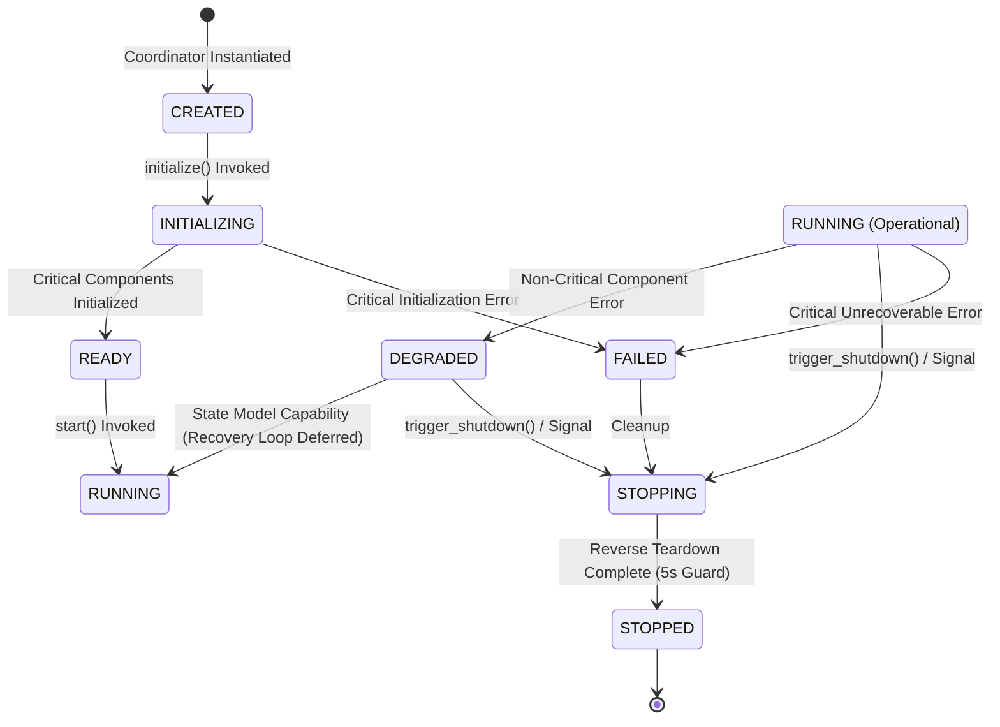

### Dual Runtime Execution Modes & Privilege Strategy

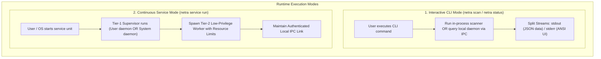

---

## 5. Endpoint Agent Internal Subsystems

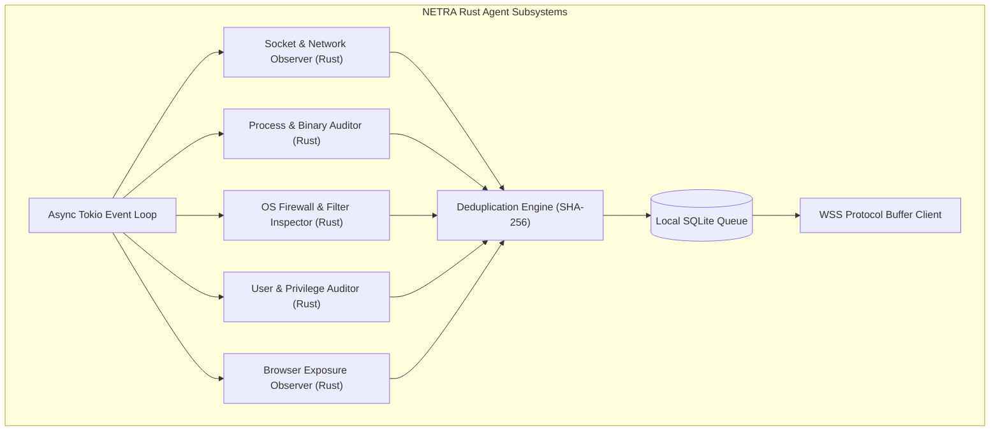

---

## 6. Local-First Data Architecture (SQLite Core)

### Foundational Architectural Invariant
Future NETRA security observations, posture findings, and configuration states that require durable local persistence must pass through the local storage boundary before external synchronization:

* **Embedded SQLite Engine**: Statically embeds **SQLite 3.48.0** via **`rusqlite` (v0.33.0)** (`bundled` feature) with zero external C library dependencies.
* **WAL Mode & Rigorous Durability Semantics**: `PRAGMA journal_mode = WAL;` and `PRAGMA synchronous = NORMAL;`. Under SQLite's documented guarantees: Process crashes recover all committed WAL transactions. OS crashes or sudden power loss may lose recent commits since the last sync/checkpoint while structural b-tree consistency is maintained. Durability is weaker than `FULL` in exchange for eliminating SSD write amplification.
* **Segregated Handle Model**: Segregated writer and reader connection handles wrapped in `netra-core::storage::DatabaseEngine` and dispatched onto Tokio's blocking thread pool.
* **Storage Memory Budget**: SQLite page cache is capped at ~2MB per connection handle (`PRAGMA cache_size = -2000`). Whole-process memory benchmarking and validation under load are assigned to Phase 16.
* **Atomic Clean-Shutdown Marker Protocol**: `.runtime_active` tracks process session ownership; `.clean_shutdown` is written atomically only after handle closure and checkpoint completion, ensuring crash detection and multi-instance safety.
* **Bounded Shutdown Checkpointing**: WAL checkpoints during shutdown are wrapped in an external 1,000ms Tokio timeout with passive fallback, ensuring database teardown never blocks the global 5,000ms shutdown ceiling.
* **State-Aware Retention & Saturation Controls**: Configurable 500MB storage ceiling. Proactively prunes acknowledged records at 85% capacity, reserves the top 5% for critical finding updates at 95%, and halts non-critical enqueues in read-only degraded mode at 100% saturation while strictly protecting `QUEUED` observations and `OPEN` findings.
* **Quarantine Directory Protocol**: If corruption is detected, all connections are closed and database files are safely isolated into a dedicated `quarantine_<TIMESTAMP>/` directory with SHA-256 hashes recorded in `quarantine_meta.json` without automated destructive wiping.

---

## 7. Network Intelligence & Topology Architecture

NETRA correlates local network configuration across all enrolled endpoints without invasive port scanning:

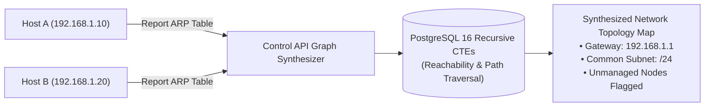

---

## 8. Browser & Web Exposure Observation Subsystem

Correlates OS network sockets with browser binaries to identify unauthorized external exposures:
* **Passive Correlation**: Reads OS socket tables (`GetExtendedTcpTable` / Netlink) in Rust and matches PID to known browser binaries.
* **Domain Resolution**: Uses OS DNS cache and TLS SNI headers observed at TCP connect time.
* **Academic Privacy Boundary**: Never inspects web page DOM, cookies, HTTP bodies, or user keystrokes.

---

## 9. Modular Vulnerability Intelligence Subsystem

Correlates installed software inventories with open vulnerability feeds:

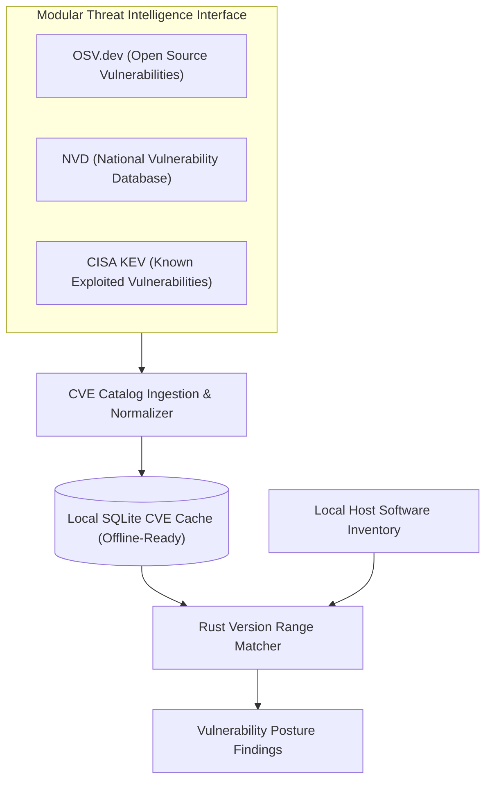

---

## 10. Policy & Controlled Remediation Architecture

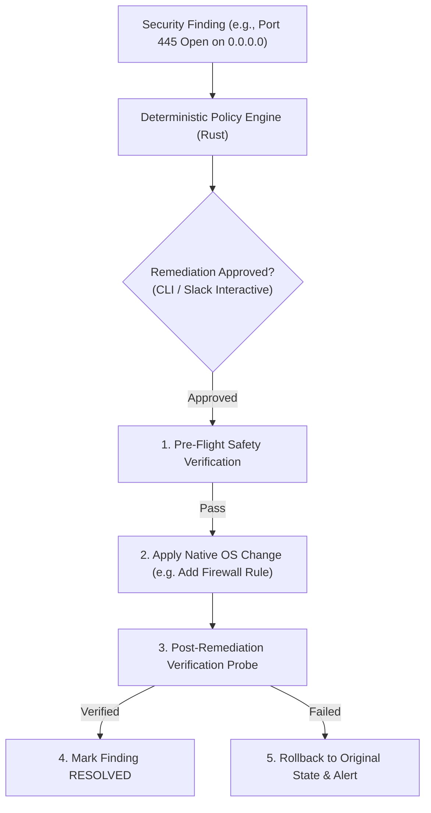

---

## 11. Control API & Supabase Coordination Layer

* **Supabase / PostgreSQL Core**: Serves as the central data store enforcing multi-tenant isolation via Row-Level Security (`SET LOCAL app.current_tenant_id`).
* **Architectural Decoupling**: Endpoints never connect directly to the database; all traffic routes through the authenticated Control API / WSS Gateway.

---

## 12. Cross-Platform OS Abstraction Layer

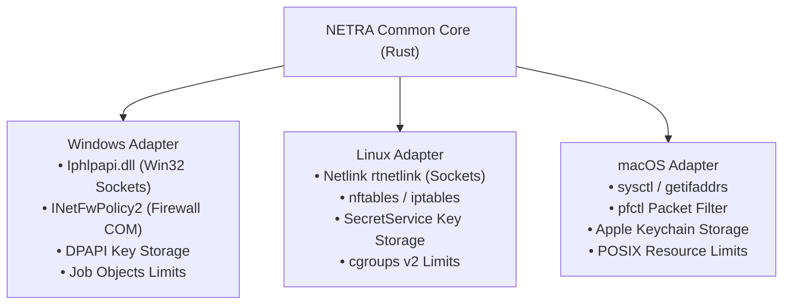

---

## 13. Supply Chain Security & TUF Update Model

* **Hermetic Compilation**: Fully reproducible Rust builds (`cargo build --release --locked`).
* **Artifact Provenance**: Syft generates CycloneDX/SPDX SBOMs; Cosign signs release binaries via GitHub OIDC.
* **Atomic Binary Updates**: Downloaded updates are verified against TUF signed manifests and swapped atomically on disk.

---

## 14. Security Trust, Data & Failure Boundaries

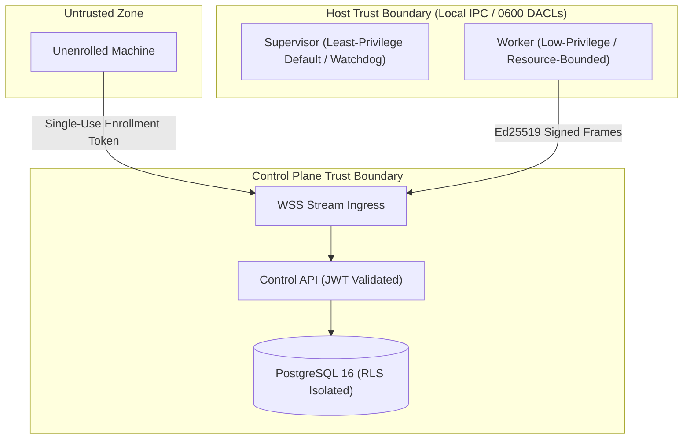

---

## 15. Architectural Decision Records (ADRs)

| ADR ID | Decision | Chosen Approach | Rejected Alternative | Core Rationale |
| :--- | :--- | :--- | :--- | :--- |
| **ADR-001** | Agent Implementation Language | **Rust (Rust 2021 Edition)** | Go, Python, C++ | Memory safety without garbage collection pauses, low memory (<15MB RAM), sub-millisecond cold start, native Win32/Netlink syscall bindings, and high concurrency via Tokio. |
| **ADR-002** | Device Transport Protocol | **Outbound WebSocket over TLS 1.3 (Protobuf)** | Inbound REST / gRPC | Traverses NAT gateways with zero open client firewall ports. Protobuf ensures minimal bandwidth. |
| **ADR-003** | Local State Management | **Local SQLite (WAL Mode via `rusqlite`)** | JSON files / Raw memory | ACID safety, WAL non-blocking concurrent reads, resilient offline buffering up to 500MB. |
| **ADR-004** | Topology & Reachability Graph | **PostgreSQL 16 Recursive CTEs** | Dedicated Neo4j Cluster | Sub-10ms graph path queries for under 50k nodes within existing ACID transaction boundary; zero dual-write operational overhead. |
| **ADR-005** | Third-Party Integrations | **Slack (Async Gateway) / Discord (Outbound Webhook)** | Discord as Primary Control Plane | Discord lacks enterprise RBAC and SSO. Positioned strictly as optional notification plugins. |
| **ADR-006** | Python Subsystem Scope | **Scoped Optional Extension Layer** | Python Monorepo / Python-First Runtime | Confines Python strictly to advisory LLM interfaces and research analytics; eliminates PyInstaller bloat and Python runtime crashes on endpoints. |
| **ADR-007** | Runtime Lifecycle Ownership | **Domain-Neutral Core (`netra-core::runtime`)** | CLI-Owned Runtime or Platform-Owned Runtime | Decouples lifecycle state orchestration from presentation (CLI) and OS syscalls (Platform). Enables uniform lifecycle management across interactive CLI, background daemon, and worker sandboxes without circular dependencies. |
| **ADR-008** | Privilege Separation & Least-Privilege by Default | **Least-Privilege Execution with Graceful Degradation** | Monolithic Elevated Daemon (Always SYSTEM / root) | Minimizes attack surface. The supervisor and worker execute under standard user privileges by default, applying OS resource limits without requiring administrator rights. Privileged capabilities are isolated to narrowly scoped helpers in later phases. |
| **ADR-009** | Local IPC Wire Protocol & Mutual Authentication | **Length-Delimited JSON over Named Pipes / UDS with Dual-Gated Auth** | Plain Unauthenticated Pipes / HTTP on Localhost | Avoids opening TCP ports on localhost. Combines kernel-level peer PID/UID verification (`SO_PEERCRED` / `GetNamedPipeClientProcessId`) with ephemeral 256-bit secret tokens to guarantee tamper-proof local IPC. |

