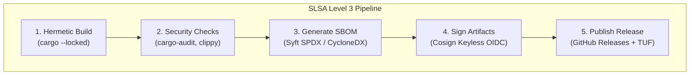
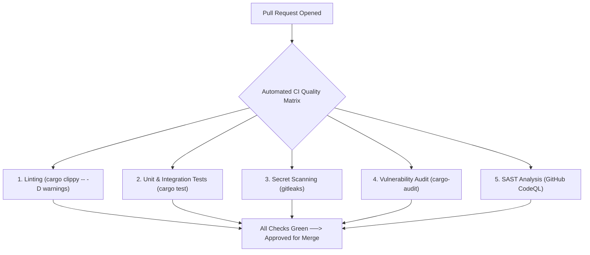
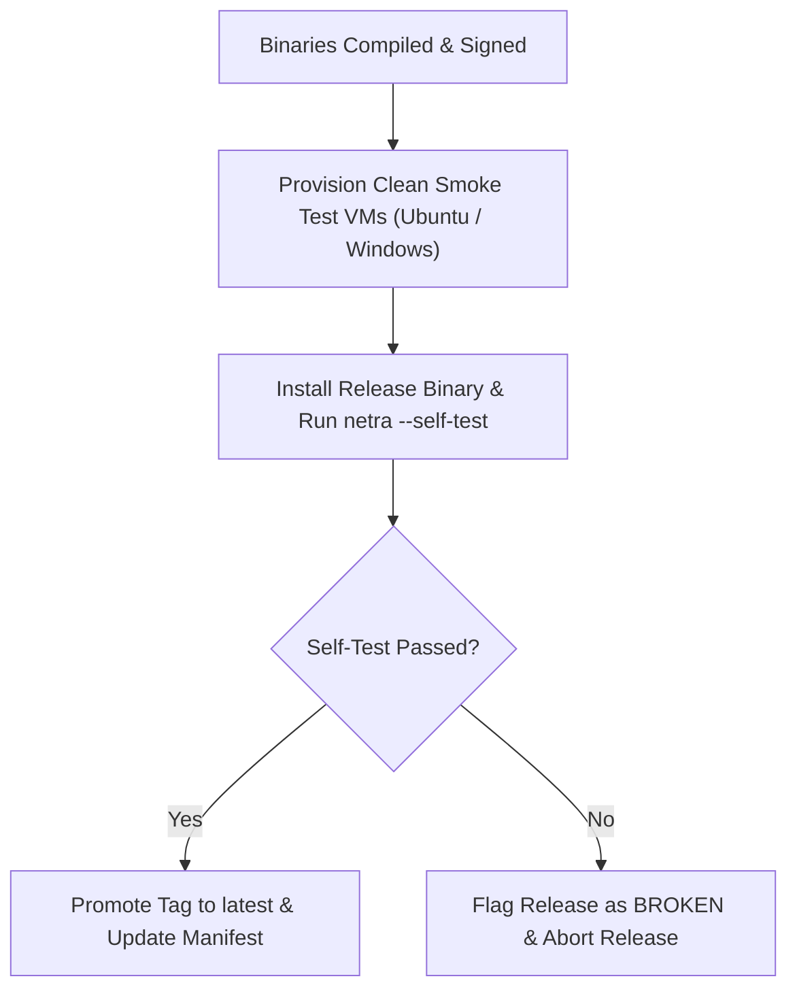

# NETRA — CI/CD Automation & Supply Chain Security Framework

> **Overview**
>
> This document details the continuous integration, reproducible Rust build pipelines, static security analysis, Software Bill of Materials (SBOM) generation, and cryptographic release signing workflows for NETRA (Network & Endpoint Threat Reconnaissance Architecture).

**Status:** Specified / Designed  
**Audience:** DevOps Engineers, Rust Maintainers, Release Engineers, Academic Auditors  
**Purpose:** Establishes the automated verification framework ensuring that all released Rust binaries maintain verified supply chain integrity (SLSA Level 3).

---

## Contents

1. [CI/CD Philosophy & Supply Chain Posture](#1-cicd-philosophy--supply-chain-posture)
2. [Pull Request Quality Gates & Automated Scans](#2-pull-request-quality-gates--automated-scans)
3. [Hermetic Rust Build & Multi-Architecture Compilation](#3-hermetic-rust-build--multi-architecture-compilation)
4. [Automated Security Scanners (Clippy, Cargo-Audit, CodeQL)](#4-automated-security-scanners-clippy-cargo-audit-codeql)
5. [Software Bill of Materials (SBOM) Generation](#5-software-bill-of-materials-sbom-generation)
6. [Cryptographic Artifact Signing (Cosign / Sigstore)](#6-cryptographic-artifact-signing-cosign--sigstore)
7. [GitHub Actions Release Pipeline Architecture](#7-github-actions-release-pipeline-architecture)
8. [Release Verification & Automated Smoke Testing](#8-release-verification--automated-smoke-testing)

---

## 1. CI/CD Philosophy & Supply Chain Posture

NETRA enforces strict **Supply-chain Levels for Software Artifacts (SLSA Level 3)** compliance for its Rust codebase:



---

## 2. Pull Request Quality Gates & Automated Scans

Every Pull Request must pass mandatory automated checks before merging into `main`:



---

## 3. Hermetic Rust Build & Multi-Architecture Compilation

```bash
# Matrix Build Targets:
# Linux AMD64 (Static Musl)
cargo build --release --locked --target x86_64-unknown-linux-musl

# Linux ARM64 (Static Musl)
cargo build --release --locked --target aarch64-unknown-linux-musl

# Windows AMD64
cargo build --release --locked --target x86_64-pc-windows-msvc

# macOS Universal (Apple Silicon + Intel)
cargo build --release --locked --target aarch64-apple-darwin
cargo build --release --locked --target x86_64-apple-darwin
lipo -create -output dist/netra-darwin-universal \
  target/aarch64-apple-darwin/release/netra \
  target/x86_64-apple-darwin/release/netra
```

---

## 4. Automated Security Scanners

1. **`cargo-audit`**: Audits transitive Rust dependencies in `Cargo.lock` against the RustSec Advisory Database.
2. **`cargo-deny`**: Verifies crate licensing compliance (Apache 2.0 / MIT) and prohibits duplicate dependencies.
3. **`gitleaks`**: Scans the git commit history to prevent accidental leakage of private keys or credentials.
4. **`codeql`**: Performs semantic static application security testing (SAST) to detect logic flaws.

---

## 5. Software Bill of Materials (SBOM) Generation

During each release build, an authoritative SBOM is generated using `syft`:

```bash
# Generate SBOM in CycloneDX and SPDX formats
syft packages dir:target/release/ -o cyclonedx-json=dist/netra-sbom.cyclonedx.json
syft packages dir:target/release/ -o spdx-json=dist/netra-sbom.spdx.json
```

---

## 6. Cryptographic Artifact Signing (Cosign / Sigstore)

Release artifacts and container images are cryptographically signed using **Cosign** via GitHub Actions OIDC:

```bash
cosign sign-blob \
  --yes \
  --output-signature dist/netra-linux-amd64.sig \
  --output-certificate dist/netra-linux-amd64.pem \
  dist/netra-linux-amd64
```

---

## 7. GitHub Actions Release Pipeline Architecture

```yaml
name: Release Pipeline
on:
  push:
    tags:
      - 'v*'

jobs:
  build-and-release:
    runs-on: ubuntu-latest
    permissions:
      contents: write
      id-token: write
    steps:
      - uses: actions/checkout@v4
      - uses: dtolnay/rust-toolchain@stable
        with:
          targets: x86_64-unknown-linux-musl, aarch64-unknown-linux-musl
      - name: Build Static Release Binaries
        run: cargo build --release --locked
      - name: Generate SBOM
        uses: anchore/sbom-action@v0
        with:
          path: target/release/
      - name: Sign Binaries with Cosign
        uses: sigstore/cosign-installer@v3
      - name: Create GitHub Release
        uses: softprops/action-gh-release@v2
        with:
          files: target/release/netra*
```

---

## 8. Release Verification & Automated Smoke Testing


