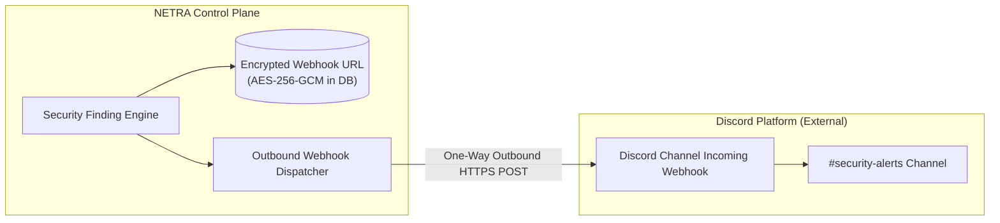
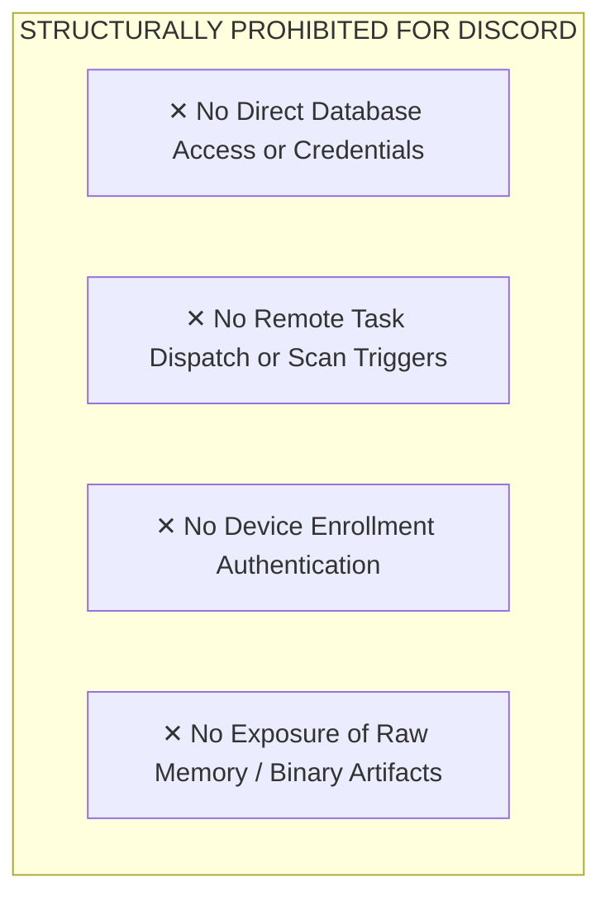

# NETRA — Discord Integration & Homelab Notifier Architecture

> **Overview**
>
> This document specifies the optional Discord integration for NETRA (Network & Endpoint Threat Reconnaissance Architecture). It defines the one-way webhook egress architecture, embed schemas, security restrictions, and architectural demotion rationale from the core control plane.

**Status:** Specified / Designed  
**Audience:** Homelab Maintainers, Community Developers, Security Researchers  
**Purpose:** Establishes the technical boundaries for dispatching informational notifications to personal Discord servers without introducing security liabilities into the core architecture.

---

## Contents

1. [Integration Role & Demotion Rationale](#1-integration-role--demotion-rationale)
2. [Supported Use Cases](#2-supported-use-cases)
3. [Discord Webhook Architecture & Security Boundary](#3-discord-webhook-architecture--security-boundary)
4. [Discord Webhook Embed Schema](#4-discord-webhook-embed-schema)
5. [What Discord MUST NOT Control](#5-what-discord-must-not-control)

---

## 1. Integration Role & Demotion Rationale

In legacy prototypes, Discord was mistakenly utilized as an interactive control plane. In the new NETRA architecture, Discord has been **formally demoted to an Optional Outbound Webhook Notifier**:
* **Why Demoted**: Discord lacks enterprise RBAC, enforces 2,000-character message limits, introduces third-party token leakage risks, and cannot operate in air-gapped academic networks.
* **New Role**: Maintained purely as an optional webhook egress for homelab enthusiasts and student researchers.

---

## 2. Supported Use Cases

1. **Homelab Finding Alerts**: Push real-time finding notifications to a personal Discord server channel via a standard incoming webhook URL.
2. **Weekly Lab Digest**: Post a formatted summary of homelab device health and open findings.

---

## 3. Discord Webhook Architecture & Security Boundary



---

## 4. Discord Webhook Embed Schema

```json
{
  "username": "NETRA Security Notifier",
  "avatar_url": "https://netra.io/assets/netra-icon.png",
  "embeds": [
    {
      "title": "🛡️ NETRA Alert: Insecure Listening Port Discovered",
      "description": "An unauthorized service was discovered listening on an external interface.",
      "color": 15158332,
      "fields": [
        { "name": "Host", "value": "`homelab-server-01`", "inline": true },
        { "name": "Severity", "value": "HIGH", "inline": true },
        { "name": "Service", "value": "Redis (Port 6379)", "inline": true },
        { "name": "Remediation", "value": "Bind Redis to `127.0.0.1` or enable UFW firewall rule." }
      ],
      "footer": { "text": "NETRA Academic Edition • v1.0.0" },
      "timestamp": "2026-08-24T12:30:00Z"
    }
  ]
}
```

---

## 5. What Discord MUST NOT Control


