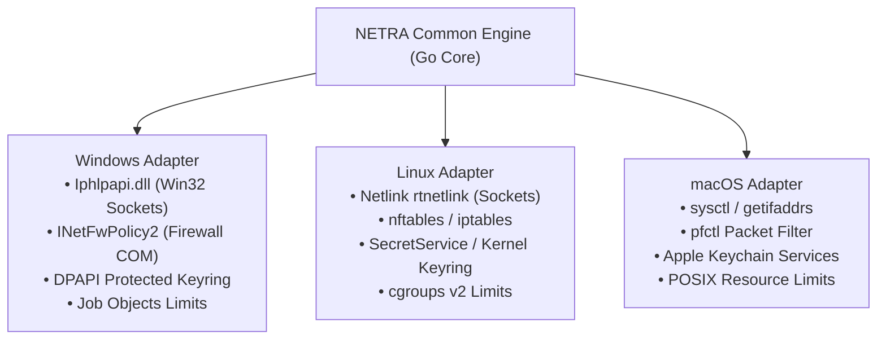
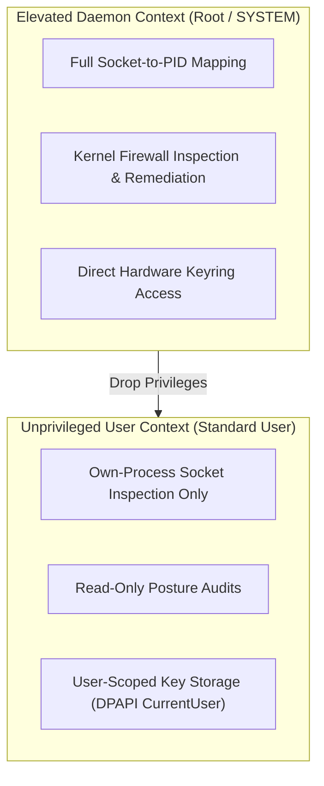

# NETRA — Cross-Platform Operating System Versatility & Adapters

> **Overview**
>
> This document details the multi-platform abstraction layer of NETRA (Network & Endpoint Threat Reconnaissance Architecture). It defines native kernel syscall mappings, credential vault integrations, firewall APIs, resource sandboxes, and graceful privilege degradation across Windows, Linux, and macOS.

**Status:** Specified / Designed  
**Audience:** Systems Developers, OS Integration Engineers, Security Researchers  
**Purpose:** Serves as the implementation specification for native operating system adapters, ensuring consistent behavior across diverse platform architectures.

---

## Contents

1. [Cross-Platform Engineering Strategy](#1-cross-platform-engineering-strategy)
2. [OS Adapter Abstraction Interface](#2-os-adapter-abstraction-interface)
3. [Windows Native Syscall Adapter](#3-windows-native-syscall-adapter)
4. [Linux Native Syscall & Netlink Adapter](#4-linux-native-syscall--netlink-adapter)
5. [macOS Native Sysctl & BSD Socket Adapter](#5-macos-native-sysctl--bsd-socket-adapter)
6. [Cross-Platform Capability Matrix](#6-cross-platform-capability-matrix)
7. [Privilege Scopes & Graceful Degradation Hierarchy](#7-privilege-scopes--graceful-degradation-hierarchy)
8. [Packaging, Packaging Matrices & Binary Formats](#8-packaging-packaging-matrices--binary-formats)

---

## 1. Cross-Platform Engineering Strategy

NETRA avoids brittle CLI subprocess text-scraping (such as parsing `netsh` or `ufw` output). Instead, it communicates directly with native OS kernel APIs and dynamic libraries:



---

## 2. OS Adapter Abstraction Interface

Every platform adapter implements the common Go `OSAdapter` interface:

```go
type OSAdapter interface {
    GetListeningSockets(ctx context.Context) ([]SocketInfo, error)
    GetRunningProcesses(ctx context.Context) ([]ProcessInfo, error)
    GetFirewallStatus(ctx context.Context) (*FirewallProfile, error)
    GetRoutingAndARPTable(ctx context.Context) (*NetworkTopologyRaw, error)
    GetInstalledPackages(ctx context.Context) ([]PackageInfo, error)
    StoreSecureKey(keyID string, secret []byte) error
    RetrieveSecureKey(keyID string) ([]byte, error)
    ApplyRemediation(action RemediationAction) error
}
```

---

## 3. Windows Native Syscall Adapter

* **Socket & TCP Table**: Direct invocation of `GetExtendedTcpTable` and `GetExtendedUdpTable` from `Iphlpapi.dll`.
* **Firewall Management**: Windows COM automation via `INetFwPolicy2` interface (Domain, Private, Public profiles).
* **Hardware-Protected Storage**: Windows DPAPI (`CryptProtectData` / `CryptUnprotectData`).
* **Resource Sandboxing**: Binds worker process to a Win32 **Job Object** (`JOB_OBJECT_LIMIT_PROCESS_MEMORY`, `JOB_OBJECT_CPU_RATE_CONTROL`).

---

## 4. Linux Native Syscall & Netlink Adapter

* **Socket & Routing Extraction**: High-performance **Netlink (`rtnetlink`, `inet_diag`)** sockets via pure Go bindings, falling back to `/proc/net/tcp` and `/proc/net/udp`.
* **Firewall Verification**: Native Netfilter (`nftables` / `iptables`) libmnl communication.
* **Key Storage**: Freedesktop SecretService API or `0400` root-owned key vault in `/etc/netra/keys/`.
* **Resource Sandboxing**: Bounded via **systemd slice / `cgroups v2`** (`CPUQuota=20%`, `MemoryMax=100M`).

---

## 5. macOS Native Sysctl & BSD Socket Adapter

* **Socket & Process Table**: Queries via `sysctl` (`KERN_PROC`), `getifaddrs`, and BSD routing sockets.
* **Firewall Verification**: Inspects macOS Packet Filter (`pfctl -s info`).
* **Key Storage**: Apple System Keychain via `SecItemAdd` and `SecItemCopyMatching`.

---

## 6. Cross-Platform Capability Matrix

| Capability | Windows (Win32/COM) | Linux (Netlink/cgroups) | macOS (sysctl/Keychain) |
| :--- | :--- | :--- | :--- |
| **`SCAN_NETWORK`** | ★ Full Native Support | ★ Full Native Support | ★ Full Native Support |
| **`SCAN_PROCESSES`** | ★ Full Native Support | ★ Full Native Support | ★ Full Native Support |
| **`SCAN_FIREWALL`** | ★ `INetFwPolicy2` COM | ★ `nftables` / `iptables` | ★ `pfctl` Inspection |
| **`OBSERVE_TOPOLOGY`** | ★ `GetIpNetTable2` | ★ `ip neigh` / Netlink | ★ `sysctl` Routing Socket |
| **`BROWSER_EXPOSURE`** | ★ Full Native Support | ★ Full Native Support | ★ Full Native Support |
| **`SECURE_KEYRING`** | ★ Windows DPAPI | ★ SecretService API | ★ Apple Keychain |
| **`AUTO_UPDATE`** | ★ Atomic Renaming | ★ Systemd Unit Swap | ★ Launchd Daemon Swap |

---

## 7. Privilege Scopes & Graceful Degradation Hierarchy



---

## 8. Packaging, Packaging Matrices & Binary Formats

* **Windows**: Single static `.exe` binary, optional MSI installer with Windows Service registration.
* **Linux**: Single static `.tar.gz` binary, `.deb` package (Debian/Ubuntu), `.rpm` package (RHEL/Fedora).
* **macOS**: Universal Mach-O binary (Apple Silicon + Intel) with Launchd daemon plist.
