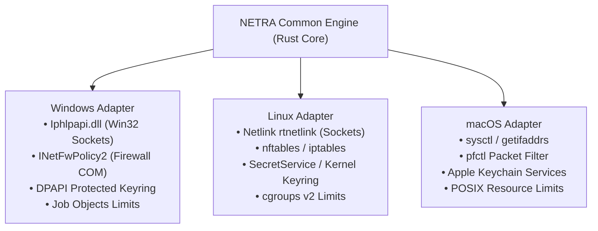
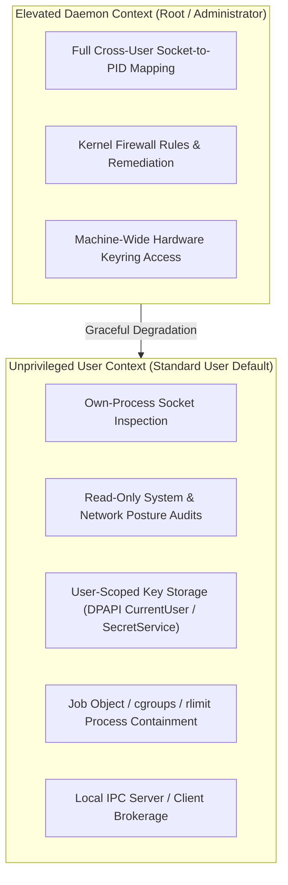
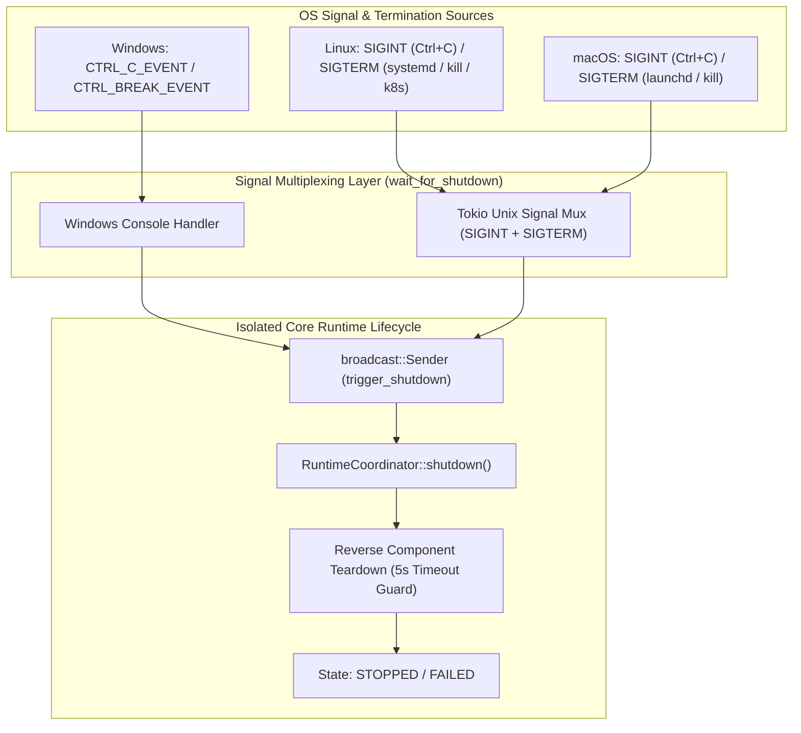

# NETRA — Cross-Platform Operating System Versatility & Adapters

> **Overview**
>
> This document details the multi-platform abstraction layer of NETRA (Network & Endpoint Threat Reconnaissance Architecture). It defines native kernel syscall mappings, credential vault integrations, firewall APIs, resource sandboxes, and graceful privilege degradation across Windows, Linux, and macOS using native Rust crates.

**Status:** Specified / Designed  
**Audience:** Systems Developers, OS Integration Engineers, Rust Engineers, Security Researchers  
**Purpose:** Serves as the implementation specification for native operating system adapters, ensuring consistent behavior across diverse platform architectures.

---

## Contents

1. [Cross-Platform Engineering Strategy](#1-cross-platform-engineering-strategy)
2. [OS Adapter Abstraction Trait (Rust)](#2-os-adapter-abstraction-trait-rust)
3. [Windows Native Syscall Adapter (`windows-sys`)](#3-windows-native-syscall-adapter-windows-sys)
4. [Linux Native Syscall & Netlink Adapter (`nix` / `netlink`)](#4-linux-native-syscall--netlink-adapter-nix--netlink)
5. [macOS Native Sysctl & BSD Socket Adapter](#5-macos-native-sysctl--bsd-socket-adapter)
6. [Cross-Platform Capability Matrix](#6-cross-platform-capability-matrix)
7. [Privilege Scopes & Graceful Degradation Hierarchy](#7-privilege-scopes--graceful-degradation-hierarchy)
8. [Packaging, Packaging Matrices & Binary Formats](#8-packaging-packaging-matrices--binary-formats)

---

## 1. Cross-Platform Engineering Strategy

NETRA avoids brittle CLI subprocess text-scraping (such as parsing `netsh` or `ufw` output). Instead, it communicates directly with native OS kernel APIs through high-performance, memory-safe Rust crates:



---

## 2. OS Adapter Abstraction Trait (Rust)

Every platform adapter implements the common asynchronous Rust `OSAdapter` trait:

```rust
use async_trait::async_trait;
use std::error::Error;

#[async_trait]
pub trait OSAdapter: Send + Sync {
    async fn get_listening_sockets(&self) -> Result<Vec<SocketInfo>, Box<dyn Error>>;
    async fn get_running_processes(&self) -> Result<Vec<ProcessInfo>, Box<dyn Error>>;
    async fn get_firewall_status(&self) -> Result<FirewallProfile, Box<dyn Error>>;
    async fn get_routing_and_arp_table(&self) -> Result<NetworkTopologyRaw, Box<dyn Error>>;
    async fn get_installed_packages(&self) -> Result<Vec<PackageInfo>, Box<dyn Error>>;
    fn store_secure_key(&self, key_id: &str, secret: &[u8]) -> Result<(), Box<dyn Error>>;
    fn retrieve_secure_key(&self, key_id: &str) -> Result<Vec<u8>, Box<dyn Error>>;
    async fn apply_remediation(&self, action: &RemediationAction) -> Result<(), Box<dyn Error>>;
}
```

---

## 3. Windows Native Syscall Adapter (`windows-sys`)

* **Socket & TCP Table**: Direct invocation of `GetExtendedTcpTable` and `GetExtendedUdpTable` from `Iphlpapi.dll` via `windows-sys`.
* **Firewall Management**: Windows COM automation via `INetFwPolicy2` interface (Domain, Private, Public profiles).
* **Hardware-Protected Storage**: Windows DPAPI (`CryptProtectData` / `CryptUnprotectData`).
* **Resource Limitation & Isolation**: Binds child worker process to an anonymous Win32 **Job Object** (`JOB_OBJECT_LIMIT_PROCESS_MEMORY`, `JOB_OBJECT_LIMIT_KILL_ON_JOB_CLOSE`, and optional `JOB_OBJECT_CPU_RATE_CONTROL`).
* **Local IPC Transport**: Tokio Named Pipe (`\\.\pipe\netra-supervisor-ipc`) secured with strict SDDL security descriptors, verifying caller PID via `GetNamedPipeClientProcessId`.

---

## 4. Linux Native Syscall & Netlink Adapter (`nix` / `netlink`)

* **Socket & Routing Extraction**: High-performance **Netlink (`rtnetlink`, `inet_diag`)** sockets via pure Rust bindings (`netlink-packet-route`), falling back to `/proc/net/tcp` and `/proc/net/udp`.
* **Firewall Verification**: Native Netfilter (`nftables` / `iptables`) communication.
* **Key Storage**: Freedesktop SecretService API or `0400` root/user-owned key vault in `/etc/netra/keys/` or `~/.config/netra/keys/`.
* **Resource Limitation & Isolation**: Bounded via **systemd slice / `cgroups v2`** (`memory.max = 104857600`, `cpu.max = 20000 100000`, `pids.max = 64`), with fallback to POSIX `setrlimit` (`RLIMIT_AS`) and parent-death tracking via `prctl(PR_SET_PDEATHSIG, SIGKILL)`.
* **Local IPC Transport**: Unix Domain Socket (`/run/netra/supervisor.sock` or `$XDG_RUNTIME_DIR/netra/supervisor.sock`) with mode `0600`, verifying peer PID/UID via `SO_PEERCRED`.

---

## 5. macOS Native Sysctl & BSD Socket Adapter

* **Socket & Process Table**: Queries via `sysctl` (`KERN_PROC`), `getifaddrs`, and BSD routing sockets via `nix`.
* **Firewall Verification**: Inspects macOS Packet Filter (`pfctl -s info`).
* **Key Storage**: Apple System Keychain via `security-framework` crate (`SecItemAdd` and `SecItemCopyMatching`).
* **Resource Limitation & Isolation**: Bounded via POSIX `setrlimit` (`RLIMIT_AS` / `RLIMIT_RSS`).
* **Local IPC Transport**: Unix Domain Socket (`/var/run/netra/supervisor.sock` or `~/Library/Caches/netra/supervisor.sock`) with mode `0600`, verifying peer UID via `getpeereid()` / `LOCAL_PEERCRED`.

---

## 6. Cross-Platform Capability Matrix

| Capability | Windows (`windows-sys`) | Linux (`nix` / Netlink) | macOS (`sysctl` / Keychain) |
| :--- | :--- | :--- | :--- |
| **`SCAN_NETWORK`** | ★ Full Native Support | ★ Full Native Support | ★ Full Native Support |
| **`SCAN_PROCESSES`** | ★ Full Native Support | ★ Full Native Support | ★ Full Native Support |
| **`SCAN_FIREWALL`** | ★ `INetFwPolicy2` COM | ★ `nftables` / `iptables` | ★ `pfctl` Inspection |
| **`OBSERVE_TOPOLOGY`** | ★ `GetIpNetTable2` | ★ `ip neigh` / Netlink | ★ `sysctl` Routing Socket |
| **`BROWSER_EXPOSURE`** | ★ Full Native Support | ★ Full Native Support | ★ Full Native Support |
| **`SECURE_KEYRING`** | ★ Windows DPAPI | ★ SecretService API | ★ Apple Keychain |
| **`PROCESS_ISOLATION`** | ★ Win32 Job Objects | ★ cgroups v2 / setrlimit | ★ POSIX setrlimit |
| **`LOCAL_IPC`** | ★ Named Pipes (SDDL) | ★ Unix Domain Socket (0600) | ★ Unix Domain Socket (0600) |

---

## 7. Privilege Scopes & Graceful Degradation Hierarchy



### OS Privilege & Resource Enforcement Matrix

| Feature / Operation | Windows | Linux | macOS |
| :--- | :--- | :--- | :--- |
| **Supervisor User Context** | Standard User or SYSTEM service | Standard User or systemd root service | Standard User or root LaunchDaemon |
| **Worker User Context** | Standard User (Restricted Token) | Dropped to `netra` unprivileged user | Dropped to `_nobody` user |
| **Resource Isolation Metric** | Working Set / Memory Limit (Job Object) | `memory.current` / `memory.max` (cgroups v2) | Resident Set Size (setrlimit) |
| **Parent-Death Cleanup** | `JOB_OBJECT_LIMIT_KILL_ON_JOB_CLOSE` | `prctl(PR_SET_PDEATHSIG, SIGKILL)` | Disconnect watchdog timer |
| **IPC Transport Type** | Tokio Named Pipe (`\\.\pipe\...`) | Tokio Unix Domain Socket (`.sock`) | Tokio Unix Domain Socket (`.sock`) |
| **IPC Access Control** | SDDL DACL (`0600` equivalent) | File permissions mode `0600` | File permissions mode `0600` |
| **Peer Credential API** | `GetNamedPipeClientProcessId` (PID check) | `getsockopt(SO_PEERCRED)` (PID+UID) | `getpeereid()` / `LOCAL_PEERCRED` (UID) |

---

## 8. Packaging, Packaging Matrices & Binary Formats

* **Windows**: Single static `.exe` binary (`x86_64-pc-windows-msvc`), optional MSI installer with Windows Service registration.
* **Linux**: Single static `.tar.gz` binary (`x86_64-unknown-linux-musl`), `.deb` package (Debian/Ubuntu), `.rpm` package (RHEL/Fedora).
* **macOS**: Universal Mach-O binary (Apple Silicon + Intel) with Launchd daemon plist.

---

## 9. Cross-Platform OS Termination & Signal Handling Semantics

NETRA enforces strict isolation between external OS signals and internal core lifecycle logic to ensure deterministic, idempotent, and bounded teardown across diverse operating systems:



### Platform-Specific Signal & Termination Matrix

| Feature / Behavior | Windows | Linux | macOS |
| :--- | :--- | :--- | :--- |
| **Interactive Terminal Stop (`Ctrl+C`)** | `CTRL_C_EVENT` captured via console handler | `SIGINT` captured via Tokio signal | `SIGINT` captured via Tokio signal |
| **Console Break (`Ctrl+Break`)** | `CTRL_BREAK_EVENT` captured via console handler | `SIGINT` / `SIGQUIT` | `SIGINT` / `SIGQUIT` |
| **Service / Container Stop (`SIGTERM`)** | N/A (Windows uses Service Control Manager or IPC Stop) | `SIGTERM` captured (systemd, Docker, `kill <pid>`) | `SIGTERM` captured (launchd, `kill <pid>`) |
| **Hard Process Kill** | `TerminateProcess` / `taskkill /F` (Immediate OS kill, uncatchable) | `SIGKILL` / `kill -9` (Immediate kernel kill, uncatchable) | `SIGKILL` / `kill -9` (Immediate kernel kill, uncatchable) |
| **Graceful Teardown Execution** | Reverse component teardown with 5000ms timeout guard | Reverse component teardown with 5000ms timeout guard | Reverse component teardown with 5000ms timeout guard |
| **Shutdown Idempotency** | Multiple shutdown triggers execute safely as no-ops | Multiple shutdown triggers execute safely as no-ops | Multiple shutdown triggers execute safely as no-ops |
| **Signal-Lifecycle Isolation** | Pure signal notification $\to$ internal broadcast channel | Pure signal notification $\to$ internal broadcast channel | Pure signal notification $\to$ internal broadcast channel |

---

## 10. Native Storage Paths & Access Control Matrix

| Environment / Mode | Windows | Linux | macOS |
| :--- | :--- | :--- | :--- |
| **Standard User CLI Data Path** | `%LOCALAPPDATA%\NETRA\agent.db` | `~/.local/share/netra/agent.db` | `~/Library/Application Support/NETRA/agent.db` |
| **System Service / Daemon Path** | `%ProgramData%\NETRA\data\agent.db` | `/var/lib/netra/agent.db` | `/Library/Application Support/NETRA/agent.db` |
| **Directory DACL / Permissions** | Owner SID + SYSTEM FullControl | Directory mode `0700` (`rwx------`) | Directory mode `0700` (`rwx------`) |
| **Forensic Quarantine Directory** | `%LOCALAPPDATA%\NETRA\quarantine_<TIMESTAMP>\` | `/var/lib/netra/quarantine_<TIMESTAMP>/` | `~/Library/Application Support/NETRA/quarantine_<TIMESTAMP>/` |
| **Clean Shutdown Marker Path** | `%LOCALAPPDATA%\NETRA\.clean_shutdown` | `/var/lib/netra/.clean_shutdown` | `~/Library/Application Support/NETRA/.clean_shutdown` |


