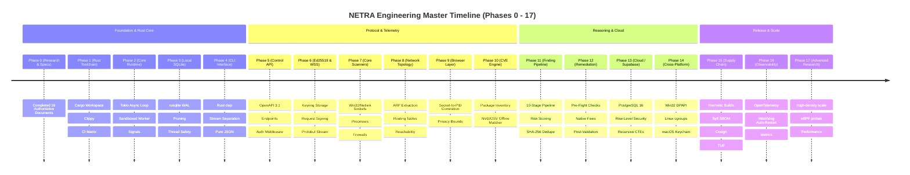
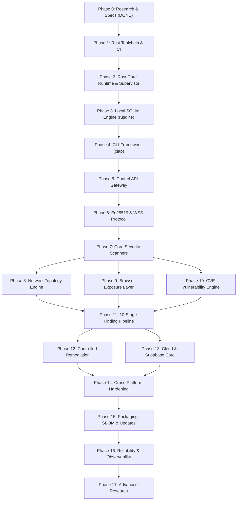

# NETRA — Master Phased Implementation Roadmap & Engineering Milestones

> **Overview**
>
> This document defines the authoritative, dependency-driven phased implementation roadmap for NETRA (Network & Endpoint Threat Reconnaissance Architecture). It enforces rigorous engineering gates where each phase proceeds strictly from specification and API contracts through Rust-first implementation, security testing, and cross-platform verification.

**Status:** Specified / Designed  
**Audience:** Core Maintainers, Systems Architects, Security Researchers, Open-Source Contributors  
**Purpose:** Serves as the master execution blueprint establishing deliverables, verification gates, and milestone dependencies across all 17 engineering phases.

---

## Contents

1. [Phased Engineering Philosophy & Execution Order](#1-phased-engineering-philosophy--execution-order)
2. [Master Milestone Timeline](#2-master-milestone-timeline)
3. [Phase Dependency & Gating Graph](#3-phase-dependency--gating-graph)
4. [Phase 0: Deep Research & Architecture Lock (COMPLETED)](#4-phase-0-deep-research--architecture-lock-completed)
5. [Phase 1: Repository & Rust Toolchain Foundation](#5-phase-1-repository--rust-toolchain-foundation)
6. [Phase 2: Rust Core Runtime & OS Sandboxing](#6-phase-2-rust-core-runtime--os-sandboxing)
7. [Phase 3: Local SQLite Engine & State Management (`rusqlite`)](#7-phase-3-local-sqlite-engine--state-management-rusqlite)
8. [Phase 4: CLI Framework & Output Formatting (Rust `clap`)](#8-phase-4-cli-framework--output-formatting-rust-clap)
9. [Phase 5: Control API Gateway & API Contracts](#9-phase-5-control-api-gateway--api-contracts)
10. [Phase 6: Device Identity & Asymmetric Ed25519 WSS Protocol](#10-phase-6-device-identity--asymmetric-ed25519-wss-protocol)
11. [Phase 7: Core Security Observation (Sockets, Processes, Firewall, Users)](#11-phase-7-core-security-observation-sockets-processes-firewall-users)
12. [Phase 8: Network Intelligence & Topology Discovery](#12-phase-8-network-intelligence--topology-discovery)
13. [Phase 9: Browser & Web Exposure Observation Layer](#13-phase-9-browser--web-exposure-observation-layer)
14. [Phase 10: Modular Vulnerability Intelligence & CVE Correlation](#14-phase-10-modular-vulnerability-intelligence--cve-correlation)
15. [Phase 11: 10-Stage Finding Engine, Risk Scoring & Policy Model](#15-phase-11-10-stage-finding-engine-risk-scoring--policy-model)
16. [Phase 12: Controlled Remediation Engine & Verification Loops](#16-phase-12-controlled-remediation-engine--verification-loops)
17. [Phase 13: Cloud Coordination & Supabase Multi-Tenant RLS Core](#17-phase-13-cloud-coordination--supabase-multi-tenant-rls-core)
18. [Phase 14: Cross-Platform Hardening (Windows, Linux, macOS)](#18-phase-14-cross-platform-hardening-windows-linux-macos)
19. [Phase 15: Hermetic Packaging, SBOM & TUF Secure Updates](#19-phase-15-hermetic-packaging-sbom--tuf-secure-updates)
20. [Phase 16: Reliability, Observability & Watchdog Hardening](#20-phase-16-reliability-observability--watchdog-hardening)
21. [Phase 17: Advanced Research & Performance Optimization](#21-phase-17-advanced-research--performance-optimization)

---

## 1. Phased Engineering Philosophy & Execution Order

NETRA enforces a **System-Design-First and API-Contract-First** development order:

$$\text{Research} \longrightarrow \text{Requirements} \longrightarrow \text{Architecture} \longrightarrow \text{System Design} \longrightarrow \text{API Contracts} \longrightarrow \text{Data Model} \longrightarrow \text{Implementation} \longrightarrow \text{Tests} \longrightarrow \text{Verification}$$

> [!IMPORTANT]
> No phase shall be declared complete without passing its predefined automated test suites, security gates, and exit criteria.

---

## 2. Master Milestone Timeline

---

## 3. Phase Dependency & Gating Graph

---

## 4. Phase 0: Deep Research & Architecture Lock (COMPLETED)

* **Status**: `COMPLETED`
* **Goal**: Complete ecosystem discovery, legacy post-mortem, reference evaluation (Drishti-Innofusion), and establish the 16-document engineering specification suite locked under a Rust-first systems architecture.
* **Deliverables**: Complete specifications in `README.md` and `docs/` (`PRD.md`, `TRD.md`, `ARCHITECTURE.md`, `SYSTEM_DESIGN.md`, `API.md`, `SECURITY_CHECK.md`, `PHASES.md`, `UI_UX.md`, `USAGE.md`, `OS_VERSATILE.md`, `CI_CD.md`, `WORKFLOW.md`, `RESEARCH.md`, `SLACK.md`, `DISCORD.md`).
* **Exit Gate**: All documents consistent, cross-linked, verified against Rust-first architecture, and locked for implementation.

---

## 5. Phase 1: Repository & Rust Toolchain Foundation

* **Status**: `PROPOSED / NEXT`
* **Goal**: Initialize clean Cargo workspace, Rust 2021 toolchains, clippy lint configurations, and automated CI pipelines.
* **Scope**:
  - `Cargo.toml` workspace initialization (`netra-core`, `netra-agent`, `netra-cli`, `netra-api`).
  - `.clippy.toml` configuration (enforcing strict clippy lints, `cargo-deny`, `cargo-audit`).
  - GitHub Actions CI workflow for pull request validation across Windows, Linux, and macOS.
* **Exit Gate**: `cargo test --workspace` and `cargo clippy --all-targets -- -D warnings` pass cleanly.

---

## 6. Phase 2: Rust Core Runtime, Lifecycle & Process Isolation

* **Status**: `COMPLETED`
* **Sub-phase Breakdown**:
  - **Phase 2.1 — Core Crate Boundaries & Interfaces (`COMPLETED`)**: Workspace structure (`netra-core`, `netra-platform`, `netra-cli`), unidirectional dependency invariants, platform abstraction traits.
  - **Phase 2.2 — Runtime Lifecycle & OS Initialization (`COMPLETED`)**: Deterministic `RuntimeState` state machine, pluggable `ComponentLifecycle` contracts, `RuntimeCoordinator` in-process startup/teardown, timeout guards, and automated test suite.
  - **Phase 2.3 — Privilege Separation, Process Isolation & Local IPC Foundation (`COMPLETED`)**: Two-tier process model (least-privilege supervisor + low-privilege worker), configurable cgroups v2 / Job Objects / setrlimit resource bounds, authenticated local IPC (`0600` DACLs + dual-gated peer PID & token handshake), sub-2-second auto-restart crash watchdog, and 5-crash circuit breaker.
* **Exit Gate**: Worker terminates and restarts within 2 seconds upon crash; memory bounded at configured ceiling (100MB default); zero unauthorized IPC connections permitted. Verified 100% across Windows, Ubuntu, and macOS.

---

## 7. Phase 3: Local SQLite Engine & State Management (`rusqlite`)

* **Status**: `COMPLETED & VERIFIED`
* **Goal**: Build the local-first SQLite persistence layer in Rust using `rusqlite` (v0.33.0, bundled SQLite 3.48.0).
* **Scope**:
  - Embedded transactional migrations (`_netra_migrations`, `local_config`, `observation_queue`, `local_findings`).
  - Enable WAL mode with nuanced durability semantics (`synchronous = NORMAL` for high-throughput buffering, application-crash safety, structural consistency).
  - Segregated read-write connection handle model adapted for Tokio via `spawn_blocking`.
  - Atomic clean-shutdown marker protocol (`.clean_shutdown` / `.runtime_active`) for multi-instance safety and unclean restart detection.
  - Bounded shutdown checkpointing with external Tokio timeout and passive/restart fallback.
  - State-aware queue pruning with configurable storage quota (500MB default), strictly preserving `QUEUED` observations and `OPEN` findings.
  - Safe cross-platform quarantine directory protocol (`quarantine_<timestamp>/` + `quarantine_meta.json`).
* **Exit Gate**: 10,000 concurrent insert/select operations execute without database lock timeouts or panics; corrupted files safely quarantined without data destruction.

---

## 8. Phase 4: CLI Framework & Output Formatting (Rust `clap`)

* **Status**: `COMPLETED & VERIFIED`
* **Goal**: Build the Unix-philosophy `netra` CLI in Rust using `clap` v4.
* **Scope**:
  - Canonical command hierarchy (`status`, `diagnostics`, `storage` [`status`, `check`, `recover`], `version`).
  - Canonical output stream separation (`stdout` primary command result / clean JSON; `stderr` human UI, progress, warnings, errors).
  - Versioned JSON envelope schema strictly separating `schema_version` from `netra_version`.
  - Safe storage recovery contract requiring explicit confirmation or `--force-reinit` and preserving quarantine evidence.
  - Formally defined `--quiet` suppression rules and automatic TTY ANSI styling.
  - Standard exit code engine (`0` Success, `1` Operational Error, `2` Policy Violation, `3` Invalid Arguments, `4` Degraded State).
* **Exit Gate**: 100% of CLI integration test suites pass in CI without requiring external `jq` tools, validating JSON schema compatibility, stdout purity, and exit codes.

---

## 9. Phase 5: Control API Gateway & API Contracts

* **Status**: `COMPLETED & VERIFIED`
* **Goal**: Implement the REST Control-Plane API Gateway in Rust using **Axum (v0.8)** following OpenAPI 3.1 specifications.
* **Scope**:
  - Dedicated `netra-api` workspace crate maintaining `netra-core` domain neutrality.
  - Localhost loopback binding (`127.0.0.1:8443` default) with fail-fast collision behavior.
  - Lean, non-speculative route taxonomy (`health`, `version`, `status`, `diagnostics`, `openapi.json`, `storage/status`, `storage/check?deep=true|false`).
  - Read-only diagnostic semantics for `storage/check` (idempotent `GET` with optional `?deep=true`).
  - Universal JSON success and error envelopes matching `docs/API.md` Section 4.
  - Host-local capability-minimized trust boundary (destructive actions excluded from HTTP).
  - Resource protection stack: 1MB body limit, 15-second request timeout, CORS disabled by default.
  - Single-source-of-truth OpenAPI 3.1 specification generated at compile time via `utoipa`.
  - Seamless `ComponentLifecycle` integration with `RuntimeCoordinator` for graceful connection draining bounded by the global shutdown budget.
* **Exit Gate**: 100% of `netra-api` integration test suites pass across Windows, Linux, and macOS without compilation warnings or schema drift.

---

## 10. Phase 6: Device Identity, OS-Protected Key Management & WSS Protocol

* **Status**: `COMPLETED & VERIFIED`
* **Goal**: Implement cryptographic device identity, OS-protected private-key storage (DPAPI / Secret Service / Keychain), client-side enrollment protocol, canonical request signing, and outbound WebSocket over TLS 1.3 (WSS) streaming in Rust.
* **Scope**:
  - Stable `DeviceId` model (`dev_<uuidv7>`) distinct from MAC/hostnames.
  - Ed25519 keypair generation and memory zeroization via `ed25519-dalek` and `zeroize`.
  - OS-Protected `KeyStore` trait: Win32 DPAPI (`NATIVE TESTED`), Apple Keychain (`NOT NATIVE TESTED`), Linux Secret Service with fail-safe `ERR_KEYSTORE_UNAVAILABLE` on headless servers (no weak machine-id key derivation).
  - Development KeyStore (`insecure-dev-keystore`) strictly compile-time gated for isolated CI tests, completely absent in release binaries; Phase 7 and future production capabilities MUST NOT depend on this backend.
  - Client-side enrollment challenge-response proof-of-possession against mock test fixtures.
  - Deterministic line-delimited request signing (`StringToSign`) and consolidated replay defense.
  - Policy-driven key rotation state machine (`ACTIVE` $\to$ `ROTATION_PENDING` $\to$ `NEW_KEY_VERIFIED` $\to$ `ACTIVE` $\to$ `RETIRED`).
  - Persistent outbound WSS client over TLS 1.3 (`tokio-tungstenite` + `rustls`) with Canonical JSON framing.
* **Exit Gate**: 100% of cryptographic unit tests pass; replay attacks with stale timestamp (>300s) or duplicated nonces are rejected with HTTP 401; KeyStore safely stores and scrubs private keys.

---

## 11. Phase 7: Core Security Observation Subsystems & Rule Engine

* **Status**: `COMPLETED & VERIFIED`
* **Goal**: Implement native OS posture scanners, canonical evidence hashing, deterministic rule evaluation, finding deduplication, and scan presentation in Rust.
* **Scope**:
  - Strongly typed Observation envelope with schema versioning (`schema_version: 1`), `TargetDescriptor` enum (`Host`, `Process`, `Socket`, `Firewall`, `User`, `Service`, `OsConfiguration`), and canonical SHA-256 evidence hashing.
  - Six native OS posture scanners in `netra-platform`:
    - `PlatformSocketScanner` (`scanner.sockets.v1`): Win32 `GetExtendedTcpTable`/`GetExtendedUdpTable` (`NATIVE TESTED`), Linux `/proc/net` parser (`FIXTURE TESTED`), macOS stub.
    - `PlatformProcessScanner` (`scanner.process.v1`): Win32 Toolhelp32 snapshot, ephemeral command-line privacy, configurable binary SHA-256 hashing (`--hash-binaries`, 50MB file cap).
    - `PlatformFirewallScanner` (`scanner.firewall.v1`): Win32 Registry profile state query (`Domain`, `Private`, `Public`).
    - `PlatformUserScanner` (`scanner.users.v1`): Win32 `NetUserEnum` local accounts, zero password/hash extraction.
    - `PlatformServiceScanner` (`scanner.services.v1`): Win32 Service Control Manager (`EnumServicesStatusExW`), unquoted path detection.
    - `PlatformOsConfigScanner` (`scanner.os.v1`): Registry SecureBoot and UAC (`EnableLUA`) verification.
  - Baseline Rule Engine (`netra-core::rules`) with 6 rules (`NET-001-PLAINTEXT-PORT`, `NET-002-UNRESTRICTED-DB`, `FW-001-PROFILE-DISABLED`, `USR-001-GUEST-ENABLED`, `SVC-001-UNQUOTED-PATH`, `OS-001-SECUREBOOT-OFF`).
  - Deterministic finding deduplication fingerprinting: `SHA-256(rule_id || ":" || target_key || ":" || discriminator)`.
  - `ScannerSupervisor`: Concurrent multi-collector execution with per-scanner 5000ms timeout bounds and panic isolation.
  - CLI Presentation: `netra scan [domain] [--hash-binaries]` and `netra findings list [--severity] [--status]` with clean JSON/box output.
  - REST Endpoints: `GET /api/v1/scan/status` and `GET /api/v1/findings`.
* **Exit Gate**: All 6 scanners execute concurrently in under 100ms on Windows benchmark machines; 100% of unit/integration tests pass cleanly across `netra-core`, `netra-platform`, `netra-cli`, and `netra-api`.

---

## 12. Phase 8: Network Intelligence & Topology Discovery

* **Status**: `IN PROGRESS` (Phase 8.1–8.7.6 COMPLETED & VERIFIED; Phase 8.8.1 & Phase 8.8.2 COMPLETED & VERIFIED; Phase 8.8.3+ NOT STARTED)
* **Goal**: Synthesize cross-agent local network reachability maps and passive network observation.
* **Scope**:
  - Core network domain models, IP classification, SHA-256 MAC pseudonymization, in-memory topology builder (`netra-core::network`) (`COMPLETED & VERIFIED`).
  - Native OS Network Interface Posture Scanner (`scanner.interfaces.v1`):
    - Windows: `GetAdaptersAddresses` IP Helper API (`IMPLEMENTED + NATIVE TESTED`).
    - Linux: `/sys/class/net` and `/proc/net/dev` parser (`IMPLEMENTED + FIXTURE TESTED`).
    - macOS: Stubs (`STUB + NOT NATIVE TESTED`).
  - Native OS Routing Table & Default Gateway Posture Scanner (`scanner.routes.v1`):
    - Windows: `GetIpForwardTable2` IP Helper API with metric-based default gateway derivation (`IMPLEMENTED + NATIVE TESTED`).
    - Linux: `/proc/net/route` and `/proc/net/ipv6_route` passive parsers (`IMPLEMENTED + FIXTURE TESTED`).
    - macOS: Stubs with explicit `PrivilegeStatus::Unsupported` (`STUB + NOT NATIVE TESTED`).
  - Native OS DNS Configuration Posture Scanner (`scanner.dns.v1`):
    - Windows: `GetAdaptersAddresses` (`FirstDnsServerAddress`, `DnsSuffix`, IPv4/IPv6 classification) (`IMPLEMENTED + NATIVE TESTED`).
    - Linux: `/etc/resolv.conf` and `/run/systemd/resolve/resolv.conf` passive file parsers (`IMPLEMENTED + FIXTURE TESTED`).
    - macOS: Stubs with explicit `PrivilegeStatus::Unsupported` (`STUB + NOT NATIVE TESTED`).
  - Native OS Neighbor Discovery Posture Scanner (`scanner.neighbors.v1`):
    - Windows: `GetIpNetTable2` IP Helper API (IPv4 ARP + IPv6 NDP) (`IMPLEMENTED + NATIVE TESTED`).
    - Linux: Netlink `RTM_GETNEIGH` (IPv4 ARP + IPv6 NDP) and `/proc/net/arp` fallback (`IMPLEMENTED + FIXTURE TESTED`).
    - macOS: Stubs with explicit `PrivilegeStatus::Unsupported` (`STUB + NOT NATIVE TESTED`).
  - In-memory topology synthesis (`netra-core::network::topology` components `TopologyCorrelator`, `TopologyExtractor`, `TopologyObservationPayload`, `TopologyEdgeKind`, `TopologyCorrelationEdge`, std::net CIDR containment, `ScannerSupervisor` Step 5 synthesis and Step 6 separate Transaction B enqueue) (`COMPLETED & VERIFIED`).
  - Phase 8.7.1: Network Rule Infrastructure & Module Layout (`netra-core::rules::network` components `NetworkConfidenceGuardrail`, `NetworkRuleMetadata`, `NetworkRuleRegistry`, `RuleEngine::with_all_rules()`) (`COMPLETED & VERIFIED`).
  - Phase 8.7.2: Gateway Posture Finding Rules (`NET-003-GATEWAY-OFF-SUBNET`, `NET-004-COMPETING-DEFAULT-GATEWAYS`) (`COMPLETED & VERIFIED`).
  - Phase 8.7.3: DNS & Routing Posture Finding Rules (`NET-005-INVALID-DNS-RESOLVER`, `NET-006-LOOPBACK-ROUTE-LEAK`) (`COMPLETED & VERIFIED`).
  - Phase 8.7.4: Neighbor & Multi-Homing Posture Finding Rules (`NET-007-INVALID-NEIGHBOR-ENTRY`, `NET-008-MULTI-HOMED-PUBLIC-PRIVATE`) (`COMPLETED & VERIFIED`).
  - Phase 8.7.5: Network Findings Pipeline Integration (`ScannerSupervisor` canonical evaluation with `RuleEngine::with_all_rules()`, derived topology observation evaluation, `FindingsRepository::upsert_entry()`, discriminator/fingerprint fix, failure-isolated reconciliation lifecycle, Transaction A/B boundaries) (`COMPLETED & VERIFIED`).
  - Phase 8.7.6: Final Network Intelligence Verification (`network_verification_tests.rs`, rule inventory audit, cross-rule isolation, 8-mode telemetry failure isolation matrix, fingerprint determinism & ordering invariance, threat attribution language compliance, zero raw MAC privacy audit, Transaction A/B fault boundary verification) (`COMPLETED & VERIFIED`).
  - Phase 8.8.1: Repository-Level SQL Aggregation & Deterministic Rule Resolution (`FindingsRepository::count_summary`, `RuleEngine::resolve_rule_id`, `FindingsCountFilter`, `FindingsSummaryStats`, `StatusCounts`, `SeverityCounts`) (`COMPLETED & VERIFIED`).
  - Phase 8.8.2: CLI Command Hierarchy & Subcommand Implementation (`netra findings list`, `netra findings show`, `netra findings count`, argument validation, exit codes, stream separation) (`COMPLETED & VERIFIED`).
  - Phase 8.8.3+: Scan UX, REST API Parity & Final Verification (`NOT STARTED`).
* **Exit Gate**: Correctly enumerates network interfaces, kernel routing tables, DNS configuration, and Layer-2/Layer-3 neighbor tables, synthesizes deterministic in-memory topology graphs with typed correlation edges, and evaluates 6 deterministic network finding rules (`NET-003` to `NET-008`) and all baseline rules through a single unified canonical evaluation pipeline with atomic Transaction A and failure-isolated Transaction B persistence.

---

## 13. Phase 9: Browser & Web Exposure Observation Layer

* **Status**: `PLANNED`
* **Goal**: Correlate OS sockets with web browser processes in Rust while enforcing strict academic privacy boundaries.
* **Scope**:
  - Socket-to-PID correlation matching browser binaries (`chrome`, `firefox`, `edge`).
  - Domain mapping via OS DNS cache and TLS SNI headers.
* **Exit Gate**: Zero inspection of web page DOM, cookies, or HTTP request/response payloads.

---

## 14. Phase 10: Modular Vulnerability Intelligence & CVE Correlation

* **Status**: `PLANNED`
* **Goal**: Correlate installed packages against modular, open CVE catalogs (OSV / NVD).
* **Scope**:
  - Package inventory extractors (`dpkg`, `rpm`, Registry Uninstall keys).
  - Deterministic version range matching against cached NVD/OSV feeds.
* **Exit Gate**: Accurately flags known CVEs on intentionally vulnerable test software.

---

## 15. Phase 11: 10-Stage Finding Engine, Risk Scoring & Policy Model

* **Status**: `PLANNED`
* **Goal**: Implement the deterministic 10-stage reasoning pipeline in Rust.
* **Scope**:
  - Deterministic SHA-256 fingerprinting.
  - Composite risk scoring formula (Base severity $\times$ Exposure multiplier $\times$ Asset weight).
  - Deduplication and state lifecycle management.
* **Exit Gate**: Repeated scans of the same defect produce zero duplicate database records.

---

## 16. Phase 12: Controlled Remediation Engine & Verification Loops

* **Status**: `PLANNED`
* **Goal**: Execute safe, human-approved remediations with closed verification loops.
* **Scope**:
  - Pre-flight safety checks (prevent disabling critical system services).
  - Native OS remediation execution (firewall rule addition, loopback binding).
  - Post-remediation verification probes and automated rollback on failure.
* **Exit Gate**: Simulated failure during remediation triggers automatic rollback within 5 seconds.

---

## 17. Phase 13: Cloud Coordination & Supabase Multi-Tenant RLS Core

* **Status**: `PLANNED`
* **Goal**: Implement the PostgreSQL 16 relational core and Supabase coordination layer.
* **Scope**:
  - Multi-tenant Row-Level Security policies (`SET LOCAL app.current_tenant_id`).
  - Recursive CTE graph path queries for topology reachability.
* **Exit Gate**: Cross-tenant data leakage tests pass with 100% isolation verified.

---

## 18. Phase 14: Cross-Platform Hardening (Windows, Linux, macOS)

* **Status**: `PLANNED`
* **Goal**: Validate and harden OS adapters and advanced isolation across Windows, Linux, and macOS.
* **Scope**:
  - Windows: Win32 COM, DPAPI, AppContainer / restricted token hardening, and MSI packaging.
  - Linux: Netlink, systemd units, seccomp-bpf syscall filtering, mount namespace isolation, and `.deb`/`.rpm` packaging.
  - macOS: `sysctl`, Keychain, Seatbelt sandbox profiles (`sandbox_init`), and Launchd daemons.
* **Exit Gate**: Native test suites pass 100% on automated Windows, Ubuntu, and macOS runners.

---

## 19. Phase 15: Hermetic Packaging, SBOM & TUF Secure Updates

* **Status**: `PLANNED`
* **Goal**: Implement reproducible build pipelines and supply chain security.
* **Scope**:
  - Fully reproducible static binary builds (`cargo build --release --locked`).
  - Software Bill of Materials (SBOM) generation via Syft.
  - Cosign binary signing and The Update Framework (TUF) auto-update verification.
* **Exit Gate**: Corrupted update payload is rejected before disk execution.

---

## 20. Phase 16: Reliability, Observability & Watchdog Hardening

* **Status**: `PLANNED`
* **Goal**: Embed production-grade observability and long-term stability controls.
* **Scope**:
  - Structured JSON logging (`tracing` crate) and OpenTelemetry metrics.
  - 24-hour soak tests measuring memory leak stability (<0.1MB/hour drift).
* **Exit Gate**: Agent maintains continuous stability under simulated 24-hour network flapping.

---

## 21. Phase 17: Advanced Research & Performance Optimization

* **Status**: `PLANNED`
* **Goal**: Explore high-density scale and advanced OS-level sensor research.
* **Scope**:
  - Linux eBPF process execution and socket tracking probes (`aya` Rust eBPF library).
  - Distributed Redis 7 WSS session routing for 10,000+ nodes.
* **Exit Gate**: Performance benchmark confirms sub-millisecond task dispatch at 10,000 active nodes.
