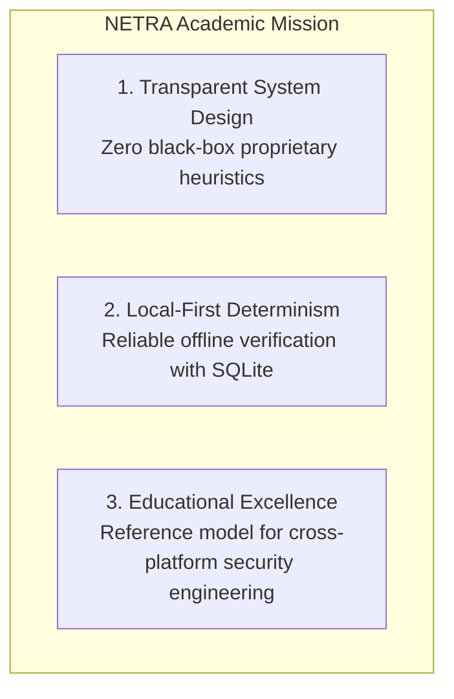
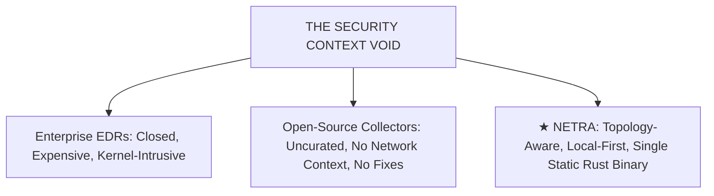
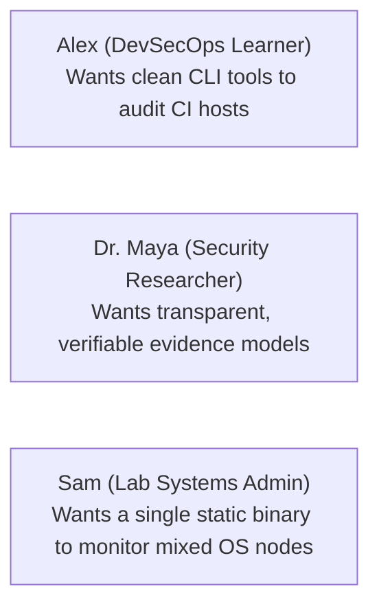
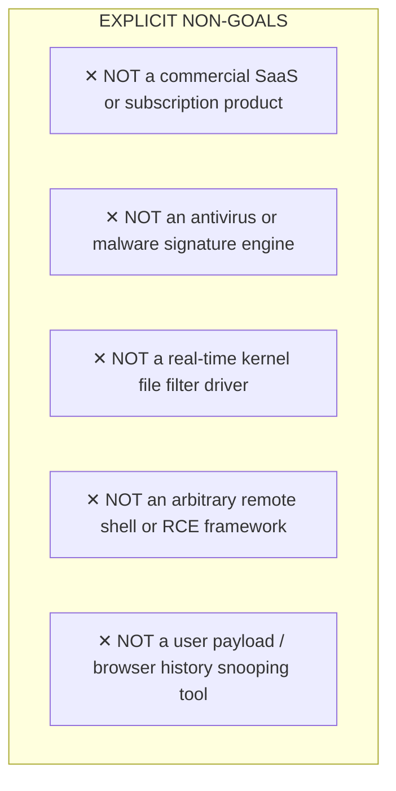
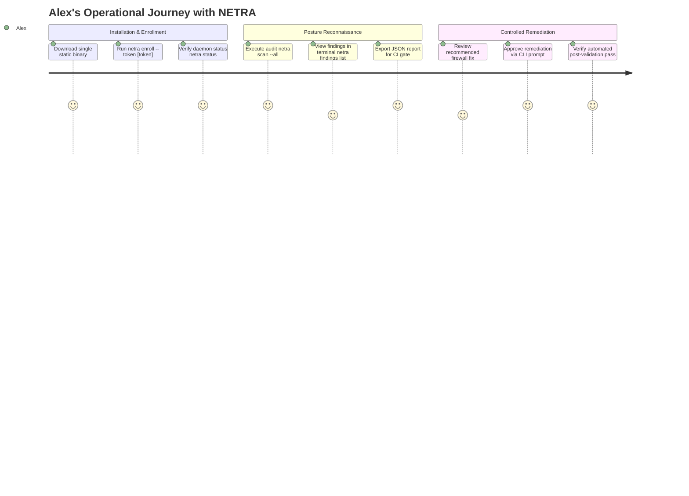

# NETRA — Product Requirements Document (PRD)

> **Overview**
>
> This document defines the academic and architectural requirements for NETRA (Network & Endpoint Threat Reconnaissance Architecture). It articulates the problem space, core product thesis, user personas, functional capabilities, explicit non-goals, and success metrics for the open-source platform.

**Status:** Specified / Designed  
**Audience:** Security Researchers, Systems Engineers, Open-Source Contributors, Academic Reviewers  
**Purpose:** Establishes the product foundation ensuring that subsequent technical specifications and implementations adhere strictly to the project's educational and defensive mission.

---

## Contents

1. [Product Identity & Academic Vision](#1-product-identity--academic-vision)
2. [Problem Statement & The Security Context Dilemma](#2-problem-statement--the-security-context-dilemma)
3. [The Product Thesis](#3-the-product-thesis)
4. [User Personas & Use Cases](#4-user-personas--use-cases)
5. [Core Product Goals](#5-core-product-goals)
6. [Explicit Non-Goals (What NETRA Will Never Be)](#6-explicit-non-goals-what-netra-will-never-be)
7. [Core Capability Specifications](#7-core-capability-specifications)
8. [End-to-End User Experience & Journeys](#8-end-to-end-user-experience--journeys)
9. [MVP Scope Boundaries (Phases 1–4)](#9-mvp-scope-boundaries-phases-14)
10. [Academic Success Metrics & Verification Criteria](#10-academic-success-metrics--verification-criteria)
11. [Project Constraints, Risks & Future Horizons](#11-project-constraints-risks--future-horizons)

---

## 1. Product Identity & Academic Vision

NETRA is an **open-source, non-commercial security engineering project** built to advance the understanding of defensive endpoint architecture, local network reachability reasoning, and safe remediation.

---

## 2. Problem Statement & The Security Context Dilemma

Modern security tools exhibit a fundamental dichotomy:
* **Enterprise Commercial EDRs**: Cost $150–$250 per node annually, rely on proprietary closed-source cloud platforms, and require intrusive kernel-level drivers.
* **Open-Source Telemetry Collectors**: Tools like `osquery` or `auditd` produce massive, uncurated raw event streams without relational network context, explainable risk scoring, or closed-loop remediation.

---

## 3. The Product Thesis

> **Central Hypothesis:**  
> Correlating **endpoint configuration posture** (listening sockets, process binaries, firewall states) with **local network topology** (ARP caches, routing paths, default gateways) within a **deterministic 10-stage evidence pipeline** yields actionable, low-noise defensive intelligence without requiring kernel drivers or cloud dependencies.

---

## 4. User Personas & Use Cases

* **Persona 1: Alex (Student / DevSecOps Engineer)**: Needs a lightweight CLI utility to audit workstation security posture and pipe structured JSON into automation scripts.
* **Persona 2: Dr. Maya (Academic Security Researcher)**: Studies lateral movement attack surfaces and requires an open-source, verifiable network reachability graph.
* **Persona 3: Sam (Homelab / Infrastructure Admin)**: Manages a mixed fleet of Windows and Linux nodes with intermittent internet connectivity, requiring local-first SQLite resilience.

---

## 5. Core Product Goals

1. **Deterministic Reasoning**: Zero subjective or unproven alerts; every finding is backed by an immutable SHA-256 evidence artifact.
2. **Topology Synthesis**: Automatically discover Layer-2/Layer-3 adjacent neighbors without active port scanning.
3. **Rust-First Resource Efficiency**: Single Rust static binary (under 20MB, under 15MB idle RAM, under 0.1% CPU).
4. **Local-First Reliability**: Uninterrupted local scanning and state storage across network partitions.
5. **Controlled Remediation**: Human-in-the-loop corrective actions with automated pre/post verification probes.

---

## 6. Explicit Non-Goals (What NETRA Will Never Be)

---

## 7. Core Capability Specifications

| Capability Key | Focus Area | Primary Mechanism |
| :--- | :--- | :--- |
| **`SCAN_NETWORK`** | Sockets & Ports | Native OS socket table extraction (`windows-sys` / `nix` Netlink) |
| **`SCAN_PROCESSES`** | Process Auditing | Enumerates running binaries, CLI flags, and binary SHA-256 hashes |
| **`SCAN_FIREWALL`** | Packet Filtering | Windows Firewall COM / Linux `nftables` profile verification |
| **`SCAN_USERS`** | Accounts & Sudo | Local user account privilege and dormant account audit |
| **`OBSERVE_TOPOLOGY`** | Network Graph | Passive ARP cache and routing table path extraction |
| **`OBSERVE_WEB_EXPOSURE`**| Browser Outbound | Socket-to-PID correlation matching browser processes (Zero content sniffing) |
| **`CORRELATE_CVE`** | Vulnerability Match | Local package inventory matching against open NVD/OSV feeds |

---

## 8. End-to-End User Experience & Journeys

---

## 9. MVP Scope Boundaries (Phases 1–4)

* **Must Have (MVP)**: Single Rust binary, Ed25519 device authentication, 4 core scanners (`NETWORK`, `PROCESSES`, `FIREWALL`, `USERS`), local SQLite state storage, and `netra` CLI.
* **Should Have (Phase 2)**: Cross-agent network topology graph, browser exposure correlation, offline CVE matching, and Slack approval gateway.
* **Future Horizons (Phase 4+)**: Linux eBPF process sensors (`aya` Rust library) and distributed multi-node clustering.

---

## 10. Academic Success Metrics & Verification Criteria

1. **Binary Footprint**: Executable size $\le 20\text{ MB}$ stripped.
2. **Runtime Footprint**: Idle memory $\le 15\text{ MB}$ RSS; CPU utilization $\le 0.1\%$.
3. **Execution Latency**: Full 4-scanner audit completes in $< 500\text{ ms}$.
4. **Deduplication Rate**: Repeated scans of unchanged defects produce exactly $0\%$ duplicate finding records.
5. **Offline Partition Tolerance**: 100% telemetry retention verified across 24-hour network outages.

---

## 11. Project Constraints, Risks & Future Horizons

* **OS Privilege Constraints**: Certain kernel firewall states require elevated permissions (Administrator / root). NETRA gracefully degrades when run under unprivileged user contexts.
* **Remediation Risk**: Host configuration modifications carry potential service interruption risks; all active remediations require human approval and post-validation verification.
