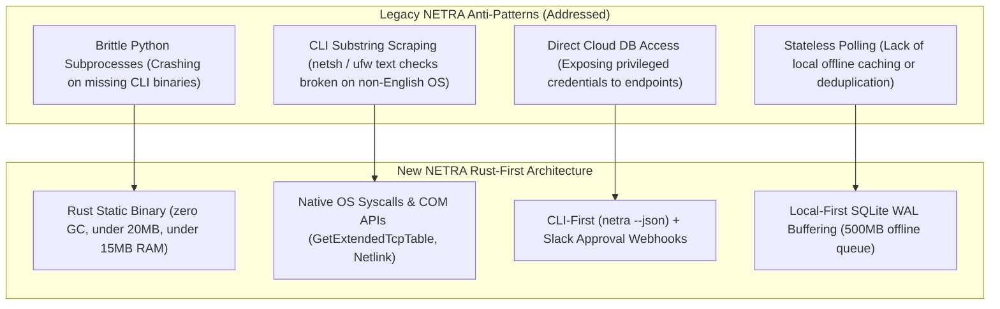
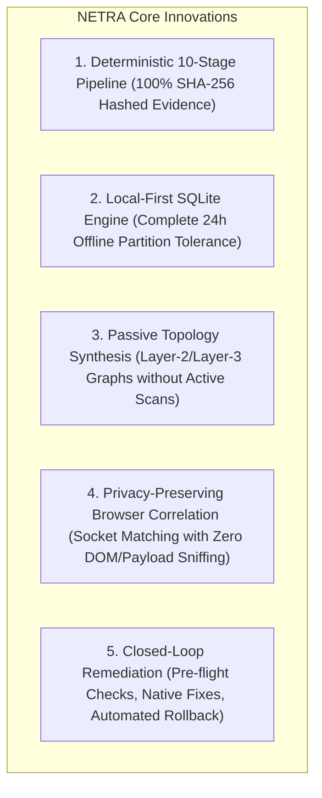

# NETRA — Comprehensive Ecosystem Discovery, Post-Mortem & Visual Architecture Research

> **Overview**
>
> This document records the architectural research, ecosystem benchmarking, legacy post-mortem lessons, language selection evaluations, reference analysis of [Drishti-Innofusion](https://github.com/soumyachk101/Drishti-Innofusion/), and the comprehensive 59-diagram visual inventory for NETRA (Network & Endpoint Threat Reconnaissance Architecture).

**Status:** Completed Research Document  
**Audience:** Security Architects, Systems Researchers, Contributors, Academic Reviewers  
**Purpose:** Serves as the foundational research evidence justifying all architectural decisions, technology selections, and visual design models across the NETRA platform.

---

## Contents

1. [Academic & Research Identity](#1-academic--research-identity)
2. [Legacy NETRA Post-Mortem & Architectural Lessons](#2-legacy-netra-post-mortem--architectural-lessons)
3. [Competitive & Architectural Ecosystem Analysis](#3-competitive--architectural-ecosystem-analysis)
4. [Reference Project Evaluation: Drishti-Innofusion](#4-reference-project-evaluation-drishti-innofusion)
5. [Systems Language Evaluation: Why Rust-First](#5-systems-language-evaluation-why-rust-first)
6. [Core Architectural Breakthroughs in New NETRA](#6-core-architectural-breakthroughs-in-new-netra)
7. [Comprehensive Visual Inventory (59 Architectural Diagrams)](#7-comprehensive-visual-inventory-59-architectural-diagrams)

---

## 1. Academic & Research Identity

NETRA is an **open-source, non-commercial academic defensive security engineering project**. It is designed to provide students, developers, and researchers with a transparent, verifiable platform to explore host security posture, network reachability, and safe automated remediation.

---

## 2. Legacy NETRA Post-Mortem & Architectural Lessons

An audit of the previous codebase (`Subhadip-Paul2006/NETRA-agent`) revealed several critical design anti-patterns that have been completely redesigned:

---

## 3. Competitive & Architectural Ecosystem Analysis

| System | Architecture | Footprint | Inbound Ports | Remediation | Open Source |
| :--- | :--- | :--- | :--- | :--- | :--- |
| **osquery** | C++ SQL Table Engine | ~40MB RAM | 0 (Outbound TLS) | ✕ (Read-only) | ★ Apache 2.0 |
| **Velociraptor** | Go VQL Collector | ~60MB RAM | 0 (Outbound TLS) | ✕ (Forensics only) | ★ AGPL 3.0 |
| **Wazuh** | C Agent / OSSEC Core | ~80MB RAM | Inbound Required | ~ (Basic scripts) | ★ GPLv2 |
| **CrowdStrike** | C++ Kernel Driver EDR | Proprietary | 0 (Outbound TLS) | ★ Automated Block | ✕ Commercial |
| **★ NETRA** | **Rust Core + SQLite WAL** | **<15MB RAM** | **0 (Outbound TLS)** | **★ Safe Closed-Loop** | **★ Academic OSS** |

---

## 4. Reference Project Evaluation: Drishti-Innofusion

Analysis of the [Drishti-Innofusion](https://github.com/soumyachk101/Drishti-Innofusion/) repository yielded important insights regarding multi-workstation observations and browser exposure awareness:

* **Valuable Concept**: Correlating browser process sockets with external domains to provide immediate visibility into developer and workstation exposure.
* **NETRA's Architectural Advancement**: While Drishti relied on higher-level scripts and external services, NETRA implements this observation natively in **Rust** through non-intrusive OS socket-to-PID tables and DNS resolver caches, enforcing strict privacy guardrails with zero payload inspection.

---

## 5. Systems Language Evaluation: Why Rust-First

To eliminate language proliferation and maintain optimal efficiency, a rigorous comparative evaluation was performed:

| Criteria | Rust (Selected Core) | Python (Justified Layer) | Go (Researched / Rejected) | C/C++ (Researched / Rejected) |
| :--- | :--- | :--- | :--- | :--- |
| **Memory Safety** | ★ Compile-Time Guarantee | ★ Safe (Interpreted) | ★ Safe (Garbage Collected) | ✕ Vulnerable to Memory Bugs |
| **Runtime Overhead** | ★ Zero Runtime / Zero GC | ✕ High (~50MB+ runtime) | ~ Low GC pause overhead | ★ Zero Runtime |
| **Idle Memory (RSS)** | ★ <15MB | ✕ 50–100MB | ~ 25–40MB | ★ <10MB |
| **Cold Startup Time** | ★ <50ms | ✕ 500ms–2000ms | ~ 100ms | ★ <20ms |
| **Native Syscall Interop** | ★ Direct Zero-Cost FFI | ✕ Requires ctypes/C-FFI | ~ cgo runtime overhead | ★ Direct native |
| **Binary Portability** | ★ Single Static Musl/MSVC | ✕ PyInstaller bloat | ★ Single static binary | ✕ Dynamic library hell |

### Conclusion:
* **Rust**: Selected as the primary language for the agent runtime, background daemon, CLI, schedulers, local SQLite engine, and native OS adapters.
* **Python**: Retained strictly as an optional secondary extension layer for high-level exploratory research scripts, offline heuristics, and advisory LLM interfaces.
* **Go / C++**: Documented as researched but rejected alternatives to prevent language proliferation.

---

## 6. Core Architectural Breakthroughs in New NETRA

---

---

## 7. Privilege Architecture & Process Containment Research

### 7.1 Rejection of Monolithic Elevated Execution
Prior endpoint agents frequently assumed that background daemons must permanently run with unrestricted administrator privileges (`root` / `NT AUTHORITY\SYSTEM`). Our research evaluated and rejected this pattern for the following reasons:
1. **Unnecessary Attack Surface**: >80% of endpoint telemetry tasks (event loop scheduling, network graph processing, local SQLite buffering, and outbound streaming) operate perfectly within standard unprivileged user space.
2. **Blast Radius Minimization**: Running the worker process under low privileges prevents a flaw in telemetry parsers or rules from resulting in full kernel/root compromise.
3. **Least-Privilege Capability Escalation**: Privileged operations (e.g. system-wide packet filter modifications) should be requested on-demand or delegated to narrowly scoped helper utilities rather than granting blanket SYSTEM rights to the entire runtime.

### 7.2 Resource Containment vs. Full Sandboxing
Security literature often conflates resource throttling with security sandboxing. We explicitly distinguish:
- **Resource Limitation**: Enforcing memory and CPU ceilings (via Win32 Job Objects, cgroups v2, or `setrlimit`) protects host stability and prevents runaway worker denial-of-service.
- **Process Lifecycle Isolation**: Enforcing parent-death cleanup (`KILL_ON_JOB_CLOSE`, `PDEATHSIG`) prevents orphaned background worker processes.
- **Full Sandboxing**: Advanced syscall filtering (seccomp-bpf) and filesystem isolation (AppContainer/namespaces) constitute separate security layers assigned to dedicated hardening phases.

### 7.3 Local IPC Protocol Trade-Offs
| IPC Alternative | Transport | Framing | Security Boundary | Selected / Rejected |
| :--- | :--- | :--- | :--- | :--- |
| **HTTP over Localhost (127.0.0.1)** | Loopback TCP | HTTP/1.1 or 2 | Weak: Accessible by any local process without socket DACL | **Rejected** (Violates zero listening ports) |
| **gRPC over Localhost** | HTTP/2 TCP | Protobuf | High binary overhead (~3MB extra crates); weak local DACL | **Rejected** (Unnecessary weight for local IPC) |
| **★ Length-Delimited JSON over Named Pipes / UDS** | OS Sockets / Pipes | 4-byte BE + JSON | **Strong: OS DACLs (`0600`) + Peer PID/UID check + Ephemeral Token** | **Selected Core Protocol** |

### 7.4 Control-Plane REST API Framework Evaluation

A qualitative comparative evaluation between the leading Rust asynchronous HTTP frameworks was conducted for Phase 5:

| Evaluation Dimension | **Axum (Selected)** | **Actix-Web (Researched / Rejected)** |
| :--- | :--- | :--- |
| **Async Runtime Integration** | Native integration with `tokio` (maintained by Tokio core team); uses standard `tokio::net` and `hyper`. | Custom actor-oriented runtime (`actix-rt`) layered over Tokio, introducing additional scheduler abstractions. |
| **Middleware Architecture** | Built 100% on standard `tower::Service` and `tower-http` ecosystem (limits, tracing, timeouts, compression). | Uses custom `actix_web::middleware` trait hierarchy, preventing direct reuse of Tower ecosystem middleware. |
| **Type Safety & Extractors** | Declarative compile-time extractors (`FromRequest`, `FromRequestParts`, `IntoResponse`) with zero macro bloat. | Heavy procedural macro reflection and custom handler return types. |
| **WebSocket Compatibility** | Native `axum::extract::ws::WebSocketUpgrade` built directly on `tokio-tungstenite`. | Separate `actix-ws` crate with distinct connection models. |
| **Maintenance Simplicity** | Direct functional request handlers without actor state machine overhead. | Requires understanding Actix actor lifecycle models. |

**Conclusion**: Axum is selected as the authoritative framework for NETRA's REST API layer due to its native alignment with Tokio, standard Tower middleware, and lower abstraction complexity.

---

## 8. Comprehensive Visual Inventory (59 Architectural Diagrams)

The NETRA architecture is visually modeled across 59 dedicated Mermaid diagrams distributed throughout the specification suite:

* **System Design & Lifecycles (`docs/SYSTEM_DESIGN.md`)**: 12 diagrams covering process models, startup, Ed25519 handshakes, SQLite schemas, task state machines, scanner sandboxes, topology discovery, browser exposure, CVE correlation, 10-stage pipeline, remediation loops, and offline synchronization.
* **API Contracts & Data Models (`docs/API.md`)**: 4 diagrams covering actor boundaries, ER entity relationships, Protobuf streams, and webhook dispatch.
* **Master System Architecture (`docs/ARCHITECTURE.md`)**: 10 diagrams covering high-level topology, Rust/Python boundaries, dual modes, internal agent subsystems, SQLite WAL flows, topology CTEs, vulnerability pipelines, remediation loops, cross-platform adapters, and security trust boundaries.
* **Security & Threat Models (`docs/SECURITY_CHECK.md`)**: 5 diagrams covering zero-trust tenets, capability whitelisting, remediation verification sequences, and STRIDE trust boundaries.
* **Cross-Platform Adapters (`docs/OS_VERSATILE.md`)**: 2 diagrams covering multi-OS syscall adapters and privilege degradation hierarchies.
* **CLI User Experience (`docs/UI_UX.md`)**: 3 diagrams covering command taxonomy, stream separation (stdout vs stderr), and interactive TTY modes.
* **CI/CD & Supply Chain Security (`docs/CI_CD.md`)**: 4 diagrams covering SLSA Level 3 pipelines, quality matrices, release automation, and VM smoke testing.
* **Operations & Developer Workflow (`docs/USAGE.md` & `docs/WORKFLOW.md`)**: 4 diagrams covering operational lifecycles, diagnostic decision trees, git branching models, and Definition of Done.
* **Master Phased Implementation Roadmap (`docs/PHASES.md`)**: 2 diagrams covering master milestone timelines and 17-phase dependency gating graphs.
* **Integration Gateways (`docs/SLACK.md` & `docs/DISCORD.md`)**: 4 diagrams covering Slack dual-custody approval loops, Block Kit schemas, and Discord homelab notification flows.
* **Research & Discovery (`docs/RESEARCH.md` & `README.md`)**: 9 diagrams covering legacy anti-patterns, competitive matrices, core breakthroughs, and front-door architectures.

