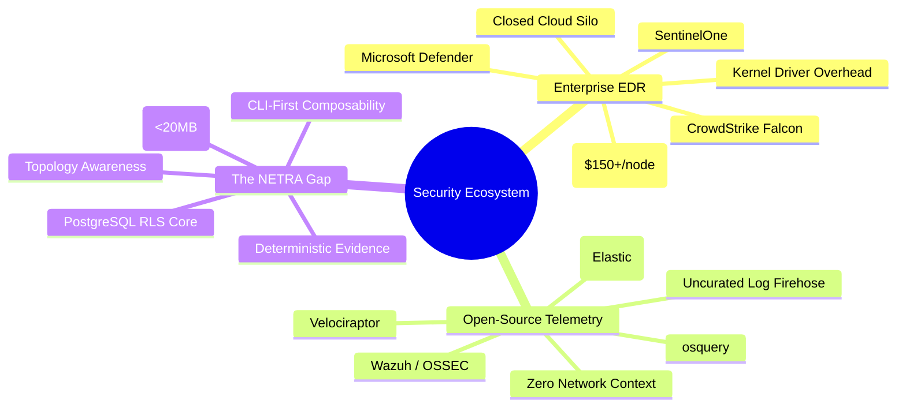
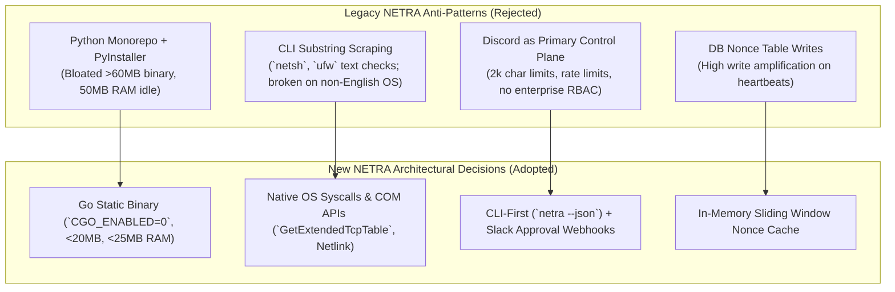
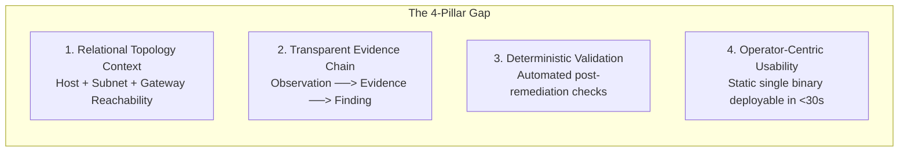
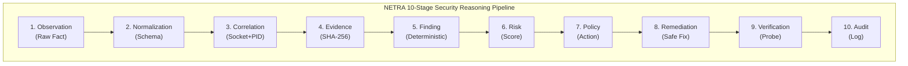
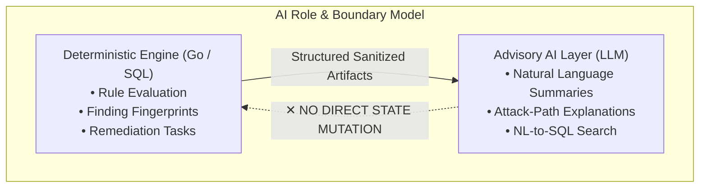

# NETRA — Deep Research, Ecosystem Analysis & Post-Mortem

> **Overview**
>
> This document compiles the comprehensive academic research, industry ecosystem discovery, legacy post-mortem audits, comparative analysis of reference projects (including Drishti-Innofusion), and architectural decision rationale for NETRA (Network & Endpoint Threat Reconnaissance Architecture).

**Status:** Approved Research Base  
**Audience:** Security Researchers, Systems Architects, Students, Academic Reviewers  
**Purpose:** Preserves the foundational discovery data, post-mortem findings, and comparative trade-off analyses justifying all architectural choices in NETRA.

---

## Contents

1. [Executive Research Summary](#1-executive-research-summary)
2. [Problem Space Discovery & Ecosystem Mindmap](#2-problem-space-discovery--ecosystem-mindmap)
3. [Industry Landscape & Competitive Analysis](#3-industry-landscape--competitive-analysis)
4. [Legacy NETRA Post-Mortem & Evolution Analysis](#4-legacy-netra-post-mortem--evolution-analysis)
5. [Drishti-Innofusion Reference Analysis](#5-drishti-innofusion-reference-analysis)
6. [The Identified Market & Technical Gap](#6-the-identified-market--technical-gap)
7. [NETRA Differentiation Thesis](#7-netra-differentiation-thesis)
8. [Network Intelligence & Topology Discovery Research](#8-network-intelligence--topology-discovery-research)
9. [Graph vs. Relational Data Architecture Evaluation](#9-graph-vs-relational-data-architecture-evaluation)
10. [Endpoint Agent Architecture & Language Evaluation](#10-endpoint-agent-architecture--language-evaluation)
11. [Communication Protocol & Network Traversal Analysis](#11-communication-protocol--network-traversal-analysis)
12. [Device Identity, Cryptography & Attestation Research](#12-device-identity-cryptography--attestation-research)
13. [Task Orchestration & State Machine Modeling](#13-task-orchestration--state-machine-modeling)
14. [Finding, Evidence & Risk Data Modeling](#14-finding-evidence--risk-data-modeling)
15. [AI Boundaries & Decision Framework](#15-ai-boundaries--decision-framework)
16. [Third-Party Integration Analysis (Slack & Discord)](#16-third-party-integration-analysis-slack--discord)
17. [Supply Chain & Agent Update Security Research](#17-supply-chain--agent-update-security-research)
18. [Core Deep-Thinking Questions Answered](#18-core-deep-thinking-questions-answered)
19. [Visual Documentation & Diagram Inventory](#19-visual-documentation--diagram-inventory)

---

## 1. Executive Research Summary

Defensive security infrastructure in 2026 presents a sharp divergence. Enterprise Endpoint Detection and Response (EDR) platforms (CrowdStrike Falcon, Microsoft Defender for Endpoint, SentinelOne) are closed, costly, and kernel-intrusive. Conversely, open-source host collectors (osquery, Wazuh, auditd) emit overwhelming, uncurated log streams lacking relational network context, explainable risk models, or closed-loop remediation.

This research establishes **NETRA** as an open-source, academic defensive platform that unifies **endpoint posture reconnaissance** with **local network topology** within a deterministic 10-stage evidence pipeline.

---

## 2. Problem Space Discovery & Ecosystem Mindmap

---

## 3. Industry Landscape & Competitive Analysis

| System | Architecture & Language | Telemetry Source | Primary Strength | Critical Limitation for NETRA's Use Case |
| :--- | :--- | :--- | :--- | :--- |
| **osquery** | C++ daemon embedding SQLite | OS tables (processes, sockets, users) | Exposes OS state as standard SQL virtual tables | Pure telemetry collector; no built-in remediation, no topology synthesis, requires heavy third-party control planes. |
| **Velociraptor** | Single Go binary with custom VQL engine | Raw NTFS, memory, MFT, process tables | Fast, flexible digital forensics and incident hunting across 10,000+ endpoints | Designed for point-in-time forensic investigations, steep learning curve (VQL), not built for continuous posture reasoning. |
| **Wazuh** | C agent + Python scripts + OpenSearch | Log files (Syslog, EventLog), FIM, rootcheck | Broad compliance mapping (PCI-DSS, SOC 2) | High server operational complexity (OpenSearch/Elastic cluster), outdated XML rule syntax, brittle regex decoders. |
| **LimaCharlie** | C/C++ sensor + cloud event routing | Real-time EDR telemetry ring | "SecOps Cloud" primitives with granular API control | Proprietary commercial cloud; not an open-source, topology-aware self-hostable platform. |
| **Elastic Agent**| Go wrapper managing Elastic Beats | System logs, NetFlow, Endpoint Security | Unified log and metric collection in Elastic Stack | High host memory footprint (>250MB RAM), strict dependency on expensive Elasticsearch clusters. |
| **CrowdStrike / Defender** | Proprietary C++ kernel drivers | Kernel hooks (ETW, eBPF, Minifilter) | Enterprise-grade malware execution blocking | Expensive ($150+/node), closed-source, cloud-locked, ignores network routing topology and local posture reasoning. |

---

## 4. Legacy NETRA Post-Mortem & Evolution Analysis

An audit of the legacy repository (`https://github.com/Subhadip-Paul2006/NETRA-agent`) highlighted key architectural anti-patterns that were eliminated in the new design:

---

## 5. Drishti-Innofusion Reference Analysis

The open-source reference project **Drishti-Innofusion** (`https://github.com/soumyachk101/Drishti-Innofusion/`) was evaluated strictly for comparative academic research:
* **Valuable Concepts Observed**: Exploring multi-workstation telemetry and correlating browser activity with external connection flows.
* **Architectural Shortcomings Identified**:
  - Direct database queries from unauthenticated endpoints (creating privilege escalation risks).
  - Heavy reliance on scripting interpreters without binary sandboxing.
  - Incomplete offline buffering resulting in data loss during network drops.
* **NETRA's Differentiators**: Decoupled control API, local-first SQLite WAL buffering, strict Ed25519 asymmetric attestation, and zero inbound listening ports.

---

## 6. The Identified Market & Technical Gap

---

## 7. NETRA Differentiation Thesis

---

## 8. Network Intelligence & Topology Discovery Research

* **Stage 1 (Passive Extraction)**: Zero-traffic reading of kernel routing tables and OS neighbor/ARP caches (`GetIpNetTable2` on Windows, `ip neigh` on Linux).
* **Stage 2 (Directed Inferences)**: Gateway traceroute and reverse DNS (PTR) queries.
* **Stage 3 (Controlled Micro-Probing)**: Policy-gated unicast probes to standard ports (22, 80, 445, 3389).

---

## 9. Graph vs. Relational Data Architecture Evaluation

* **Selected Approach**: **PostgreSQL 16 Recursive Common Table Expressions (CTEs)**.
* **Rationale**: Enables sub-10ms graph path queries for up to 50,000 nodes within the existing ACID transaction boundary; completely eliminates the operational complexity of managing a separate Neo4j cluster.

---

## 10. Endpoint Agent Architecture & Language Evaluation

* **Selected Language**: **Go (Golang 1.22+)** with optional native Rust extensions.
* **Rationale**: Single static binary (<20MB), low idle memory (<25MB RAM), sub-millisecond cold start, and robust standard library support for cross-platform system calls.

---

## 11. Communication Protocol & Network Traversal Analysis

* **Selected Protocol**: Persistent **WebSocket over TLS 1.3 (WSS)** with **Protocol Buffers v3**.
* **Rationale**: Traverses corporate NAT gateways with zero open inbound ports on the client firewall, while Protobuf minimizes bandwidth.

---

## 12. Device Identity, Cryptography & Attestation Research

* **Cryptographic Standard**: **Ed25519 (RFC 8032)** asymmetric public-key cryptography.
* **Key Storage**: Windows DPAPI, Linux SecretService, macOS Keychain.

---

## 13. Task Orchestration & State Machine Modeling

Tasks follow an explicit state machine:
$$\text{PENDING} \longrightarrow \text{DISPATCHED} \longrightarrow \text{LEASED} \longrightarrow \text{RUNNING} \longrightarrow \text{COMPLETED} \ (\text{or } \text{FAILED} / \text{CANCELLED})$$

---

## 14. Finding, Evidence & Risk Data Modeling

* **Deduplication Fingerprint Formula**:
  $$\text{Fingerprint} = \text{SHA-256}(\text{TenantID} \parallel \text{DeviceID} \parallel \text{Capability} \parallel \text{RuleID} \parallel \text{ResourceKey})$$

---

## 15. AI Boundaries & Decision Framework

---

## 16. Third-Party Integration Analysis (Slack & Discord)

* **Slack**: Positioned as an **Asynchronous Notification & Human Approval Gateway** utilizing Block Kit interactive buttons.
* **Discord**: Demoted to an **Optional Outbound Webhook Notifier** for homelabs and students.

---

## 17. Supply Chain & Agent Update Security Research

Release binaries are compiled hermetically (`CGO_ENABLED=0`), signed keylessly with **Cosign**, verified via **The Update Framework (TUF)**, and installed via atomic binary swaps.

---

## 18. Core Deep-Thinking Questions Answered

1. **Fundamental Problem**: Contextual disconnect between endpoint configuration posture and local network reachability.
2. **Target Audience**: Students, security researchers, DevSecOps engineers, and lab administrators.
3. **Core Differentiator**: Deterministic 10-stage evidence pipeline + passive topology synthesis in a single static Go binary (<20MB).
4. **Non-Goals**: No kernel file filter drivers, no arbitrary remote shell, no commercial subscription model.
5. **MVP Goal**: Validate that a single Go binary can enroll via Ed25519, stream posture over WSS, and output deduplicated findings via a clean CLI (`netra`).

---

## 19. Visual Documentation & Diagram Inventory

The following table catalogs all visual diagrams engineered across the documentation suite:

| Diagram ID | Document | Diagram Title | Mermaid Type | Explanatory Purpose |
| :--- | :--- | :--- | :--- | :--- |
| **DIA-001** | `README.md` | NETRA System Topology | `flowchart TD` | Illustrates host, control plane, and integration relationships |
| **DIA-002** | `README.md` | Documentation Navigation Map | `flowchart TD` | Guides readers across the 15-document specification suite |
| **DIA-003** | `docs/PRD.md` | NETRA Academic Mission | `flowchart TD` | Connects product pillars to the core value proposition |
| **DIA-004** | `docs/PRD.md` | The Security Context Void | `flowchart TD` | Highlights the void between EDRs and open-source log tools |
| **DIA-005** | `docs/PRD.md` | Explicit Non-Goals | `flowchart TD` | Visually separates educational goals from non-goals |
| **DIA-006** | `docs/PRD.md` | Alex's Operational Journey | `journey` | Illustrates the end-to-end user experience of onboarding to fix |
| **DIA-007** | `docs/TRD.md` | Runtime Resource Ceilings | `flowchart LR` | Details binary size, memory ceilings, and latency budgets |
| **DIA-008** | `docs/TRD.md` | Automated Test Matrix | `flowchart TD` | Connects unit, integration, and E2E verification suites |
| **DIA-009** | `docs/ARCHITECTURE.md`| Core Architecture Principles | `flowchart LR` | Summarizes foundational engineering tenets |
| **DIA-010** | `docs/ARCHITECTURE.md`| High-Level System Topology | `flowchart TD` | Master architectural diagram showing all services and flows |
| **DIA-011** | `docs/ARCHITECTURE.md`| Dual Runtime Execution Modes | `flowchart TD` | Compares interactive CLI mode with background daemon mode |
| **DIA-012** | `docs/ARCHITECTURE.md`| Agent Internal Subsystems | `flowchart TD` | Details agent internal probes, deduplication, and queues |
| **DIA-013** | `docs/ARCHITECTURE.md`| Network Topology Synthesis | `flowchart LR` | Shows cross-agent ARP correlation and PostgreSQL CTE graphs |
| **DIA-014** | `docs/ARCHITECTURE.md`| Controlled Remediation Flow | `flowchart TD` | Pre-flight check, native OS change, and post-validation loop |
| **DIA-015** | `docs/ARCHITECTURE.md`| OS Abstraction Adapters | `flowchart TD` | Maps Go core to Win32 COM, Netlink, and BSD socket layers |
| **DIA-016** | `docs/ARCHITECTURE.md`| Trust & Security Boundaries | `flowchart TD` | Delineates untrusted hosts, local DACLs, and control plane RLS |
| **DIA-017** | `docs/SYSTEM_DESIGN.md`| Process Models & Dual Modes | `flowchart TD` | Connects CLI invocation and two-tier background daemon |
| **DIA-018** | `docs/SYSTEM_DESIGN.md`| System Startup & Keyring | `sequenceDiagram` | OS service startup, SQLite migration, and DPAPI key retrieval |
| **DIA-019** | `docs/SYSTEM_DESIGN.md`| Device Identity State Machine | `stateDiagram-v2` | State transitions for keypair generation and attestation |
| **DIA-020** | `docs/SYSTEM_DESIGN.md`| Local SQLite Entity Schema | `erDiagram` | Schema for local config, observation queue, and scan history |
| **DIA-021** | `docs/SYSTEM_DESIGN.md`| Task Orchestration States | `stateDiagram-v2` | State transitions for task dispatch, lease, and completion |
| **DIA-022** | `docs/SYSTEM_DESIGN.md`| 3-Tier Topology Discovery | `flowchart TD` | Connects passive ARP, directed traceroute, and micro-probing |
| **DIA-023** | `docs/SYSTEM_DESIGN.md`| Browser Exposure Observation | `sequenceDiagram` | Correlates browser PID with remote IP and DNS cache |
| **DIA-024** | `docs/SYSTEM_DESIGN.md`| Deterministic CVE Matching | `flowchart LR` | Package inventory mapping against cached NVD/OSV feeds |
| **DIA-025** | `docs/SYSTEM_DESIGN.md`| 10-Stage Data Pipeline | `flowchart TD` | Full data lifecycle from observation to immutable audit log |
| **DIA-026** | `docs/SYSTEM_DESIGN.md`| Remediation Verification Loop | `stateDiagram-v2` | State transitions for approval, pre-flight, and rollback |
| **DIA-027** | `docs/SYSTEM_DESIGN.md`| Offline Sync State Machine | `stateDiagram-v2` | State transitions for offline FIFO queueing and recovery |
| **DIA-028** | `docs/SYSTEM_DESIGN.md`| Device Enrollment Flow | `sequenceDiagram` | Multi-actor sequence for token validation and Ed25519 pairing |
| **DIA-029** | `docs/SYSTEM_DESIGN.md`| Finding Deduplication Flow | `sequenceDiagram` | Ingestion, SHA-256 fingerprint check, and upsert sequence |
| **DIA-030** | `docs/SECURITY_CHECK.md`| Core Security Tenets | `flowchart TD` | Displays zero-trust architectural principles |
| **DIA-031** | `docs/SECURITY_CHECK.md`| Capability Whitelist vs Shell | `flowchart LR` | Details approved capabilities vs prohibited shell calls |
| **DIA-032** | `docs/SECURITY_CHECK.md`| Remediation Approval Sequence | `sequenceDiagram` | Human operator authorization and post-validation sequence |
| **DIA-033** | `docs/UI_UX.md` | CLI Command Hierarchy Tree | `flowchart TD` | Complete tree of `netra` CLI subcommands and flags |
| **DIA-034** | `docs/UI_UX.md` | Stream Separation Architecture| `flowchart TD` | Visualizing stdout data piping vs. stderr UI output |
| **DIA-035** | `docs/UI_UX.md` | Interactive vs. CI Mode Check | `flowchart TD` | `isatty` detection and terminal spinner handling |
| **DIA-036** | `docs/USAGE.md` | Operational User Lifecycle | `flowchart TD` | Install ──> Enroll ──> Scan ──> View ──> Fix ──> Validate |
| **DIA-037** | `docs/USAGE.md` | Diagnostics Decision Tree | `flowchart TD` | Decision tree for troubleshooting offline agents |
| **DIA-038** | `docs/OS_VERSATILE.md` | OS Adapter Abstraction | `flowchart TD` | Go interface to Windows/Linux/macOS syscall mapping |
| **DIA-039** | `docs/OS_VERSATILE.md` | Privilege Degradation Tree | `flowchart TD` | Elevated daemon context vs unprivileged user scopes |
| **DIA-040** | `docs/API.md` | API Calling Actor Boundaries | `flowchart TD` | Separates Agent API, Control API, and Integration API |
| **DIA-041** | `docs/API.md` | Control Plane Relational Model| `erDiagram` | PostgreSQL entities, cardinalities, and foreign keys |
| **DIA-042** | `docs/SLACK.md` | Slack Integration Gateway | `flowchart LR` | NETRA backend to Slack bot alert delivery |
| **DIA-043** | `docs/SLACK.md` | Interactive Approval Sequence | `sequenceDiagram` | Human-in-the-loop remediation authorization sequence |
| **DIA-044** | `docs/SLACK.md` | Least-Privilege OAuth Scopes | `flowchart TD` | Permitted scopes vs. strictly prohibited scopes |
| **DIA-045** | `docs/DISCORD.md` | Discord Webhook Architecture | `flowchart LR` | One-way webhook egress to Discord channel |
| **DIA-046** | `docs/DISCORD.md` | Prohibited Discord Actions | `flowchart TD` | Visually reinforces restrictions on Discord integration |
| **DIA-047** | `docs/CI_CD.md` | SLSA Level 3 Supply Chain Flow| `flowchart LR` | Build ──> Scan ──> SBOM ──> Cosign Sign ──> Release |
| **DIA-048** | `docs/CI_CD.md` | Automated PR Quality Gates | `flowchart TD` | 5-stage automated check matrix for pull requests |
| **DIA-049** | `docs/CI_CD.md` | Release Smoke Test & Rollback | `flowchart TD` | Clean VM provisioning and automated rollback trigger |
| **DIA-050** | `docs/WORKFLOW.md` | Git Branching Model | `gitGraph` | Git flow branching, feature merging, and patch tags |
| **DIA-051** | `docs/WORKFLOW.md` | Feature Development Lifecycle | `flowchart TD` | Issue ──> Design/ADR ──> Code ──> PR ──> Merge |
| **DIA-052** | `docs/WORKFLOW.md` | Emergency Hotfix Release Flow | `flowchart TD` | Rapid vulnerability patch and expedited release flow |
| **DIA-053** | `docs/PHASES.md` | Master Timeline Roadmap | `timeline` | Chronological milestone roadmap (Phases 0 to 17) |
| **DIA-054** | `docs/PHASES.md` | Phase Dependency & Gating Graph| `flowchart TD` | Dependency gating flow from Phase 0 to Phase 17 |
| **DIA-055** | `docs/RESEARCH.md` | Security Ecosystem Mindmap | `mindmap` | Landscape categorization and identification of the gap |
| **DIA-056** | `docs/RESEARCH.md` | Legacy vs. New Architecture | `flowchart TD` | Post-mortem lessons translated to architectural decisions |
| **DIA-057** | `docs/RESEARCH.md` | 4-Pillar Market Gap | `flowchart LR` | Visualizing the four core dimensions of NETRA's gap |
| **DIA-058** | `docs/RESEARCH.md` | 10-Stage Reasoning Pipeline | `flowchart TD` | Full deterministic reasoning pipeline |
| **DIA-059** | `docs/RESEARCH.md` | AI Role & Boundary Model | `flowchart TD` | Deterministic engine core air-gapped from advisory AI |
