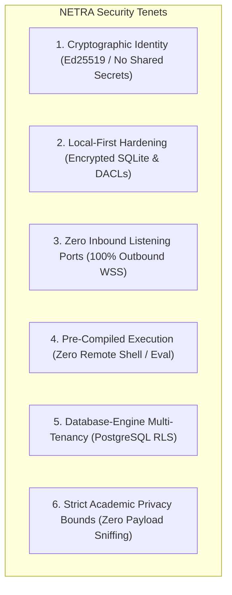
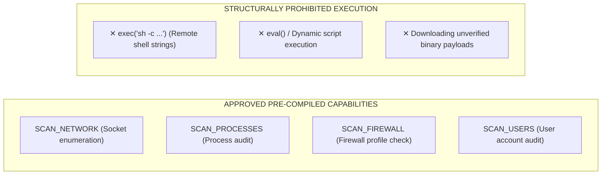
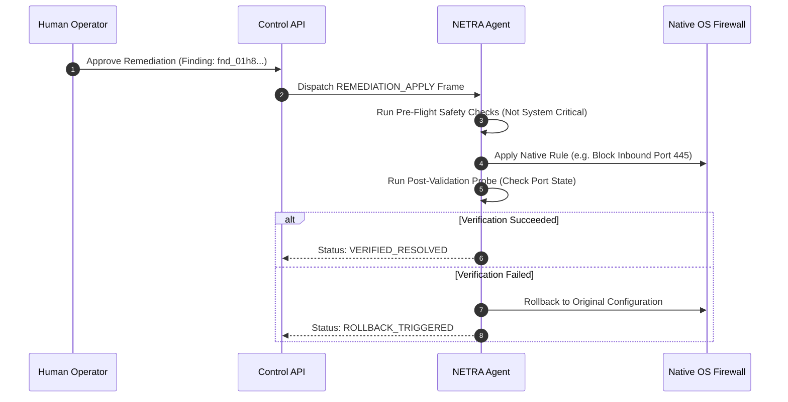

# NETRA — Comprehensive Security Architecture & Threat Model (STRIDE)

> **Overview**
>
> This document details the threat models, cryptographic verification systems, access control boundaries, sandboxing mechanisms, and supply chain safeguards implemented across NETRA (Network & Endpoint Threat Reconnaissance Architecture).

**Status:** Specified / Designed  
**Audience:** Security Engineers, Cryptographers, Academic Reviewers, System Auditors  
**Purpose:** Establishes the formal security model and verifies that the platform maintains zero-trust isolation, cryptographic integrity, and strict privacy boundaries.

---

## Contents

1. [Core Security Principles & Trust Boundaries](#1-core-security-principles--trust-boundaries)
2. [Device Identity & Asymmetric Cryptography (Ed25519)](#2-device-identity--asymmetric-cryptography-ed25519)
3. [Local State & SQLite Security (Encryption & WAL)](#3-local-state--sqlite-security-encryption--wal)
4. [Control Plane & Multi-Tenant Row-Level Security (RLS)](#4-control-plane--multi-tenant-row-level-security-rls)
5. [Pre-Compiled Capability Whitelist vs. Prohibited Remote Shell](#5-pre-compiled-capability-whitelist-vs-prohibited-remote-shell)
6. [Browser Observation Privacy & Security Guardrails](#6-browser-observation-privacy--security-guardrails)
7. [Controlled Remediation Security & Verification Loops](#7-controlled-remediation-security--verification-loops)
8. [Supply Chain Integrity, SBOM & TUF Secure Updates](#8-supply-chain-integrity-sbom--tuf-secure-updates)
9. [Compromised Agent Threat Model](#9-compromised-agent-threat-model)
10. [Comprehensive STRIDE Threat Model Matrix](#10-comprehensive-stride-threat-model-matrix)

---

## 1. Core Security Principles & Trust Boundaries



---

## 2. Device Identity & Asymmetric Cryptography (Ed25519)

Every enrolled agent host is identified by an **Ed25519 (RFC 8032)** asymmetric cryptographic keypair:
* **Private Key Generation**: Generated locally in memory upon initial enrollment. Private keys are never transmitted over the network.
* **OS Protected Key Storage**:
  - **Windows**: Protected via DPAPI (`CryptProtectData`) using `CRYPTPROTECT_LOCAL_MACHINE` scope.
  - **Linux**: Stored via Freedesktop SecretService API or `0400` root-restricted filesystem vaults.
  - **macOS**: Stored in the Apple System Keychain with explicit access control lists.
* **Canonical Header Verification**: All agent requests are signed with canonical headers (`X-NETRA-Device-ID`, `X-NETRA-Timestamp`, `X-NETRA-Nonce`, `X-NETRA-Signature`) and validated against a $\pm 300\text{s}$ timestamp window and sliding nonce cache.

---

## 3. Local State & SQLite Security (Encryption & WAL)

* **Filesystem DACLs**: Local database files (`agent.db`) are restricted to `0600` permissions (accessible only by the root/SYSTEM supervisor).
* **Encryption at Rest**: Optional SQLCipher encryption using a key derived from the OS hardware-backed keyring.
* **Memory Scrubbing**: Sensitive cryptographic buffers in RAM are zeroed immediately after signing operations.

---

## 4. Control Plane & Multi-Tenant Row-Level Security (RLS)

Multi-tenant data isolation is enforced at the **PostgreSQL database engine layer**, completely eliminating application-level tenant leakage:

```sql
-- PostgreSQL Engine RLS Policy
ALTER TABLE findings ENABLE ROW LEVEL SECURITY;

CREATE POLICY tenant_isolation_policy ON findings
  FOR ALL
  USING (tenant_id = NULLIF(current_setting('app.current_tenant_id', true), '')::uuid);
```

---

## 5. Pre-Compiled Capability Whitelist vs. Prohibited Remote Shell



---

## 6. Browser Observation Privacy & Security Guardrails

NETRA enforces strict academic privacy boundaries when correlating web browser processes with network exposures:
* **Allowed**: Correlating browser PID with destination IP, port 443/80, protocol, and reverse DNS domain.
* **Prohibited**: Under no circumstances shall NETRA read web page DOM trees, form fields, keystrokes, browser history, cookies, or HTTP payloads.

---

## 7. Controlled Remediation Security & Verification Loops



---

## 8. Supply Chain Integrity, SBOM & TUF Secure Updates

* **SLSA Level 3 Compliance**: All release binaries are compiled hermetically in GitHub Actions (`CGO_ENABLED=0`).
* **Cryptographic Attestation**: Binaries are signed keylessly with **Cosign** using GitHub OIDC tokens.
* **TUF Auto-Updates**: Auto-updates follow **The Update Framework (TUF)** with root keys held offline. Update payloads are verified before atomic disk replacement.

---

## 9. Compromised Agent Threat Model

If an attacker achieves full root/SYSTEM compromise of an endpoint running NETRA:
1. **Blast Radius Containment**: The attacker gains access only to that specific device's Ed25519 private key.
2. **Tenant Isolation**: The attacker cannot access or forge telemetry for other endpoints; the server verifies signatures against the registered public key for that UUID.
3. **Database Protection**: The attacker cannot directly access the PostgreSQL database or bypass Row-Level Security.
4. **Immediate Revocation**: The central control plane can issue an emergency device revocation, permanently dropping the agent's WSS stream.

---

## 10. Comprehensive STRIDE Threat Model Matrix

| STRIDE Category | Specific Threat Scenario | Attack Surface | Impact | Likelihood | Architectural Mitigation | Residual Risk |
| :--- | :--- | :--- | :--- | :--- | :--- | :--- |
| **Spoofing** | Rogue host attempts to impersonate an enrolled agent | WSS Ingress `/v1/agent/stream` | High | Low | Mandatory Ed25519 asymmetric signatures on every frame. | Negligible |
| **Tampering** | Man-in-the-Middle modifies task dispatch frames | Network Ingress | High | Low | Strict TLS 1.3 encryption with pinned server certificates. | Negligible |
| **Repudiation** | Operator denies authorizing a destructive remediation | Remediation API | Medium | Low | Cryptographically signed `audit_events` log with operator JWT claims. | Negligible |
| **Information Disclosure** | Local user attempts to read cached security findings | Local Filesystem | Medium | Low | Local SQLite database protected by `0600` DACLs and OS keyring. | Low (Root local access) |
| **Denial of Service** | Scanner enters infinite loop or consumes all host RAM | Worker Process | Medium | Medium | Hard sandboxing via Windows Job Objects (100MB) & Linux cgroups (20% CPU). | Negligible |
| **Elevation of Privilege** | Attacker injects shell metacharacters into task arguments | Task Execution Engine | Critical | Low | Zero remote shell execution; strict pre-compiled capability whitelisting. | Negligible |
