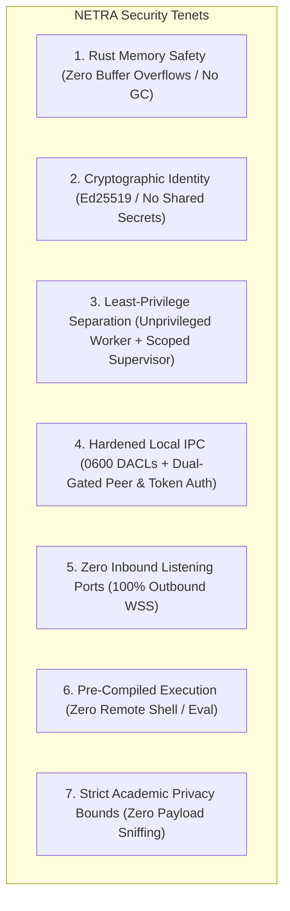
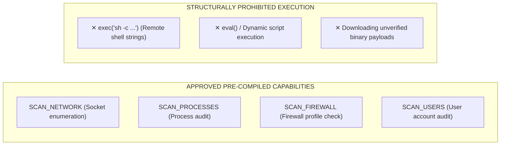
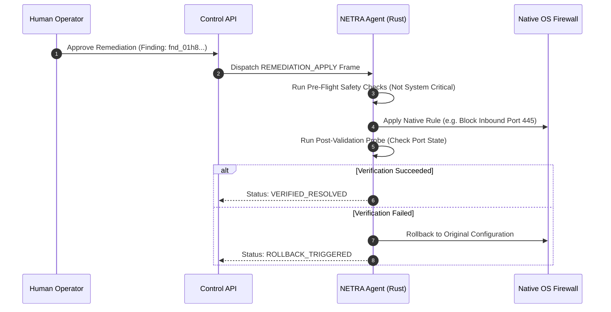

# NETRA — Comprehensive Security Architecture & Threat Model (STRIDE)

> **Overview**
>
> This document details the threat models, cryptographic verification systems, access control boundaries, Rust memory safety guarantees, and supply chain safeguards implemented across NETRA (Network & Endpoint Threat Reconnaissance Architecture).

**Status:** Specified / Designed  
**Audience:** Security Engineers, Cryptographers, Academic Reviewers, System Auditors  
**Purpose:** Establishes the formal security model and verifies that the platform maintains zero-trust isolation, cryptographic integrity, and strict privacy boundaries.

---

## Contents

1. [Core Security Principles & Trust Boundaries](#1-core-security-principles--trust-boundaries)
2. [Rust Memory Safety & Concurrency Guarantees](#2-rust-memory-safety--concurrency-guarantees)
3. [Device Identity & Asymmetric Cryptography (Ed25519)](#3-device-identity--asymmetric-cryptography-ed25519)
4. [Local State & SQLite Security (Encryption & WAL)](#4-local-state--sqlite-security-encryption--wal)
5. [Control Plane & Multi-Tenant Row-Level Security (RLS)](#5-control-plane--multi-tenant-row-level-security-rls)
6. [Pre-Compiled Capability Whitelist vs. Prohibited Remote Shell](#6-pre-compiled-capability-whitelist-vs-prohibited-remote-shell)
7. [Browser Observation Privacy & Security Guardrails](#7-browser-observation-privacy--security-guardrails)
8. [Controlled Remediation Security & Verification Loops](#8-controlled-remediation-security--verification-loops)
9. [Supply Chain Integrity, SBOM & TUF Secure Updates](#9-supply-chain-integrity-sbom--tuf-secure-updates)
10. [Compromised Agent Threat Model](#10-compromised-agent-threat-model)
11. [Comprehensive STRIDE Threat Model Matrix](#11-comprehensive-stride-threat-model-matrix)

---

## 1. Core Security Principles & Trust Boundaries



### Protection Layer & Containment Matrix

NETRA establishes explicit, verifiable containment boundaries across operating systems, avoiding overclaiming security guarantees:

| Protection Layer | Windows Control | Linux Control | macOS Control | Implementation Phase |
| :--- | :--- | :--- | :--- | :--- |
| **Resource Limitation (RAM)** | Win32 Job Object (`ProcessMemoryLimit = 100MB`) | `cgroups v2` (`memory.max = 100M`) / `setrlimit` | POSIX `setrlimit(RLIMIT_AS)` | **Phase 2.3** |
| **Resource Limitation (CPU)** | Win32 Job Object (`CPU_RATE_CONTROL = 20%`) | `cgroups v2` (`cpu.max = "20000 100000"`) | Process nice priority | **Phase 2.3** |
| **Process Lifecycle Isolation** | `JOB_OBJECT_LIMIT_KILL_ON_JOB_CLOSE` | `prctl(PR_SET_PDEATHSIG, SIGKILL)` | IPC disconnect watchdog | **Phase 2.3** |
| **Privilege Reduction** | Unprivileged Token / Standard User token | Dropped to `netra` unprivileged user | Dropped to `_nobody` user | **Phase 2.3** |
| **Local Transport DACLs** | Named Pipe SDDL (`0600` equivalent) | Unix Domain Socket mode `0600` in `0700` dir | Unix Domain Socket mode `0600` in `0700` dir | **Phase 2.3** |
| **Peer Credential Verification** | `GetNamedPipeClientProcessId` check | `SO_PEERCRED` (PID + UID check) | `getpeereid()` / `LOCAL_PEERCRED` | **Phase 2.3** |
| **Ephemeral Token Handshake** | 256-bit CSPRNG token exchange | 256-bit CSPRNG token exchange | 256-bit CSPRNG token exchange | **Phase 2.3** |
| **Filesystem Isolation** | Windows AppContainer / Sandbox profile | Mount namespaces / Pivot root | Sandbox seatbelt file profile | Phase 14 (Hardening) |
| **Syscall Restriction** | Restricted Token / Syscall filter | `seccomp-bpf` syscall filter | `sandbox_init` profile | Phase 14 (Hardening) |

---

## 2. Rust Memory Safety & Concurrency Guarantees

Building the NETRA endpoint layer in Rust eliminates an entire class of critical security vulnerabilities commonly afflicting C/C++ agents:
* **Spatial & Temporal Memory Safety**: Rust's ownership, borrow checker, and lifetime system prevents buffer overflows, use-after-free, double-free, and dangling pointer vulnerabilities at compile-time.
* **Data Race Freedom**: Multi-threaded concurrency in Tokio guarantees thread safety without race conditions or shared mutable state vulnerabilities.
* **Zero Unsafe in Core Scanners**: Core posture scanners adhere to `#![forbid(unsafe_code)]` wherever feasible, isolating minimal native FFI bindings into audited wrapper crates.

---

## 3. Device Identity & Asymmetric Cryptography (Ed25519)

Every enrolled agent host is identified by an **Ed25519 (RFC 8032)** asymmetric cryptographic keypair:
* **Private Key Generation & Residency**: Generated locally in memory upon initial enrollment using `ed25519-dalek` and `zeroize`. Private keys are never transmitted over the network.
* **OS-Protected Key Storage (KeyStore)**:
  - **Windows**: Protected via Win32 DPAPI (`CryptProtectData`) using user or machine master key scope.
  - **Linux**: Stored via Freedesktop Secret Service API over D-Bus. In headless environments without a secret provider, the system fails safely with `ERR_KEYSTORE_UNAVAILABLE` (no weak pseudo-encryption from public host identifiers like `/etc/machine-id`).
  - **macOS**: Stored in Apple Keychain Services (`SecItemAdd`) with explicit access control lists.
* **Memory Protection**: Volatile memory buffers holding private key seed material implement `ZeroizeOnDrop` via `zeroize::Zeroizing<T>` to scrub memory when dropped.
* **Canonical Header Verification**: All agent requests are signed with canonical headers (`X-NETRA-Device-ID`, `X-NETRA-Timestamp`, `X-NETRA-Nonce`, `X-NETRA-Signature`) and validated against a $\pm 300\text{ s}$ timestamp window and sliding nonce cache.

---

## 4. Local State & Local IPC Security Boundary

### 4.1 Local State & SQLite Storage Security
* **Filesystem DACLs & Permissions**: Parent directory is restricted to `0700` permissions; local database files (`agent.db`, `agent.db-wal`, `agent.db-shm`) are restricted to `0600` permissions (accessible exclusively by the executing user SID or daemon owner).
* **Secret Segregation Boundary**: Asymmetric private keys (Ed25519) and bootstrap tokens are **strictly prohibited** from SQLite plaintext storage; private keys are managed exclusively by OS-protected key storage (DPAPI / Secret Service / Keychain in Phase 6). SQLite stores only public keys and metadata.
* **Safe 6-Step Quarantine Directory Protocol**: When corruption is detected, active handles are closed, database files are isolated into a dedicated `quarantine_<TIMESTAMP>/` directory, and an adjacent `quarantine_meta.json` recording SHA-256 hashes, file sizes, and corruption errors is generated. Silent automated file deletion is strictly prohibited.
* **Storage Recovery Safeguards**: The manual operator command `netra storage recover` requires explicit operator confirmation in interactive mode or `--force-reinit` in non-interactive/CI mode. Recovery strictly archives existing database, WAL, and SHM files to a quarantine directory before re-initializing a clean store. Recovery is never invoked implicitly from health checks or status commands.
* **Atomic Clean-Shutdown Marker Protocol**: `.runtime_active` tracks process session ownership and prevents multi-instance file conflicts. `.clean_shutdown` is written atomically only after handle closure and checkpoint completion to reliably detect crashes and trigger Tier 2 `PRAGMA quick_check;`.

### 4.2 Local IPC as a Critical Security Boundary
The Local IPC link between the Supervisor and Worker processes constitutes a high-assurance host trust boundary:

1. **Kernel Peer Identity Verification**: Before accepting any request frame, the IPC server queries the OS kernel for the connecting process credentials (`GetNamedPipeClientProcessId` on Windows; `SO_PEERCRED` on Linux; `getpeereid()` on macOS). If the PID/UID does not strictly match the expected spawned worker process, the connection is instantly rejected and logged.
2. **Ephemeral Handshake Secret**: At worker launch, the supervisor generates a single-use 256-bit cryptographically secure token passed via private environment variable or secure startup argument. The worker must present this token in the `HandshakeRequest` within a 3.0-second handshake deadline.
3. **Session Invalidation on Restart**: Every worker restart completely invalidates the previous IPC session. The supervisor generates a fresh 256-bit token for the new instance, rendering previous tokens or stale sockets useless.
4. **Frame Guard & Parsing Safety**: Length-delimited framing strictly enforces a `1,048,576` byte (1MB) maximum payload size. Frames exceeding this limit or containing malformed JSON are dropped immediately without heap allocation exhaustion.

### 4.3 REST API Gateway Trust Boundary & Threat Model (Phase 5)

The Phase 5 REST API Gateway (`netra-api`) introduces an HTTP interface governed by an **unauthenticated host-local trust assumption and capability minimization**:

```mermaid
flowchart TD
    subgraph Host["Host Environment Trust Boundary"]
        subgraph AttackVectors["Local Threat Actors"]
            L1["Other Local OS User Accounts"]
            L2["Unprivileged Local Processes (Same User)"]
            L3["Browser DNS Rebinding / Localhost CSRF"]
        end

        subgraph Defenses["Phase 5 Security Controls"]
            D1["1. Bind strictly to 127.0.0.1 / ::1 (Loopback Only)"]
            D2["2. Remote/Public Binding Prohibited (No allow_remote)"]
            D3["3. CORS Disabled (Zero browser cross-origin access)"]
            D4["4. Capability Minimization (Read-only diagnostics only)"]
            D5["5. Zero Destructive Endpoints (Recovery blocked on HTTP)"]
            D6["6. Single-Flight Lock for Deep Storage Checks (409 Conflict)"]
            D7["7. Strict Data Classification (Secrets/Paths Redacted)"]
            D8["8. Cache-Control: no-store (Prevent local disk caching)"]
        end

        subgraph CoreService["netra-core / Storage Engine"]
            S1["Read-Only Repository Access"]
        end

        AttackVectors --> Defenses
        Defenses --> CoreService
    end
```



1. **Security Model Definition**: Formally documented as *"Unauthenticated local diagnostic API under a host-local trust assumption"*.
   - **Transport Exposure**: Binding strictly to loopback (`127.0.0.1` / `::1`) eliminates external network accessibility.
   - **Authentication**: Phase 5 does **not** authenticate local caller processes; any local process under the same OS context can connect.
   - **Authorization & Capability Minimization**: Because no local authentication is present, the API scope is strictly constrained to safe, read-only diagnostic inspection (`health`, `version`, `status`, `diagnostics`, `storage/status`, `storage/check`). Destructive actions (such as `netra storage recover`) are **strictly forbidden** from HTTP exposure.
2. **Loopback-Only Invariant**: Phase 5 supports exclusively IPv4 loopback (`127.0.0.1`) and IPv6 loopback (`::1`). Remote/LAN binding is completely disabled in Phase 5 (no `allow_remote` toggle exists). Remote access is deferred to Phase 6+ with cryptographic authentication.
3. **Data Classification Boundary**: `GET /api/v1/diagnostics` strictly redacts and excludes tokens, credentials, private keys, environment variable dumps, and arbitrary filesystem trees.
4. **Single-Flight Abuse Protection & Check Semantics**: Deep database integrity checks (`GET /api/v1/storage/check?deep=true`) utilize an in-memory lock (`AtomicBool`). Concurrent requests receive `409 Conflict` (`ERR_INTEGRITY_CHECK_IN_PROGRESS`) to prevent resource exhaustion attacks. When the check probe executes cleanly, `200 OK` is returned with `passed: true` for clean databases or `passed: false` with detailed corruption diagnostics for damaged databases. Operational engine/I/O execution failures return `500`/`503`.
5. **Anti-Caching Policy**: Live diagnostic endpoints emit `Cache-Control: no-store, no-cache, must-revalidate` to prevent local browser or proxy caching of runtime state.
6. **Phase 6+ Authentication Extension Point**: When remote control is enabled in Phase 6, asymmetric Ed25519 request signature verification and JWT Bearer tokens will be inserted into the Axum Tower middleware pipeline before route handling.

---

Multi-tenant data isolation is enforced at the **PostgreSQL database engine layer**, completely eliminating application-level tenant leakage:

```sql
-- PostgreSQL Engine RLS Policy
ALTER TABLE findings ENABLE ROW LEVEL SECURITY;

CREATE POLICY tenant_isolation_policy ON findings
  FOR ALL
  USING (tenant_id = NULLIF(current_setting('app.current_tenant_id', true), '')::uuid);
```

> [!IMPORTANT]
> Distributed agents **never receive direct Supabase database credentials**. All communication is mediated through the authenticated Control API.

---

## 6. Pre-Compiled Capability Whitelist vs. Prohibited Remote Shell



---

## 7. Browser Observation Privacy & Security Guardrails

NETRA enforces strict academic privacy boundaries when correlating web browser processes with network exposures:
* **Allowed**: Correlating browser PID with destination IP, port 443/80, protocol, and reverse DNS domain.
* **Prohibited**: Under no circumstances shall NETRA read web page DOM trees, form fields, keystrokes, browser history, cookies, or HTTP payloads.

---

## 8. Controlled Remediation Security & Verification Loops



---

## 9. Supply Chain Integrity, SBOM & TUF Secure Updates

* **SLSA Level 3 Compliance**: All release binaries are compiled hermetically in GitHub Actions (`cargo build --release --locked`).
* **Cryptographic Attestation**: Binaries are signed keylessly with **Cosign** using GitHub OIDC tokens.
* **TUF Auto-Updates**: Auto-updates follow **The Update Framework (TUF)** with root keys held offline. Update payloads are verified before atomic disk replacement.

---

## 10. Privilege Separation & Compromised Process Threat Model

### 10.1 Worker Compromise Threat Model
If an attacker compromises the Tier-2 Worker process (e.g., via logic vulnerability or parser exploit):
1. **No Escalation to Supervisor**: The worker interacts with the supervisor strictly over the typed Local IPC interface. It cannot execute arbitrary commands or code within the supervisor.
2. **Resource Throttling**: The worker cannot consume excessive host RAM or CPU; OS Job Objects / cgroups / rlimits enforce hard limits.
3. **No Direct OS Keyring / Elevation Rights**: The worker runs with dropped user privileges and cannot access unauthorized OS capabilities.

### 10.2 Supervisor Compromise Threat Model
If an attacker compromises the host system or supervisor context:
1. **Blast Radius Containment**: The attacker gains access only to that specific device's Ed25519 private key.
2. **Tenant Isolation**: The attacker cannot access or forge telemetry for other endpoints; the server verifies signatures against the registered public key for that UUID.
3. **Database Protection**: The attacker cannot directly access the PostgreSQL database or bypass Row-Level Security.
4. **Emergency Revocation**: The central control plane can issue an emergency device revocation, permanently rejecting all traffic from that device ID.

---

## 11. Comprehensive STRIDE Threat Model Matrix

| STRIDE Category | Specific Threat Scenario | Attack Surface | Impact | Likelihood | Architectural Mitigation | Residual Risk |
| :--- | :--- | :--- | :--- | :--- | :--- | :--- |
| **Spoofing** | Rogue host attempts to impersonate an enrolled agent | WSS Ingress `/v1/agent/stream` | High | Low | Mandatory Ed25519 asymmetric signatures on every frame. | Negligible |
| **Spoofing** | Unauthorized local process attempts to connect to Local IPC | Named Pipe / Unix Socket | High | Low | Dual-gated auth: Kernel peer PID/UID validation + 256-bit ephemeral handshake token. | Negligible |
| **Tampering** | Man-in-the-Middle modifies task dispatch frames | Network Ingress | High | Low | Strict TLS 1.3 encryption with pinned server certificates. | Negligible |
| **Tampering** | Local standard user modifies `agent.db` or IPC socket | Local Filesystem | High | Low | Local files protected by OS DACLs (`0600`) in private directory. | Low (Root local access) |
| **Repudiation** | Operator denies authorizing a destructive remediation | Remediation API | Medium | Low | Cryptographically signed `audit_events` log with operator JWT claims. | Negligible |
| **Information Disclosure** | Local user attempts to read cached security findings | Local Filesystem | Medium | Low | Local SQLite database protected by `0600` DACLs and OS keyring encryption. | Low (Root local access) |
| **Denial of Service** | Scanner enters infinite loop or consumes host memory | Worker Process | Medium | Medium | Hard resource bounds via Windows Job Objects (100MB) & Linux cgroups / setrlimit. | Negligible |
| **Denial of Service** | Malicious process floods Local IPC with oversized payloads | Local IPC Socket | Medium | Low | `LengthDelimitedCodec` enforces strict 1MB frame limit; drops and closes connection. | Negligible |
| **Elevation of Privilege** | Attacker injects shell metacharacters into task arguments | Task Execution Engine | Critical | Low | Zero remote shell execution; strict pre-compiled capability whitelisting. | Negligible |
| **Elevation of Privilege** | Worker attempts to manipulate supervisor execution | Local IPC Protocol | Critical | Low | Strictly typed JSON command messages with input schema validation; zero raw memory sharing. | Negligible |

