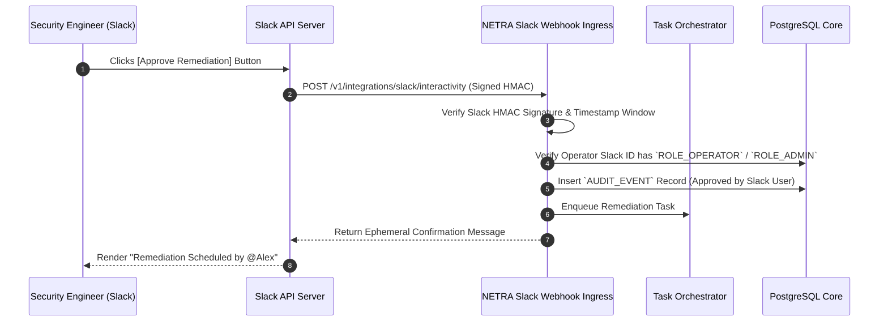

# NETRA — Slack Integration & Human Approval Gateway Architecture

> **Overview**
>
> This document specifies the optional Slack integration for NETRA (Network & Endpoint Threat Reconnaissance Architecture). It details the asynchronous notification architecture, Block Kit message structures, interactive human approval workflows, and least-privilege OAuth boundaries.

**Status:** Specified / Designed  
**Audience:** Security Engineers, Slack App Developers, DevOps Integrators  
**Purpose:** Establishes the technical and security contracts required for human-in-the-loop remediation authorizations via Slack.

---

## Contents

1. [Integration Role & Architecture Philosophy](#1-integration-role--architecture-philosophy)
2. [Supported Use Cases](#2-supported-use-cases)
3. [Alert Notification Model & Block Kit Design](#3-alert-notification-model--block-kit-design)
4. [Interactive Remediation Approval Workflow](#4-interactive-remediation-approval-workflow)
5. [Security Boundaries & OAuth Scopes](#5-security-boundaries--oauth-scopes)
6. [Rate Limits & Failure Handling](#6-rate-limits--failure-handling)
7. [What Slack MUST NOT Be Allowed To Do](#7-what-slack-must-not-be-allowed-to-do)

---

## 1. Integration Role & Architecture Philosophy

Slack is an external third-party communication platform. Within NETRA, Slack is defined strictly as an **Optional Asynchronous Notification & Human Approval Gateway**:
* **Decoupled Architecture**: The core NETRA platform functions completely independently if Slack is unconfigured or offline.
* **No Inbound Agent Traffic**: Endpoints never communicate directly with Slack.

```mermaid
flowchart LR
    subgraph CorePlatform["NETRA Control Plane"]
        BE["NETRA Control API & Engine"]
    end

    subgraph SlackService["Slack Cloud (Optional Gateway)"]
        Bot["Slack Bot App"]
        Channel["#security-alerts Channel"]
    end

    BE -->|Outbound Webhook (TLS 1.3)| Bot
    Bot --> Channel
```

---

## 2. Supported Use Cases

1. **Critical Finding Notifications**: Instant notification when a `CRITICAL` or `HIGH` severity finding is detected on an enrolled host.
2. **Interactive Remediation Approvals**: Human-in-the-loop authorization (`[Approve]` / `[Reject]`) before executing high-impact corrective actions.
3. **Weekly Digest**: Scheduled summary of open versus resolved findings.

---

## 3. Alert Notification Model & Block Kit Design

When a critical finding is ingested, the Control API dispatches a structured Slack Block Kit message:

```json
{
  "blocks": [
    {
      "type": "header",
      "text": { "type": "plain_text", "text": "🚨 NETRA Alert: Insecure Port Exposure Detected" }
    },
    {
      "type": "section",
      "fields": [
        { "type": "mrkdwn", "text": "*Host:* `workstation-01`" },
        { "type": "mrkdwn", "text": "*Severity:* `HIGH`" },
        { "type": "mrkdwn", "text": "*Subnet:* `192.168.1.0/24`" },
        { "type": "mrkdwn", "text": "*MITRE:* `T1021.002`" }
      ]
    },
    {
      "type": "actions",
      "elements": [
        {
          "type": "button",
          "text": { "type": "plain_text", "text": "Approve Firewall Isolation" },
          "style": "danger",
          "action_id": "approve_remediation_fnd_01h8c4d5e6"
        }
      ]
    }
  ]
}
```

---

## 4. Interactive Remediation Approval Workflow



---

## 5. Security Boundaries & OAuth Scopes

```mermaid
flowchart TD
    subgraph OAuthScopes["Least-Privilege Slack Scopes"]
        S1["`chat:write`<br/>Post alert notifications to channels"]
        S2["`commands`<br/>Support `/netra status` slash queries"]
    end

    subgraph ProhibitedScopes["STRICTLY PROHIBITED SCOPES"]
        P1["✕ `channels:history` (Reading channel messages)"]
        P2["✕ `files:write` (Uploading arbitrary files)"]
        P3["✕ `admin` (Workspace administrative control)"]
    end
```

---

## 6. Rate Limits & Failure Handling

* **Token Bucket Throttling**: Limits outbound Slack notifications to 1 message per second per channel.
* **Failure Decoupling**: If the Slack API returns HTTP `429` or `5xx`, messages are buffered in memory and retried up to 3 times before being dropped. Core scanning is never blocked.

---

## 7. What Slack MUST NOT Be Allowed To Do

* ✕ Slack users cannot trigger arbitrary remote shell commands.
* ✕ Slack cannot be used as an authentication provider for agent device enrollment.
* ✕ Full raw memory dumps or sensitive host files must never be dispatched to Slack.
