# NETRA — Runtime System Design & Behavioral Specification

> **Overview**
>
> This document provides the authoritative runtime behavioral specification of NETRA (Network & Endpoint Threat Reconnaissance Architecture). It details process lifecycles, dual runtime modes, cryptographic handshakes, local SQLite state storage, Rust-first scanning subsystems, browser exposure awareness, vulnerability correlation, finding reasoning pipelines, and resilient offline synchronization.

**Status:** Specified / Designed  
**Audience:** Core Developers, Systems Engineers, Security Researchers, Contributors  
**Purpose:** Serves as the primary behavioral blueprint for implementing the NETRA Rust runtime core, background supervisor daemon, CLI interface, and data processing engines.

---

## Contents

1. [Runtime Architectural Foundations](#1-runtime-architectural-foundations)
2. [Process Models & Dual Execution Modes](#2-process-models--dual-execution-modes)
3. [System Startup, Initialization & Identity Bootstrap](#3-system-startup-initialization--identity-bootstrap)
4. [Device Identity, Attestation & Keyring Storage](#4-device-identity-attestation--keyring-storage)
5. [Agent ↔ Control API Transport Protocol](#5-agent--control-api-transport-protocol)
6. [Local-First State Architecture (SQLite WAL)](#6-local-first-state-architecture-sqlite-wal)
7. [Task Orchestration & State Machine](#7-task-orchestration--state-machine)
8. [Security Scanning Subsystems & OS Sandboxing](#8-security-scanning-subsystems--os-sandboxing)
9. [Network Intelligence & Topology Discovery Engine](#9-network-intelligence--topology-discovery-engine)
10. [Browser & Web Exposure Observation Layer](#10-browser--web-exposure-observation-layer)
11. [Vulnerability Intelligence & CVE Correlation](#11-vulnerability-intelligence--cve-correlation)
12. [The 10-Stage Deterministic Data Pipeline](#12-the-10-stage-deterministic-data-pipeline)
13. [Risk Scoring & Policy Evaluation Model](#13-risk-scoring--policy-evaluation-model)
14. [Controlled Remediation & Verification Loops](#14-controlled-remediation--verification-loops)
15. [Offline State Machine & Resilient Cloud Sync](#15-offline-state-machine--resilient-cloud-sync)
16. [Failure Handling, Watchdogs & Crash Recovery](#16-failure-handling-watchdogs--crash-recovery)
17. [Comprehensive Sequence Diagram Catalog](#17-comprehensive-sequence-diagram-catalog)

---

## 1. Runtime Architectural Foundations

NETRA is engineered as an open-source, academic defensive security framework built with a **Rust-First Systems Architecture**:
1. **Rust Systems Core**: Single static executable compiled in Rust (using `tokio` async runtime, `rusqlite`, and native syscall bindings). Delivers memory safety, zero garbage collection pauses, sub-millisecond cold starts, and minimal idle memory footprint (under 15MB RSS).
2. **Justified Python Layer**: Optional Python modules are reserved strictly for high-level exploratory research tooling, offline heuristics, and advisory LLM prompting. Core agent telemetry, schedulers, and network monitoring run 100% in Rust.
3. **Local-First Determinism**: Security findings, observations, and telemetry queues are committed to an embedded local SQLite database before any remote network transmission.
4. **Outbound-Only Communication**: All network connections to the Control API are outbound over TLS 1.3. Endpoints listen on zero inbound TCP/UDP ports.
5. **Privacy-Preserving Inspection**: Telemetry focuses on host configuration posture, network reachability, and process socket bindings. User file contents, keystrokes, browser history, and session payloads are strictly out of scope.

---

## 2. Process Models & Dual Execution Modes

NETRA operates in two distinct operational modes using the same unified Rust binary:

```mermaid
flowchart TD
    Binary["netra (Rust Native Binary)"]
    
    Binary --> CheckMode{"Invocation Context"}
    
    CheckMode -- "CLI Command (e.g., netra status, netra storage status)" --> CLIMode["Interactive / Scripting CLI Mode<br/>• Short-lived userspace process<br/>• Canonical stdout (result/JSON) & stderr (UI/logs) separation<br/>• Strict exit codes (0, 1, 2, 3, 4)"]
    
    CheckMode -- "Service Daemon (systemd / Windows SCM / user daemon)" --> DaemonMode["Two-Tier Background Service Mode"]
    
    subgraph DaemonMode["Two-Tier Background Service Mode"]
        direction TB
        Supervisor["Tier 1: OS Supervisor Daemon (Rust / Least-Privilege Default)<br/>• Watchdog monitoring & auto-restart<br/>• Child lifecycle & resource limitation enforcement<br/>• Authenticated Local IPC broker"]
        Worker["Tier 2: Isolated Worker Process (Rust / Low-Privilege)<br/>• WSS stream gateway connection (Phase 6)<br/>• Task execution & rule evaluation<br/>• Local SQLite FIFO buffering"]
        
        Supervisor <-->|Authenticated Local IPC (0600 DACLs / Peer Auth)| Worker
    end
```

### Runtime Privilege & Isolation Strategy

1. **Least-Privilege Execution by Default**:
   - The Supervisor daemon and Worker process execute in standard unprivileged user context by default.
   - When run as a background service, NETRA supports both unprivileged user daemon mode (e.g., `systemd --user`, user LaunchAgent, background process) and system daemon mode.
   - Privileged operations (e.g., cross-user socket mapping in Phase 7 or firewall rule adjustments in Phase 12) are requested on-demand or isolated to dedicated helper binaries, rather than requiring the entire daemon to run as root/SYSTEM.
2. **Behavior When Elevation Is Unavailable**:
   - NETRA executes in unprivileged mode, auditing own-process and accessible system information.
   - Privileged scan capabilities transition to `ComponentHealth::Degraded` with informative status messages rather than crashing the agent.
   - Remediation operations requiring root/admin return an explicit `ELEVATION_REQUIRED` error with required capabilities.

### Runtime Lifecycle & Conceptual Boundary

The NETRA architecture establishes a strictly unidirectional conceptual hierarchy:

$$\mathbf{netra\text{-}cli} \;\longrightarrow\; \mathbf{netra\text{-}core} \;\longrightarrow\; \mathbf{runtime\;lifecycle} \;\longrightarrow\; \mathbf{platform\;abstraction}$$

* **`netra-core::runtime` Ownership**: Owns the canonical `RuntimeState` lifecycle state machine, pluggable `ComponentLifecycle` trait contracts, and `RuntimeCoordinator` orchestrating serial startup, health monitoring, and reverse graceful teardown.
* **Decoupled Consumers**: Both interactive CLI commands (`netra-cli`) and background service daemons (Phase 2.3) instantiate and coordinate components through `netra-core::runtime` without presentation logic or OS syscall coupling.

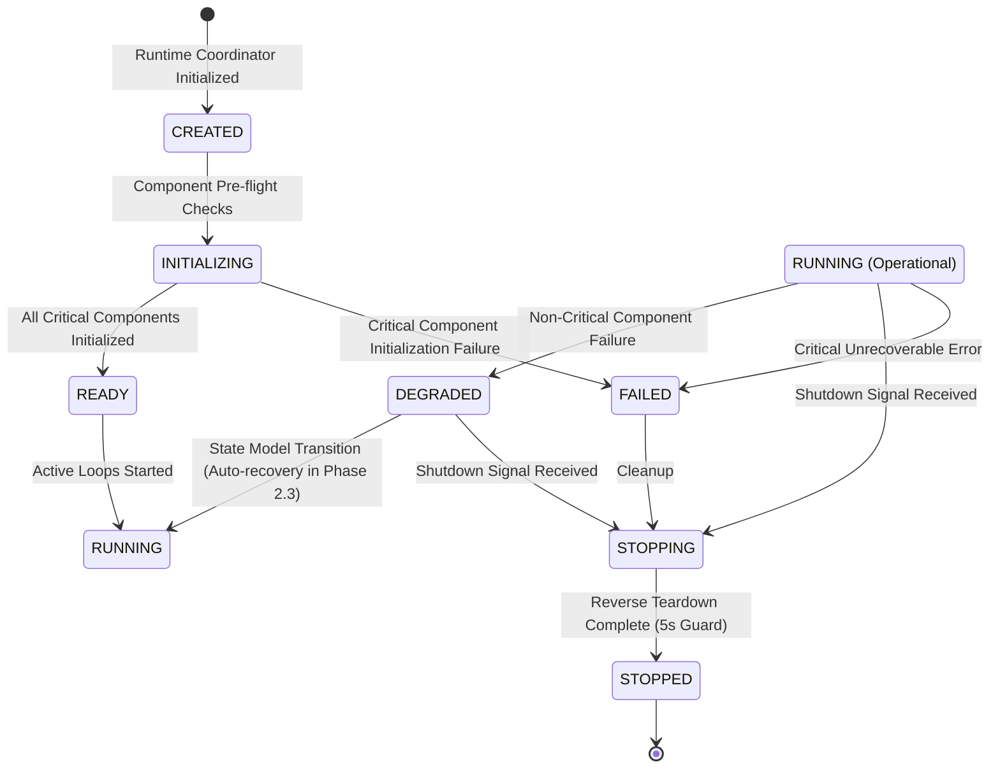

#### State Model Capability vs. Implemented Runtime Behavior

* **State Model Capability**: The core state transition matrix supports `DEGRADED -> RUNNING`, `RUNNING -> DEGRADED`, and `DEGRADED -> STOPPING` to accommodate self-healing workflows without breaking state changes.
* **Implemented Phase 2.2 Behavior**: Phase 2.2 provides the core lifecycle coordination, deterministic startup/shutdown ordering, and on-demand health queries (`coordinator.health().await`). Continuous background health polling and automated `DEGRADED -> RUNNING` recovery loops are deferred to the Phase 2.3 Supervisor Daemon and Phase 16 Watchdog.

#### Graceful Shutdown Semantics & Teardown Timeout Guard

To ensure high availability and prevent process hangs during shutdown or restarts, the `RuntimeCoordinator` implements bounded teardown semantics:

1. **Default Shutdown Timeout**: `5000ms` (`DEFAULT_SHUTDOWN_TIMEOUT_MS = 5000`). Configurable via `NetraConfig.runtime.shutdown_timeout_ms`, `RuntimeCoordinator::with_timeout(ms)`, `RuntimeCoordinator::from_config(&config)`, or the `NETRA_SHUTDOWN_TIMEOUT_MS` environment variable.
2. **Purpose**: Prevents slow, deadlocked, or unresponsive subsystems (e.g. unclosed sockets, hanging IPC channels, long-running scan routines) from indefinitely delaying service termination or OS reboots.
3. **Scope**: Applied individually per component during its asynchronous `ComponentLifecycle::stop()` teardown phase.
4. **Behavior When Exceeded**: If a component does not finish `stop()` within the timeout ceiling, `tokio::time::timeout` cancels the future. The coordinator logs a structured warning and continues tearing down subsequent components in reverse registration order without aborting or crashing.
5. **Logging**: Structured warning log emitted:
   ```text
   WARN Component '<component_name>' timed out during graceful shutdown (<timeout_ms>ms). Forcing teardown.
   ```
6. **Forced Termination Behavior**: Teardown for the unresponsive component is abandoned. All remaining components continue to execute their graceful shutdown, and the coordinator safely arrives at `RuntimeState::Stopped` (or preserves `RuntimeState::Failed` if invoked during critical failure).
7. **Idempotency**: Repeated invocations of `coordinator.shutdown()` execute safely as clean no-ops.
8. **Cross-Platform Signals & Lifecycle Isolation**: Asynchronous signal listeners (`wait_for_shutdown()`) intercept `SIGINT` (Ctrl+C) and `SIGTERM` on Unix (Linux/macOS) and `CTRL_C_EVENT` / `CTRL_BREAK_EVENT` on Windows. Signal handlers perform zero direct state manipulation; they only dispatch to the internal broadcast channel (`trigger_shutdown()`), preserving clean isolation from the core lifecycle logic.

---

## 3. System Startup, Initialization & Identity Bootstrap

When the system boots or the NETRA daemon is initiated, the startup sequence progresses through five deterministic phases:

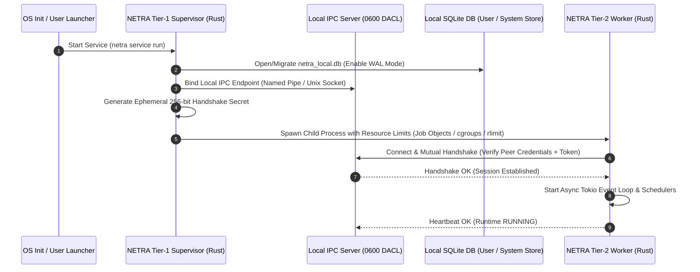

---

## 4. Device Identity, Attestation & Keyring Storage

Every enrolled host possesses a unique **Ed25519 (RFC 8032)** asymmetric cryptographic identity:
* **Private Key Security**: Generated strictly in memory and saved to OS-level secure storage:
  - **Windows**: Windows Data Protection API (DPAPI) via `CryptProtectData` with machine/user scope.
  - **Linux**: Kernel Keyring / Freedesktop SecretService API or `0400` root-owned key store.
  - **macOS**: Apple Keychain Services (`SecItemAdd` with access control).
* **Public Key Representation**: Exported as a 64-character hexadecimal string (32 bytes) and transmitted during enrollment to the Control API.
* **Canonical Request Signing**: Every outgoing frame or HTTP request includes cryptographic headers:
  ```http
  X-NETRA-Device-ID: dev_01h8a9b2c3d4e5f6
  X-NETRA-Timestamp: 1776189500
  X-NETRA-Nonce: a9f8e7d6-c5b4-4a3b-2a1f-0e9d8c7b6a5f
  X-NETRA-Request-ID: req_1122334455667788
  X-NETRA-Signature: 6f8b9e... (128-character hex-encoded Ed25519 signature)
  ```
  ```text
  StringToSign = METHOD + "\n" + PATH + "\n" + TIMESTAMP + "\n" + NONCE + "\n" + REQUEST_ID + "\n" + SHA256(BODY)
  ```

### 4.2 Key Lifecycle & Deterministic Rotation State Machine

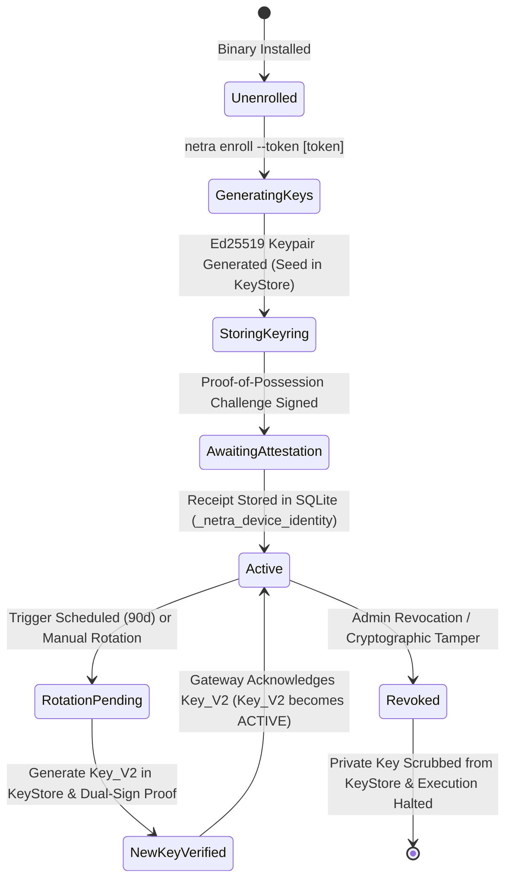

#### Key Rotation Crash & Restart Recovery Sequence:

```mermaid
sequenceDiagram
    autonumber
    participant Agent as NETRA Agent Core
    participant SQLite as Local SQLite Store
    participant KeyStore as OS KeyStore
    participant GW as Upstream Control Gateway

    Note over Agent,GW: Normal Rotation Sequence
    Agent->>KeyStore: 1. Generate & store Key_V2 private seed
    Agent->>SQLite: 2. Persist Key_V2 metadata; set status = ROTATION_PENDING
    Agent->>GW: 3. Dispatch KeyRotationRequest (Dual-Signed by V1 + V2)
    
    Note over Agent: CRASH / POWER LOSS OCCURS BEFORE ACK
    
    Note over Agent,GW: Post-Restart Recovery Sequence
    Agent->>SQLite: 4. Startup scan detects Key_V2 with ROTATION_PENDING
    Agent->>SQLite: 5. Verify Key_V1 is still ACTIVE (Never delete old key prematurely)
    Agent->>KeyStore: 6. Load Key_V1 and Key_V2 private seeds
    Agent->>GW: 7. Re-dispatch idempotent KeyRotationRequest upon WSS reconnect
    GW->>GW: 8. Verify dual-signatures and register Key_V2 as ACTIVE
    GW-->>Agent: 9. 200 OK: KeyRotationAck { active_key_id: "key_v2", grace_expires_at: "..." }
    Agent->>SQLite: 10. Update SQLite: Key_V2 -> ACTIVE, Key_V1 -> RETIRED
    Agent->>KeyStore: 11. Schedule Key_V1 private seed deletion upon grace expiry
```

---

## 5. Agent ↔ Control API Transport Protocol (WSS & REST)

NETRA agents communicate with the upstream Control Gateway via a persistent **WebSocket over TLS 1.3 (WSS)** connection using **Canonical JSON Framing**:

* **Primary Transport**: `wss://api.netra.io/api/v1/agent/stream`
* **Transport Encryption**: Strict TLS 1.3 via `rustls` with Mozilla root CA certificates (`webpki-roots`).
* **Session Authentication**: Ed25519 challenge-response handshake upon connection establishment.
* **In-Session Replay Defense**: Monotonic sequence numbers (`sequence_num: 0, 1, 2...`) per connection lifetime.
* **Heartbeat Cadence**: Ping/Pong frame sent every 15 seconds. If missed for 45 seconds, the connection is marked `DISCONNECTED` and reconnect loop begins.
* **Reconnection Algorithm**: Exponential backoff with jitter:
  $$t_{\text{backoff}} = \min(t_{\text{max}}, t_{\text{base}} \times 2^{\text{attempt}}) \pm \text{jitter}$$
  where $t_{\text{base}} = 2\text{ s}$, $t_{\text{max}} = 60\text{ s}$, and $\text{jitter} \in [0, 500\text{ ms}]$.


### 5.1 Control-Plane REST API Gateway Architecture (Phase 5)

The Phase 5 REST API Gateway (`netra-api`) operates as an asynchronous Axum HTTP service:

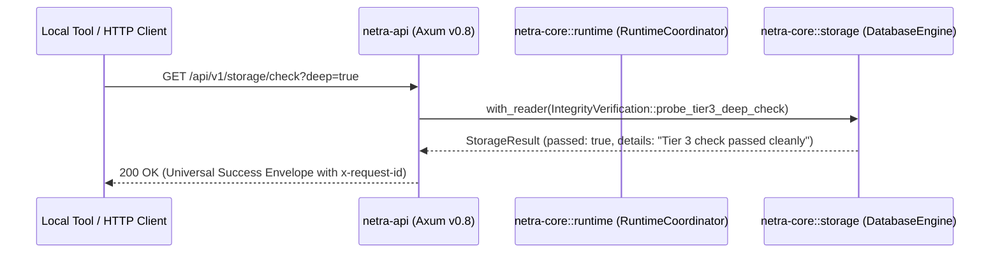

* **Loopback-Only Binding**: Strictly `127.0.0.1:8443` or `[::1]:8443` (configurable port; binding to public/remote interfaces is prohibited in Phase 5).
* **Route Taxonomy**: `GET /api/v1/health`, `GET /api/v1/version`, `GET /api/v1/status`, `GET /api/v1/diagnostics`, `GET /api/v1/openapi.json`, `GET /api/v1/storage/status`, `GET /api/v1/storage/check` (returns `200 OK` with `passed: true|false` payload when probe executes successfully; `409 Conflict` if deep check is already in flight).
* **Cache Headers**: Emits `Cache-Control: no-store` on live diagnostic routes to prevent local caching of ephemeral state.
* **Runtime Lifecycle**: `ApiService` implements `ComponentLifecycle`. `RuntimeCoordinator` initiates reverse teardown; `ApiService` stops accepting new connections and drains in-flight requests within the global runtime budget.

---

## 6. Local-First State Architecture (SQLite WAL)

Future NETRA security observations, posture findings, and configuration states requiring durable local persistence are committed to an embedded local SQLite database (`/var/lib/netra/agent.db` on Linux, `%ProgramData%\NETRA\data\agent.db` on Windows Service, or user data directories for CLI) managed by the Rust `rusqlite` engine (v0.33.0, bundled SQLite 3.48.0):

### SQLite Configuration, Durability & Retention:
* **Journal Mode**: `PRAGMA journal_mode = WAL;` (Concurrent readers with single serialized writer handle).
* **Synchronous & Durability**: `PRAGMA synchronous = NORMAL;` (Under SQLite's documented semantics: Process crashes safely recover all committed WAL transactions without tearing. OS crashes or sudden power loss may lose recent transactions committed since the last sync/checkpoint while structural b-tree consistency is maintained under POSIX filesystem write-ordering).
* **Foreign Keys**: `PRAGMA foreign_keys = ON;` (Relational integrity enforcement).
* **Busy Timeout**: `PRAGMA busy_timeout = 5000;` (Prevents immediate lock errors).
* **Storage Memory Budget**: `PRAGMA cache_size = -2000;` (Caps SQLite page cache at ~2MB per connection handle; process-wide memory benchmarking is verified in Phase 16).
* **Storage Quota & Saturation Controls**: Configurable 500MB database ceiling (`max_storage_bytes`). State-aware pruning cleans acknowledged records at 85% capacity, reserves the top 5% for critical finding updates at 95%, and enters read-only degraded mode at 100% saturation while strictly protecting `QUEUED` observations and `OPEN` findings.

```mermaid
erDiagram
    LOCAL_CONFIG {
        string key PK "Local storage & runtime setting key"
        string value_json "Serialized JSON value"
        string value_type "Type discriminator"
        datetime updated_at "ISO 8601 UTC"
    }
    OBSERVATION_QUEUE {
        string id PK
        string observation_type
        text payload_json
        string sha256_hash
        string status
        integer retry_count
        string source_finding_id
        datetime created_at
        datetime updated_at
    }
    LOCAL_FINDINGS {
        string fingerprint PK
        string rule_id
        string severity
        string status
        string title
        text evidence_summary_json
        integer occurrence_count
        datetime first_seen
        datetime last_seen
    }
    SCAN_HISTORY {
        string scan_id PK
        string capability
        string trigger_mode
        integer findings_count
        datetime executed_at
        integer duration_ms
    }

    LOCAL_FINDINGS ..o{ OBSERVATION_QUEUE : "provenance reference (application-level)"
    SCAN_HISTORY ..o{ LOCAL_FINDINGS : "generates (application-level)"
```

---

## 7. Task Orchestration & State Machine

Scan tasks are dispatched asynchronously from the Control API or triggered locally via the CLI:

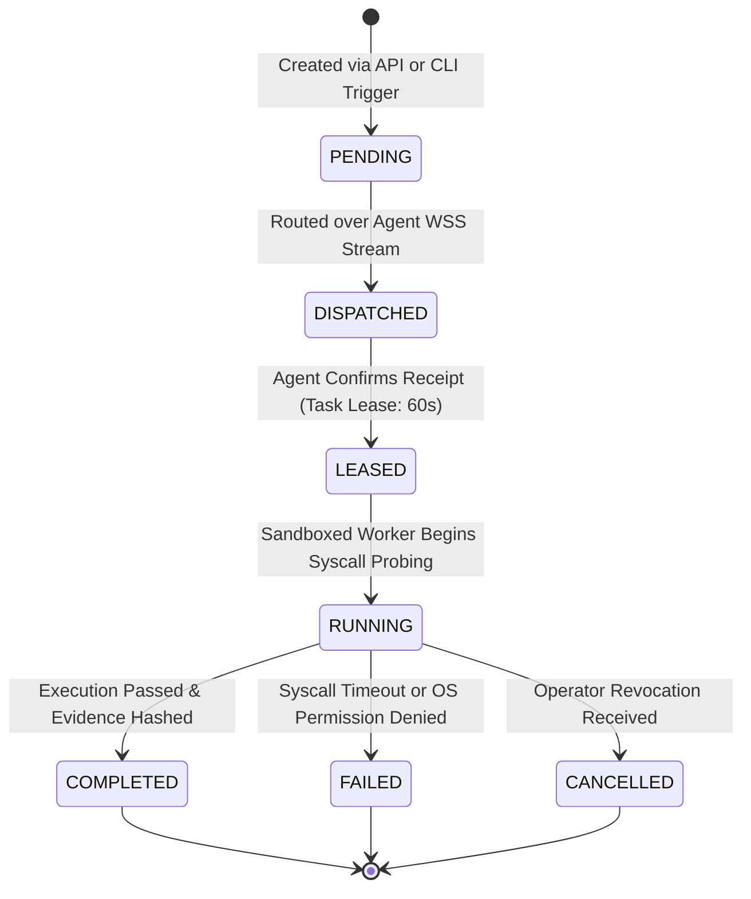

---

## 8. Security Scanning Subsystems & Process Resource Isolation

Scanning capabilities execute inside isolated asynchronous Rust tasks bounded by OS-level resource limits and process containment:

1. **`SCAN_NETWORK`**: Native OS socket inspection (`GetExtendedTcpTable` on Windows via `windows-sys`, Netlink `rtnetlink` / `/proc/net/tcp` on Linux, `sysctl KERN_PROC` on macOS). Maps listening ports, bound IPs, and associated process binaries.
2. **`SCAN_INTERFACES`**: Native OS network adapter enumeration (`GetAdaptersAddresses` on Windows, `/sys/class/net` on Linux). Maps operational status, IP addresses, prefix lengths, and SHA-256 pseudonymized MAC hashes.
3. **`SCAN_ROUTES`**: Native kernel routing table query (`GetIpForwardTable2` on Windows, `/proc/net/route` on Linux). Derives active default gateways deterministically by metric.
4. **`SCAN_DNS`**: Passive DNS configuration discovery (`GetAdaptersAddresses` on Windows, `/etc/resolv.conf` on Linux). Maps configured resolvers and domain suffixes without performing DNS resolution.
5. **`SCAN_NEIGHBORS`**: Passive Layer-2/Layer-3 adjacent neighbor cache observation (`GetIpNetTable2` on Windows, Netlink `RTM_GETNEIGH` on Linux). Zero active ARP/NDP probing.
6. **`IN_MEMORY_TOPOLOGY_SYNTHESIS`**: Deterministic in-memory graph synthesis inside `ScannerSupervisor` (`TopologyCorrelator` + `TopologyExtractor` in `netra-core`). Derives typed correlation edges (`InterfaceHostsSubnet`, `InterfaceHasGateway`, `InterfaceHasNeighbor`, `NeighborIsGateway`, `GatewayOnSubnet`, `DnsOnSubnet`) in pure memory (zero I/O) and persists in a separate SQLite transaction (Transaction B).
7. **`SCAN_PROCESSES`**: Enumerates running processes, parent PIDs, executable paths, SHA-256 binary hashes, and active CLI parameters.
8. **`SCAN_FIREWALL`**: Queries kernel packet filters (Windows `INetFwPolicy2`, Linux `nftables`/`iptables`, macOS `pfctl`). Detects disabled profiles or overly permissive `0.0.0.0/0` inbound rules.
9. **`SCAN_USERS`**: Audits local user accounts, active sudoers, and dormant administrative profiles.
10. **`SCAN_SERVICES`**: Queries operating system services, binary paths, and start configurations.
11. **`SCAN_OS_CONFIG`**: Audits platform security posture (UAC, Secure Boot, kernel parameters).

### Configurable Process Resource Controls:
* **Linux**: Configured via `cgroups v2` slice (`cpu.max = "20000 100000"` [20% CPU], `memory.max = 104857600` [100MB], `pids.max = 64`). Fallback to POSIX `setrlimit` (`RLIMIT_AS`) if cgroups v2 controller is unavailable.
* **Windows**: Bound to a Win32 **Job Object** with `JOB_OBJECT_LIMIT_PROCESS_MEMORY` (`100MB` default) and `JOB_OBJECT_LIMIT_KILL_ON_JOB_CLOSE` (prevents orphaned processes).
* **macOS**: Bound via POSIX `setrlimit` (`RLIMIT_AS` / `RLIMIT_RSS`).
* **Execution Timeout Policy**: Default 30-second context timeout per scanner invocation.

---

## 9. Network Intelligence & Topology Discovery Engine

NETRA constructs a deterministic Layer-2/Layer-3 local reachability graph through a non-intrusive 3-tier methodology:

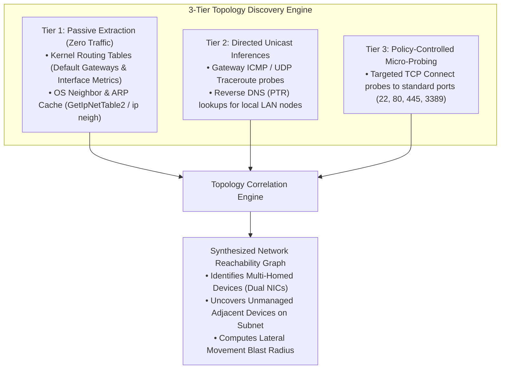

---

## 10. Browser & Web Exposure Observation Layer

NETRA provides web exposure awareness by correlating OS socket connections with web browser processes, strictly maintaining academic privacy standards:

* **What Is Monitored**:
  - Web browser process binaries (`chrome.exe`, `firefox`, `msedge`, `brave`, `safari`).
  - Active outbound socket destinations (Remote IP, Remote Port 443/80, Protocol).
  - Reverse DNS hostname mappings and TLS SNI domain headers observed at socket establishment.
  - Active listening ports opened by background web extensions or developer local servers (`localhost:3000`, `localhost:8080`).
* **What Is STRICTLY OUT OF SCOPE (Privacy Guard)**:
  - ✕ No inspection of HTTP request/response payloads or headers.
  - ✕ No reading of browser cookies, local storage, or session tokens.
  - ✕ No access to browser tabs, DOM trees, or web page content.
  - ✕ No keystroke logging, form data capture, or password field interception.

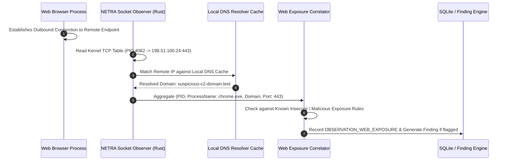

---

## 11. Vulnerability Intelligence & CVE Correlation

NETRA correlates local software inventories against standardized vulnerability feeds (NVD / OSV / GitHub Security Advisories) using offline-capable cached catalogs:

1. **Inventory Collection**: Collects package metadata from OS package managers (`dpkg`, `rpm`, `pacman`, Windows Registry Uninstall Keys, macOS Homebrew).
2. **CPE Normalization**: Converts raw application strings into Common Platform Enumeration (CPE 2.3) identifiers.
3. **Deterministic Matcher**: Compares version strings against semver and version-range specifications stored in local SQLite CVE cache.

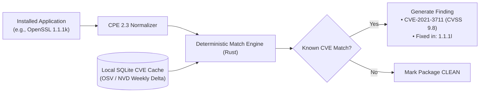

---

## 12. The 10-Stage Deterministic Data Pipeline

Every security defect in NETRA traverses an immutable 10-stage processing pipeline:

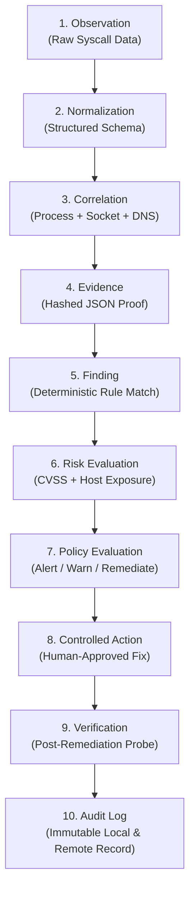

### Deterministic Fingerprinting Formula:
```text
Fingerprint = SHA-256(TenantID + "::" + DeviceID + "::" + Capability + "::" + RuleID + "::" + ResourceKey)
```

---

## 13. Risk Scoring & Policy Evaluation Model

NETRA calculates contextual risk by multiplying intrinsic vulnerability severity with environmental exposure:

$$\text{Composite Risk Score} = \text{Base Severity (1–10)} \times \text{Exposure Multiplier} \times \text{Asset Weight}$$

| Exposure Multiplier | Condition |
| :--- | :--- |
| **`1.0`** | Service listening only on `127.0.0.1` (Local loopback only) |
| **`1.5`** | Service listening on private RFC 1918 subnet (`192.168.x.x`, `10.x.x.x`) |
| **`2.0`** | Service listening on `0.0.0.0` with no active host firewall rule |
| **`3.0`** | Service bound to a public IP with known unpatched remote code execution CVE |

---

## 14. Controlled Remediation & Verification Loops

NETRA strictly avoids uncontrolled, destructive automated changes. Every remediation follows a closed verification loop:

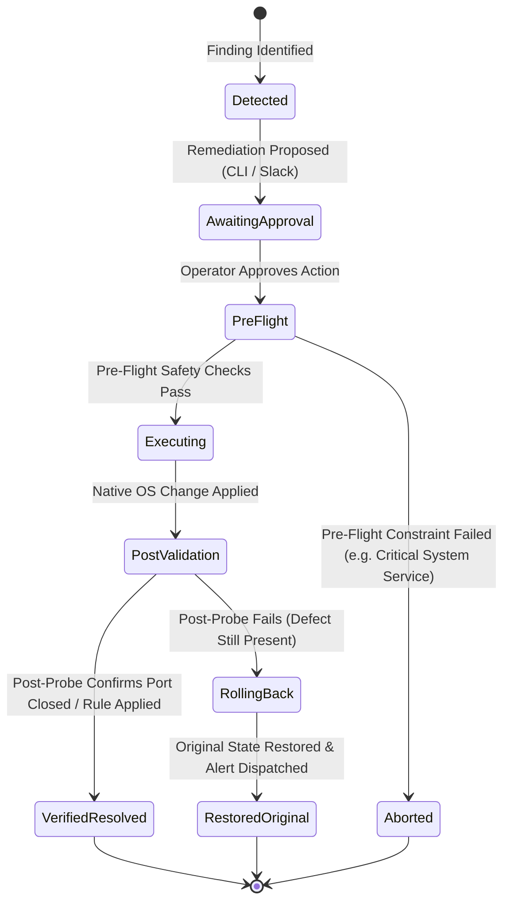

---

## 15. Offline State Machine & Resilient Cloud Sync

When network connectivity is interrupted, the NETRA agent transitions into offline buffering mode:

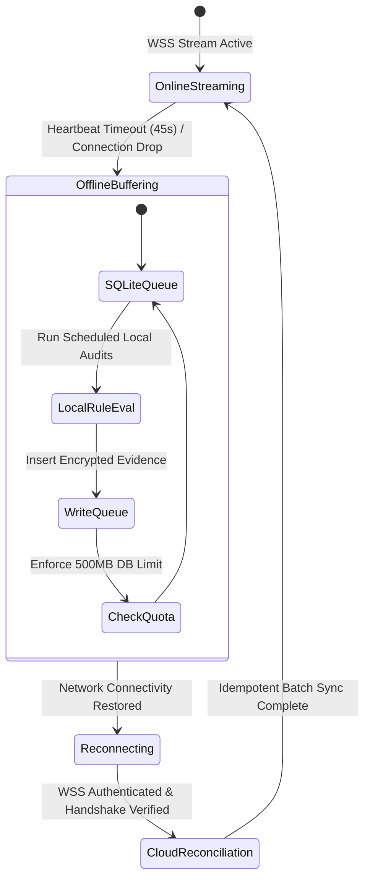

---

## 16. Failure Handling, Watchdogs & Crash Recovery

1. **Supervisor Process Watchdog & Auto-Restart**:
   - The Supervisor daemon monitors the Worker child process PID asynchronously.
   - **Target**: On an isolated unexpected worker exit, auto-restart occurs in $\le 2000\text{ ms}$.
   - **Exponential Backoff**: If repeated crashes occur, backoff increases ($2\text{s} \to 4\text{s} \to 8\text{s} \to 16\text{s} \to 32\text{s}$).
   - **Circuit Breaker**: If $\ge 5$ consecutive crashes happen in a 300-second window, auto-restart is suspended, and the supervisor transitions to `SupervisorState::Failed` to prevent host resource thrashing.
   - **Stable Reset**: 60 seconds of continuous stable execution resets the crash counter.
2. **Resource Throttling Watchdog**: If the Worker process exceeds configured memory ceilings or CPU quotas for $>60$ continuous seconds, the Supervisor triggers a `ShutdownNotice` followed by graceful restart.
3. **Database Integrity, Atomic Marker Protocol & Quarantine Directory Sequence**:
   - **Atomic Marker Protocol**: 
     - `.runtime_active` records the active process PID, session UUIDv7, and timestamp (mode `0600`). Prevents concurrent multi-instance conflicts.
     - Stale sessions (dead PID in `.runtime_active` or missing `.clean_shutdown`) flag an unclean restart, triggering Tier 2 `PRAGMA quick_check;`.
     - `.clean_shutdown` is written **only after** all write transactions finish, checkpoints complete/timeout, and SQLite connection handles are fully closed. It is finalized via atomic temp write (`.clean_shutdown.tmp`) and rename (`rename`).
   - **Tiered Verification**: Fast schema probe on clean startup (target: `<1ms`), `PRAGMA quick_check;` on suspicious restarts (target: `<50ms`), and full diagnostics via `netra diagnostics`. Timings are measured benchmark baselines.
   - **Safe 6-Step Quarantine Directory Sequence**:
     1. Freeze incoming write transactions.
     2. Explicitly close all active SQLite connection handles and release OS file locks.
     3. Create a dedicated directory: `quarantine_<UTC_TIMESTAMP>/` (mode `0700`).
     4. Deterministically move/copy `agent.db`, `agent.db-wal`, and `agent.db-shm` into the quarantine directory.
     5. Generate `quarantine_meta.json` inside the directory recording SHA-256 hashes, file sizes, UTC timestamp, and the corruption error string.
     6. Transition storage engine to safe `StorageState::Degraded(Quarantined)` and notify `RuntimeCoordinator` without destructive auto-wiping. Replacement database creation requires explicit operator action (`netra storage recover --force-reinit`).

---

## 17. Comprehensive Sequence Diagram Catalog

### 17.1 Device Enrollment & Registration Flow

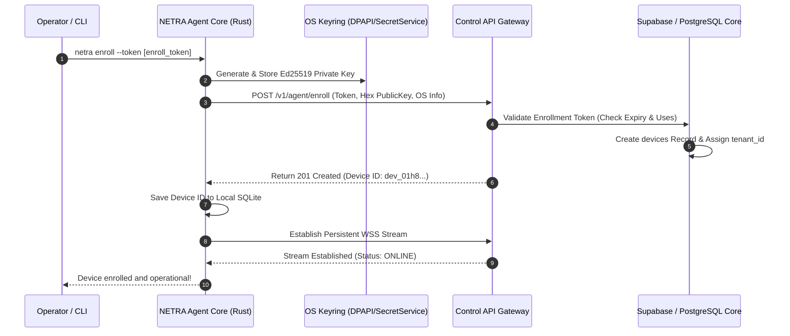

### 17.2 Finding Detection, Evidence Ingestion & Deduplication

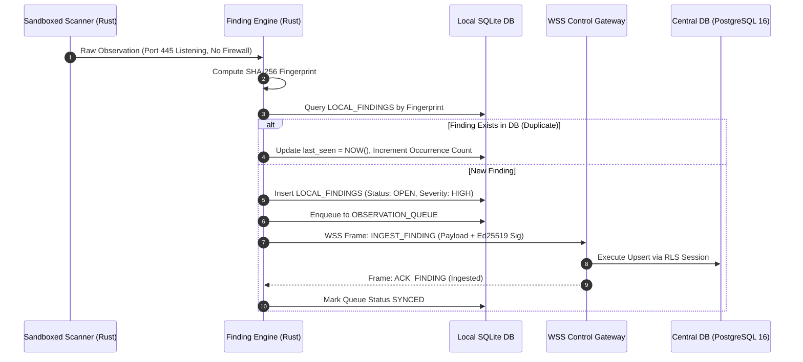

### 17.3 Local IPC Startup & Mutual Handshake

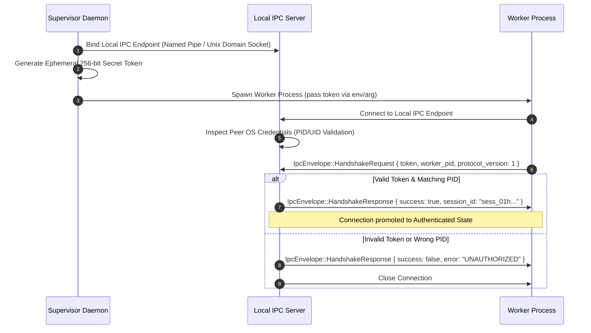

### 17.4 Local IPC Periodic Heartbeat & Liveness

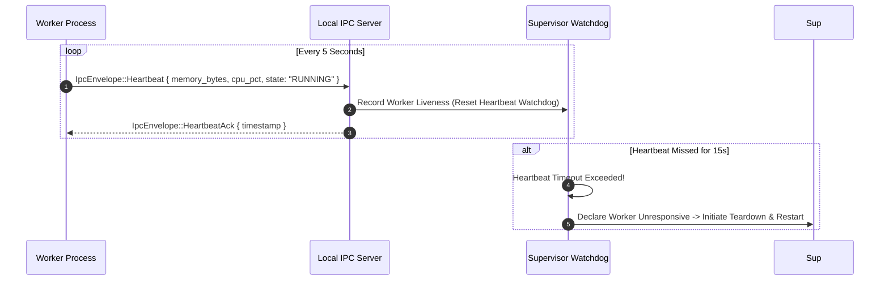

### 17.5 Local IPC Malformed Frame & Error Handling

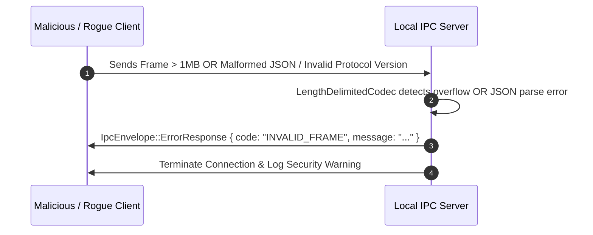

### 17.6 Worker Crash & Sub-2s Watchdog Recovery

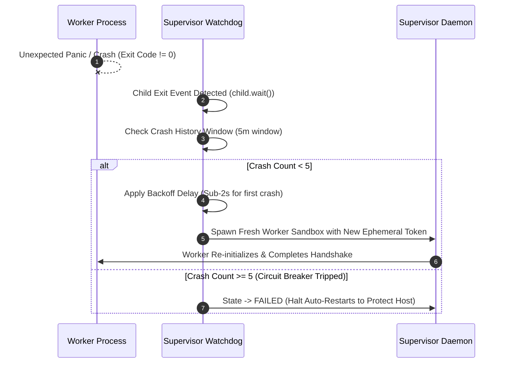

### 17.7 Graceful Teardown over Local IPC

```mermaid
sequenceDiagram
    autonumber
    participant OS as OS Signal (SIGINT / SCM Stop)
    participant Sup as Supervisor Daemon
    participant IPC as Local IPC Server
    participant Worker as Worker Process

    OS->>Sup: Termination Signal Received
    Sup->>IPC: Broadcast IpcEnvelope::ShutdownNotice { grace_period_ms: 5000 }
    Worker->>Worker: Reverse Teardown of Runtime Components
    Worker-->>IPC: IpcEnvelope::ShutdownAck
    Sup->>Worker: Await Child Process Clean Exit (or Kill after 5s)
    Sup->>IPC: Close IPC Endpoint & Release Resources
```
