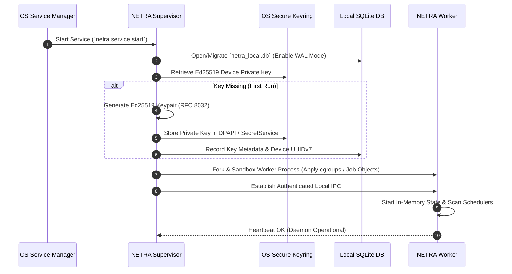
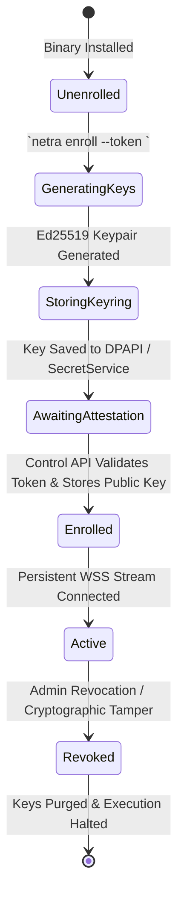
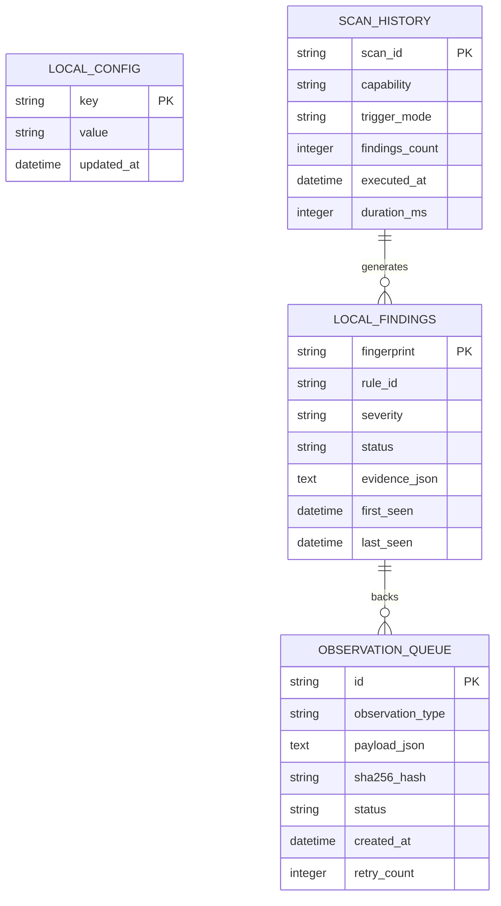
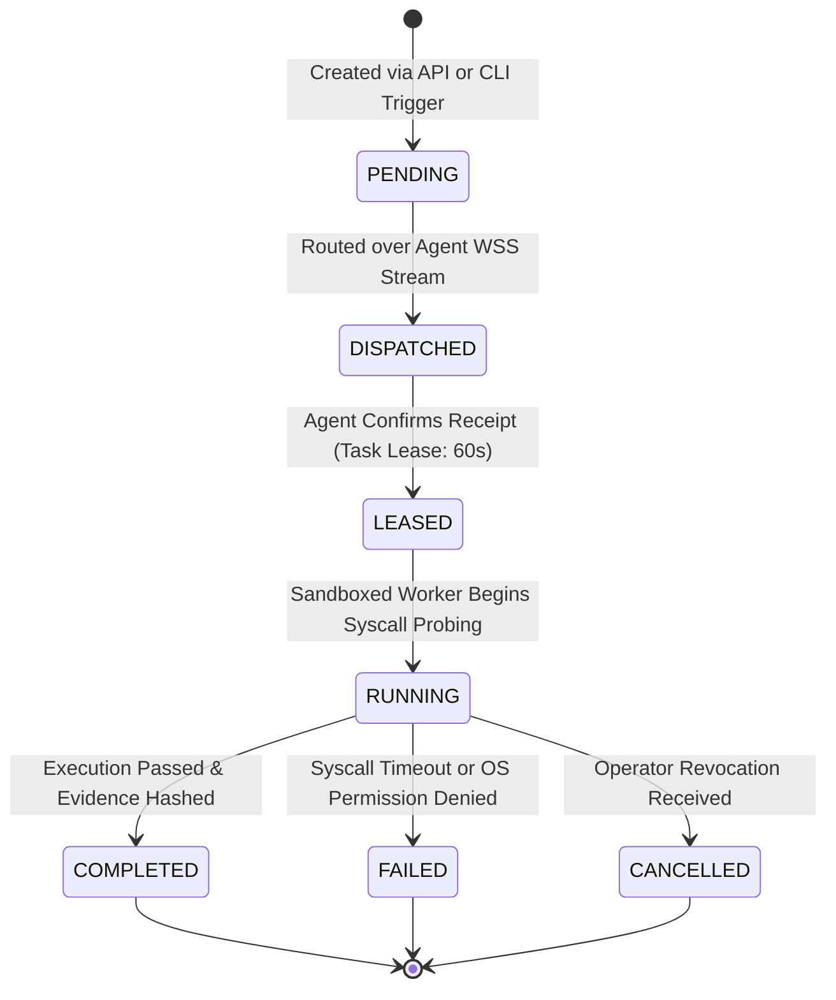
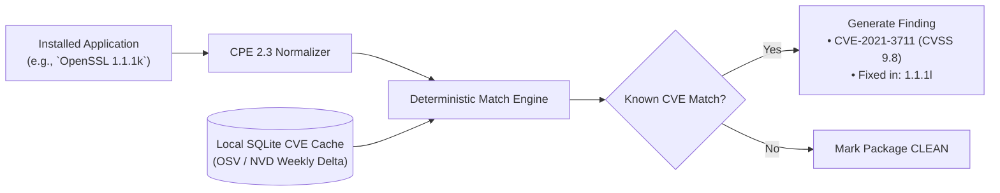
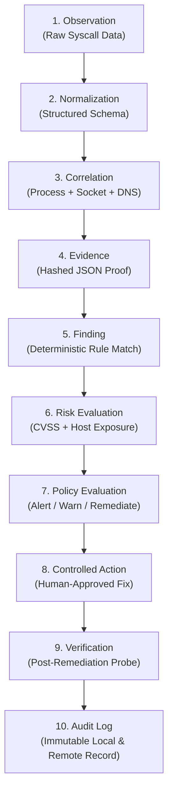
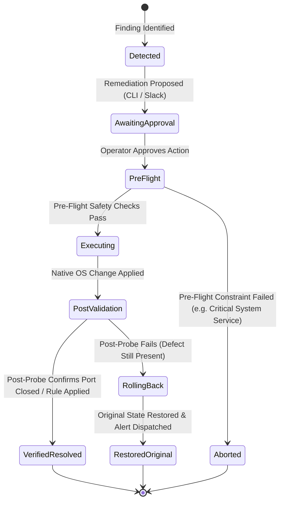
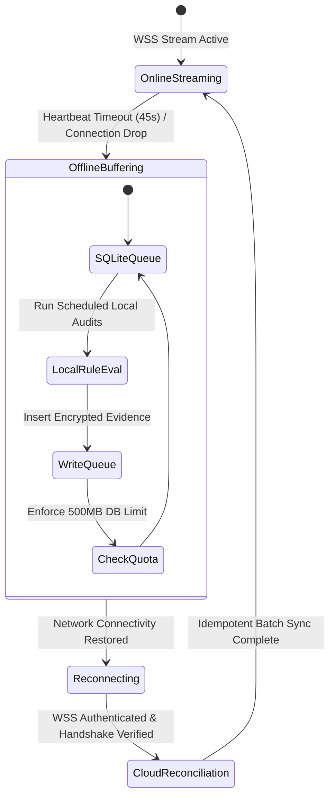
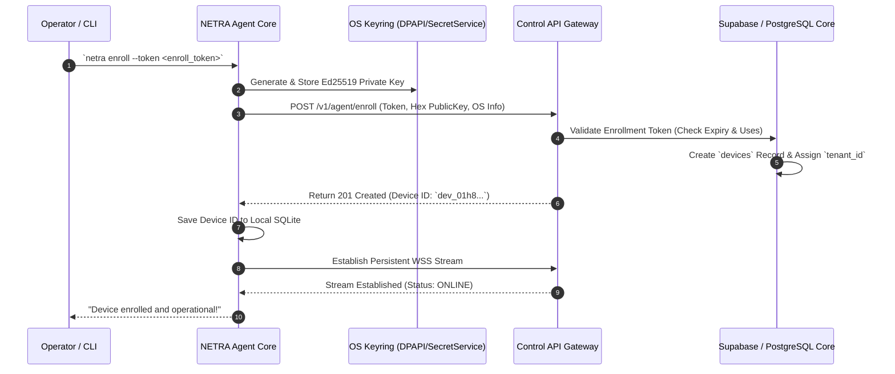
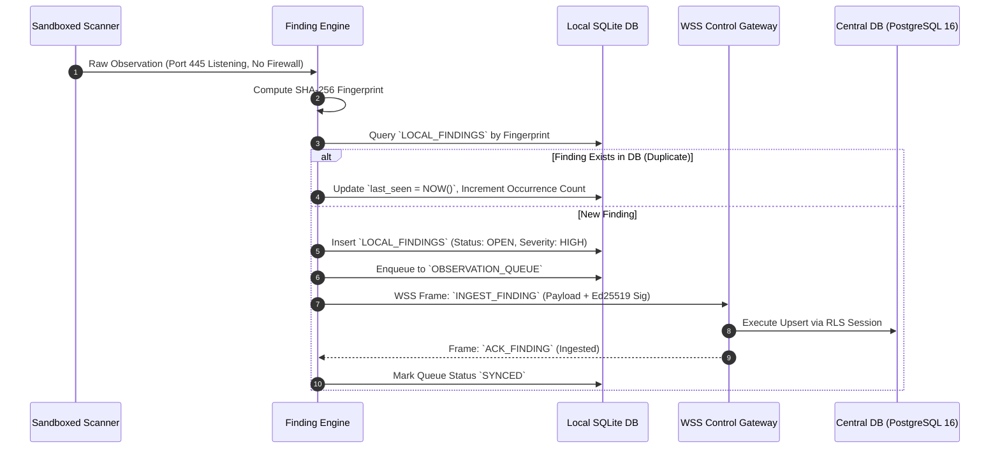

# NETRA — Runtime System Design & Behavioral Specification

> **Overview**
>
> This document provides the authoritative runtime behavioral specification of NETRA (Network & Endpoint Threat Reconnaissance Architecture). It details process lifecycles, execution modes, cryptographic handshakes, local SQLite state storage, scanning subsystems, browser exposure awareness, vulnerability correlation, finding reasoning pipelines, and resilient offline synchronization.

**Status:** Specified / Designed  
**Audience:** Core Developers, Security Researchers, Systems Engineers, Contributors  
**Purpose:** Serves as the primary behavioral blueprint for implementing the NETRA runtime core, background daemon, CLI interface, and data processing engines.

---

## Contents

1. [Runtime Architectural Foundations](#1-runtime-architectural-foundations)
2. [Process Models & Dual Execution Modes](#2-process-models--dual-execution-modes)
3. [System Startup, Initialization & Identity Bootstrap](#3-system-startup-initialization--identity-bootstrap)
4. [Device Identity, Attestation & Keyring Storage](#4-device-identity-attestation--keyring-storage)
5. [Agent ↔ Control API Transport Protocol](#5-agent--control-api-transport-protocol)
6. [Local-First State Architecture (SQLite WAL)](#6-local-first-state-architecture-sqlite-wal)
7. [Task Orchestration & State Machine](#7-task-orchestration--state-machine)
8. [Security Scanning Subsystems & OS Sandboxing](#8-security-scanning-subsystems--os-sandboxing)
9. [Network Intelligence & Topology Discovery Engine](#9-network-intelligence--topology-discovery-engine)
10. [Browser & Web Exposure Observation Layer](#10-browser--web-exposure-observation-layer)
11. [Vulnerability Intelligence & CVE Correlation](#11-vulnerability-intelligence--cve-correlation)
12. [The 10-Stage Deterministic Data Pipeline](#12-the-10-stage-deterministic-data-pipeline)
13. [Risk Scoring & Policy Evaluation Model](#13-risk-scoring--policy-evaluation-model)
14. [Controlled Remediation & Verification Loops](#14-controlled-remediation--verification-loops)
15. [Offline State Machine & Resilient Cloud Sync](#15-offline-state-machine--resilient-cloud-sync)
16. [Failure Handling, Watchdogs & Crash Recovery](#16-failure-handling-watchdogs--crash-recovery)
17. [Comprehensive Sequence Diagram Catalog](#17-comprehensive-sequence-diagram-catalog)

---

## 1. Runtime Architectural Foundations

NETRA is engineered as an open-source, academic defensive security framework. At runtime, it prioritizes:
1. **Zero External Runtime Dependencies**: Single statically compiled binary (`CGO_ENABLED=0`) written in Go with optional native Rust extensions for high-performance syscall probing.
2. **Local-First Determinism**: Security findings, observations, and telemetry queues are committed to an encrypted local SQLite database before any remote network transmission.
3. **Outbound-Only Communication**: All network connections to the Control API are outbound over TLS 1.3. Endpoints listen on zero inbound TCP/UDP ports.
4. **Privacy-Preserving Inspection**: Telemetry focuses on host configuration posture, network reachability, and process socket bindings. User file contents, keystrokes, browser history, and session payloads are strictly out of scope.

---

## 2. Process Models & Dual Execution Modes

NETRA operates in two distinct operational modes using the same unified binary:

```mermaid
flowchart TD
    Binary["netra (Single Binary Entry Point)"]
    
    Binary --> CheckMode{"Invocation Context"}
    
    CheckMode -- "CLI Command (e.g., `netra scan`)" --> CLIMode["Interactive / Scripting CLI Mode<br/>• Short-lived userspace process<br/>• Direct OS probing or Local Daemon IPC<br/>• stdout/stderr stream separation<br/>• Pure JSON / ANSI table outputs"]
    
    CheckMode -- "Service Daemon (systemd / Windows SCM)" --> DaemonMode["Two-Tier Background Service Mode"]
    
    subgraph DaemonMode["Two-Tier Background Service Mode"]
        direction TB
        Supervisor["Tier 1: OS Supervisor Daemon (Root / SYSTEM)<br/>• Watchdog monitoring & auto-restart<br/>• Keyring access & atomic binary updates<br/>• System-level firewall / route probing"]
        Worker["Tier 2: Sandboxed Worker Process (Low-Privilege)<br/>• WSS stream gateway connection<br/>• Task execution & rule evaluation<br/>• Local SQLite FIFO buffering"]
        
        Supervisor <-->|Local Domain Socket / Named Pipe (DACL 0600)| Worker
    end
```

---

## 3. System Startup, Initialization & Identity Bootstrap

When the system boots or the NETRA daemon is initiated, the startup sequence progresses through five deterministic phases:



---

## 4. Device Identity, Attestation & Keyring Storage

Every enrolled host possesses a unique **Ed25519 (RFC 8032)** asymmetric cryptographic identity:
* **Private Key Security**: Generated strictly in memory and saved to OS-level secure storage:
  - **Windows**: Windows Data Protection API (DPAPI) via `CryptProtectData` with machine/user scope.
  - **Linux**: Kernel Keyring / Freedesktop SecretService API or `0400` root-owned key store.
  - **macOS**: Apple Keychain Services (`SecItemAdd` with access control).
* **Public Key Representation**: Exported as a 64-character hexadecimal string (`32 bytes`) and transmitted during enrollment to the Control API.
* **Canonical Request Signing**: Every outgoing frame or HTTP request includes cryptographic headers:
  $$\text{Headers: } \text{X-NETRA-Device-ID}, \text{X-NETRA-Timestamp}, \text{X-NETRA-Nonce}, \text{X-NETRA-Signature}$$
  $$\text{StringToSign} = \text{METHOD} \parallel \text{"\textbackslash n"} \parallel \text{PATH} \parallel \text{"\textbackslash n"} \parallel \text{TIMESTAMP} \parallel \text{"\textbackslash n"} \parallel \text{NONCE} \parallel \text{"\textbackslash n"} \parallel \text{SHA256}(\text{BODY})$$



---

## 5. Agent ↔ Control API Transport Protocol

NETRA agents communicate with the central Control API via a persistent **WebSocket over TLS 1.3 (WSS)** connection, using **Protocol Buffers (Protobuf v3)** for ultra-low serialization overhead:

* **Primary Transport**: `wss://api.netra.io/v1/agent/stream`
* **Fallback Transport**: Authenticated HTTPS Long Polling (`POST /v1/agent/poll`) for restrictive proxies.
* **Heartbeat Cadence**: Ping/Pong frame sent every 15 seconds. If missed for 45 seconds, the connection is marked `DISCONNECTED` and offline caching begins.
* **Reconnection Algorithm**: Exponential backoff with jitter:
  $$t_{\text{backoff}} = \min(t_{\text{max}}, t_{\text{base}} \times 2^{\text{attempt}}) \pm \text{jitter}$$
  where $t_{\text{base}} = 1\text{s}$, $t_{\text{max}} = 300\text{s}$, and $\text{jitter} \in [0, 500\text{ms}]$.

---

## 6. Local-First State Architecture (SQLite WAL)

All local operations persist in a local SQLite database (`/var/lib/netra/agent.db` or `%ProgramData%\NETRA\agent.db`).

### SQLite Configuration & Pruning:
* **Journal Mode**: `PRAGMA journal_mode = WAL;` (Concurrent readers with single writer).
* **Synchronous**: `PRAGMA synchronous = NORMAL;` (Crash safety with optimal SSD/NVMe throughput).
* **Encryption at Rest**: Optional SQLCipher integration with DPAPI/Keyring-derived key.
* **Storage Cap**: Strict 500MB database limit with LRU pruning of resolved findings and synced raw observations.



---

## 7. Task Orchestration & State Machine

Scan tasks are dispatched asynchronously from the Control API or triggered locally via the CLI:



---

## 8. Security Scanning Subsystems & OS Sandboxing

Scanning capabilities execute inside isolated goroutines bounded by OS-level resource sandboxes:

1. **`SCAN_NETWORK`**: Native OS socket inspection (`GetExtendedTcpTable` on Windows, Netlink `rtnetlink` / `/proc/net/tcp` on Linux, `sysctl KERN_PROC` on macOS). Maps listening ports, bound IPs, and associated process binaries.
2. **`SCAN_PROCESSES`**: Enumerates running processes, parent PIDs, executable paths, SHA-256 binary hashes, and active CLI parameters.
3. **`SCAN_FIREWALL`**: Queries kernel packet filters (Windows `INetFwPolicy2`, Linux `nftables`/`iptables`, macOS `pfctl`). Detects disabled profiles or overly permissive `0.0.0.0/0` inbound rules.
4. **`SCAN_USERS`**: Audits local user accounts, active sudoers, and dormant administrative profiles.

### OS Sandboxing Constraints:
* **Linux**: Managed via `cgroups v2` (`CPUQuota=20%`, `MemoryMax=100M`).
* **Windows**: Bound to a Windows **Job Object** with `JOB_OBJECT_LIMIT_PROCESS_MEMORY` (100MB) and `JOB_OBJECT_CPU_RATE_CONTROL` (20%).
* **Execution Timeout**: Hard 30-second context timeout per scanner run.

---

## 9. Network Intelligence & Topology Discovery Engine

NETRA constructs a deterministic Layer-2/Layer-3 local reachability graph through a non-intrusive 3-tier methodology:


---

## 10. Browser & Web Exposure Observation Layer

NETRA provides web exposure awareness by correlating OS socket connections with web browser processes, strictly maintaining academic privacy standards:

* **What Is Monitored**:
  - Web browser process binaries (`chrome.exe`, `firefox`, `msedge`, `brave`, `safari`).
  - Active outbound socket destinations (Remote IP, Remote Port 443/80, Protocol).
  - Reverse DNS hostname mappings and TLS SNI domain headers observed at socket establishment.
  - Active listening ports opened by background web extensions or developer local servers (`localhost:3000`, `localhost:8080`).
* **What Is STRICTLY OUT OF SCOPE (Privacy Guard)**:
  - ✕ No inspection of HTTP request/response payloads or headers.
  - ✕ No reading of browser cookies, local storage, or session tokens.
  - ✕ No access to browser tabs, DOM trees, or web page content.
  - ✕ No keystroke logging, form data capture, or password field interception.


---

## 11. Vulnerability Intelligence & CVE Correlation

NETRA correlates local software inventories against standardized vulnerability feeds (NVD / OSV / GitHub Security Advisories) using offline-capable cached catalogs:

1. **Inventory Collection**: Collects package metadata from OS package managers (`dpkg`, `rpm`, `pacman`, Windows Registry Uninstall Keys, macOS Homebrew).
2. **CPE Normalization**: Converts raw application strings into Common Platform Enumeration (CPE 2.3) identifiers.
3. **Deterministic Matcher**: Compares version strings against semver and version-range specifications stored in local SQLite CVE cache.



---

## 12. The 10-Stage Deterministic Data Pipeline

Every security defect in NETRA traverses an immutable 10-stage processing pipeline:



### Deterministic Fingerprinting Formula:
$$\text{Fingerprint} = \text{SHA-256}(\text{TenantID} \parallel \text{DeviceID} \parallel \text{Capability} \parallel \text{RuleID} \parallel \text{ResourceKey})$$

---

## 13. Risk Scoring & Policy Evaluation Model

NETRA calculates contextual risk by multiplying intrinsic vulnerability severity with environmental exposure:

$$\text{Composite Risk Score} = \text{Base Severity (1–10)} \times \text{Exposure Multiplier} \times \text{Asset Weight}$$

| Exposure Multiplier | Condition |
| :--- | :--- |
| **`1.0`** | Service listening only on `127.0.0.1` (Local loopback only) |
| **`1.5`** | Service listening on private RFC 1918 subnet (`192.168.x.x`, `10.x.x.x`) |
| **`2.0`** | Service listening on `0.0.0.0` with no active host firewall rule |
| **`3.0`** | Service bound to a public IP with known unpatched remote code execution CVE |

---

## 14. Controlled Remediation & Verification Loops

NETRA strictly avoids uncontrolled, destructive automated changes. Every remediation follows a closed verification loop:



---

## 15. Offline State Machine & Resilient Cloud Sync

When network connectivity is interrupted, the NETRA agent transitions into offline buffering mode:



---

## 16. Failure Handling, Watchdogs & Crash Recovery

1. **Supervisor Process Watchdog**: The Supervisor daemon continuously monitors the Worker process PID. If the Worker terminates unexpectedly, the Supervisor logs the crash stack, delays for 2 seconds, and restarts the Worker with clean memory bounds.
2. **Resource Throttling Watchdog**: If the Worker process exceeds 150MB RSS memory or 25% CPU for >60 continuous seconds, the Supervisor triggers a `SIGTERM` followed by a fresh restart.
3. **Database Corruption Recovery**: If `netra_local.db` experiences header corruption, SQLite WAL recovery is executed automatically. If unrecoverable, the database is rotated to `.corrupt.<timestamp>` and reinitialized from the secure keyring credentials.

---

## 17. Comprehensive Sequence Diagram Catalog

### 17.1 Device Enrollment & Registration Flow



### 17.2 Finding Detection, Evidence Ingestion & Deduplication


