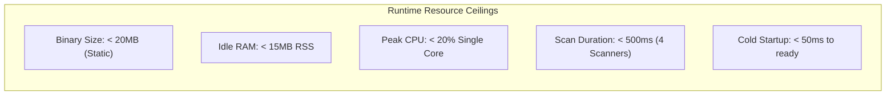
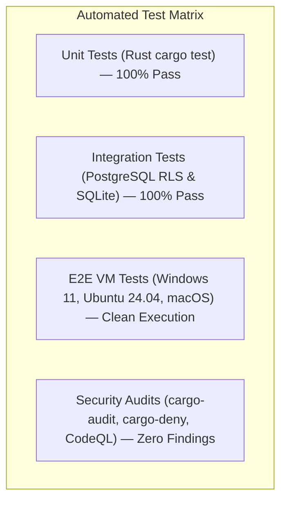

# NETRA — Technical Requirements Document (TRD)

> **Overview**
>
> This document translates the product specifications into concrete, testable engineering requirements for NETRA (Network & Endpoint Threat Reconnaissance Architecture). It defines target operating systems, Rust toolchain requirements, performance budgets, database schemas, cryptographic specifications, scanner implementations, and verification criteria.

**Status:** Specified / Designed  
**Audience:** Core Developers, Rust Systems Architects, Quality Assurance Engineers, Security Analysts  
**Purpose:** Establishes the authoritative technical constraints and acceptance criteria required for all NETRA subsystem implementations.

---

## Contents

1. [Supported Operating Systems & Hardware Architectures](#1-supported-operating-systems--hardware-architectures)
2. [Rust Systems Toolchain & Performance Budgets](#2-rust-systems-toolchain--performance-budgets)
3. [Local Storage Specifications (SQLite WAL via `rusqlite`)](#3-local-storage-specifications-sqlite-wal-via-rusqlite)
4. [Transport & Protocol Specifications](#4-transport--protocol-specifications)
5. [Cryptographic Identity & Attestation Specifications](#5-cryptographic-identity--attestation-specifications)
6. [Core Scanner Technical Requirements](#6-core-scanner-technical-requirements)
7. [Network Topology Synthesis Requirements](#7-network-topology-synthesis-requirements)
8. [Browser & Web Exposure Observation Specifications](#8-browser--web-exposure-observation-specifications)
9. [Vulnerability Intelligence & CVE Matching Requirements](#9-vulnerability-intelligence--cve-matching-requirements)
10. [Controlled Remediation & Rollback Specifications](#10-controlled-remediation--rollback-specifications)
11. [Central Control Plane & Database Requirements](#11-central-control-plane--database-requirements)
12. [CLI Interface Technical Specifications (Rust `clap`)](#12-cli-interface-technical-specifications-rust-clap)
13. [Packaging, Distribution & Supply Chain Requirements](#13-packaging-distribution--supply-chain-requirements)
14. [Automated Verification & Test Matrix](#14-automated-verification--test-matrix)

---

## 1. Supported Operating Systems & Hardware Architectures

| OS Family | Minimum Version | Target Architectures | Native Syscall Crate / Layer | Key Storage Provider |
| :--- | :--- | :--- | :--- | :--- |
| **Windows** | Windows 10 (1809+) / Server 2016+ | `x86_64-pc-windows-msvc`, `aarch64-pc-windows-msvc` | `windows-sys` (`Iphlpapi.dll`, `INetFwPolicy2`) | Windows DPAPI (`CryptProtectData`) |
| **Linux** | Kernel 4.19+ (systemd / init) | `x86_64-unknown-linux-musl`, `aarch64-unknown-linux-musl` | `nix` / `netlink-packet-route` (Netlink, `/proc`) | SecretService / Kernel Keyring |
| **macOS** | macOS 12 (Monterey+) | `aarch64-apple-darwin`, `x86_64-apple-darwin` | `sysctl`, `nix` (BSD routing sockets, `pfctl`) | Apple Keychain (`security-framework`) |

---

## 2. Rust Systems Toolchain & Performance Budgets

* **Rust Edition**: Rust 2021 Edition (`rustc 1.78+`).
* **Core Crate Stack**:
  - `tokio`: Multi-threaded asynchronous event loop.
  - `rusqlite`: Embedded SQLite interface with bundled SQLite 3.45+.
  - `ed25519-dalek` / `ring`: Formally verified asymmetric cryptographic primitives.
  - `prost` & `tokio-tungstenite`: High-efficiency Protobuf serialization and TLS 1.3 WebSocket streams.
  - `clap`: Derive-based zero-allocation CLI parser.

* **Process Isolation & Privilege Model**:
  - The background worker process is executed with dropped user privileges and constrained by platform-native resource limiters (Windows Job Objects with configurable memory ceiling [default 100MB]; Linux `cgroups v2` / `setrlimit` with `memory.max` and `cpu.max` quotas).
  - The supervisor runs with the minimum privilege necessary (standard user context by default; elevates only if running as an explicitly configured system service).
  - Bounded resource controls are configurable via `NetraConfig.runtime` (`worker_memory_limit_bytes`, `restart_delay_ms`, `max_consecutive_crashes`).

---

## 3. Local Storage Specifications (SQLite WAL via `rusqlite`)

* **Engine**: Embedded **SQLite 3.48.0** statically compiled via **`rusqlite` (v0.33.0)** (`bundled` feature, zero external C library dependencies).
* **Configuration & Pragmas**:
  - `PRAGMA journal_mode = WAL;` (Concurrent readers with single serialized writer handle).
  - `PRAGMA synchronous = NORMAL;` (SQLite documented semantics: Process crashes safely recover committed WAL transactions. OS crashes/power loss may lose uncheckpointed commits while structural consistency is preserved under ordered write filesystems).
  - `PRAGMA foreign_keys = ON;` (Relational integrity enforcement).
  - `PRAGMA busy_timeout = 5000;` (Prevents immediate `SQLITE_BUSY` lock contention).
  - `PRAGMA temp_store = MEMORY;` (Directs temporary sorting/indexes to RAM).
  - `PRAGMA cache_size = -2000;` (Caps SQLite page cache at ~2MB per connection handle; process memory bounds are verified in Phase 16).
* **Storage Quota & Saturation Policy**:
  - Configurable 500MB default quota (`max_storage_bytes`).
  - Proactive state-aware pruning at $\ge 85\%$ capacity; emergency 5% reserve at $\ge 95\%$ for critical finding updates; read-only degraded mode at 100% saturation.
  - **Protection Invariant**: `QUEUED`/`PENDING` observations and `OPEN` findings are strictly protected from routine pruning.
* **Integrity Verification & Quarantine Directory Protocol**:
  - Atomic clean shutdown marker protocol: `.runtime_active` stores active PID; `.clean_shutdown` is written atomically only after handle closure and checkpoint completion to detect unclean crashes.
  - Tiered verification: Fast schema probe on clean startup (target: `<1ms`), `PRAGMA quick_check;` on suspicious restarts (target: `<50ms`). Measured benchmark baselines.
  - Safe 6-step quarantine: Detaches handles, moves database files into `quarantine_<TIMESTAMP>/`, and records forensic `quarantine_meta.json` with SHA-256 hashes without data destruction.

---

## 4. Transport & Protocol Specifications

### 4.1 Cloud Coordination Transport (Phase 6)
* **Primary Channel**: Bidirectional **WebSocket over TLS 1.3 (WSS)** with **Canonical JSON Framing**.
* **Transport Encryption**: Strict TLS 1.3 via `rustls` with Mozilla root CA certificates (`webpki-roots`).
* **Session Handshake**: Ed25519 challenge-response handshake authenticating device identity.
* **In-Session Replay Defense**: Monotonic sequence numbers (`sequence_num: 0, 1, 2...`) per connection lifetime.
* **Heartbeat Cadence**: Ping/Pong frame every 15 seconds. Disconnection declared after 45 seconds of missed heartbeats.
* **Network Traversal**: 100% outbound connections. Endpoints require zero open inbound firewall ports.

### 4.2 Internal Local IPC Protocol Specifications (Phase 2.3)
* **Transport**: Windows Named Pipes (`\\.\pipe\netra-supervisor-ipc`) / Unix Domain Sockets (`/run/netra/supervisor.sock` or `$XDG_RUNTIME_DIR/netra/supervisor.sock`).
* **Access Control**: Strict OS DACLs (`0600` / restricted SDDL) ensuring access exclusively by the process owner.
* **Wire Framing**: 4-byte unsigned big-endian length prefix followed by UTF-8 encoded JSON envelope.
* **Frame Size Guard**: Maximum 1MB (`1,048,576` bytes) payload limit to prevent heap exhaustion.
* **Authentication**: Dual-gated verification (OS peer PID/UID kernel verification + single-use 256-bit CSPRNG token).
* **Handshake Deadline**: Client must complete authenticated handshake within 3.0 seconds of socket connection.
* **Heartbeat & Watchdog**: Worker sends telemetry heartbeat every 5.0 seconds; supervisor declares worker hung if missing for 15.0 seconds.
* **Crash Recovery**: Sub-2s auto-restart for isolated crash; exponential backoff ($2\text{s} \to 4\text{s} \to 8\text{s}$) and 5-crash circuit breaker per 300s window.

### 4.3 Control-Plane REST API Gateway Specifications (Phase 5)
* **Framework**: **Axum (v0.8)** with **Tower** and **Tower-HTTP** middleware.
* **Binding Policy**: Strictly `127.0.0.1:8443` (IPv4 loopback) or `[::1]:8443` (IPv6 loopback). Binding to external/public network interfaces is prohibited in Phase 5.
* **Fail-Fast Port Collision**: If the configured port is occupied, startup fails immediately with exit code `1` (`ERR_PORT_IN_USE`).
* **Route Taxonomy**:
  - `GET /api/v1/health` (Liveness probe and component health status)
  - `GET /api/v1/version` (Version and build target metadata)
  - `GET /api/v1/status` (Runtime state and platform attributes)
  - `GET /api/v1/diagnostics` (Sanitized environment diagnostic bundle)
  - `GET /api/v1/openapi.json` (OpenAPI 3.1 specification schema)
  - `GET /api/v1/storage/status` (Local SQLite disk footprint & row counts)
  - `GET /api/v1/storage/check?deep=true|false` (Read-only integrity check returning 200 OK with `passed: true|false` payload; 409 Conflict if already in flight)
* **Evidence-Based Resource Controls**:
  - Request body size limit: 1MB maximum payload ceiling (`RequestBodyLimitLayer`).
  - Request execution timeout: 15-second timeout guard (`TimeoutLayer`).
  - Deep check concurrency: Single-flight execution lock returning `409 Conflict` on concurrent runs.
  - Storage memory bounding: SQLite page cache bounded via `PRAGMA cache_size = -2000` (~2MB).
* **Caching Policy**: Emits `Cache-Control: no-store, no-cache, must-revalidate` for all live state endpoints.
* **OpenAPI 3.1 Contract**: Compiled directly from Rust API types via `utoipa` (single source of truth).
* **Lifecycle Teardown**: Implements `ComponentLifecycle`; stops accepting new connections and gracefully drains in-flight requests bounded by `RuntimeCoordinator`'s global timeout budget.

---

## 5. Cryptographic Identity & Attestation Specifications (Phase 6)

* **Algorithm**: **Ed25519 (RFC 8032)** asymmetric public-key signature standard via `ed25519-dalek` v2.1.1 and `zeroize`.
* **Key Storage (KeyStore Trait)**:
  - **Windows**: Win32 DPAPI (`CryptProtectData`) using machine or user master keys.
  - **Linux**: Freedesktop Secret Service API via D-Bus; if unavailable, returns `ERR_KEYSTORE_UNAVAILABLE` (no weak machine-id key derivation).
  - **macOS**: Apple Keychain Services (`SecItemAdd`).
* **Key Segregation**: Private keys are strictly prohibited from SQLite; SQLite stores only public keys and metadata.
* **Replay Protection**:
  - Stateless HTTP requests: Timestamp verification ($\pm 300\text{ s}$) + 600s sliding-window nonce deduplication.
  - Stateful WSS streams: Monotonic sequence numbers per connection session.
* **Deterministic Signing String**: Line-delimited `StringToSign = METHOD + "\n" + PATH + "\n" + TIMESTAMP + "\n" + NONCE + "\n" + REQUEST_ID + "\n" + HEX(SHA256(BODY))`.

---

## 6. Core Scanner Technical Requirements

1. **`SCAN_NETWORK`**:
   - Enumerates all active TCP/UDP listening endpoints via native syscalls.
   - Extracts local IP, local port, remote IP, remote port, TCP state, and associated PID.
   - Resolves executable binary path and computes SHA-256 hash of the owning process.
2. **`SCAN_PROCESSES`**:
   - Traverses active process trees (PID, PPID, executable path, command-line arguments, start time).
3. **`SCAN_FIREWALL`**:
   - Inspects status of all profiles (Domain, Private, Public on Windows; active tables on Linux).
   - Identifies overly permissive inbound allow rules (`0.0.0.0/0`).
4. **`SCAN_USERS`**:
   - Enumerates local user accounts, active sudoers/administrators, and accounts with blank passwords.

---

## 7. Network Topology Synthesis Requirements

* **Passive Extraction**: Reads kernel routing tables and ARP neighbor caches without sending network broadcast scans.
* **Graph Synthesis**: Central Control API synthesizes graph edges between endpoints sharing identical subnets and default gateways.
* **Query Latency**: PostgreSQL Recursive CTE path queries must execute in $< 10\text{ ms}$ for graphs up to 50,000 nodes.

---

## 8. Browser & Web Exposure Observation Specifications

* **Process Matching**: Continuously correlates active socket connections with known browser process names.
* **Domain Extraction**: Resolves remote destination IPs against the local OS DNS cache and TLS SNI headers.
* **Academic Privacy Boundary**: Under no circumstances shall NETRA read browser cookies, web DOM elements, HTTP request bodies, or keystrokes.

---

## 9. Vulnerability Intelligence & CVE Matching Requirements

* **Inventory Extractor**: Reads installed packages via `dpkg-query`, `rpm -qa`, and Windows Registry `Uninstall` keys.
* **Normalization**: Normalizes package names and versions into CPE 2.3 formatted strings.
* **Matching**: Performs deterministic semantic version range matching against modular open feeds (OSV / NVD).

---

## 10. Controlled Remediation & Rollback Specifications

* **Human Gate**: Active remediation tasks require human authorization (dual-custody for destructive actions).
* **Pre-Flight Checks**: Verifies that target services are not critical system infrastructure.
* **Post-Validation Probe**: Re-executes the associated scanner capability within 5 seconds of applying changes.
* **Automated Rollback**: If post-validation fails, the agent immediately restores previous configuration state.

---

## 11. Central Control Plane & Database Requirements

* **Database Engine**: PostgreSQL 16 (hosted via Supabase or self-hosted).
* **Multi-Tenancy**: Enforced exclusively via database engine Row-Level Security (`SET LOCAL app.current_tenant_id`).
* **Decoupling**: Endpoints communicate strictly with the Control API / WSS Gateway; zero direct database connections from agents.

---

## 12. CLI Interface Technical Specifications (Rust `clap`)

* **Binary Name**: `netra` (or `netra.exe` on Windows).
* **Framework**: Rust `clap` v4 (derive API).
* **Canonical Stream Separation**:
  - `stdout`: Command primary result / formatted table; **100% valid JSON** when `--json` flag is provided (unpolluted by progress, banners, or ANSI codes).
  - `stderr`: Human UI elements (spinners, progress bars, colored ANSI tables, warnings, errors, and structured logs).
* **JSON Contract**: Separates `schema_version` (JSON envelope contract version) and `netra_version` (application binary version).
* **Exit Codes**: `0` (Success), `1` (Operational Error), `2` (Policy Failure), `3` (Invalid Arguments), `4` (Degraded State).
* **Acceptance Testing**: Canonical CI verification uses native Rust integration tests (`serde_json`) to validate JSON schema, exit codes, and stdout purity without mandatory external `jq` tooling.

---

## 13. Packaging, Distribution & Supply Chain Requirements

* **Compilation**: Fully static builds (`cargo build --release --locked`, `target = musl` for Linux).
* **Provenance**: Syft generates CycloneDX and SPDX SBOMs during release builds.
* **Signing**: Release binaries signed keylessly via Cosign / Sigstore.
* **Auto-Updates**: TUF-compliant manifest verification with atomic binary replacement.

---

## 14. Automated Verification & Test Matrix

