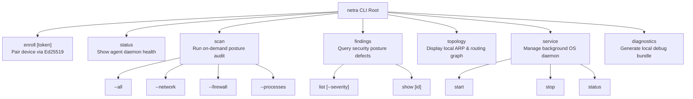
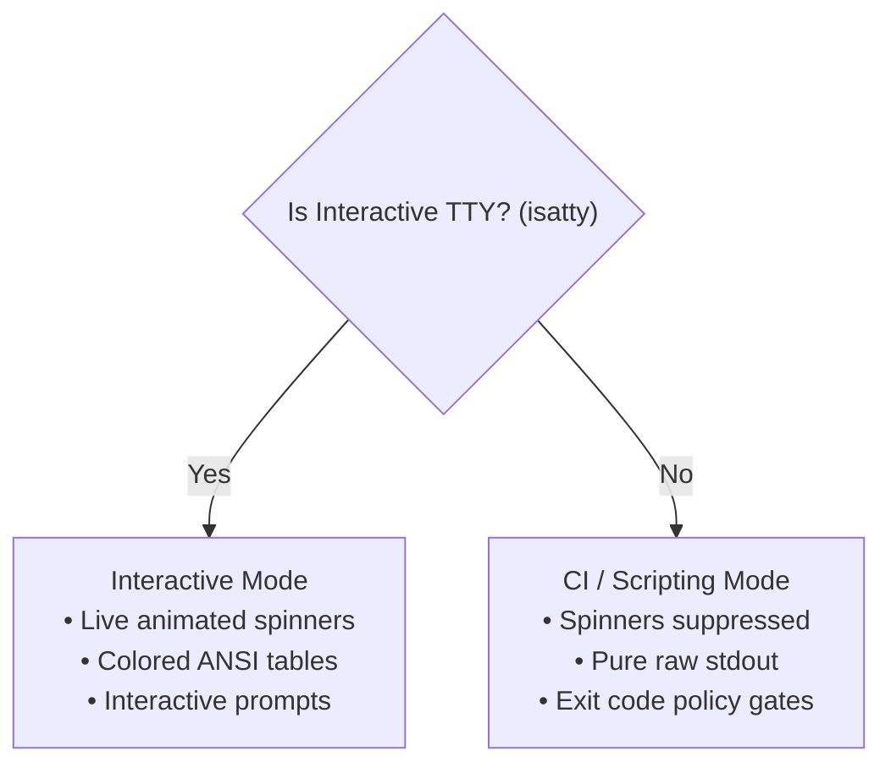

# NETRA — CLI User Experience (UI/UX) & Output Standards

> **Overview**
>
> This document specifies the terminal interaction model, command hierarchy, output stream separation, ANSI color palettes, and machine-readable JSON formatting standards for the `netra` command-line interface built in Rust (`clap`).

**Status:** Specified / Designed  
**Audience:** CLI Developers, Rust Engineers, DevOps/CI Integrators, Terminal Enthusiasts  
**Purpose:** Establishes predictable Unix-philosophy interaction patterns ensuring seamless use by human operators and automated CI/CD pipelines alike.

---

## Contents

1. [CLI Design Philosophy & Unix Principles](#1-cli-design-philosophy--unix-principles)
2. [Command Taxonomy & Hierarchy](#2-command-taxonomy--hierarchy)
3. [Output Stream Separation (stdout vs. stderr)](#3-output-stream-separation-stdout-vs-stderr)
4. [Terminal Presentation & ANSI Color Palette](#4-terminal-presentation--ansi-color-palette)
5. [Machine-Readable Modes (`--json` / `--yaml`)](#5-machine-readable-modes---json----yaml)
6. [Interactive vs. Non-Interactive CI Modes](#6-interactive-vs-non-interactive-ci-modes)
7. [Standard Exit Code Specifications](#7-standard-exit-code-specifications)
8. [Command UX Walkthroughs & Examples](#8-command-ux-walkthroughs--examples)
9. [Actionable Error Presentation UX](#9-actionable-error-presentation-ux)

---

## 1. CLI Design Philosophy & Unix Principles

NETRA is designed with a **Terminal-First Philosophy** implemented in zero-allocation Rust:
* **Rule of Separation**: The CLI clearly separates mechanism from policy and pure data from visual presentation.
* **Rule of Silence**: When invoked with `--quiet` or piped into another command, the CLI suppresses banners and decorative text.
* **Rule of Composability**: Standard JSON outputs allow effortless piping into tools like `jq`, Python, or shell scripts.

---

## 2. Command Taxonomy & Hierarchy



---

## 3. Output Stream Separation (stdout vs. stderr)

```mermaid
flowchart TD
    subgraph Invocation["CLI Invocation (netra findings list)"]
        Parser["Rust clap Parser"] --> Exec["Rust Execution Engine"]
    end

    Exec -->|Human Visual UI (Spinners, Headers, Colors)| Stderr["stderr (Terminal UI)"]
    Exec -->|Pure Structured Data (JSON / Plain Text)| Stdout["stdout (Piped to jq / Scripts)"]

    Stdout --> JQ["jq / Python Script / CI Gate"]
    Stderr --> User["Human Operator Screen"]
```

---

## 4. Terminal Presentation & ANSI Color Palette

* **CRITICAL**: Bright Bold Red (`\033[1;31m`) — Immediate exploit risk or high-severity defect.
* **HIGH**: Red (`\033[0;31m`) — Severe configuration defect or exposed network port.
* **MEDIUM**: Yellow (`\033[0;33m`) — Insecure setting or unverified network route.
* **LOW / INFO**: Cyan (`\033[0;36m`) — Informational posture item or asset inventory.
* **SUCCESS**: Green (`\033[0;32m`) — Task completed successfully or finding verified resolved.

---

## 5. Machine-Readable Modes (`--json` / `--yaml`)

When `--json` is specified, `netra` suppresses terminal spinners and writes a clean JSON envelope directly to `stdout`:

```json
{
  "version": "1.0.0",
  "command": "findings list",
  "status": "success",
  "data": {
    "total": 1,
    "findings": [
      {
        "id": "fnd_01h8c4d5e6",
        "title": "Public Profile Firewall Disabled",
        "severity": "HIGH",
        "status": "OPEN",
        "fingerprint": "a9f8e7d6c5b43a2b1c0e9d8c7b6a5f4e3d2c1b0a9f8e7d6c5b4a3b2a1f0e9d8c",
        "first_seen": "2026-08-24T12:00:00Z"
      }
    ]
  }
}
```

---

## 6. Interactive vs. Non-Interactive CI Modes



---

## 7. Standard Exit Code Specifications

| Exit Code | Semantic Meaning | Usage Context |
| :--- | :--- | :--- |
| **`0`** | **SUCCESS** | Command executed cleanly; no policy violations detected. |
| **`1`** | **OPERATIONAL ERROR** | Network unreachable, invalid credentials, missing permissions. |
| **`2`** | **POLICY FAILURE** | Security scan detected findings exceeding `--fail-on` threshold. |
| **`3`** | **INVALID ARGUMENTS** | Incorrect CLI syntax or missing required flags. |

---

## 8. Command UX Walkthroughs & Examples

### `netra status`
```text
$ netra status

NETRA Host Security Agent (v1.0.0-linux-x86_64)
─────────────────────────────────────────────────────────────
  Device ID:       dev_01h8a9b2c3d4e5f6
  Tenant ID:       ten_01h8a1b2c3d4 (Academic Lab)
  Status:          ● ONLINE (WSS Stream Connected)
  Supervisor:      Active (systemd: netra.service)
  Local DB:        Clean (0 items queued)
  Last Sync:       2026-08-24 12:15:32 UTC (10s ago)
─────────────────────────────────────────────────────────────
```

---

## 9. Actionable Error Presentation UX

Errors provide the root cause and immediate actionable remedies:

```text
$ netra scan --firewall

✖ Error: Permission Denied (OS_PRIVILEGE_ERROR)
  The requested capability 'SCAN_FIREWALL' requires elevated OS privileges to query
  the kernel firewall state.

  Remedy:
  • Re-run this command with elevated privileges:
    $ sudo netra scan --firewall
  • Or start the NETRA background supervisor daemon:
    $ sudo netra service start
```
