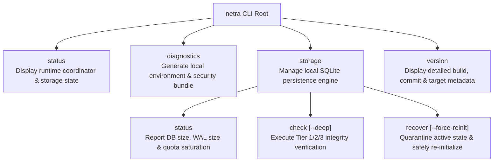

# NETRA — CLI User Experience (UI/UX) & Output Standards

> **Overview**
>
> This document specifies the terminal interaction model, command hierarchy, output stream separation, ANSI color palettes, machine-readable JSON formatting standards, and safety contracts for the `netra` command-line interface built in Rust (`clap`).

**Status:** Specified / Designed  
**Audience:** CLI Developers, Rust Engineers, DevOps/CI Integrators, Terminal Enthusiasts  
**Purpose:** Establishes predictable Unix-philosophy interaction patterns ensuring seamless use by human operators and automated CI/CD pipelines alike.

---

## Contents

1. [CLI Design Philosophy & Unix Principles](#1-cli-design-philosophy--unix-principles)
2. [Command Taxonomy & Hierarchy](#2-command-taxonomy--hierarchy)
3. [Canonical Output Stream Separation (stdout vs. stderr)](#3-canonical-output-stream-separation-stdout-vs-stderr)
4. [Terminal Presentation & ANSI Color Palette](#4-terminal-presentation--ansi-color-palette)
5. [Machine-Readable JSON Contract (`schema_version` vs `netra_version`)](#5-machine-readable-json-contract-schema_version-vs-netra_version)
6. [Interactive vs. Non-Interactive CI Modes & Quiet Rules](#6-interactive-vs-non-interactive-ci-modes--quiet-rules)
7. [Standard Exit Code Specifications](#7-standard-exit-code-specifications)
8. [Storage Recovery Safety Contract](#8-storage-recovery-safety-contract)
9. [Command UX Walkthroughs & Examples](#9-command-ux-walkthroughs--examples)
10. [Actionable Error Presentation UX](#10-actionable-error-presentation-ux)

---

## 1. CLI Design Philosophy & Unix Principles

NETRA is designed with a **Terminal-First Philosophy** implemented in zero-allocation Rust:
* **Rule of Separation**: Pure command result data is emitted to `stdout`; visual UI, progress spinners, logs, and diagnostic banners are strictly routed to `stderr`.
* **Rule of Silence**: Full compliance with `--quiet` / `-q`. Suppresses non-essential headers and progress without swallowing critical errors or warnings.
* **Rule of Composability**: Standard JSON outputs allow effortless parsing in CI pipelines, Rust integration tests, Python, or shell tools like `jq`.
* **No Speculative Abstractions**: The runtime CLI exposes only implemented capabilities (`status`, `diagnostics`, `storage`, `version`). Future capabilities (scanners, topology, CVEs) are scheduled across later phases in `PHASES.md`.

---

## 2. Command Taxonomy & Hierarchy



---

## 3. Canonical Output Stream Separation (stdout vs. stderr)

```mermaid
flowchart TD
    subgraph Invocation["CLI Invocation (netra storage status / netra status)"]
        Parser["Rust clap Parser"] --> Resolver["netra-core Config & Runtime"]
        Resolver --> Exec["Command Handler"]
    end

    Exec -->|Command Primary Result (Human Summary OR Clean JSON)| Stdout["stdout (Piped / Scripted)"]
    Exec -->|Progress Spinners, Warnings, Errors, Diagnostic Logs| Stderr["stderr (Operator Terminal)"]

    Stdout --> Consumer["Test Suite / jq / Script / Terminal"]
    Stderr --> UserScreen["Human Operator Screen / Log Collector"]
```

### Stream Allocation Matrix

| Mode | `stdout` | `stderr` |
| :--- | :--- | :--- |
| **Interactive Human (default)** | Primary command result / formatted table / summary text | Progress spinners, decorative banners, status logs |
| **Machine JSON (`--json`)** | **100% Exactly one valid JSON document** (no ANSI, no progress) | Warnings, recoverable/fatal errors, structured log events |
| **Quiet Mode (`-q` / `--quiet`)** | Normal primary command result | Informational banners & progress suppressed; errors/warnings preserved |
| **Non-TTY / Piped Execution** | Pure output (unpolluted) | ANSI color sequences automatically stripped |

---

## 4. Terminal Presentation & ANSI Color Palette

ANSI color codes are applied **only** when `stderr` is an interactive TTY, `--no-color` is not passed, `NO_COLOR` env var is unset, and `--json` is false.

* **CRITICAL / ERROR**: Red (`\x1b[31m`) — Unrecoverable failures, integrity corruption, panic states.
* **WARNING / DEGRADED**: Yellow (`\x1b[33m`) — Quarantined state, high quota saturation (>85%), degraded components.
* **SUCCESS / HEALTHY**: Green (`\x1b[32m`) — Healthy runtime state, successful migrations, clean integrity check.
* **INFO / METADATA**: Cyan (`\x1b[36m`) — Headers, table columns, platform and version attributes.

---

## 5. Machine-Readable JSON Contract (`schema_version` vs `netra_version`)

To prevent coupling between output contract compatibility and application release cycles, the JSON envelope strictly separates the **JSON output schema version** from the **NETRA binary version**:

### 5.1 Success Envelope Schema
```json
{
  "schema_version": "1.0",
  "netra_version": "1.0.0-foundation",
  "command": "storage status",
  "status": "success",
  "data": {
    "db_path": "/var/lib/netra/agent.db",
    "total_size_bytes": 1048576,
    "wal_size_bytes": 32768,
    "max_storage_bytes": 524288000,
    "saturation_percent": 0.20,
    "records": {
      "migrations": 1,
      "config": 2,
      "queued_observations": 0,
      "findings": 0
    }
  },
  "timestamp": "2026-08-26T07:30:00.000000Z"
}
```

### 5.2 Error Envelope Schema
```json
{
  "schema_version": "1.0",
  "netra_version": "1.0.0-foundation",
  "command": "storage check",
  "status": "error",
  "error": {
    "code": "ERR_STORAGE_CORRUPTION",
    "message": "Database quick_check failed: file is not a database",
    "context": {
      "db_path": "/var/lib/netra/agent.db",
      "tier": 2
    }
  },
  "timestamp": "2026-08-26T07:30:00.000000Z"
}
```

---

## 6. Interactive vs. Non-Interactive CI Modes & Quiet Rules

### 6.1 `--quiet` Suppression Rules
* **Suppressed by `--quiet`**:
  - Informational startup banners & ASCII art.
  - Interactive spinner animations and step progress messages.
  - Informational completion notices on `stderr`.
* **Preserved during `--quiet`**:
  - Warnings (`stderr`).
  - Recoverable and fatal errors (`stderr`).
  - Primary result payload (`stdout`).

---

## 7. Standard Exit Code Specifications

| Exit Code | Semantic Name | Usage Context |
| :---: | :--- | :--- |
| **`0`** | `Success` | Command completed cleanly with healthy state. |
| **`1`** | `OperationalError` | Generic runtime, I/O, storage query, or OS permission failure. |
| **`2`** | `PolicyFailure` | Security policy threshold exceeded (reserved for Phase 7+). |
| **`3`** | `InvalidArguments` | Malformed CLI syntax, unrecognized flag, or missing parameter. |
| **`4`** | `DegradedState` | System is operational but running in degraded/quarantined state. |

---

## 8. Storage Recovery Safety Contract

The `netra storage recover` command is **explicitly destructive** to the active local database file and must adhere to strict safety invariants:

1. **Quarantine Before Re-initialization**: The existing `agent.db`, `agent.db-wal`, and `agent.db-shm` files are moved into a dedicated timestamped `quarantine_<TIMESTAMP>/` directory (mode `0700`) with SHA-256 hashes recorded in `quarantine_meta.json`.
2. **No Automatic Quarantine Purge**: Quarantined forensic evidence is never automatically deleted.
3. **Explicit Operator Intent**:
   - In interactive TTY mode: Requires typing `CONFIRM` or explicit `[y/N]` confirmation.
   - In non-interactive scripting/CI mode: Requires explicit `--force-reinit` flag. In the absence of `--force-reinit`, recovery is refused with exit code `1`.
4. **No Implicit Invocation**: Recovery is never triggered automatically from `status` or `diagnostics`.

---

## 9. Command UX Walkthroughs & Examples

### `netra status`
```text
$ netra status

NETRA Host Security Agent (v1.0.0-foundation)
─────────────────────────────────────────────────────────────
  Platform:        windows (x86_64) [LAPTOP-BTE1GJID]
  Privilege:       STANDARD_USER
  Runtime State:   ● RUNNING
  Runtime Health:  ● HEALTHY
  Storage Engine:  ● READY (1.0MB / 500MB, 0.2% quota)
─────────────────────────────────────────────────────────────
```

### `netra storage status`
```text
$ netra storage status

NETRA Local Storage Status
─────────────────────────────────────────────────────────────
  Database Path:   tmp/agent.db
  Total Footprint: 1.05 MB (WAL: 32.7 KB, SHM: 32.7 KB)
  Storage Quota:   500.00 MB (Saturation: 0.2%)
  Migrations:      1 applied (v1: 001_initial_schema)
  Active Records:  2 config entries, 0 queued observations, 0 findings
─────────────────────────────────────────────────────────────
```

---

## 10. Actionable Error Presentation UX

```text
$ netra storage check --deep

✖ Error: Database Corruption Detected (ERR_STORAGE_CORRUPTION)
  Tier 3 deep integrity verification failed on SQLite database 'tmp/agent.db'.

  Remedy:
  • Inspect corruption forensics:
    $ netra storage status
  • Quarantine corrupted database and re-initialize a fresh store:
    $ netra storage recover --force-reinit
```
