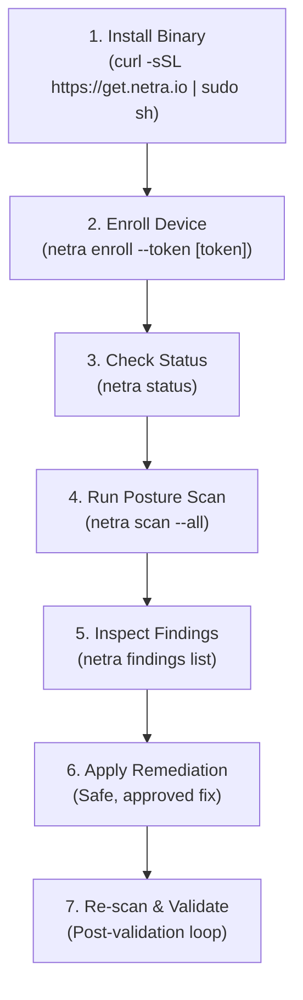
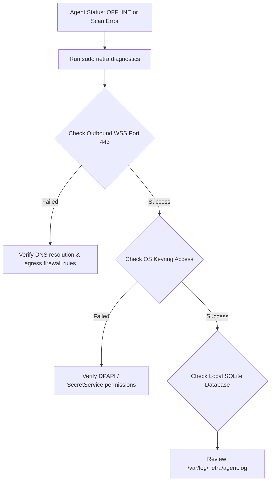

# NETRA — Practical Operations & Developer Usage Handbook

> **Overview**
>
> This document serves as the hands-on operations manual and developer guide for NETRA (Network & Endpoint Threat Reconnaissance Architecture). It covers Rust agent installation, device enrollment, running posture audits, inspecting network topology, scripting CI/CD gates, and diagnostic troubleshooting.

**Status:** Specified / Designed  
**Audience:** Developers, DevOps Engineers, Lab Administrators, Students, Security Researchers  
**Purpose:** Provides step-by-step instructions and operational commands for deploying, managing, and automating NETRA across diverse endpoint environments.

---

## Contents

1. [Operational Lifecycle Overview](#1-operational-lifecycle-overview)
2. [Prerequisites & System Requirements](#2-prerequisites--system-requirements)
3. [Agent Installation & Verification](#3-agent-installation--verification)
4. [Device Enrollment & Registration](#4-device-enrollment--registration)
5. [Running On-Demand Posture & Network Scans](#5-running-on-demand-posture--network-scans)
6. [Investigating Findings & Cryptographic Evidence](#6-investigating-findings--cryptographic-evidence)
7. [Inspecting Local Network Topology](#7-inspecting-local-network-topology)
8. [Automating CI/CD Security Policy Gates](#8-automating-cicd-security-policy-gates)
9. [Configuration Files & Environment Variables](#9-configuration-files--environment-variables)
10. [Diagnostic Bundles & Troubleshooting Decision Tree](#10-diagnostic-bundles--troubleshooting-decision-tree)

---

## 1. Operational Lifecycle Overview



---

## 2. Prerequisites & System Requirements

* **Windows**: Windows 10/11 (`x86_64`, `aarch64`) or Windows Server 2016+.
* **Linux**: Linux Kernel 4.19+ (Ubuntu, Debian, RHEL, Fedora, Arch; systemd recommended).
* **macOS**: macOS 12 (Monterey) or newer (Apple Silicon M1/M2/M3 or Intel).
* **Network**: Outbound access over TCP port 443 (HTTPS/WSS). Zero open inbound listening ports required.

---

## 3. Agent Installation & Verification

### Linux (Ubuntu / Debian / RHEL / Arch)
```bash
# Download and install single static Rust binary
curl -sSL https://get.netra.io | sudo sh

# Verify installation
netra --version
# Output: netra version 1.0.0 (x86_64-unknown-linux-musl)
```

### Windows (PowerShell as Administrator)
```powershell
# PowerShell automated installer
iwr -useb https://get.netra.io/install.ps1 | iex

# Verify installation
netra.exe --version
```

---

## 4. Device Enrollment & Registration

```bash
$ sudo netra enroll --token enroll_sec_99a8b7c6d5e4f3a2

✔ Generating Ed25519 cryptographic keypair in RAM...
✔ Storing private key in OS protected storage (DPAPI / SecretService)...
✔ Registering device with NETRA Control Gateway (https://api.netra.io)...
✔ Device enrolled successfully! (Device ID: dev_01h8a9b2c3d4e5f6)
✔ Background supervisor service started.
```

---

## 5. Running On-Demand Posture & Network Scans

```bash
# 5.1 Run all standard posture audits (Sockets, Processes, Firewall, Users)
$ netra scan --all

# 5.2 Run network socket and listening port reconnaissance only
$ netra scan --network

# 5.3 Run host packet filter and firewall rule audit only
$ netra scan --firewall
```

---

## 6. Investigating Findings & Cryptographic Evidence

```bash
$ netra findings show fnd_01h8c4d5e6

Finding: Insecure SMBv1 Service Bound to External Subnet
────────────────────────────────────────────────────────────────────────
  ID:             fnd_01h8c4d5e6
  Severity:       HIGH
  Category:       NETWORK_SECURITY
  Fingerprint:    a9f8e7d6c5b4... (SHA-256 Verified)
  MITRE ATT&CK:   T1021.002 (SMB/Windows Admin Shares)
  Discovered:     2026-08-24 12:15:32 UTC

Description:
  TCP port 445 is listening on interface 'eth0' (192.168.1.50) without
  firewall isolation, accessible to adjacent subnet neighbors.

Recommended Remediation:
  1. Disable SMBv1 via OS registry or configuration.
  2. Bind SMB service strictly to localhost or apply inbound firewall block.
```

---

## 7. Inspecting Local Network Topology

```bash
$ netra topology

Subnet: 192.168.1.0/24 (Interface: eth0)
Default Gateway: 192.168.1.1 (Gateway-Router - 00:1A:2B:3C:4D:5E)

Discovered Adjacent Neighbors (ARP Table):
  • 192.168.1.15  [00:11:22:33:44:55]  (dev-laptop-02)
  • 192.168.1.60  [00:AA:BB:CC:DD:EE]  (srv-database-01)
```

---

## 8. Automating CI/CD Security Policy Gates

```yaml
name: Security Posture Gate
on: [push, pull_request]

jobs:
  netra-audit:
    runs-on: ubuntu-latest
    steps:
      - uses: actions/checkout@v4
      - name: Install NETRA Agent
        run: curl -sSL https://get.netra.io | sudo sh
      - name: Run Host Posture Audit
        run: |
          netra scan --all --fail-on=HIGH --json > netra-report.json
      - name: Upload Security Report
        uses: actions/upload-artifact@v4
        with:
          name: netra-security-report
          path: netra-report.json
```

---

## 9. Configuration Files & Environment Variables

| Variable | Default Value | Description |
| :--- | :--- | :--- |
| `NETRA_SERVER_URL` | `https://api.netra.io` | Central Control API base URL |
| `NETRA_LOG_LEVEL` | `info` | Logging verbosity (`debug`, `info`, `warn`, `error`) |
| `NETRA_CONFIG_DIR` | `/etc/netra` (Linux) | Path to local configuration directory |
| `NO_COLOR` | `0` | Set to `1` to disable ANSI colors in terminal output |

---

## 10. Diagnostic Bundles & Troubleshooting Decision Tree



---

## 11. Storage Diagnostics, Quota & Quarantine Management

```bash
# Check local SQLite storage health and quota utilization
netra storage status

# Run deep Tier 3 integrity verification
netra diagnostics --deep-storage-check

# Inspect quarantined corrupted databases (forensic preservation directory)
ls -la /var/lib/netra/quarantine_*/
cat /var/lib/netra/quarantine_*/quarantine_meta.json

# Explicit operator recovery (creates clean replacement without deleting quarantine archive)
netra storage recover --force-reinit
```

