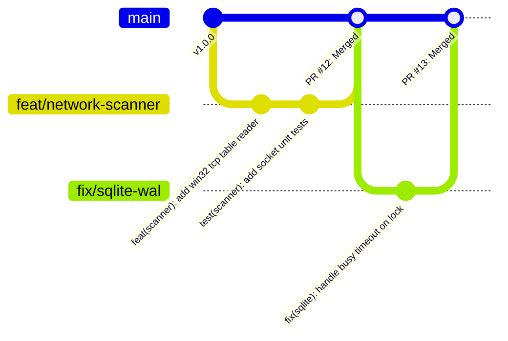

# NETRA — Engineering Contribution & Developer Workflow Guide

> **Overview**
>
> This document governs the engineering standards, branching models, conventional commit specifications, code review criteria, and Definition of Done (DoD) for developers and researchers contributing to the open-source NETRA codebase.

**Status:** Specified / Designed  
**Audience:** Core Maintainers, Rust Developers, Open-Source Contributors, Academic Researchers  
**Purpose:** Establishes uniform engineering discipline, ensuring high code quality, security hygiene, and transparent open-source collaboration.

---

## Contents

1. [Open-Source Engineering Principles](#1-open-source-engineering-principles)
2. [Local Rust Development Environment Setup](#2-local-rust-development-environment-setup)
3. [Branching Strategy (Trunk-Based Development)](#3-branching-strategy-trunk-based-development)
4. [Conventional Commit Message Standard](#4-conventional-commit-message-standard)
5. [Code Quality & Linting Standards (`clippy` / `fmt`)](#5-code-quality--linting-standards-clippy--fmt)
6. [Testing Standards & Coverage Targets](#6-testing-standards--coverage-targets)
7. [Peer Review & Security Checklist](#7-peer-review--security-checklist)
8. [Definition of Done (DoD)](#8-definition-of-done-dod)

---

## 1. Open-Source Engineering Principles

NETRA is an academic open-source project prioritizing:
* **Code Clarity & Explainability**: Complex unsafe syscall blocks must include detailed safety comments explaining why the operation is safe.
* **Deterministic Behavior**: Avoid non-deterministic algorithms, unseeded random values, or race conditions.
* **Zero Language Proliferation**: Maintain a clean Rust codebase, avoiding unnecessary third-party runtime bridges.

---

## 2. Local Rust Development Environment Setup

```bash
# 1. Install Rust via rustup (Rust 2021 Edition, 1.78+)
curl --proto '=https' --tlsv1.2 -sSf https://sh.rustup.rs | sh

# 2. Add required cargo components and linters
rustup component add clippy rustfmt

# 3. Clone repository
git clone https://github.com/Subhadip-Paul2006/NETRA-Backend.git
cd NETRA-Backend

# 4. Run automated test suites
cargo test --workspace

# 5. Verify clippy lints
cargo clippy --all-targets -- -D warnings
```

---

## 3. Branching Strategy (Trunk-Based Development)



* **`main`**: Always releasable, protected branch. Direct pushes to `main` are prohibited in collaborative environments.
* **Feature Branches**: Named `feat/<feature-name>`, `fix/<bug-name>`, or `docs/<doc-name>`.

---

## 4. Conventional Commit Message Standard

Commits must follow the **Conventional Commits 1.0.0** specification:

$$\text{Format: } \langle\text{type}\rangle(\langle\text{scope}\rangle): \langle\text{description}\rangle$$

### Approved Commit Types:
* `feat`: A new user-facing capability or scanner.
* `fix`: A bug fix or security remediation.
* `docs`: Documentation modifications or architectural updates.
* `test`: Adding missing unit, integration, or benchmark tests.
* `refactor`: Code restructuring with zero behavioral changes.
* `ci`: Changes to CI/CD workflows, cargo configurations, or release scripts.

---

## 5. Code Quality & Linting Standards (`clippy` / `fmt`)

```bash
# Format Rust code
cargo fmt --check

# Enforce strict Clippy warnings
cargo clippy --all-targets -- -D warnings
```

---

## 6. Testing Standards & Coverage Targets

* **Unit Tests**: Mandatory for all parsers, state machines, fingerprint formulas, and rule matchers.
* **Integration Tests**: Verify database migrations, SQLite WAL concurrency, and mock WSS communication.
* **Coverage Target**: Minimum **85% code coverage** required for merge approval.

---

## 7. Peer Review & Security Checklist

Every Pull Request review must verify:
- [ ] No unhandled unwraps/panics in production code paths (`.expect()` / `.unwrap()` replaced with `Result` propagation).
- [ ] No arbitrary remote shell execution or unsanitized strings passed to OS execution functions.
- [ ] Memory allocations are bounded (no unbounded vectors reading untrusted network frames).
- [ ] All new public types and methods have clear Rustdoc documentation.

---

## 8. Definition of Done (DoD)

A milestone or feature is considered **Done** only when:
1. All unit and integration tests pass cleanly (`cargo test`).
2. Clippy reports zero warnings (`cargo clippy -- -D warnings`).
3. Documentation and architecture cross-references are updated.
4. Supply chain security scans (`cargo-audit`, `gitleaks`) report zero findings.
