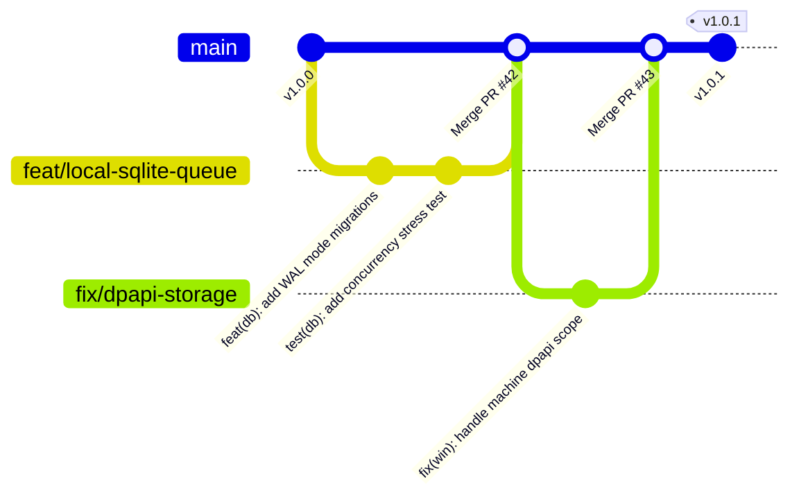
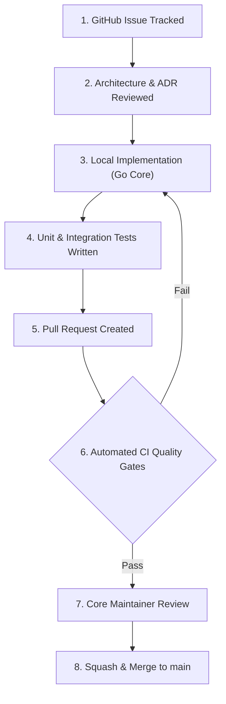
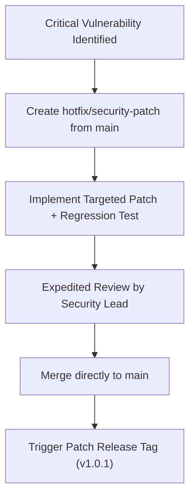

# NETRA — Open-Source Developer Workflow & Engineering Standards

> **Overview**
>
> This document outlines the contribution workflows, Git branching models, conventional commit standards, architectural decision processes, and quality gates governing development on NETRA (Network & Endpoint Threat Reconnaissance Architecture).

**Status:** Specified / Designed  
**Audience:** Core Maintainers, Open-Source Contributors, Reviewers, Security Researchers  
**Purpose:** Establishes predictable and rigorous software engineering practices to ensure long-term codebase maintainability, security, and stability.

---

## Contents

1. [Open-Source Engineering Philosophy](#1-open-source-engineering-philosophy)
2. [Branching Strategy & Repository Flow](#2-branching-strategy--repository-flow)
3. [Feature & Research Development Lifecycle](#3-feature--research-development-lifecycle)
4. [Conventional Commit Specifications](#4-conventional-commit-specifications)
5. [Pull Request Lifecycle & Review Gates](#5-pull-request-lifecycle--review-gates)
6. [Architecture Decision Process (ADRs)](#6-architecture-decision-process-adrs)
7. [Definition of Ready (DoR) & Definition of Done (DoD)](#7-definition-of-ready-dor--definition-of-done-dod)
8. [Emergency Security Hotfix Workflow](#8-emergency-security-hotfix-workflow)

---

## 1. Open-Source Engineering Philosophy

NETRA maintains high standards of engineering excellence:
* **Zero Technical Debt by Default**: No code is merged with disabled linter warnings or failing unit tests.
* **Strict Type Safety & Hermetic Dependencies**: External dependencies must be audited for permissive licensing (Apache 2.0 / MIT) and security posture.
* **Architecture-First Implementation**: Code changes must trace back to approved specifications in `docs/SYSTEM_DESIGN.md` or `docs/API.md`.

---

## 2. Branching Strategy & Repository Flow



---

## 3. Feature & Research Development Lifecycle



---

## 4. Conventional Commit Specifications

All commits must adhere to the **Conventional Commits v1.0.0** specification:

```text
<type>(<scope>): <short summary in present tense>

[optional body explaining WHY, not what]

[optional footer: Fixes #123]
```

### Supported Types:
* `feat`: A new capability or scanner.
* `fix`: A bug fix or defect correction.
* `sec`: A security hardening improvement or vulnerability patch.
* `refactor`: Code change that neither fixes a bug nor adds a feature.
* `perf`: Performance optimization.
* `test`: Adding or correcting test suites.
* `docs`: Documentation updates or corrections.

---

## 5. Pull Request Lifecycle & Review Gates

Every Pull Request must satisfy:
1. **Issue Link**: Clearly linked to an existing GitHub issue.
2. **Automated CI Validation**: $100\%$ green status across all automated tests, SAST, and lint checks.
3. **Test Coverage**: Accompanying unit/integration tests covering new code paths.
4. **Documentation**: Updated corresponding documents in the `docs/` directory.

---

## 6. Architecture Decision Process (ADRs)

Any architectural modification impacting security models, database schemas, protocols, or technology choices must be preceded by an **Architectural Decision Record (ADR)** documented in [docs/ARCHITECTURE.md](./ARCHITECTURE.md).

---

## 7. Definition of Ready (DoR) & Definition of Done (DoD)

### Definition of Ready (DoR):
* Technical requirements documented in [docs/TRD.md](./TRD.md).
* Threat implications analyzed against [docs/SECURITY_CHECK.md](./SECURITY_CHECK.md).
* API / CLI interfaces agreed upon in [docs/API.md](./API.md) and [docs/UI_UX.md](./UI_UX.md).

### Definition of Done (DoD):
* Code implemented, statically typed, and lint-clean.
* Unit test coverage $\ge 85\%$ on new code paths.
* Zero newly introduced vulnerabilities (`govulncheck`, `gitleaks`).
* PR reviewed and approved by a core maintainer.

---

## 8. Emergency Security Hotfix Workflow


